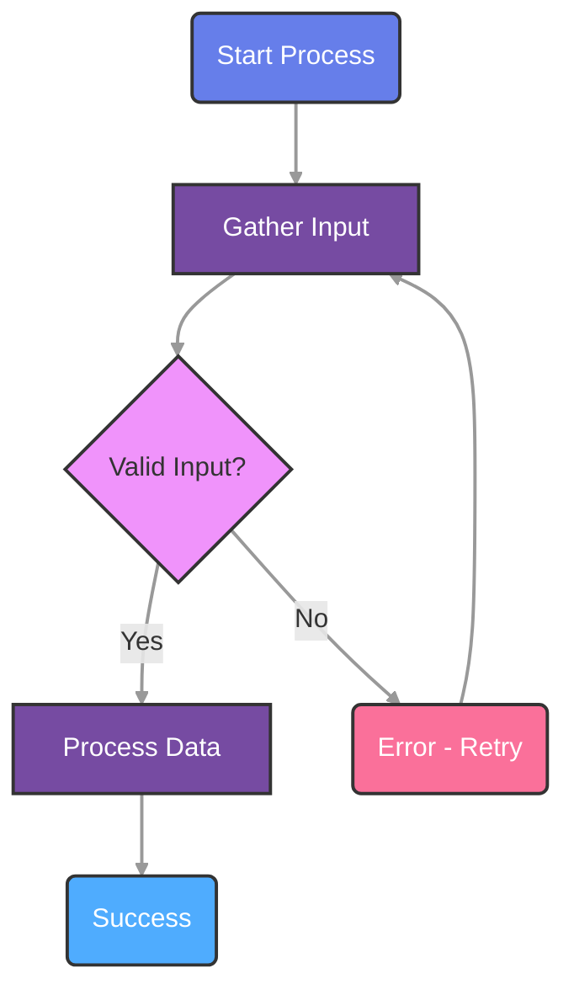
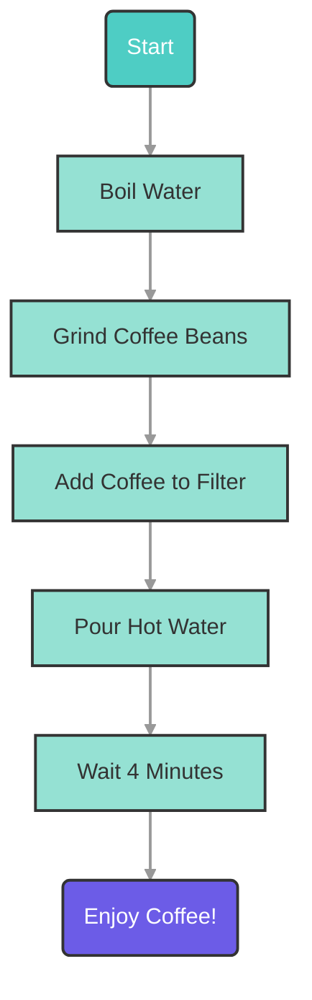
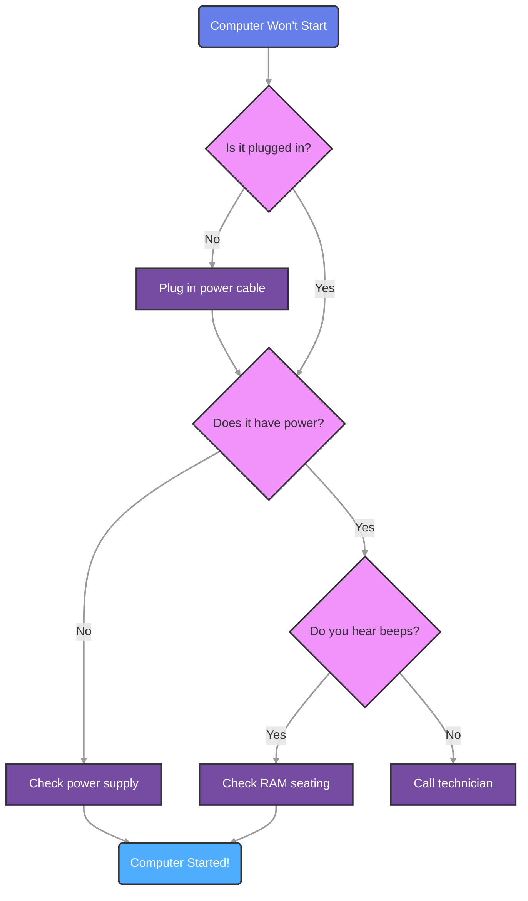
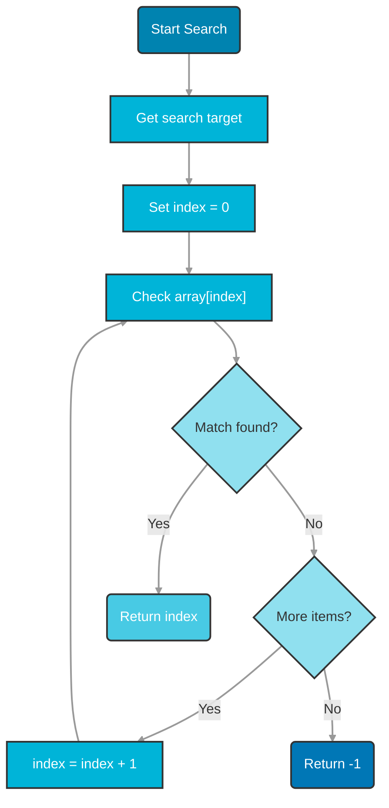

# Mermaid Diagram Generator

## Security Handoff

This skill does not replace security hardening.

- If work touches authentication, authorization, secrets, sensitive data, session/cookies, CSP/CORS, or API exposure, also apply `security-best-practices` and `api-security-best-practices`.
- Never include secrets, tokens, credentials, or private keys in examples, fixtures, diagrams, logs, or generated artifacts.

## Overview

Generate Mermaid diagrams for technical and product documentation in any project. This skill supports inline Mermaid blocks and optional standalone diagram bundles with reusable HTML, CSS and JavaScript assets.

The design goal is to create diagrams that are clear, readable and easy to embed in architecture docs, PRDs, reviews, QA artifacts, runbooks and other Markdown-based records.

## When to Use This Skill

Use the mermaid-generator skill when users request:

- Workflow diagrams or process flows
- Decision trees with branching logic
- Algorithm visualizations
- System architecture flows
- Step-by-step procedure illustrations
- State transition diagrams
- Any flowchart-style visualization

**Example user requests:**
- "Create a flowchart showing the software development lifecycle"
- "Generate a workflow diagram for the scientific method"
- "Make a decision tree for troubleshooting network issues"
- "Visualize the process of photosynthesis as a diagram"

## Workflow

### Step 1: Gather Diagram Requirements

Analyze the user's description to extract:

1. **Diagram Purpose**: What process or workflow is being illustrated?
2. **Key Steps**: What are the main nodes/steps in the workflow?
3. **Decision Points**: Are there branching decisions (if/then)?
4. **Flow Direction**: Should it be top-down (TD), left-right (LR), or other?
5. **Start/End Points**: Where does the process begin and end?

**If the description is incomplete or unclear**, prompt the user for additional information:

```
To create an accurate workflow diagram, I need more information:

1. What are the main steps in this process?
2. Are there any decision points where the flow branches?
3. What happens in success vs. error scenarios?
4. Should this flow top-down or left-right?
```

**Required information before proceeding:**

- At least 3-5 distinct steps/nodes
- Clear start and end points
- Understanding of the flow sequence

### Step 2: Design the Mermaid Flowchart

Consult `references/mermaid-flowchart-syntax.md` for detailed syntax guidance.

**Design decisions:**

1. **Choose node shapes** based on purpose:
   - Rounded rectangles `("Label")` for start/end
   - Rectangles `["Label"]` for process steps
   - Diamonds `{"Decision?"}` for decision points
   - Circles `(("Label"))` for connectors

2. **Select color palette** from reference guide:
   - Vibrant (purple/blue/pink) for engaging diagrams
   - Professional (turquoise/mint/coral) for formal content
   - Ocean (blue spectrum) for technical content
   - Or create custom palette matching the project's visual language

3. **Define style classes** for consistent theming:
   ```
   classDef startNode fill:#667eea,stroke:#333,stroke-width:2px,color:#fff,font-size:16px
   classDef processNode fill:#764ba2,stroke:#333,stroke-width:2px,color:#fff,font-size:16px
   classDef decisionNode fill:#f093fb,stroke:#333,stroke-width:2px,color:#333,font-size:16px
   ```

4. **Ensure 16pt fonts** for all nodes and edge labels:
   - Set `font-size:16px` in all classDef declarations
   - Apply to edge labels: `linkStyle default font-size:16px`

5. **Use top-down direction** unless user specifies otherwise:
   ```
   flowchart TD
   ```

**Example Mermaid code structure:**



### Step 3: Create the Diagram Directory Structure

When a standalone diagram bundle is useful, create a directory in a project-appropriate documentation path, for example:

```bash
mkdir -p docs/diagrams/[diagram-name]
```

If the target directory does not exist, create it first using `create_directory` before generating any files.

**Naming convention:**
- Use kebab-case (lowercase with hyphens)
- Descriptive and concise
- Examples: `software-lifecycle`, `scientific-method`, `network-troubleshooting`

### Step 4: Generate Files from Templates

Before creating files from templates, re-check that `docs/diagrams/[diagram-name]/` exists and create it with `create_directory` if needed.

Use the template files in `assets/template/` as a starting point. Replace placeholders with actual content:

#### 4.1 Create main.html

Copy `assets/template/main.html` and replace these placeholders:

- `{{TITLE}}`: Diagram title (e.g., "Software Development Lifecycle")
- `{{SUBTITLE}}`: Brief subtitle (e.g., "Interactive Workflow Diagram")
- `{{MERMAID_CODE}}`: The complete Mermaid flowchart code (from Step 2)
- `{{DESCRIPTION}}`: 2-3 sentence explanation of the diagram

**Important:** Ensure proper indentation of the Mermaid code within the `<div class="mermaid">` tag.

#### 4.2 Create style.css

Copy `assets/template/style.css` directly - no modifications needed unless custom styling is requested.

The default stylesheet ensures:
- 16px font size for diagram elements
- Responsive design for mobile devices
- Clean, professional appearance
- Print-friendly styling

#### 4.3 Create script.js

Copy `assets/template/script.js` directly. This provides:
- Zoom controls for large diagrams
- Export to SVG functionality
- Node interaction tracking
- Accessibility features

#### 4.4 Create index.md

Copy `assets/template/index.md` and replace placeholders:

- `{{TITLE}}`: Same as main.html title
- `{{OVERVIEW}}`: 1-paragraph overview of the workflow
- `{{DESCRIPTION}}`: Detailed description of the process
- `{{WORKFLOW_STEPS}}`: Bulleted list of main steps:
  ```markdown
  1. **Step Name** - Description of what happens
  2. **Decision Point** - What decision is being made
  3. **Final Step** - How the process concludes
  ```
- `{{KEY_CONCEPTS}}`: Bulleted list of educational concepts illustrated
- `{{RELATED_CONCEPTS}}`: Links to related documents, ADRs, PRDs, reviews or architecture sections

### Step 5: Link the Diagram from the Relevant Artifact

If the diagram is stored as a standalone bundle, add a reference from the most relevant artifact in the project, for example:

- architecture or System Design documentation;
- PRD, user story or scope document;
- review, ADR or changelog entry;
- QA artifact or runbook.

Example Markdown link:

```markdown
[Workflow diagram](docs/diagrams/software-lifecycle/index.md)
```

### Step 6: Validate and Test

Perform quality checks:

1. **Syntax validation**: Ensure Mermaid code renders without errors
2. **File structure**: Verify all 5 files are present (index.md, metadata.json, style.css, main.html, script.js)
3. **Placeholder replacement**: Check that no `{{PLACEHOLDERS}}` remain
4. **Font size verification**: Confirm 16px fonts in Mermaid code and CSS
5. **Color contrast**: Ensure text is readable on colored backgrounds
6. **Responsive design**: Test that diagram works on different screen sizes

**Test the diagram:**

```bash
open docs/diagrams/[diagram-name]/main.html
```

Open main.html directly in browser to test standalone functionality.

### Step 7: Inform the User

Provide a summary of what was created:

```
Created Mermaid diagram: [Diagram Name]

Location: docs/diagrams/[diagram-name]/

Files generated:
✓ main.html - Standalone interactive diagram
✓ index.md - Documentation wrapper page
✓ style.css - Responsive styling
✓ script.js - Interactive features (zoom, export)

Features:
• Top-down flowchart layout
• Colorful node backgrounds for visual clarity
• 16-point fonts for optimal readability
• [X] nodes and [Y] edges
• Zoom controls and SVG export

The diagram illustrates: [brief description]

To view:
1. Standalone: Open docs/diagrams/[diagram-name]/main.html
2. In documentation: Open the linked Markdown page or embed the Mermaid block directly

Next steps:
- Link from the relevant architecture, review, PRD or QA artifact
- Reuse the Mermaid block in related documents when helpful
- Consider creating related diagrams for connected flows
```

## Best Practices

### Design Principles

1. **Clarity over Complexity**: Keep diagrams focused on core workflow - if too complex, consider breaking into multiple diagrams
2. **Consistent Styling**: Use the same color palette across related diagrams in the same project or documentation set
3. **Meaningful Labels**: Use clear, concise labels (2-5 words max per node)
4. **Logical Flow**: Ensure arrows flow in expected reading direction (top-down or left-right)
5. **Color Semantics**: Use colors consistently (e.g., green for success, red for errors)

### Accessibility

1. **Font Size**: Always use 16px minimum for readability
2. **Color Contrast**: Ensure WCAG AA contrast ratios (4.5:1 minimum)
3. **Text Alternatives**: Provide descriptive text in index.md
4. **Semantic HTML**: Use proper heading structure in documentation

### Documentation Integration

1. **Align with Document Purpose**: Map the diagram to the decision, flow or architecture being explained
2. **Keep It Traceable**: Link the diagram to the relevant PRD, ADR, System Design, review or QA artifact
3. **Re-use Wisely**: Prefer one canonical diagram referenced by multiple docs over inconsistent copies
4. **Add Narrative**: Include short explanatory text in `index.md` or adjacent Markdown when needed

### Common Patterns

**Linear Process Flow:**
```
Start → Step 1 → Step 2 → Step 3 → End
```

**Decision Tree:**
```
Start → Decision 1 (Yes/No)
  ├─ Yes → Action A → End
  └─ No → Decision 2 (Yes/No)
      ├─ Yes → Action B → End
      └─ No → Action C → End
```

**Loop/Iteration:**
```
Start → Initialize → Process → Check Complete?
  ├─ No → Process (loop back)
  └─ Yes → End
```

**Error Handling:**
```
Start → Try Action → Success?
  ├─ Yes → Continue → End
  └─ No → Error Handler → Retry or Exit
```

## Troubleshooting

### Common Issues

**Issue: Mermaid code doesn't render**
- Check for syntax errors (missing quotes, brackets)
- Ensure `flowchart TD` directive is first line
- Verify no reserved keywords used as IDs (like "end" in lowercase)

**Issue: Fonts not 16px**
- Verify `font-size:16px` in all classDef declarations
- Check `linkStyle default font-size:16px` is present
- Ensure style.css includes `.mermaid .node text` styling

**Issue: Colors not showing**
- Confirm classDef declarations come after flowchart code
- Verify `:::className` syntax on nodes
- Check hex color codes are valid

**Issue: Diagram too large/small**
- Adjust node count (split into multiple diagrams if >15 nodes)
- Use zoom controls in script.js
- Modify CSS max-width settings

**Issue: Labels cut off or truncated**
- Shorten label text
- Use markdown strings for auto-wrapping: `A["Text **bold**"]`
- Increase diagram container width in CSS

## Resources

### Bundled References

- **`references/mermaid-flowchart-syntax.md`**: Comprehensive Mermaid syntax guide with examples, node shapes, styling options, and color palettes

### Bundled Templates

- **`assets/template/main.html`**: Standalone HTML diagram template
- **`assets/template/style.css`**: Responsive stylesheet with 16px fonts
- **`assets/template/script.js`**: Interactive features (zoom, export, tracking)
- **`assets/template/index.md`**: Documentation wrapper template

### External Resources

- Mermaid.js Documentation: https://mermaid.js.org/

## Examples

### Example 1: Simple Linear Workflow

**User Request:** "Create a diagram showing the steps of making coffee"

**Generated Mermaid Code:**



### Example 2: Decision-Based Workflow

**User Request:** "Create a flowchart for troubleshooting a computer that won't start"

**Generated Mermaid Code:**



### Example 3: Loop-Based Algorithm

**User Request:** "Visualize a simple search algorithm"

**Generated Mermaid Code:**



## Integration with Other Skills

This skill works well with:

- **review-documentation**: Add diagrams to delivery reviews and technical records
- **prd-generator**: Visualize product flows and scope decisions
- **user-story-writing**: Add process flows and state transitions to stories
- **documentation-sync**: Update diagrams when architecture or operations change
- **clean-architecture**: Illustrate boundaries, layers and dependency direction

## Version History

**v1.0** - Initial release
- Flowchart diagram generation
- Standalone diagram bundle creation
- 16pt fonts and colorful styling
- Top-down rendering default
