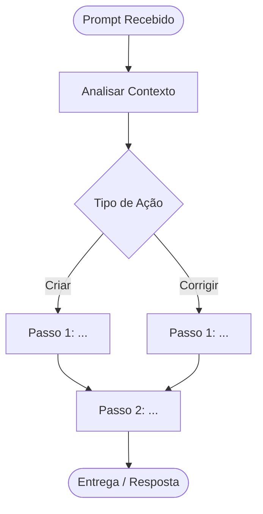
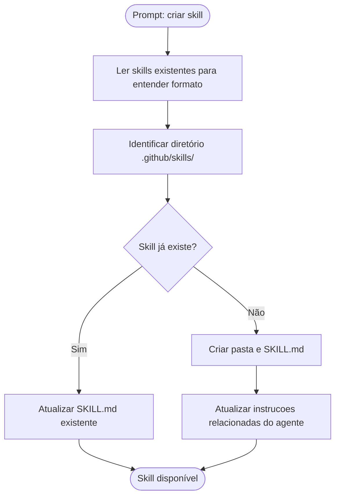

# Prompt Logger

## Visão Geral

Esta skill registra, de forma estruturada, cada prompt enviado pelo usuário e a interpretação gerada pelo assistente. O objetivo é criar um histórico auditável de todas as solicitações e as decisões tomadas, facilitando rastreabilidade, revisão e onboarding de novos colaboradores.

> **Boundary de segurança:** nunca persista segredos, credenciais, tokens, cookies, chaves privadas, material sensível copiado de ambientes protegidos, dados pessoais desnecessários ou qualquer conteúdo que aumente a superfície de exposição do repositório. Quando o prompt contiver dados sensíveis, registre uma versão sanitizada e explique a sanitização no log.

Cada solicitação gera **um arquivo Markdown independente** em `docs/prompts/`, contendo:
- O prompt original, ou uma versão sanitizada quando houver conteúdo sensível
- A interpretação semântica (o que o usuário realmente quer)
- As entidades e intenções identificadas
- O plano de ação derivado
- Um diagrama Mermaid mostrando o fluxo de raciocínio

## Quando Usar Esta Skill

Ative esta skill para **toda solicitação recebida**, antes ou junto com a execução da tarefa. Exemplos:

- O usuário pede para criar uma feature → registre o log e então implemente
- O usuário faz uma pergunta técnica → registre o log e então responda
- O usuário solicita refatoração → registre o log e então refatore
- O usuário pede análise de código → registre o log e então analise

## Workflow

### Passo 1: Extrair Estrutura do Prompt

Antes de gerar o log, analise o prompt e extraia:

0. **Sensibilidade do conteúdo**: Identifique se o prompt contém segredos, credenciais, tokens, cookies, PII desnecessária, dados copiados de produção ou outros dados que não devam ser versionados. Se contiver, gere antes uma versão sanitizada para persistência.

1. **Domínio**: Qual área do sistema/projeto é afetada? (ex: backend, frontend, geo, auth)
2. **Tipo de Ação**: O que está sendo pedido? (criar, corrigir, analisar, refatorar, explicar, configurar)
3. **Entidades Envolvidas**: Quais artefatos, módulos, arquivos ou conceitos são mencionados?
4. **Intenção Principal**: Em uma frase, o objetivo do usuário
5. **Intenções Secundárias**: Requisitos implícitos ou consequências esperadas
6. **Restrições Identificadas**: Limitações técnicas, de prazo ou de escopo mencionadas
7. **Ambiguidades**: Partes do prompt que precisam de inferência ou poderiam ser interpretadas de mais de uma forma

### Passo 2: Convencao de nome do arquivo

O nome do arquivo segue o padrão:

```
docs/prompts/YYYY-MM-DD_NNN_slug-da-intencao.md
```

Onde:
- `YYYY-MM-DD`: Data atual (contexto do sistema)
- `NNN`: Número sequencial com 3 dígitos do dia (001, 002, ...). Antes de calcular o sequencial, confirme se `docs/prompts/` existe e, se necessario, crie com `create_directory`. Em seguida, verifique quantos arquivos já existem para a data atual com `file_search` ou `list_dir`.
- `slug-da-intencao`: Até 5 palavras em kebab-case que descrevam a intenção principal

**Exemplos:**
- `2026-03-14_001_criar-skill-prompt-logger.md`
- `2026-03-14_002_refatorar-servico-de-pagamento.md`
- `2026-03-14_003_analisar-latencia-api.md`

### Passo 3: Gerar o Arquivo de Log

Use o template abaixo para criar o arquivo. **Preencha todas as seções**. Não deixe campos em branco; se a informação não se aplicar, escreva `N/A` com justificativa breve.

---

## Template do Arquivo de Log

```markdown
---
date: YYYY-MM-DD
sequence: NNN
domain: <domínio identificado>
action_type: <tipo de ação>
status: logged
---

# Log de Prompt — <slug-da-intencao>

## Prompt Original

> <transcreva aqui o prompt do usuário exatamente como foi recebido, sem alterações; se houver conteúdo sensível, substitua por uma versão sanitizada e registre a sanitização na seção de Restrições>

---

## Interpretação

### Intenção Principal

<descreva em 1 a 3 frases o que o usuário realmente quer, capturando o objetivo de negócio ou técnico>

### Entidades Identificadas

| Entidade | Tipo | Relevância |
|---|---|---|
| <nome> | <arquivo / módulo / conceito / ferramenta / camada> | <por que é relevante para a solicitação> |

### Intenções Secundárias

- <requisito implícito ou efeito colateral esperado>
- <outro, se houver>

### Restrições

- <restrição técnica, de escopo ou de prazo identificada no prompt ou no contexto do projeto>

### Ambiguidades e Inferências

| Ambiguidade | Inferência Adotada | Confiança |
|---|---|---|
| <trecho ambíguo do prompt> | <como foi interpretado> | Alta / Média / Baixa |

---

## Plano de Ação



### Passos Planejados

1. **<Passo 1>**: <descrição do que será feito e por quê>
2. **<Passo 2>**: <descrição>
3. **<Passo N>**: <descrição>

---

## Contexto do Projeto Aplicado

> <Cite as instrucoes do agente, decisoes arquiteturais ou convencoes do repositorio que influenciaram esta interpretacao. Ex: "Conforme Clean Architecture, a logica sera implementada na camada Application.">

---

## Resultado Esperado

<Descreva o artefato ou resposta que será entregue: arquivos criados/modificados, resposta fornecida, diagrama gerado, etc.>
```

---

## Diagrama Mermaid: Fluxo de Raciocínio

O diagrama deve ser adaptado à solicitação, mas sempre seguir a estrutura base:

```
Prompt → Análise → Identificação de Tipo → Ramificações por Ação → Entrega
```

**Diretrizes para o diagrama:**
- Use `flowchart TD` (top-down) como padrão
- Nós de início/fim com `([texto])` (stadium shape)
- Decisões com `{texto}` (rhombus)
- Processos com `[texto]` (rectangle)
- Limite a 10–15 nós para clareza
- Nomes dos nós devem ser autodescritivos no contexto da solicitação

**Exemplo para uma solicitação de "criar skill":**



## Regras de Qualidade

- **Atomicidade**: Um arquivo por prompt. Não agrupe prompts diferentes no mesmo log.
- **Fidelidade**: O campo "Prompt Original" deve preservar fielmente a intenção do texto recebido. Se houver conteúdo sensível, registre uma versão sanitizada, indique que houve sanitização e nunca persista o segredo bruto.
- **Rastreabilidade**: Sempre referencie arquivos do projeto que foram consultados para formar a interpretação.
- **Neutralidade**: Registre ambiguidades honestamente. Não omita inferências feitas.
- **Diagrama obrigatório**: Todo log deve ter pelo menos um diagrama Mermaid no Plano de Ação.
- **Idioma**: O log deve ser escrito no mesmo idioma do prompt do usuário.
- **Segurança**: Nunca grave em `docs/prompts/` credenciais, chaves privadas, tokens, cookies, segredos de ambiente, dumps de produção ou PII desnecessária. Prefira placeholders como `[TOKEN_REMOVIDO]`, `[SEGREDO_REMOVIDO]` e `[DADO_SENSIVEL_REDACTED]`.

## Integração com Outras Skills

Quando esta skill for ativada em conjunto com outra (ex: `prd-generator`, `clean-architecture`):

1. Gere o log **primeiro** (ou simultaneamente com a execução)
2. Referencie no log qual outra skill foi ativada
3. No campo "Contexto do Projeto Aplicado", mencione a skill complementar
4. Ignore a geração de log para prompts que sejam exclusivamente para execução de comandos (ex: git, npm, docker) — esta skill é para solicitações de interpretação e ação, não para logs operacionais.

## Notas de Implementação

- Use `list_dir` ou `file_search` para descobrir o número sequencial correto antes de criar o arquivo
- Use `create_file` para criar o log em `docs/prompts/`
- O log deve ser criado **antes** da entrega da resposta principal, ou no mesmo turno
- Não solicite confirmação do usuário para criar o log — faça automaticamente
