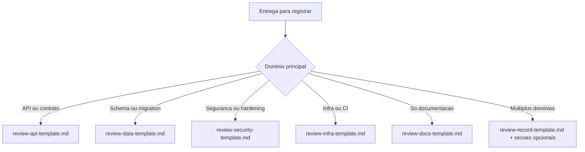

# Review Documentation

Skill para registrar alteracoes tecnicas em um artefato formal de review, changelog tecnico ou registro de entrega, mantendo rastreabilidade clara entre mudanca, decisao, validacao e risco.

## Regra de acionamento obrigatorio

Esta skill deve ser acionada obrigatoriamente sempre que a tarefa envolver:
- desenvolvimento de codigo novo;
- refatoracao de codigo existente;
- correcao de defeitos, bugs ou regressões em codigo.

Essa obrigatoriedade vale mesmo quando a solicitacao principal estiver focada em implementacao, ajuste tecnico ou correção funcional, desde que haja alteracao de codigo no escopo da entrega.

## Quando ativar

Ative esta skill obrigatoriamente quando a tarefa envolver desenvolvimento, refatoracao ou correcao de codigo.

Ative esta skill tambem quando a tarefa envolver qualquer um dos cenarios abaixo:
- criar ou atualizar um registro tecnico de entrega;
- documentar alteracao retroativa ja implementada;
- registrar PR, fix, refatoracao, ajuste de schema, testes, infraestrutura, seguranca ou documentacao;
- consolidar ADR resumido da mudanca;
- padronizar registros tecnicos de entrega do projeto.

## Nao confundir com `documentation-sync`

Use esta skill quando a necessidade principal for produzir um artefato formal de review, changelog tecnico ou registro auditavel da entrega.

Nao use esta skill como substituto da revisao de documentacao viva do repositorio. Quando a mudanca tambem exigir atualizar README, docs operacionais, arquitetura, QA, requisitos ou guias existentes, complemente com `../documentation-sync/`.

Regra pratica:
- `review-documentation` registra a mudanca executada em um artefato formal de entrega;
- `documentation-sync` revisa e atualiza a base documental afetada pela mudanca.

## Regras obrigatorias

### 1. Registro obrigatorio por alteracao relevante
Toda alteracao relevante deve gerar um registro tecnico no local adotado pelo projeto, como pasta de review, changelog de entrega, journal tecnico ou artefato equivalente.

Para tarefas com desenvolvimento, refatoracao ou correcao de codigo, esse registro nao e opcional: ele faz parte do criterio de conclusao da entrega.

### 2. Cobertura retroativa
Se a mudanca ja foi feita e ainda nao tem registro, crie o review retroativo antes de considerar a tarefa concluida.

### 3. Padrao de nome do arquivo
Quando o projeto nao definir outro padrao, use preferencialmente:

```text
YYYY-MM-DD-HHMM-<slug-curto>.md
```

### 4. Conteudo minimo obrigatorio
Todo review deve conter:
- contexto e objetivo da alteracao;
- escopo tecnico e arquivos modificados;
- ADR resumido com decisao, alternativas e trade-offs;
- evidencias de validacao;
- riscos, impacto e plano de rollback;
- proximos passos recomendados;
- ao menos um diagrama `mermaid`.

### 5. Criterio de conclusao
Nenhuma tarefa de implementacao deve ser considerada plenamente fechada sem o registro tecnico correspondente, quando o projeto exigir esse tipo de artefato.

Quando a tarefa envolver desenvolvimento, refatoracao ou correcao de codigo, a execucao desta skill deve ser tratada como obrigatoria para o fechamento da demanda.

### 6. Commit obrigatorio ao acionar a skill
Sempre que esta skill for acionada, deve ser criado um commit relacionado exclusivamente aos arquivos afetados pela solicitacao atendida.

Esse commit deve incluir, na mensagem e/ou corpo descritivo conforme o padrao adotado pelo projeto:
- resumo do prompt original;
- resumo da `Intencao Principal`;
- resumo das `Intencoes Secundarias`;
- referencia objetiva aos arquivos afetados pela solicitacao.

Se o projeto usar Conventional Commits, Gitflow ou outro padrao de mensagem, essa exigencia deve ser acomodada no assunto e no corpo do commit, sem quebrar a convencao local.

## Padrao estrutural recomendado

Use esta ordem de secoes:

1. Titulo objetivo da alteracao
2. `## Contexto e objetivo`
3. `## Escopo tecnico e arquivos modificados`
4. `## ADR resumido`
5. `## Evidencias de validacao`
6. `## Riscos, impacto e rollback`
7. `## Proximos passos recomendados`
8. `## Diagrama (Mermaid)`

## Regras editoriais

- Escreva de forma tecnica, direta e auditavel.
- Diferencie claramente o que foi executado do que apenas foi recomendado.
- Quando citar testes, inclua o comando executado e o resultado resumido.
- Quando nao houver execucao real, declare explicitamente que a validacao nao foi executada.
- Liste arquivos modificados em formato simples e objetivo.
- Evite texto promocional, justificativas vagas ou linguagem generica.

## Secoes opcionais por tipo de alteracao

### 1. Persistencia e dados
Documente adicionalmente quando houver mudanca em banco, modelos, eventos de dados, migracoes, trilha de auditoria, capacidade ou rollback de persistencia.

### 2. API, contratos e integracoes
Documente contratos alterados, endpoints afetados, compatibilidade retroativa, payloads, filas, eventos, webhooks ou integracoes externas.

### 3. Relatorios, arquivos gerados ou exportacoes
Documente templates impactados, fluxo de geracao, nomes de arquivo, entrada, saida e validacao aplicada.

### 4. Tempo real, mensageria ou processamento assincrono
Documente rotas, consumidores, payloads, autenticacao, reprocessamento, fallback e comportamento em indisponibilidade.

### 5. Testes e QA
Documente suite afetada, cobertura adicionada, regressao evitada, impacto em CI e evidencias reaproveitadas no fechamento.

### 6. Mudancas somente documentais
Mesmo alteracoes apenas em `docs/` podem exigir review se fizerem parte da entrega solicitada. Nesse caso, descreva documento refinado, criterio de consistencia aplicado e impacto esperado sobre requisitos, QA, arquitetura ou manutencao.

## Workflow recomendado

### Passo 1. Identificar o tipo de alteracao
Classifique a entrega por dominio principal:
- aplicacao ou API;
- dados e persistencia;
- testes e QA;
- integracoes externas;
- processamento assincrono ou eventos;
- infraestrutura e operacao;
- documentacao.

### Passo 2. Coletar evidencias
Levante:
- arquivos tocados;
- comandos executados;
- suites de teste afetadas;
- riscos, dependencias e bloqueios.

Colete tambem os insumos obrigatorios do commit final:
- lista consolidada dos arquivos afetados pela solicitacao;
- resumo curto do prompt;
- resumo da `Intencao Principal`;
- resumo das `Intencoes Secundarias`.

### Passo 2.1. Garantir diretorio de registro
Confirmar se o diretorio de review/changelog/journal tecnico existe.
Se nao existir, criar com `create_directory` antes de salvar o artefato.

### Passo 3. Selecionar o template adequado

Use o template especifico para o tipo de entrega identificado no Passo 1:

| Tipo de entrega | Template |
|---|---|
| Geral / multiplos dominios | [review-record-template.md](assets/template/review-record-template.md) |
| API / endpoints / contratos | [review-api-template.md](assets/template/review-api-template.md) |
| Schema / migration / persistencia | [review-data-template.md](assets/template/review-data-template.md) |
| Seguranca / hardening | [review-security-template.md](assets/template/review-security-template.md) |
| Infraestrutura / CI / pipeline | [review-infra-template.md](assets/template/review-infra-template.md) |
| Documentacao | [review-docs-template.md](assets/template/review-docs-template.md) |

Adapte as secoes opcionais conforme necessario. Para entregas que cruzam dominios, use o template geral e inclua as secoes opcionais dos dominios envolvidos.

### Passo 4. Validar conformidade
Antes de concluir, confirme:
- o arquivo foi salvo no local de review adotado pelo projeto;
- o nome segue o padrao cronologico, quando aplicavel;
- ha pelo menos um diagrama `mermaid`;
- o registro distingue validacao executada de validacao pendente;
- rollback e proximos passos foram registrados.

### Passo 5. Criar o commit obrigatorio
Antes de encerrar a execucao da skill:
- agrupe no commit apenas os arquivos afetados pela solicitacao atual;
- use mensagem de commit aderente ao padrao do projeto;
- inclua no commit um resumo do prompt, da `Intencao Principal` e das `Intencoes Secundarias`;
- relacione explicitamente os arquivos afetados pela solicitacao.

## Checklist rapido

- [ ] Pasta de registro existente (ou criada antes da escrita do review)
- [ ] Arquivo salvo no local de review adotado pelo projeto
- [ ] Nome no formato esperado pelo projeto
- [ ] Contexto e objetivo preenchidos
- [ ] Arquivos modificados listados
- [ ] ADR resumido preenchido
- [ ] Evidencias de validacao informadas
- [ ] Riscos, impacto e rollback descritos
- [ ] Proximos passos registrados
- [ ] Diagrama `mermaid` incluido
- [ ] Commit criado com os arquivos afetados pela solicitacao
- [ ] Commit inclui resumo do prompt, `Intencao Principal` e `Intencoes Secundarias`

## Convencoes adicionais recomendadas

- Prefira slug curto orientado ao efeito da mudanca, nao ao ticket interno.
- Use titulos focados no comportamento alterado.
- Se a mudanca for retroativa, deixe isso explicito logo no contexto.
- Para tarefas amplas, priorize um review por entrega coerente, nao um review unico para alteracoes desconexas.
- Quando existirem revisao consolidada ou aprovacao final do Tech Lead, referencie o review tecnico nesses artefatos quando aplicavel.

## Referencias de apoio

Use estes materiais durante o preenchimento do review:

| Referencia | Uso |
|---|---|
| [checklist.md](references/checklist.md) | Conformidade pre-publicacao por tipo de entrega |
| [adr-patterns.md](references/adr-patterns.md) | Exemplos de ADR por cenario (refatoracao, schema, seguranca, infra, docs) |
| [rollback-guide.md](references/rollback-guide.md) | Padroes de plano de rollback por tipo de entrega |
| [validation-evidence.md](references/validation-evidence.md) | Padroes de evidencia de validacao com exemplos de comando e resultado |
| [anti-patterns.md](references/anti-patterns.md) | Anti-padroes recorrentes e como corrigi-los |

## Decision tree — qual template usar?



## Saida esperada

O resultado desta skill deve incluir:
- um arquivo Markdown pronto para auditoria tecnica, com rastreabilidade clara entre alteracao, decisao, validacao, risco e proximo passo;
- um commit relacionado aos arquivos afetados pela solicitacao;
- resumo do prompt, da `Intencao Principal` e das `Intencoes Secundarias` associado ao commit conforme a convencao do projeto.