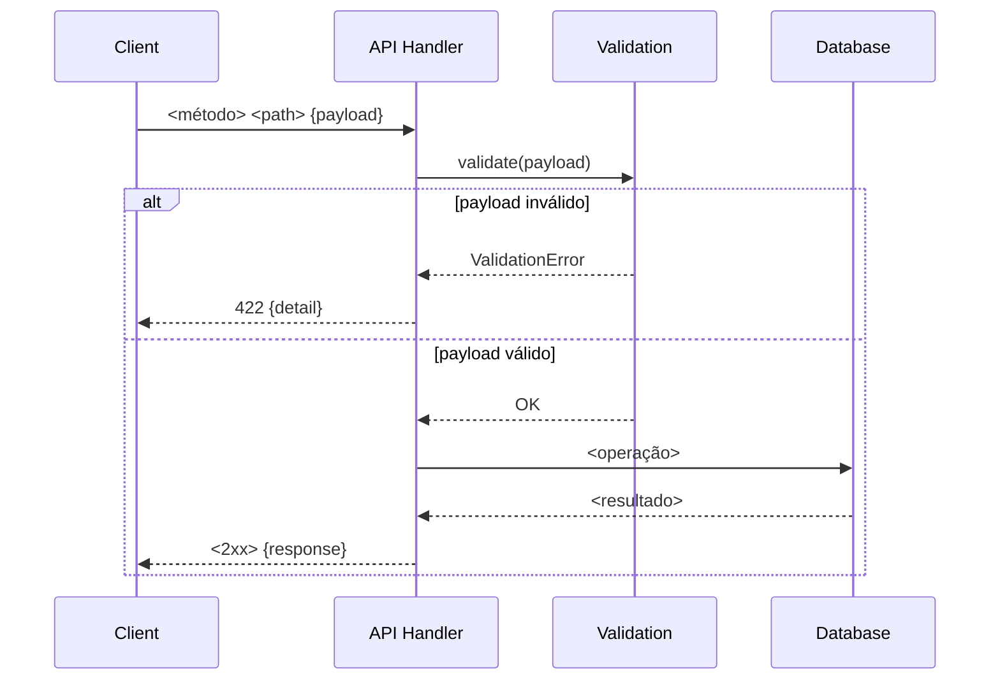

# <Titulo curto — ex: "Adicionar validação de schema no endpoint POST /orders">

> **Tipo:** API / Endpoints / Contratos
> **Registro retroativo:** [sim/não] — se sim, declare o commit e data aqui.

## Contexto e objetivo
Descreva:
- qual endpoint ou contrato foi afetado;
- qual era o problema, comportamento incorreto ou necessidade de evolução;
- qual é o objetivo técnico desta entrega.

## Escopo técnico e arquivos modificados
- `<path/to/handler.py>` — <o que mudou>
- `<path/to/schema.py>` — <o que mudou>
- `<path/to/tests/test_endpoint.py>` — <cenários adicionados>
- `<path/to/openapi.json>` — <se gerado automaticamente, declarar>

Mudanças aplicadas:
- `<mudança técnica 1>`
- `<mudança técnica 2>`

## ADR resumido

### Decisão
<Uma frase: o que foi escolhido e por quê.>

### Alternativas consideradas
1. `<alternativa 1>` — <motivo do descarte>
2. `<alternativa 2>` — <motivo do descarte>
3. `<opção escolhida>` — <motivo da preferência>

### Trade-offs
- **Vantagem:** <o que melhora>
- **Custo:** <o que aumenta ou sacrifica>
- **Risco residual:** <o que ainda pode falhar>

## Contrato e endpoints afetados

| Método | Path | Status anterior | Status após | Breaking? |
|--------|------|-----------------|-------------|-----------|
| POST | `/api/<recurso>` | `<antes>` | `<depois>` | Não / Sim |
| GET | `/api/<recurso>/:id` | `<antes>` | `<depois>` | Não / Sim |

Compatibilidade retroativa: [breaking / non-breaking]
Se breaking: estratégia de versioning ou migração de clientes adotada:
- `<estratégia>`

Payloads alterados (se aplicável):

```json
// Request — antes
{ "<campo>": "<tipo-anterior>" }

// Request — depois
{ "<campo>": "<tipo-novo>", "<campo-novo>": "<tipo>" }
```

## Evidências de validação

Ambiente: <local / CI / staging>

```bash
# Happy path
curl -X POST <url> \
  -H "Authorization: Bearer <token>" \
  -H "Content-Type: application/json" \
  -d '<payload-válido>'
# Resultado esperado: <HTTP 2xx + payload>

# Cenário de erro — validação
curl -X POST <url> \
  -H "Authorization: Bearer <token>" \
  -d '<payload-inválido>'
# Resultado esperado: <HTTP 4xx + mensagem>

# Cenário de erro — autenticação
curl -X POST <url> -H "Authorization: Bearer token-invalido"
# Resultado esperado: HTTP 401
```

Resultado:
- `<resultado resumido 1>`
- `<resultado resumido 2>`

Validação não executada:
- `<o que ficou pendente e por quê>`

## Riscos, impacto e rollback

### Riscos
- `<risco 1>` — probabilidade: <baixa/média/alta>
- `<risco 2>`

### Impacto
- **Clientes do endpoint:** <impacto>
- **Contratos downstream:** <impacto>
- **Documentação OpenAPI:** <atualizada automaticamente / pendente>

### Plano de rollback
**Gatilho:** <condição que ativa o rollback — ex: "taxa de erro 4xx inesperado > X%">
**Responsável:** <papel>

1. `<passo 1>`
2. `<passo 2>`
3. Validar: `<smoke test ou comando de verificação>`

**Impacto do rollback:** <o que é perdido ou afetado>

## Próximos passos recomendados
1. `<próximo passo 1>`
2. `<próximo passo 2>`

## Diagrama (Mermaid)


