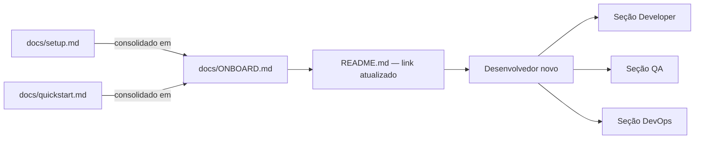

# <Titulo curto — ex: "Docs: consolidar onboarding em ONBOARD.md unificado">

> **Tipo:** Documentação
> **Registro retroativo:** [sim/não] — se sim, declare o commit e data aqui.

## Contexto e objetivo
Descreva:
- qual documento ou conjunto de documentos foi afetado;
- qual era o problema (desatualização, duplicação, inconsistência, ausência);
- qual é o objetivo desta entrega documental e quem é o público afetado.

## Escopo técnico e arquivos modificados
- `<docs/ONBOARD.md>` — <criado / reescrito / atualizado>
- `<docs/setup.md>` — <removido / consolidado em ONBOARD.md>
- `<README.md>` — <link atualizado>

Mudanças aplicadas:
- `<mudança 1 — ex: "três arquivos de onboarding consolidados em um">`
- `<mudança 2>`

## ADR resumido

### Decisão
<Uma frase: o que foi escolhido e por quê.>

### Alternativas consideradas
1. `<alternativa 1>` — <motivo do descarte>
2. `<alternativa 2>` — <motivo do descarte>
3. `<opção escolhida>` — <motivo da preferência>

### Trade-offs
- **Vantagem:** <o que melhora — consistência, descobribilidade, manutenção>
- **Custo:** <o que aumenta — arquivo mais longo, necessidade de manutenção ativa>
- **Risco residual:** <ex: links externos ainda apontando para docs antigos>

## Critério de consistência aplicado
Descreva o critério usado para validar a qualidade do documento produzido:
- `<critério 1 — ex: "toda seção tem exemplo prático">`
- `<critério 2 — ex: "nenhum link interno quebrado">`
- `<critério 3 — ex: "terminologia consistente com SKILL.md do pacote">`

## Impacto sobre outros artefatos
Documentos que dependem do conteúdo alterado:
| Artefato | Tipo de impacto | Ação tomada |
|----------|-----------------|-------------|
| `<README.md>` | Link atualizado | Atualizado nesta entrega |
| `<docs/setup.md>` | Conteúdo absorvido | Removido |
| `<requisitos / QA / arquitetura>` | Referência | <atualizado / pendente> |

## Evidências de validação

Tipo: revisão editorial (sem execução de código).

Inspeção realizada:
- [ ] Links internos verificados manualmente (todos resolvem)
- [ ] Exemplos de código revisados (sintaxe correta, sem anti-padrões)
- [ ] Consistência com código atual verificada
- [ ] Terminologia alinhada com padrão do projeto

```bash
# Verificar links quebrados (se disponível)
<ferramenta de lint de markdown>
# Resultado: <N broken links / 0 broken links>
```

Validação não executada:
- `<o que ficou pendente>`

## Riscos, impacto e rollback

### Riscos
- Links externos ainda apontando para documentos removidos — probabilidade: <baixa/média/alta>
- `<risco 2>`

### Impacto
- **Descobribilidade:** <melhora / sem mudança>
- **Onboarding:** <impacto para novos membros>
- **Rastreabilidade de requisitos:** <impacto se houver>

### Plano de rollback
**Gatilho:** <condição — ex: "conteúdo crítico removido acidentalmente">
**Responsável:** Developer / Tech Lead

1. Identificar versão anterior via `git log -- <arquivo>`:
   ```bash
   git show <commit-hash>:<path/to/doc.md> > <path/to/doc.md>
   ```
2. Commitar restauração com mensagem explicando o motivo.
3. Notificar stakeholders se o documento foi compartilhado externamente.

**Impacto do rollback:** conteúdo novo perdido; links externos podem precisar de nova atualização.

## Próximos passos recomendados
1. `<próximo passo 1 — ex: configurar lint de markdown no CI>`
2. `<próximo passo 2 — ex: atualizar links externos em wikis ou portais>`

## Diagrama (Mermaid)


