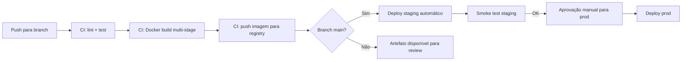

# <Titulo curto — ex: "CI: migrar build para Docker multi-stage">

> **Tipo:** Infraestrutura / CI / Pipeline
> **Registro retroativo:** [sim/não] — se sim, declare o commit e data aqui.

## Contexto e objetivo
Descreva:
- qual componente de infraestrutura ou pipeline foi afetado;
- qual era o problema (drift de ambiente, build lento, configuração frágil, custo);
- qual é o objetivo desta entrega (reprodutibilidade, velocidade, segurança, custo).

## Escopo técnico e arquivos modificados
- `<Dockerfile>` — <o que mudou>
- `<.github/workflows/<pipeline>.yml>` — <o que mudou>
- `<terraform/<modulo>.tf>` — <o que mudou, se IaC>
- `<docker-compose.yml>` — <o que mudou, se aplicável>

Mudanças aplicadas:
- `<mudança técnica 1>`
- `<mudança técnica 2>`

## ADR resumido

### Decisão
<Uma frase: o que foi escolhido e por quê.>

### Alternativas consideradas
1. `<alternativa 1>` — <motivo do descarte>
2. `<alternativa 2>` — <motivo do descarte>
3. `<opção escolhida>` — <motivo da preferência>

### Trade-offs
- **Vantagem:** <o que melhora — tempo, reprodutibilidade, custo>
- **Custo:** <o que aumenta — complexidade, tempo de configuração inicial>
- **Risco residual:** <o que ainda pode causar drift ou falha>

## Configuração de ambiente

Variáveis de ambiente adicionadas ou alteradas:
| Variável | Ambiente | Valor (mascarado) | Obrigatória |
|----------|----------|-------------------|-------------|
| `<VAR_NAME>` | `<dev/staging/prod>` | `<***>` | Sim/Não |

Serviços ou dependências afetadas:
- `<serviço 1>` — `<impacto>`
- `<serviço 2>` — `<impacto>`

Ambientes alvo desta mudança: `<dev / staging / prod / todos>`

## Evidências de validação

Ambiente: `<CI / staging>`

```bash
# Pipeline executado em:
# <url-do-run>

# Resultado dos jobs
<job 1>: passed
<job 2>: passed

# Métricas antes e depois (se disponível)
# Tempo de build anterior: <Xm Ys>
# Tempo de build após: <Xm Ys>
```

Imagem gerada (se aplicável): `<registry/imagem:tag>`

Deploy validado em: `<ambiente>`
```bash
<comando de verificação do deploy>
# Resultado: <status>
```

Validação não executada:
- `<o que ficou pendente — ex: teste de rollback em prod>`

## Riscos, impacto e rollback

### Riscos
- `<risco 1>` — probabilidade: <baixa/média/alta>
- `<risco 2>`

### Impacto
- **Pipeline:** <o que muda no fluxo de CI/CD>
- **Desenvolvedores locais:** <o que muda no setup local>
- **Produção:** <o que muda no comportamento em prod>

### Plano de rollback
**Gatilho:** <condição — ex: "pipeline quebrado após merge, deploy em prod falhando">
**Responsável:** DevOps / Developer

1. `<passo 1 — ex: git revert da mudança de infra>`
2. `<passo 2 — ex: re-aplicar configuração anterior via IaC>`
3. Validar: `<comando que confirma restauração>`

**Impacto do rollback:** <o que é perdido ao reverter>

## Próximos passos recomendados
1. `<próximo passo 1 — ex: pinar versões de imagens base>`
2. `<próximo passo 2 — ex: configurar alert de drift de ambiente>`

## Diagrama (Mermaid)


