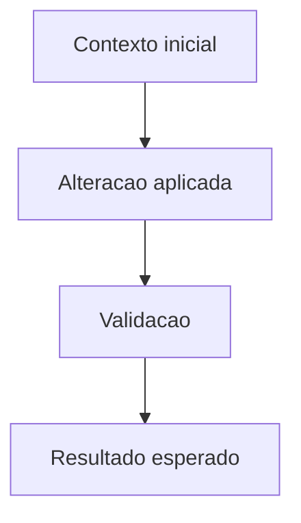

# <Titulo curto da alteracao>

## Contexto e objetivo
Descreva o problema, motivacao ou solicitacao que originou a alteracao.

Informe de forma objetiva:
- o que estava incorreto, ausente ou vulneravel;
- qual era o objetivo tecnico da entrega;
- se o registro e retroativo, declare isso aqui.

## Escopo tecnico e arquivos modificados
- `<arquivo-ou-modulo-1>`
- `<arquivo-ou-modulo-2>`
- `<arquivo-ou-modulo-3>`

Mudancas aplicadas:
- `<mudanca-tecnica-1>`
- `<mudanca-tecnica-2>`
- `<mudanca-tecnica-3>`

## ADR resumido
### Decisao
Descreva a decisao tecnica adotada.

### Alternativas consideradas
1. `<alternativa-1>`
2. `<alternativa-2>`

### Trade-offs
- `<trade-off-1>`
- `<trade-off-2>`

## Evidencias de validacao
Comandos executados:

```bash
<comando-1>
<comando-2>
```

Resultado:
- `<resultado-resumido-1>`
- `<resultado-resumido-2>`

Se nao houve execucao real, declare explicitamente:
- `Validacao automatizada nao executada nesta entrega.`

## Riscos, impacto e rollback
### Riscos
- `<risco-1>`
- `<risco-2>`

### Impacto
- `<impacto-1>`
- `<impacto-2>`

### Plano de rollback
1. `<passo-rollback-1>`
2. `<passo-rollback-2>`

## Proximos passos recomendados
1. `<proximo-passo-1>`
2. `<proximo-passo-2>`

## Diagrama (Mermaid)


## Secoes opcionais por tipo de alteracao

### Para modelo ou banco
- Migracoes criadas ou alteradas
- Impacto em auditoria, integridade ou capacidade
- Validacao em ambiente representativo quando aplicavel

### Para API ou schema
- Endpoints afetados
- Contrato, payload ou adaptador ajustado
- Impacto em schema, documentacao de contrato ou compatibilidade

### Para relatorios, exportacoes ou arquivos gerados
- Templates, definicoes ou artefatos impactados
- Fluxo de entrada, processamento e saida
- Nome final, formato ou destino do arquivo gerado

### Para integracoes externas
- Contrato mockado
- Estrategia de fallback
- Status do smoke real por ambiente

### Para testes e QA
- Suite, marcador ou categoria de teste usada
- Cobertura adicionada ou regressao protegida
- Impacto em CI, evidencias ou aceite