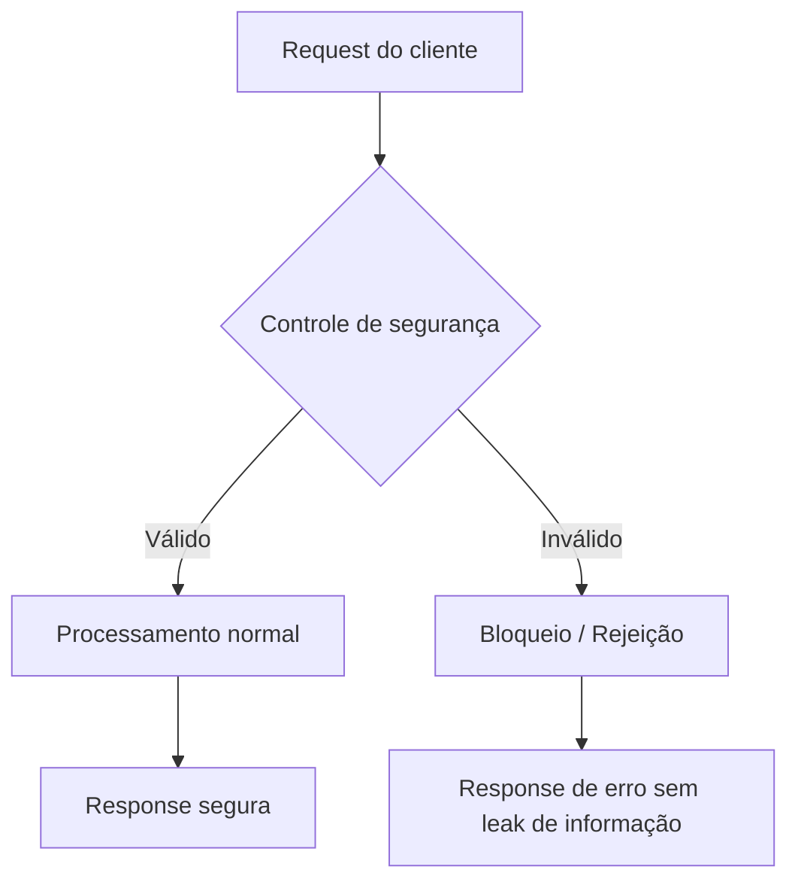

# <Titulo curto — ex: "Hardening: substituir nonce CSP estático por nonce por request">

> **Tipo:** Segurança / Hardening
> **Registro retroativo:** [sim/não] — se sim, declare o commit e data aqui.

## Contexto e objetivo
Descreva:
- qual vulnerabilidade, risco ou gap de segurança foi identificado;
- qual era o comportamento anterior e por que era inadequado;
- qual é o objetivo de segurança desta entrega (confidencialidade, integridade, disponibilidade).

Classificação OWASP (se aplicável): `<A01–A10 ou N/A>`

## Escopo técnico e arquivos modificados
- `<path/to/security-config.ts>` — <o que mudou>
- `<path/to/middleware/csp.ts>` — <o que mudou>
- `<path/to/tests/security.test.ts>` — <cenários adicionados>

Mudanças aplicadas:
- `<mudança técnica 1>`
- `<mudança técnica 2>`

## ADR resumido

### Decisão
<Uma frase: o que foi escolhido e por quê, com referência à ameaça mitigada.>

### Alternativas consideradas
1. `<alternativa 1>` — <motivo do descarte + risco residual>
2. `<alternativa 2>` — <motivo do descarte + risco residual>
3. `<opção escolhida>` — <por que mitiga melhor com menor custo operacional>

### Trade-offs
- **Vantagem:** <ameaça mitigada ou superfície reduzida>
- **Custo:** <impacto em performance, complexidade ou UX>
- **Risco residual:** <o que ainda não está coberto>

## Controles de segurança aplicados

| Controle | Antes | Depois | OWASP / WCAG / Norma |
|----------|-------|--------|----------------------|
| `<controle 1>` | `<estado anterior>` | `<estado após>` | `<referência>` |
| `<controle 2>` | `<estado anterior>` | `<estado após>` | `<referência>` |

Headers de segurança (se aplicável):
```http
Content-Security-Policy: <valor após>
X-Frame-Options: <valor>
Strict-Transport-Security: <valor>
X-Content-Type-Options: nosniff
```

Secrets e credenciais (se aplicável):
- Segredo rotacionado: [sim/não]
- Segredo commitado acidentalmente: [sim — ação tomada / não]
- Localização dos secrets: `<Vault / AWS Secrets Manager / .env não commitado>`

## Evidências de validação

Ambiente: <local / staging>

```bash
# Verificar headers
curl -I <url>

# Verificar ausência de secrets no repositório
git grep -i "<padrão-de-secret>"

# Ferramenta de análise estática (se disponível)
<ferramenta> <comando>
```

Resultado:
- `<resultado resumido 1>`
- `<resultado resumido 2>`

Ferramentas complementares utilizadas:
- `<ferramenta>` — `<resultado resumido>`

Validação não executada:
- `<o que ficou pendente — ex: pentest formal, validação em prod>`

## Riscos, impacto e rollback

### Riscos
- `<risco 1>` — probabilidade: <baixa/média/alta>
- `<risco 2>`

### Impacto
- **Superfície de ataque:** <reduzida em / nenhuma mudança em>
- **Usuários afetados:** <nenhum / usuários com sessão ativa precisam reautenticar / etc>
- **Dependências downstream:** <o que precisa ser atualizado>

### Plano de rollback
**Gatilho:** <condição — ex: "falha de autenticação após rotação de secret">
**Responsável:** <papel>

1. `<passo 1>`
2. `<passo 2>`
3. Validar: `<verificação de que o comportamento anterior foi restaurado>`

**Impacto do rollback:** <o que é perdido em termos de segurança ao reverter>

## Próximos passos recomendados
1. `<próximo passo 1 — ex: agendar pentest formal>`
2. `<próximo passo 2 — ex: configurar scan automatizado no CI>`

## Diagrama (Mermaid)


