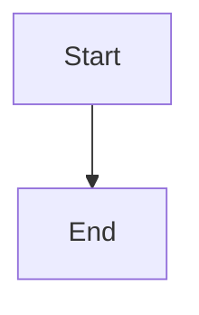
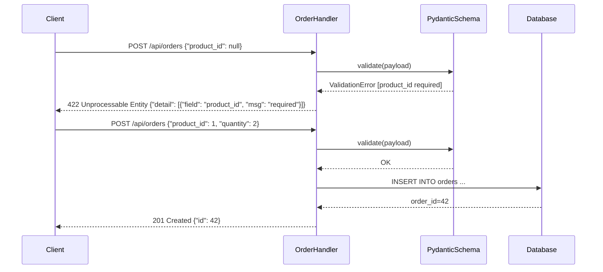

# Anti-padrões de Review Documentation

Erros recorrentes em registros técnicos de entrega e como corrigi-los.

## Anti-padrões de conteúdo

### 1. Contexto vago

❌ **Evitar:**
```markdown
## Contexto e objetivo
Implementar a funcionalidade solicitada pelo cliente.
```

✅ **Preferir:**
```markdown
## Contexto e objetivo
O endpoint `POST /api/orders` retornava `500` quando o campo `product_id` era nulo,
quebrando o fluxo de checkout. A validação de schema estava ausente no handler.
O objetivo desta entrega é adicionar validação com retorno `422 Unprocessable Entity`
e mensagem descritiva para o campo inválido.
```

**Por que importa:** sem contexto real, o registro não explica o problema — só o que foi feito, nunca o porquê.

---

### 2. Arquivos modificados genéricos

❌ **Evitar:**
```markdown
## Escopo técnico e arquivos modificados
- Vários arquivos de backend
- Alguns testes
```

✅ **Preferir:**
```markdown
## Escopo técnico e arquivos modificados
- `app/api/orders/handler.py` — adicionada validação de schema com Pydantic
- `app/api/orders/schemas.py` — campo `product_id` marcado como obrigatório com mensagem customizada
- `tests/api/test_orders.py` — 4 novos cenários de validação (campo ausente, nulo, tipo errado, valor negativo)
```

**Por que importa:** lista vaga não permite rastrear impacto de regressão ou entender o escopo real da mudança.

---

### 3. ADR sem alternativas reais

❌ **Evitar:**
```markdown
## ADR resumido
### Decisão
Usar Pydantic para validação.

### Alternativas consideradas
1. Não usar validação
2. Usar Pydantic
```

✅ **Preferir:**
```markdown
## ADR resumido
### Decisão
Usar Pydantic V2 com `model_validator` para validação no nível do schema, retornando erros padronizados.

### Alternativas consideradas
1. `Validação manual no handler` — descartado: verboso, sem padronização de mensagens
2. `Middleware de validação global` — descartado: granularidade insuficiente por campo
3. `Pydantic V2 com model_validator` — escolhido: declarativo, integrado ao FastAPI, mensagens configuráveis

### Trade-offs
- **Vantagem:** validação automática, serialização e documentação OpenAPI geradas juntas
- **Custo:** curva de aprendizado de V2 para o time; `model_validator` tem sintaxe diferente do V1
- **Risco residual:** campos opcionais com `None` podem passar silenciosamente se o validator não cobrir todos os cenários
```

**Por que importa:** ADR sem alternativas reais não documenta uma decisão — apenas registra o que foi feito.

---

### 4. Evidência omitida ou vaga

❌ **Evitar:**
```markdown
## Evidências de validação
Testado localmente e funcionou.
```

✅ **Preferir:**
```markdown
## Evidências de validação
Ambiente: local (Docker Compose com banco PostgreSQL 15)

```bash
pytest tests/api/test_orders.py -v
```
Resultado: `12 passed, 0 failed`

Validação não executada:
- Teste de carga — pendente; QA Expert deve executar antes do merge.
```

**Por que importa:** "testado localmente" não é reproduzível, não especifica ambiente e não declara o que não foi validado.

---

### 5. Rollback sem passos concretos

❌ **Evitar:**
```markdown
## Riscos, impacto e rollback
### Plano de rollback
Reverter o deploy caso haja problemas.
```

✅ **Preferir:**
```markdown
### Plano de rollback
**Gatilho:** taxa de erro 5xx > 0,5% por 3 minutos após o deploy.
**Responsável:** Developer de plantão.

1. `git revert <commit-hash> --no-edit && git push origin main`
2. Re-deploy via pipeline de CI (tag anterior: `v1.4.2`)
3. Validar: `curl -X POST /api/orders -d '{"product_id": null}'` deve retornar `422`
4. Registrar incidente no canal #incidents com link para este review

**Impacto:** endpoint sem validação de schema até nova release.
```

**Por que importa:** rollback genérico nunca é acionado — quando o incidente acontece, ninguém sabe o que fazer.

---

### 6. Diagrama ausente ou não relacionado

❌ **Evitar:**
```markdown
## Diagrama (Mermaid)

```

✅ **Preferir:**
```markdown
## Diagrama (Mermaid)

```

**Por que importa:** diagrama genérico não acrescenta informação; diagrama específico explica o comportamento implementado.

---

### 7. Review retroativo não declarado

❌ **Evitar:** criar um review sem mencionar que a mudança já foi implementada.

✅ **Preferir:** declarar explicitamente no contexto:
```markdown
## Contexto e objetivo
> **Registro retroativo:** esta mudança foi implementada no commit `abc1234` em 2026-03-28
> e não teve registro técnico formal na entrega. Este documento preenche a lacuna.
```

**Por que importa:** reviews sem declaração de retroatividade criam confusão sobre o estado atual do sistema.

---

### 8. Review único para mudanças desconexas

❌ **Evitar:** um único arquivo cobrindo "refatoração do handler + migration de schema + atualização de README".

✅ **Preferir:** um review por entrega coerente:
- `2026-03-31-1000-refatoracao-order-handler.md`
- `2026-03-31-1015-migration-orders-soft-delete.md`
- `2026-03-31-1030-atualizacao-readme-onboarding.md`

**Por que importa:** reviews agregados dificultam rastreabilidade por mudança e complicam rollback seletivo.

---

## Checklist de detecção de anti-padrões

Antes de publicar, verifique:

- [ ] Contexto descreve o problema real, não apenas o que foi feito
- [ ] Arquivos modificados são listados com nome e path completo
- [ ] ADR tem pelo menos 2 alternativas descartadas com motivo
- [ ] Evidências incluem comandos + resultados (ou declaração honesta de ausência)
- [ ] Rollback tem gatilho, responsável, passos e validação
- [ ] Diagrama representa o comportamento implementado (não um placeholder)
- [ ] Review retroativo declara retroatividade no contexto
- [ ] Review cobre uma entrega coerente (não múltiplas desconexas)
