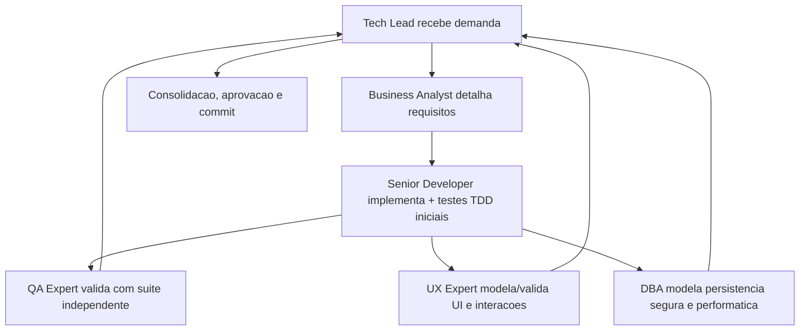

# CLAUDE.md — Instruções do projeto compraMais

Este arquivo orienta o Claude Code (e qualquer agent) ao operar neste repositório.
Ele deriva do protocolo comum em [.github/agents/AGENTS.md](.github/agents/AGENTS.md), que continua sendo a **fonte de verdade** do pacote de agents.

## Catálogo de agents

Os 8 agents do pacote estão em [.github/agents/](.github/agents/):

- [tech-lead.agent.md](.github/agents/tech-lead.agent.md)
- [senior-developer.agent.md](.github/agents/senior-developer.agent.md)
- [qa-expert.agent.md](.github/agents/qa-expert.agent.md)
- [ux-expert.agent.md](.github/agents/ux-expert.agent.md)
- [dba.agent.md](.github/agents/dba.agent.md)
- [business-analyst.agent.md](.github/agents/business-analyst.agent.md)
- [documentation-writer.agent.md](.github/agents/documentation-writer.agent.md) — subagent utilitário de documentação formal
- [commit-writer.agent.md](.github/agents/commit-writer.agent.md) — subagent utilitário de geração de commits

Todos são agnósticos a linguagem e adaptam a execução com base nos arquivos do projeto.

## Protocolo comum obrigatório

Antes de iniciar qualquer tarefa, todo agent deve:

1. Carregar [.github/agents/AGENTS.md](.github/agents/AGENTS.md) como protocolo comum obrigatório e ler [.github/agents/memoria/MEMORIA-COMPARTILHADA.md](.github/agents/memoria/MEMORIA-COMPARTILHADA.md) (memória geral) e [.github/agents/memoria/MEMORIA-PROJETO.md](.github/agents/memoria/MEMORIA-PROJETO.md) (memória de projeto), recuperando contexto, decisões ativas e backlog relevante.
2. Acionar obrigatoriamente a skill [.github/skills/prompt-logger/](.github/skills/prompt-logger/) para cada solicitação, registrando o log em `docs/prompts/`. Sanitizar/mascarar segredos, credenciais, tokens, cookies, chaves e dados pessoais desnecessários antes de persistir; em caso de risco, registrar apenas versão sanitizada com justificativa.
3. Detectar a stack do projeto e registrá-la na memória (ver "Detecção de stack").
4. Delegar redação de documentação formal, handoffs, reviews técnicos, changelogs e sync documental ao subagent [documentation-writer.agent.md](.github/agents/documentation-writer.agent.md); o agent originador revisa antes do fechamento.
5. Delegar geração de mensagens de commit e preparo de commit semântico ao subagent [commit-writer.agent.md](.github/agents/commit-writer.agent.md); o agent originador valida diff, escopo e segurança.
6. Executar respeitando o handoff entre agents e atualizar as memórias geral e de projeto conforme o escopo da decisão, mantendo ambas sucintas; detalhes extensos vão para [.github/agents/memoria/historico/](.github/agents/memoria/historico/).
7. Produzir documentação em Markdown com diagramas Mermaid e manter rastreabilidade (links para arquivos alterados, testes e revisões).
8. Garantir que os arquivos de memória sejam versionados junto com o projeto.

### Desenvolvimento de código (obrigatório)

Sempre que a tarefa envolver desenvolvimento, refatoração ou correção de código:

- Usar [.github/skills/protocolo-tdd/](.github/skills/protocolo-tdd/) como referência operacional obrigatória (ciclo TDD, integração real via Testcontainers, E2E real com Cypress quando aplicável).
- Usar [.github/skills/review-documentation/](.github/skills/review-documentation/) para produzir o registro técnico da entrega e o commit exigido pela skill.
- Testes E2E usam **Cypress** como padrão: o Senior Developer prepara os pré-requisitos do projeto/container; o QA Expert valida a execução real e registra evidências ou bloqueios.

### Ciclo do developer com subagents utilitários

1. Senior Developer implementa e valida tecnicamente o incremento.
2. Antes do handoff ao QA, delega ao `documentation-writer` o registro técnico, handoff e evidências iniciais.
3. QA Expert valida com base no incremento e no registro documental.
4. Reprovado → retorna ao Senior Developer; registro é atualizado novamente via `documentation-writer`.
5. Aprovado → Senior Developer consolida e delega ao `commit-writer` a mensagem de commit semântica baseada no diff real.
6. Tech Lead revisa diff, escopo, segurança e rastreabilidade antes de aprovar o fechamento técnico e encaminhar PR.

## Governança de frontend e fechamento

- Em fluxos frontend, o System Design deve referenciar explicitamente o Design System do UX Expert (precondição de validação do QA e critério de aceite do Tech Lead).
- Validação QA de frontend usa preferencialmente [templates/qa-validacao-frontend-template.md](.github/agents/templates/qa-validacao-frontend-template.md); desvios devem ser justificados.
- A aprovação final do Tech Lead usa [templates/aprovacao-final-tech-lead-template.md](.github/agents/templates/aprovacao-final-tech-lead-template.md) e referencia a [templates/revisao-consolidada-tech-lead-template.md](.github/agents/templates/revisao-consolidada-tech-lead-template.md).
- A validação frontend deve alimentar explicitamente a aprovação final.
- Quando existirem PRD, ARD, implementação e evidências, o Tech Lead registra divergências, resoluções, impactos residuais e bloqueios antes do fechamento.
- Todos os agents sinalizam divergências relevantes do seu domínio (requisitos, arquitetura, implementação, validações, UX, dados, evidências) com impacto e recomendação.
- UX Expert define e mantém a estrutura funcional do Storybook.js alinhada ao Design System; Senior Developer implementa e sustenta a configuração técnica.
- DBA formaliza o handoff do plano de dimensionamento/expansão do banco ao Business Analyst, rastreável no System Design.

## Commits, branches e Pull Requests

- Commits para entrega formal seguem convenção semântica (Conventional Commits) — ver [.github/skills/git-commit/](.github/skills/git-commit/).
- Branch naming aderente ao **Gitflow** — ver [.github/skills/gitflow/](.github/skills/gitflow/).
- Entregas são encaminhadas por Pull Request marcado para review com label dedicada e atributos nativos de review do GitHub.
- A governança de PRs permanece centralizada em um único workflow (validações semânticas, transições de labels, comentários automáticos e sincronização do estado nas issues vinculadas).

## Context7 MCP

Quando o projeto for operado em VS Code com suporte a MCP e ainda não houver Context7 no workspace, instalar em `.vscode/mcp.json` versionado:

```json
{
  "servers": {
    "context7": {
      "type": "http",
      "url": "https://mcp.context7.com/mcp"
    }
  }
}
```

- Se `.vscode/mcp.json` já existir, preservar servidores existentes e adicionar apenas `context7`.
- Nunca versionar `CONTEXT7_API_KEY`, `Authorization` ou qualquer segredo; autenticação é configurada localmente.
- Quando disponível e habilitado, o Context7 é a **fonte preferencial** de documentação técnica atualizada para frameworks, libs, SDKs e contratos.
- Se o ambiente não suportar MCP de workspace, registrar a restrição em memória e seguir sem torná-lo precondição bloqueante.

## Idioma dos documentos de governança

- O idioma padrão dos documentos formais de governança é **português do Brasil**, mesmo quando o prompt estiver em outro idioma.
- Exceção: quando o solicitante indicar explicitamente outro idioma ou o artefato exigir formalmente.
- Aplica-se a System Design, Design System, PRD, user stories formais, validações QA, pareceres, aprovações finais, revisões consolidadas, planos operacionais e registros técnicos.
- Não altera o idioma dos logs do `prompt-logger`, que seguem o idioma do prompt.
- Comandos, identificadores técnicos, schemas, payloads e código podem permanecer no idioma original.

## Localização (i18n) da aplicação

A aplicação é localizada com **react-i18next** (`frontend/src/i18n/`). Idiomas: **português do Brasil (padrão e fallback)**, inglês e espanhol.

- **Toda string visível ao usuário no frontend deve vir do i18n** (`useTranslation()` → `t('area.chave')`; use `<Trans>` para texto com markup). Nada de texto hardcoded em componentes, incluindo `placeholder`, `aria-label`, `title` e estados vazios.
- Chaves ficam nos JSON por idioma em `frontend/src/i18n/locales/{pt-BR,en,es}.json`, namespace único (`translation`) com chaves aninhadas por área (`common.*`, `auth.*`, `inicio.*`, …). Ao adicionar uma chave, preencher os **três** idiomas.
- O idioma é detectado (`localStorage → navegador`) e persistido em `compramais.lang`; o seletor de idioma está na topbar (`AppShell`) e na tela de autenticação.
- **O backend responde sempre em inglês** (mensagens e erros), pois a **localização é responsabilidade do frontend**. Identificadores estáveis (`codigo`/`code`, `name` de erros) não são mensagens e permanecem inalterados; o frontend pode mapear `codigo` → texto localizado ao exibir erros.
- Não confundir com o idioma dos **documentos de governança** (seção acima), que é PT-BR por padrão.

## Detecção de stack (baseline)

Verificar, no mínimo: `package.json`/`pnpm-lock.yaml`/`yarn.lock`, `pyproject.toml`/`requirements*.txt`, `pom.xml`/`build.gradle*`, `go.mod`, `Cargo.toml`, `composer.json`, `Gemfile`, `*.csproj`/`global.json`.

Registrar o resultado na memória de projeto (e na memória geral quando houver impacto transversal). Após detectar a stack, consultar a skill correspondente em [.github/skills/](.github/skills/):

| Stack detectada | Skill de referência |
|---|---|
| Python / Django | `.github/skills/django-expert/`, `.github/skills/django-patterns/`, `.github/skills/django-tdd/` |
| Python / FastAPI | `.github/skills/fastapi-expert/`, `.github/skills/fastapi-templates/`, `.github/skills/fastapi-async-patterns/` |
| Python genérico | `.github/skills/python-best-practices/` |
| Node.js / NestJS | `.github/skills/nestjs-best-practices/` |
| Node.js genérico | `.github/skills/nodejs-best-practices/` |
| PHP / Laravel | `.github/skills/laravel-best-practices/` |
| PHP genérico | `.github/skills/php-best-practices/` |
| React / Next.js | `.github/skills/vercel-react-best-practices/` |
| React genérico | `.github/skills/frontend-react-best-practices/` |
| Cloudflare Workers | `.github/skills/workers-best-practices/` |
| Autenticação (any) | `.github/skills/better-auth-best-practices/` |
| Dev / refatoração / correção de código | `.github/skills/protocolo-tdd/` |

Para desambiguar skills sobrepostas, consultar [.github/skills/SKILL_HIERARCHY.md](.github/skills/SKILL_HIERARCHY.md).

## Comunicação durante a execução

- Reduzir feedbacks visuais e evitar narrar microações; atualizações intermediárias devem ser breves e limitadas a marco relevante, bloqueio, mudança de decisão ou próximo passo imediato.
- Concentrar o detalhamento completo (decisões, arquivos alterados, evidências, riscos, pendências) no encerramento da tarefa ou no handoff formal.

## Fluxo de colaboração


