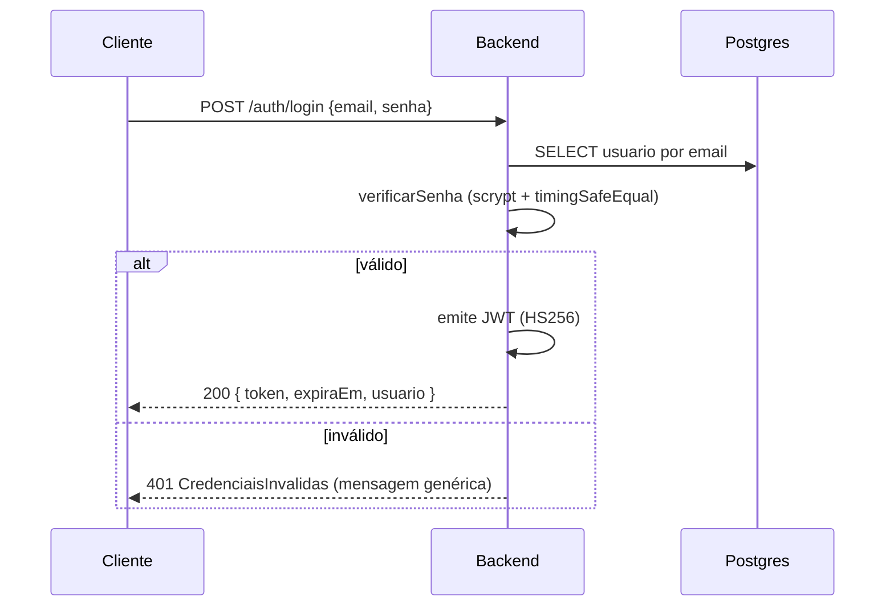

# Autenticação — local (e-mail/senha + JWT) e Google OAuth

Documento técnico da autenticação do compraMais. Implementa **RF-015** (autenticação recorrente) sobre
o provedor de identidade plugável (**AD-20**), com persistência em banco e guardrails de LGPD (**AD-19**)
e segredos (**AD-29 / PRJ-DEC-07**). Para criar as credenciais no Google, ver
[google-cloud-setup.md](google-cloud-setup.md).

## Visão geral

- **Login local:** e-mail + senha. Senha com **scrypt + salt** (`node:crypto`), nunca em texto.
  Login bem-sucedido emite um **JWT** (HS256).
- **Login Google (OAuth 2.0 / OIDC):** o usuário pode **vincular** uma conta Google e autenticar por
  ela. O backend resolve o usuário e emite o **mesmo JWT**.
- **Persistência:** tabela `usuarios` no PostgreSQL (adaptador `UsuarioRepositoryPg`); em testes e
  ambientes sem banco, adaptador em memória (mesma porta).
- **Identidade plugável (AD-20):** local é o default; Google é uma 2ª via; gov.br/SSO seriam novas
  implementações sem reescrever consumidores.

## Modelo de domínio

`Usuario` (em `backend/src/shared/identity/usuario.ts`) é a **identidade de autenticação** — estende
`EntidadeBase` (AD-33). Distinto de `ContaAcesso`, que modela o vínculo fornecedor ↔ titular/procurador.

| Campo | Tipo | Observação |
|---|---|---|
| `id` | uuid | PK |
| `email` | text único | normalizado (trim + lowercase) |
| `senhaHash` / `salt` | text \| null | credencial local (scrypt); null = só login social |
| `googleId` | text único \| null | `sub` do Google (OIDC) |
| `nome` | text | nome de exibição |
| `papel` | text | `titular \| procurador \| cpl \| smga \| leitura` |
| `fornecedorId` | uuid \| null | empresa representada (titular/procurador) |
| `registerDate`/`updateDate`/`lastUserUpdate` | — | auditoria de linha (AD-33) |

Regras encapsuladas: e-mail válido, senha ≥ 8, verificação em tempo constante (`timingSafeEqual`),
vínculo Google idempotente (re-vincular o mesmo `googleId` é no-op; outro `googleId` lança).

## Endpoints

| Método | Rota | Descrição | Auth |
|---|---|---|---|
| POST | `/auth/registro` | Cria usuário local (`email`, `senha`, `nome`, `papel?`, `fornecedorId?`) | pública |
| POST | `/auth/login` | Login local → `{ token, expiraEm, usuario }` | pública |
| GET | `/auth/me` | Identidade do token | Bearer JWT |
| POST | `/auth/google/vincular` | Vincula `googleId` ao usuário autenticado | Bearer JWT |
| GET | `/auth/google` | Inicia o OAuth (redirect ao Google) | pública¹ |
| GET | `/auth/google/callback` | Callback: troca code, lê perfil, loga, redireciona com JWT | pública¹ |

¹ Montadas só quando `GOOGLE_CLIENT_ID`/`GOOGLE_CLIENT_SECRET` estão configurados. Documentação
interativa de todas as rotas em **`/docs`** (OpenAPI).

### JWT

- Algoritmo **HS256**; segredo em `JWT_SECRET` (dev) / Docker secret `jwt_secret` (prod, `*_FILE`).
- Claims: `sub` = `userId`, `papel`, `empresaId` (quando houver), `iss = compramais`, `exp`
  (`JWT_EXPIRES_IN_SECONDS`, default 3600s).
- Envie como `Authorization: Bearer <token>`. `TokenService.verificar` valida assinatura, emissor e
  expiração.

## Fluxos

### Login local

### Login/vínculo via Google

Resolução do usuário no callback (`AutenticarGoogle`):
1. por `googleId` (já vinculado) → login;
2. senão por **e-mail** (conta local existente) → **vincula** o Google e loga;
3. senão **auto-provisiona** um usuário novo (papel padrão `titular`) e loga.

Diagrama completo do OAuth: ver [google-cloud-setup.md](google-cloud-setup.md#visão-geral-do-fluxo).

## Eventos de auditoria (AD-18 / AD-23)

As operações emitem eventos de domínio consumidos pela auditoria (escritor único):
`UsuarioRegistrado`, `UsuarioAutenticado` (`{ metodo: local|google }`) e `GoogleVinculado`. Ações de
procurador carregam ator + empresa na trilha (AD-30).

## Persistência

- Migração [`backend/migrations/0002_init_auth.sql`](../../backend/migrations/0002_init_auth.sql)
  (forward-only — AD-28). No startup, o **migration runner** (`src/shared/db/migracoes.ts`) aplica todas
  as migrações pendentes em ordem e as registra em `schema_migrations` (idempotente). Ver
  [migrações e seed](../db/migracoes-e-seed.md).
- Seleção do adaptador: **Postgres** quando `POSTGRES_HOST`/`DATABASE_URL` configurados e
  `NODE_ENV !== test`; senão **memória** (mantém os testes sem depender de banco).

## Segurança e LGPD

- **Senha:** scrypt + salt aleatório por usuário; nunca serializada/trafegada em texto (AD-19).
- **Segredos** (AD-29 / PRJ-DEC-07): `JWT_SECRET` e `GOOGLE_CLIENT_SECRET` nunca versionados; em prod
  via Docker secret / gestor de segredos. `.env` está no `.gitignore`.
- **Mensagens genéricas:** login e reset não revelam a existência da conta.
- **Hardening HTTP:** helmet + CORS aplicados globalmente (`shared/http/security.ts`).
- **Pendências (Onda 2/3):** MFA, refresh token + revogação, reset de senha por mensageria, e mover o
  `GOOGLE_CLIENT_SECRET` para Docker secret dedicado.

## Variáveis de ambiente

| Variável | Default (dev) | Descrição |
|---|---|---|
| `JWT_SECRET` (ou `JWT_SECRET_FILE`) | inseguro (trocar) | segredo de assinatura HS256 |
| `JWT_EXPIRES_IN_SECONDS` | `3600` | TTL do token |
| `GOOGLE_CLIENT_ID` | vazio | client OAuth (vazio = Google off) |
| `GOOGLE_CLIENT_SECRET` (ou `_FILE`) | vazio | segredo OAuth |
| `GOOGLE_CALLBACK_URL` | `http://localhost:3000/auth/google/callback` | = redirect URI no Console |
| `AUTH_FRONTEND_REDIRECT` | `http://localhost:5173/#/cadastro` | destino pós-login Google |
| `POSTGRES_*` | ver compose | conexão do banco |
