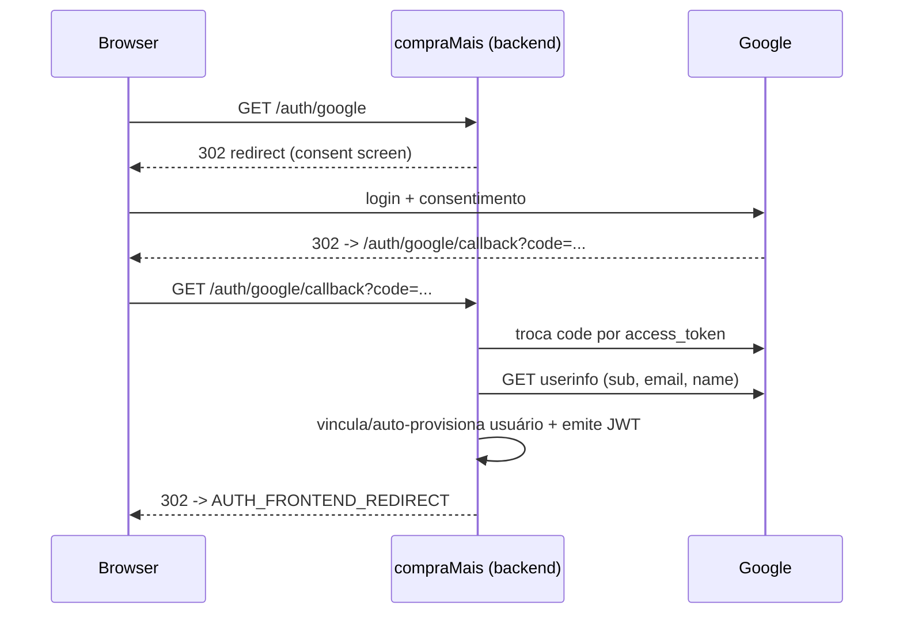

# Configuração do Google OAuth (Google Cloud Console)

Guia completo para habilitar o **login social com Google** no compraMais. Ao final você terá um
`GOOGLE_CLIENT_ID` e um `GOOGLE_CLIENT_SECRET` para preencher o `.env` (dev) ou o gestor de segredos
(prod). A arquitetura de autenticação está em [autenticacao.md](autenticacao.md).

> **Segurança (AD-29 / PRJ-DEC-07):** o `GOOGLE_CLIENT_SECRET` é um segredo. **Nunca** o versione
> (`.env` está no `.gitignore`). Em produção, injete-o pelo Portainer/secret manager.

---

## Visão geral do fluxo

O compraMais usa o **Authorization Code Flow** (OAuth 2.0 / OpenID Connect). O backend
(`@fastify/oauth2`) redireciona o usuário ao Google, recebe o `code` no *callback*, troca por um
token, lê o perfil (`sub`, `email`, `name`) no endpoint OIDC `userinfo` e então resolve/loga o usuário
emitindo um **JWT** próprio do compraMais.



---

## Pré-requisitos

- Uma conta Google com acesso ao [Google Cloud Console](https://console.cloud.google.com/).
- Permissão para criar projetos / credenciais OAuth na organização (ou usar um projeto pessoal).

---

## Passo 1 — Criar (ou selecionar) um projeto

1. Acesse <https://console.cloud.google.com/>.
2. Na barra superior, abra o seletor de projetos → **Novo projeto**.
3. Nome sugerido: `compraMais` (ou `compraMais-dev` / `compraMais-prod` se separar ambientes).
4. **Criar** e selecione o projeto recém-criado.

> Recomenda-se **um projeto por ambiente** (dev e prod) para isolar credenciais e URIs de redirect.

---

## Passo 2 — Configurar a tela de consentimento OAuth

1. Menu **APIs e Serviços → Tela de permissão OAuth** (*OAuth consent screen*).
2. **User Type:**
   - **Externo** — para fornecedores (cidadãos) com qualquer conta Google. Exige publicação.
   - **Interno** — apenas contas da mesma organização Google Workspace (ex.: só servidores).
   - Para o Portal do Fornecedor, use **Externo**.
3. Preencha **App information**:
   - **App name:** `compraMais — Prefeitura de Rio Branco`
   - **User support email:** e-mail institucional de suporte.
   - **App logo:** opcional.
4. **App domain** (recomendado em produção):
   - Home page, Política de Privacidade e Termos de Serviço (URLs públicas).
   - **Authorized domains:** o domínio de produção (ex.: `compramais.example`).
5. **Developer contact information:** e-mail do time técnico.
6. **Scopes:** adicione os scopes **não sensíveis**:
   - `openid`
   - `.../auth/userinfo.email`
   - `.../auth/userinfo.profile`
   (equivalem a `openid email profile` enviados pelo backend).
7. **Test users** (enquanto o app estiver em *Testing*): adicione os e-mails que poderão logar antes
   da publicação.
8. Salve.

> **Testing vs. Published:** em *Testing*, só os *test users* conseguem logar. Para liberar a todos os
> fornecedores, clique em **Publish app** (apps externos com scopes não sensíveis costumam ser
> aprovados sem verificação adicional).

---

## Passo 3 — Criar as credenciais OAuth (Client ID)

1. Menu **APIs e Serviços → Credenciais → Criar credenciais → ID do cliente OAuth**.
2. **Application type:** **Web application**.
3. **Name:** `compraMais backend (dev)` ou `... (prod)`.
4. **Authorized JavaScript origins** (origem do browser que inicia o fluxo):
   - Dev: `http://localhost:5173` e `http://localhost:3000`
   - Prod: `https://compramais.example`
5. **Authorized redirect URIs** — DEVE casar EXATAMENTE com o `GOOGLE_CALLBACK_URL` do backend:
   - Dev: `http://localhost:3000/auth/google/callback`
   - Prod: `https://compramais.example/auth/google/callback`
6. **Criar.** O Console exibirá o **Client ID** e o **Client secret** — copie ambos.

> ⚠️ A **redirect URI** precisa ser idêntica (esquema, host, porta, caminho). Qualquer divergência
> resulta em `redirect_uri_mismatch`.

---

## Passo 4 — Preencher as variáveis de ambiente

No `.env` (dev) — veja [`.env.example`](../../.env.example) e
[`backend/.env.example`](../../backend/.env.example):

```bash
GOOGLE_CLIENT_ID=<client-id>.apps.googleusercontent.com
GOOGLE_CLIENT_SECRET=<client-secret>
GOOGLE_CALLBACK_URL=http://localhost:3000/auth/google/callback
AUTH_FRONTEND_REDIRECT=http://localhost:5173/#/cadastro
```

Em **produção** (Docker Swarm / Portainer):
- `GOOGLE_CLIENT_ID` e `GOOGLE_CALLBACK_URL` por variável de ambiente do serviço.
- `GOOGLE_CLIENT_SECRET` injetado pelo gestor de segredos (não versionado).
- `GOOGLE_CALLBACK_URL=https://compramais.example/auth/google/callback`.

> Se `GOOGLE_CLIENT_ID`/`GOOGLE_CLIENT_SECRET` estiverem **vazios**, o login social fica
> **desativado** (as rotas `/auth/google*` não são montadas) e o login local segue funcionando.

| Variável | Origem (Console) | Obrigatória p/ Google |
|---|---|---|
| `GOOGLE_CLIENT_ID` | Credenciais → Client ID | sim |
| `GOOGLE_CLIENT_SECRET` | Credenciais → Client secret | sim |
| `GOOGLE_CALLBACK_URL` | = Authorized redirect URI | sim (default localhost) |
| `AUTH_FRONTEND_REDIRECT` | URL do frontend pós-login | não (tem default) |

---

## Passo 5 — Testar

1. Suba o stack: `docker compose --profile dev up --build`.
2. No browser, acesse **`http://localhost:3000/auth/google`**.
3. Faça login e consinta. O Google redireciona para `/auth/google/callback`.
4. O backend redireciona para `AUTH_FRONTEND_REDIRECT` com `?token=<JWT>` no fragmento.
5. Use o token: `GET /auth/me` com `Authorization: Bearer <JWT>` deve retornar a identidade.

---

## Solução de problemas

| Erro | Causa provável | Correção |
|---|---|---|
| `redirect_uri_mismatch` | Redirect URI difere do cadastrado | Iguale `GOOGLE_CALLBACK_URL` à *Authorized redirect URI* (inclusive porta/scheme) |
| `access_blocked` / app não verificado | App em *Testing* e e-mail não é *test user* | Adicione o e-mail em *Test users* ou publique o app |
| `invalid_client` | Client ID/secret incorretos | Reconfira os valores copiados do Console |
| 404 em `/auth/google` | Credenciais vazias no backend | Defina `GOOGLE_CLIENT_ID` e `GOOGLE_CLIENT_SECRET` e reinicie |
| `GOOGLE_USERINFO_FALHOU` (502) | Falha ao ler o perfil OIDC | Verifique conectividade do backend e os scopes `email profile` |

---

## Rotação e revogação

- **Rotacionar o secret:** crie um novo *Client secret* no Console, atualize o ambiente e remova o
  antigo. JWTs já emitidos continuam válidos até expirar (`JWT_EXPIRES_IN_SECONDS`).
- **Revogar acesso de um app:** os usuários podem revogar em <https://myaccount.google.com/permissions>.
- **Comprometimento do secret:** rotacione imediatamente e considere reduzir o TTL do JWT.
