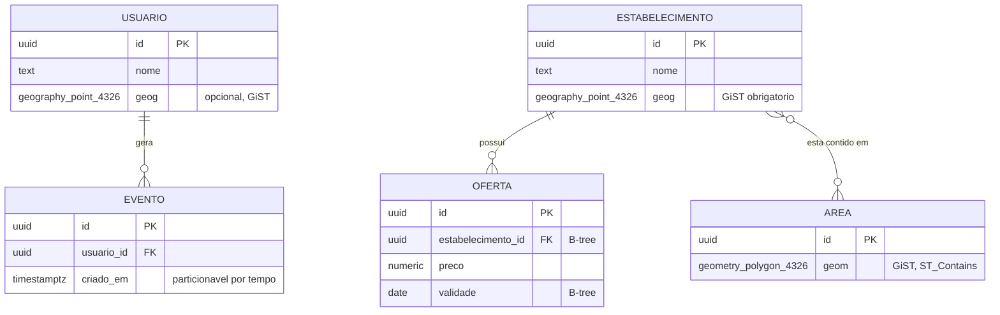
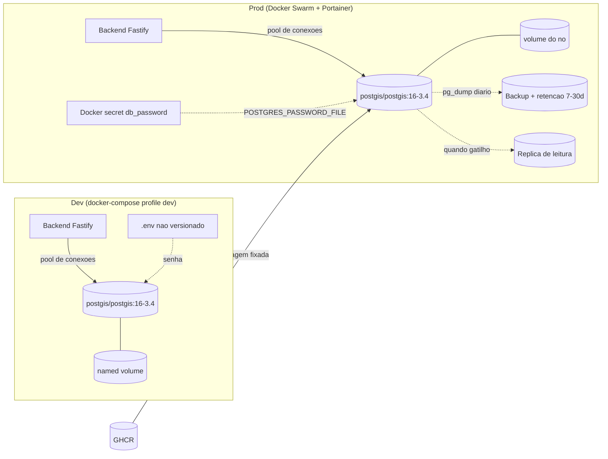
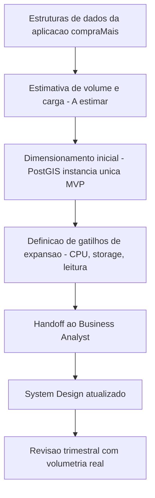

# Plano de Dimensionamento e Expansao do Banco — compraMais

> Documento baseado em `templates/plano-dimensionamento-expansao-banco-template.md`. Elaborado pela persona DBA conforme o protocolo do pacote de agents. Idioma: portugues do Brasil (DEC-STR-25).

## Identificacao

- Sistema ou modulo: **compraMais** — aplicacao web com dados georreferenciados (camada de persistencia)
- Responsavel DBA: Agent DBA (pacote `.github/agents/`)
- Data da versao: 2026-06-27
- Ambiente de referencia: Desenvolvimento | Homologacao | Producao (plano cobre os tres; producao em Docker Swarm/Portainer)
- Versao do schema ou baseline: **Baseline inicial (greenfield)** — sem schema implementado ainda; este plano antecede a primeira migration

## Contexto do plano

- **Objetivo do plano:** definir capacidade inicial, estrategia de modelagem geoespacial, indexacao, operacao (imagem, volume, backup, conexao) e gatilhos de expansao do PostgreSQL + PostGIS que sustenta o compraMais, alimentando o System Design via handoff ao Business Analyst.
- **Escopo funcional coberto:** persistencia transacional e consultas geoespaciais (proximidade, contencao em area, ordenacao por distancia) da aplicacao. Nao cobre cache de aplicacao, filas, nem object storage de midias (fora da camada relacional).
- **Premissas de negocio:**
  - compraMais lida com entidades georreferenciadas (ex.: estabelecimentos/pontos de oferta e usuarios com localizacao). **A estimar com o solicitante:** dominio funcional exato, entidades reais e volumetria.
  - Padrao de uso esperado: consultas geoespaciais "perto de mim" e listagem por raio/area, com leitura predominante sobre escrita.
- **Premissas tecnicas:**
  - PostgreSQL com extensao PostGIS para dados georreferenciados (PRJ-DEC-04).
  - Backend Node.js (Fastify) conecta ao banco; banco roda como servico no `docker-compose.yml` unico com profiles dev/prod (PRJ-DEC-05) e em Docker Swarm orquestrado por Portainer em producao (PRJ-DEC-06).
  - Segredos (senha do banco) nunca versionados: `.env` em dev, Docker secrets em prod (PRJ-DEC-07).
  - SRID padrao **4326 (WGS84)** para armazenamento dos dados geograficos.
- **Restricoes conhecidas:**
  - Greenfield: nao ha evidencia real de carga; numeros sao premissas conservadoras a validar.
  - Deploy de producao por imagem (sem build no cluster) — a imagem do banco deve ter tag fixada e ser publicada/consumida de forma controlada.
  - Volume persistente obrigatorio para o dado do banco em qualquer ambiente.

## Estruturas de dados consideradas

> Modelagem conceitual inicial. Entidades e atributos sao **hipoteses a validar com o solicitante**; servem para orientar capacidade e indices.

| Entidade ou agregado | Volume atual | Crescimento esperado | Criticidade | Observacoes |
|---|---|---|---|---|
| Usuario (`usuarios`) | 0 (greenfield) | A estimar com o solicitante | Alta | Pode ter localizacao opcional (`geography(Point,4326)`) para "perto de mim" |
| Estabelecimento / Ponto de oferta (`estabelecimentos`) | 0 | A estimar com o solicitante | Alta | Entidade geo central: `geography(Point,4326)`; alvo das consultas de proximidade |
| Oferta / Produto (`ofertas`) | 0 | A estimar com o solicitante | Alta | Relacionada a estabelecimento; alto churn (validade/preco) |
| Area de cobertura / Regiao (`areas`) | 0 | A estimar com o solicitante | Media | `geometry(Polygon/MultiPolygon,4326)` para consultas de contencao (`ST_Contains`) |
| Eventos / Log de acesso (`eventos`) | 0 | A estimar com o solicitante | Baixa-Media | Candidato natural a particionamento por tempo e arquivamento |

## Padroes de acesso e carga

| Fluxo ou consulta critica | Tipo de operacao | Frequencia estimada | Janela de pico | Observacoes |
|---|---|---|---|---|
| Buscar estabelecimentos proximos a um ponto (raio) | Leitura | A estimar com o solicitante (alta esperada) | Horario comercial | `ST_DWithin(geog, :ponto, :raio)` + ordenacao por distancia; usa indice GiST |
| Ordenar resultados por distancia (KNN) | Leitura | A estimar | Pico de busca | Operador `<->` com indice GiST (KNN); limitar `LIMIT` |
| Verificar se ponto esta dentro de area/regiao | Leitura | A estimar | Variavel | `ST_Contains`/`ST_Intersects` sobre poligonos; GiST em `areas` |
| Cadastro/atualizacao de estabelecimento e oferta | Escrita | A estimar (baixa-media) | Distribuida | Escrita transacional; invalida cache de leitura da aplicacao |
| Listagem de ofertas por estabelecimento | Leitura | A estimar (alta) | Pico de busca | Indice B-tree em FK `estabelecimento_id` |

## Premissas de dimensionamento

- **Capacidade inicial estimada:** instancia unica do banco (sem replica) suficiente para MVP. Baseline sugerido: **2 vCPU / 4 GB RAM / 20 GB de armazenamento** no servico do banco. **A estimar com o solicitante:** confirmar limites do host/no do Swarm.
- **Meta de crescimento:** suportar crescimento de entidades geo e ofertas sem reescrita de schema; expansao primariamente vertical no inicio, com replica de leitura quando a carga de leitura justificar.
- **Horizonte do plano:** 12 meses (revisao trimestral dos gatilhos).
- **Limites operacionais conhecidos:**
  - `max_connections` padrao do Postgres pode ser insuficiente sob concorrencia do Fastify — usar **pool de conexoes no backend** (ex.: `pg`/pool) e, se necessario, **PgBouncer** como gatilho de expansao.
  - Armazenamento limitado pelo volume do host/no; crescimento de `eventos` e o principal vetor.
- **Dependencias de infraestrutura:** volume persistente (named volume em dev; volume gerenciado pelo no/Swarm em prod), Docker secret para a senha, host com recursos compativeis com o baseline.

## Estrategia de dimensionamento

| Camada | Capacidade atual | Capacidade recomendada | Gatilho de expansao | Justificativa |
|---|---|---|---|---|
| Compute do banco | A definir (greenfield) | 2 vCPU / 4 GB RAM (MVP) | CPU media > 70% por 15 min em pico, ou latencia p95 de consulta geo > meta | Carga inicial baixa; geo e CPU-bound em GiST sob volume alto |
| Armazenamento | A definir | 20 GB com autoexpansao monitorada | Uso do volume > 75% | `eventos` e historico de ofertas crescem continuamente |
| Replica ou leitura | Nenhuma (instancia unica) | 1 replica de leitura quando aplicavel | Leitura > 70% da capacidade da primaria de forma sustentada | Carga de leitura geo domina; replica alivia a primaria |
| Backup e retencao | Nenhum (a configurar) | Backup logico diario (`pg_dump`) + retencao 7-30 dias | Janela de backup impactar producao, ou RPO/RTO mais rigido | Protege contra perda; base para evoluir a PITR (`pg_basebackup`/WAL) |

## Estrategia de expansao

- **Expansao vertical prevista:** primeiro caminho de escala — aumentar vCPU/RAM do servico/no do banco e ajustar `shared_buffers`, `work_mem`, `effective_cache_size` e `max_parallel_workers` proporcionalmente.
- **Expansao horizontal prevista:** introduzir **replica(s) de leitura** com roteamento de leitura no backend quando a carga de leitura geo dominar; sharding nao previsto no horizonte (complexidade desnecessaria para o volume esperado).
- **Politica de particionamento ou sharding quando aplicavel:** particionar `eventos` por intervalo de tempo (mensal) usando particionamento declarativo nativo do Postgres quando o volume crescer; entidades geo permanecem nao particionadas inicialmente.
- **Politica de arquivamento ou retencao:** mover/arquivar particoes antigas de `eventos` para armazenamento frio ou dropar conforme politica de retencao (**A estimar com o solicitante:** janela legal/funcional de retencao).
- **Plano de revisao periodica:** revisao trimestral dos gatilhos e da volumetria real; atualizar este plano e re-handoff ao Business Analyst a cada mudanca relevante de schema ou carga.

## Decisoes tecnicas de dados (especificas compraMais)

### Extensoes PostgreSQL/PostGIS

| Extensao | Necessidade | Quando habilitar | Justificativa |
|---|---|---|---|
| `postgis` | Obrigatoria | Na primeira migration (baseline) | Tipos e funcoes geoespaciais (`geometry`/`geography`, `ST_DWithin`, `ST_Contains`, KNN `<->`) |
| `btree_gist` | Recomendada | Quando houver constraint/indice combinando coluna geo + coluna escalar (ex.: exclusion constraint, ou GiST cobrindo `categoria`+geom) | Permite indices/constraints GiST sobre tipos B-tree junto de geometria |
| `postgis_topology` | Condicional | Apenas se houver modelagem topologica real (redes, malhas, relacoes topologicas formais) | Adiciona overhead; **nao habilitar por padrao**. Habilitar so quando o dominio exigir topologia |
| `pg_trgm` | Opcional (apoio) | Se houver busca textual fuzzy por nome de estabelecimento/oferta | Indice GIN trigram para busca textual; complementa a busca geo |

> Habilitacao via migration idempotente: `CREATE EXTENSION IF NOT EXISTS postgis;` (e analogas). A imagem `postgis/postgis` ja traz os binarios; o `CREATE EXTENSION` deve ser explicito no schema/migration, nao assumido.

### Estrategia de modelagem geoespacial

- **`geography` vs `geometry`:**
  - Usar **`geography(Point,4326)`** para localizacao de pontos do mundo real (usuarios, estabelecimentos) quando as consultas forem por **distancia em metros** (`ST_DWithin`, `ST_Distance`) — `geography` calcula sobre o elipsoide, retornando metros sem necessidade de reprojetar.
  - Usar **`geometry(...,4326)`** para poligonos/areas e operacoes de relacao topologica planar (`ST_Contains`, `ST_Intersects`) quando a precisao de distancia metrica global nao for o foco.
- **SRID padrao 4326 (WGS84):** padrao de armazenamento para todos os dados geo (compativel com GPS/lat-long e clientes web/mobile).
- **Quando usar projecao metrica:** para calculos de area/buffer/distancia planar de alta precisao em escala local, **reprojetar sob demanda** para uma projecao metrica adequada (ex.: UTM da regiao, ou `geometry::geography` quando ponto). **Nao** armazenar em projecao metrica como padrao — manter 4326 no storage e reprojetar na query.
- **Validacao:** garantir geometrias validas (`ST_IsValid`) na escrita; normalizar SRID na borda da aplicacao.

### Indexacao geoespacial e de apoio

| Indice | Tipo | Coluna(s) alvo | Uso |
|---|---|---|---|
| Indice geo principal | **GiST** | `estabelecimentos.geog`, `usuarios.geog`, `areas.geom` | Consultas de proximidade, contencao e KNN (`<->`) — indice obrigatorio em toda coluna geo consultada |
| Indice geo alternativo | **SP-GiST** | Pontos uniformemente distribuidos (avaliar) | Alternativa a GiST para dados de pontos; avaliar via `EXPLAIN ANALYZE` antes de adotar |
| FK / relacionamento | **B-tree** | `ofertas.estabelecimento_id`, demais FKs | Joins e listagens por estabelecimento |
| Filtros escalares quentes | **B-tree** | `ofertas.validade`, `ofertas.ativo`, etc. | Filtros frequentes combinados com a busca geo |
| Geo + escalar combinado | **GiST + `btree_gist`** | (geom, categoria) quando aplicavel | Indice composto cobrindo filtro categorico + geo |
| Busca textual (se houver) | **GIN (`pg_trgm`)** | nome/descricao | Busca fuzzy por nome, complementar a geo |

> Regra operacional: nenhuma coluna geo consultada vai a producao sem indice GiST; todo plano de consulta geo critica deve ser validado com `EXPLAIN (ANALYZE, BUFFERS)` antes do fechamento.

### Imagem, volume e backup

- **Imagem recomendada (tag fixada):** `postgis/postgis:16-3.4` (PostGIS 3.4 sobre PostgreSQL 16). Tag fixada e obrigatoria — **nao usar `latest`** — para deploy por imagem reproduzivel no Swarm/Portainer (PRJ-DEC-06). Atualizacoes de major sao mudanca controlada com plano de migracao/rollback.
- **Volume persistente:** named volume mapeando `/var/lib/postgresql/data`. Em dev, named volume do Compose; em prod, volume gerenciado pelo no/Swarm. **Nunca** depender de armazenamento efemero do container.
- **Backup:** `pg_dump` logico diario (formato custom `-Fc`) com retencao 7-30 dias como baseline; evoluir para PITR (base backup + arquivamento de WAL) quando RPO/RTO exigir. Testar restauracao periodicamente (backup nao testado nao e backup).
- **Inicializacao:** scripts em `/docker-entrypoint-initdb.d/` apenas para bootstrap de extensao/role; o schema de aplicacao deve vir por **migrations versionadas**, nao por scripts ad hoc.

### Variaveis de ambiente e conexao do backend

| Variavel | Dev (`.env`) | Prod (Docker secret) | Observacao |
|---|---|---|---|
| `POSTGRES_DB` | `compramais` | `compramais` | Nome do banco da aplicacao |
| `POSTGRES_USER` | usuario de app (nao superuser para a app) | idem | Principio de menor privilegio |
| `POSTGRES_PASSWORD` | via `.env` local (nao versionado) | via **Docker secret** (`POSTGRES_PASSWORD_FILE`) | Senha **nunca** no `docker-compose.yml` nem versionada (PRJ-DEC-07) |

- **Padrao de secret em prod:** usar a variante `*_FILE` da imagem (`POSTGRES_PASSWORD_FILE=/run/secrets/db_password`) apontando para o Docker secret, em vez de `POSTGRES_PASSWORD` em texto.
- **Conexao do backend (Fastify):** o backend monta a connection string a partir de variaveis de ambiente injetadas (host = nome do servico do banco na rede do Compose/Swarm, ex.: `db`), usando **pool de conexoes** (`pg`/pool). A senha do backend tambem vem de `.env` (dev) ou secret (prod), nunca hardcoded. Recomendado `sslmode` conforme topologia de rede do cluster.
- **Menor privilegio:** a role usada pela aplicacao recebe apenas os privilegios necessarios no schema da aplicacao; migrations rodam com role de migracao separada quando possivel.

### Estrategia de migrations

- **Migrations versionadas e idempotentes**, versionadas no repositorio junto ao backend Node.js. Cada migration deve ter caminho de aplicacao e racional de **rollback** documentado (alinhado a persona DBA: nao aprovar migracao sem plano de rollback).
- **Baseline:** primeira migration habilita extensoes (`CREATE EXTENSION IF NOT EXISTS postgis;`, `btree_gist` se necessario) e cria o schema inicial com colunas geo tipadas em SRID 4326 e indices GiST.
- **Disciplina:** mudancas de schema em producao sao mudanca controlada — aplicar fora de pico quando bloqueantes, usar `CREATE INDEX CONCURRENTLY` para indices em tabelas grandes, evitar locks longos.
- **Ferramenta:** a escolher pelo Senior Developer dentro do ecossistema Node (ex.: node-pg-migrate, Prisma Migrate, Knex). **A confirmar** na implementacao; o DBA revisa o parecer de cada migration com impacto em persistencia.

## Riscos e mitigacoes

| Risco | Impacto | Probabilidade | Mitigacao | Responsavel |
|---|---|---|---|---|
| Consulta geo sem indice GiST | Alto (latencia, full scan) | Media | Gate de revisao: nenhum deploy geo sem GiST + `EXPLAIN ANALYZE` | DBA |
| Exaustao de conexoes sob carga do Fastify | Alto (erros de conexao) | Media | Pool no backend; PgBouncer como gatilho de expansao | DBA / Senior Developer |
| Senha do banco vazada por versionamento | Critico (seguranca) | Baixa (com PRJ-DEC-07) | `.env` local + Docker secret `*_FILE`; nunca no compose | DBA / Tech Lead |
| Crescimento descontrolado de `eventos` | Medio (storage, performance) | Media | Particionamento por tempo + arquivamento/retencao | DBA |
| Perda de dados sem backup testado | Critico | Baixa-Media | `pg_dump` diario + teste de restauracao; evoluir a PITR | DBA |
| Uso de tag `latest` na imagem | Medio (deploy nao reproduzivel) | Baixa | Tag fixada `postgis/postgis:16-3.4`; upgrade controlado | DBA / Tech Lead |
| Volumetria real divergir das premissas | Medio (dimensionamento incorreto) | Alta | Marcar lacunas como "A estimar"; revisao trimestral com dados reais | DBA |

## Monitoracao e gatilhos operacionais

| Indicador | Limite de alerta | Limite critico | Acao esperada |
|---|---|---|---|
| CPU | > 70% por 15 min | > 90% sustentado | Avaliar tuning de query/indice; escalar vCPU (vertical) |
| Latencia (p95 consulta geo) | Acima da meta funcional (A estimar) | 2x a meta | `EXPLAIN ANALYZE`; revisar indices; considerar replica de leitura |
| Crescimento de dados (uso do volume) | > 75% | > 90% | Expandir volume; acionar particionamento/arquivamento de `eventos` |
| Conexoes ativas | > 70% de `max_connections` | > 90% | Ajustar pool; avaliar PgBouncer |
| Idade do backup mais recente | > 26h | > 48h | Investigar pipeline de backup; restaurar confianca/RPO |
| Replicacao (quando houver replica) | lag > 30s | lag > 5 min | Investigar I/O/rede; despriorizar leitura na replica |

## Diagramas

### ER conceitual (hipotese a validar)

### Fluxo de deploy e dados do banco (dev e prod)

## Handoff para o Business Analyst

> Handoff formal e rastreavel conforme regra 24 do protocolo e DEC-STR-04. O Business Analyst e dono do System Design e deve consolidar este plano nele.

- **Resumo executivo para documentacao no System Design:**
  - Persistencia: **PostgreSQL 16 + PostGIS 3.4**, imagem `postgis/postgis:16-3.4` (tag fixada), volume persistente obrigatorio.
  - Geoespacial: dados em **SRID 4326**; `geography(Point,4326)` para distancias em metros, `geometry(...,4326)` para areas/poligonos; reprojecao metrica apenas sob demanda na query.
  - Indexacao: **GiST** obrigatorio nas colunas geo consultadas (KNN `<->`, `ST_DWithin`, `ST_Contains`), **B-tree** em FKs/filtros, **SP-GiST** e GIN/`pg_trgm` como opcoes avaliadas.
  - Extensoes: `postgis` (obrigatoria), `btree_gist` (recomendada quando aplicavel), `postgis_topology` (condicional, nao por padrao), `pg_trgm` (opcional).
  - Operacao: senha via `.env` (dev) e **Docker secret** (`*_FILE`, prod) — nunca versionada (PRJ-DEC-07); backend conecta por pool; backup `pg_dump` diario com retencao; migrations versionadas com rollback.
  - Capacidade MVP: instancia unica 2 vCPU/4 GB/20 GB; expansao vertical primeiro, replica de leitura como gatilho; particionamento de `eventos` por tempo.
- **Impactos arquiteturais relevantes:**
  - O System Design deve refletir o banco como servico no compose unico (profiles dev/prod) e no Swarm/Portainer com pull do GHCR.
  - Necessidade de pool de conexoes no backend; PgBouncer como evolucao condicional.
  - Modelo geo central define os fluxos de busca por proximidade da aplicacao.
- **Ajustes recomendados no plano de implantacao:**
  - Garantir Docker secret para a senha do banco em prod e `.env` em dev.
  - Garantir volume persistente e rotina de backup desde o MVP.
  - Pipeline GHCR deve publicar/consumir a imagem do banco com tag fixada.
- **Ajustes recomendados no dimensionamento geral da aplicacao:**
  - Carga de leitura geo domina; dimensionar backend e banco para leitura intensiva.
  - Revisao trimestral dos gatilhos com volumetria real (hoje **A estimar com o solicitante**).

## Aprovacoes e rastreabilidade

- **Parecer do DBA:** plano aprovado como baseline greenfield. Decisoes-chave: PostGIS 3.4 / PostgreSQL 16 (imagem fixada), SRID 4326, GiST obrigatorio em colunas geo, segredos via `.env`/Docker secret, migrations versionadas com rollback. Lacunas de volumetria marcadas honestamente como "A estimar com o solicitante". Sem regressao possivel (greenfield); risco principal e divergencia de volumetria, mitigado por revisao trimestral.
- **Data do handoff ao Business Analyst:** 2026-06-27
- **Referencia no System Design:** a ser preenchida pelo Business Analyst ao consolidar (link reverso esperado para este documento).
- **Necessita revisao do Tech Lead:** **Sim** — para aceite do baseline de dados e do gate de PostGIS antes da primeira migration.

## Proximos passos

1. Validar premissas com dados reais de carga e crescimento (entidades, volumetria, retencao) com o solicitante.
2. Atualizar o Business Analyst com o resumo executivo do plano e consolidar no System Design.
3. Revisar periodicamente (trimestral) os gatilhos de expansao e a volumetria real.
4. Na primeira migration: habilitar extensoes, criar schema geo em SRID 4326 e indices GiST; submeter parecer do DBA por mudanca de persistencia.

