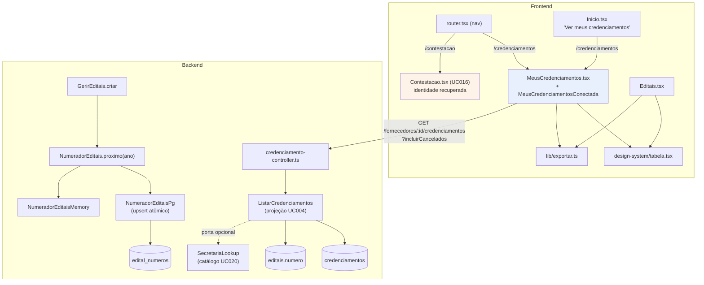

# Registro técnico — Adaptação de "Meus Credenciamentos" ao spec de UI (UC004)

**Data:** 2026-07-16 · **Branch:** `feature/layout-meus-credenciamentos` (base `develop`, PRJ-DEC-11)
**Autor:** Senior Developer (orquestração Tech Lead) · **Spec de UI:** [`spec/AI-UI-Design/portal-fornecedor.html`](../../spec/AI-UI-Design/portal-fornecedor.html)
**Rastreabilidade:** UC004 (projeção de credenciamentos) · UC016 (Tela Única de Contestação) · UC020 (catálogos) · RN005, RN016 · AD-28, AD-33 · PRJ-DEC-10, PRJ-DEC-11, PRJ-DEC-12 · DEC-STR-34

---

## Contexto e divergência central

A demanda entrou como *"ADAPTAR o 'Meus credenciamentos' de acordo com o Meus credenciamentos do
`spec/AI-UI-Design/portal-fornecedor.html`"*. O diagnóstico encontrou uma divergência estrutural que foi
**escalada ao solicitante antes de qualquer implementação**:

> O item de nav **"Meus credenciamentos"** apontava para `/contestacao`, renderizado por
> [`Contestacao.tsx`](../../frontend/src/pages/publico/Contestacao.tsx) — a **Tela Única de Contestação/
> Regularização (UC016)**, que lista **pendências**, não credenciamentos. Apenas o título e o rótulo diziam
> "Meus Credenciamentos".

A memória **PRJ-DEC-10** registrava "Meus Credenciamentos" como *refeita* no refresh de UI; na prática o
**rótulo foi aplicado sobre a tela do UC016**. Não havia tela de credenciamentos para "adaptar" — havia uma
tela de contestação com nome trocado. **Este registro corrige isso.**

### Decisões do solicitante (via `AskUserQuestion`)

| # | Questão | Decisão |
|---|---|---|
| 1 | Adaptar a Contestação ou criar página nova? | **Nova página + nav corrigida.** A Contestação (UC016) volta a ter identidade própria e item de nav próprio. |
| 2 | Colunas do spec sem dado no backend | **Estender o backend** (em vez de degradar/omitir colunas). |
| 3 | Numeração `ED-AAAA/NNN` do spec | **Implementar agora.** |
| 4 | Coluna "Etapa n/5" do spec | **Etapa derivada do estado; NÃO persistir progresso do wizard.** A coluna não é replicada. |

## Arquitetura da entrega

## Entrega — Backend

### Numeração de editais `ED-AAAA/NNN`

- **Novo** [`backend/src/editais/domain/numero-edital.ts`](../../backend/src/editais/domain/numero-edital.ts):
  `formatarNumeroEdital`, `exigirNumeroEdital` (normaliza *trim* + caixa), `anoDoNumeroEdital`, erro
  `NumeroEditalInvalido`. O sequencial é *zero-padded* a 3 dígitos, mas **não é truncado acima de 999**
  (`ED-2026/1000` é válido) — o formato do spec é piso de apresentação, não teto de capacidade.
- [`edital.ts`](../../backend/src/editais/domain/edital.ts): `Edital` ganhou `numero` **readonly**, presente
  em `EditalState` e validado em `criar`/`deEstado` (snapshot **AD-33**). O evento `EditalCriado`
  ([`eventos.ts`](../../backend/src/editais/domain/eventos.ts)) passou a carregar `numero`.
- **Nova porta** [`application/numerador-editais.ts`](../../backend/src/editais/application/numerador-editais.ts)
  (`NumeradorEditais.proximo(ano)`), com adapters
  [`numerador-editais-memory.ts`](../../backend/src/editais/adapters/numerador-editais-memory.ts) e
  [`numerador-editais-pg.ts`](../../backend/src/editais/adapters/numerador-editais-pg.ts).
  O adapter Pg **reserva atomicamente em um único statement**:
  `INSERT ... ON CONFLICT (ano) DO UPDATE SET ultimo = edital_numeros.ultimo + 1 RETURNING ultimo`
  — sem `SELECT` prévio, sem lock aplicacional, sem janela de corrida.
- [`gerir-editais.ts`](../../backend/src/editais/application/gerir-editais.ts): `criar` numera pelo **ano
  corrente** e devolve `{ editalId, numero }`.
- **Imutabilidade do número:** `numero` fica **fora do `DO UPDATE`** em
  [`edital-repository-pg.ts`](../../backend/src/editais/adapters/edital-repository-pg.ts) e `editar` não o
  alcança. Número emitido não se reescreve.

### Migração `0016_editais_numero.sql` — aditiva e forward-only (AD-28)

[`backend/migrations/0016_editais_numero.sql`](../../backend/migrations/0016_editais_numero.sql), em passos:

1. `ADD COLUMN numero` (**nullable**, para não quebrar linhas existentes);
2. `CREATE TABLE edital_numeros(ano PK, ultimo)`;
3. **backfill determinístico** por ano de `register_date` com `ROW_NUMBER` (desempate por `id`);
4. alinha `edital_numeros` com `GREATEST` (o contador nunca retrocede abaixo do backfill);
5. `SET NOT NULL`;
6. índice **único** em `numero`.

### Projeção UC004 estendida — sem coluna nova, sem migration

[`listar-credenciamentos.ts`](../../backend/src/credenciamento/application/listar-credenciamentos.ts):
`CredenciamentoResumo` passou a expor `numeroEdital`, `secretariaSigla`, `criadoEm`, `atualizadoEm`.

- **`criadoEm`/`atualizadoEm` vêm de `EntidadeBase`** (`registerDate`/`updateDate`, **AD-33**) — o dado já
  existia; **nenhuma coluna nova e nenhuma migration** foram necessárias para as datas do spec.
- **Nova porta opcional `SecretariaLookup`** resolve a sigla pelo catálogo **UC020**. Editais **não têm FK**
  para o catálogo (`secretariaId` é texto livre): sem catálogo ou sem *match*, a projeção **cai para o
  `secretariaId`** — a resolução é *best-effort* e **nunca quebra** a listagem.
- [`credenciamento-controller.ts`](../../backend/src/credenciamento/adapters/credenciamento-controller.ts):
  `GET /fornecedores/:id/credenciamentos` aceita `?incluirCancelados=true` (a tela tem filtro de cancelados;
  a **home mantém o recorte sem cancelados**).
- [`server.ts`](../../backend/src/server.ts): o bloco de **catálogos foi movido para antes** de
  editais/credenciamento (a projeção resolve a sigla por ele) + wiring
  `pool ? NumeradorEditaisPg : NumeradorEditaisMemory`.

## Entrega — Frontend (i18n pt-BR/en/es — PRJ-DEC-12)

- **Nova** [`MeusCredenciamentos.tsx`](../../frontend/src/pages/publico/MeusCredenciamentos.tsx)
  (+ container `MeusCredenciamentosConectada`), rota **`/credenciamentos`**, fiel ao spec: chips com
  contagem (Todos / Em andamento / Finalizados / Cancelados), busca por número/objeto/sigla, export
  Excel (CSV) / PDF (print), tabela ordenável, badges de status com *dot*, paginação de 5 e estado vazio que
  **distingue "nenhum ainda" de "nenhum neste filtro"**. Data em `DD/MM/AAAA · HH:MM`.
- **Ações ancoradas no domínio real** (não no mockup):
  | Estado | Ação primária | Justificativa |
  |---|---|---|
  | `iniciado` | **Continuar** (wizard) | retomada pelo estado, não por passo persistido |
  | `aceito` | **sem ação primária** | termo assinado (**RN016**); não há tela de detalhe |
  | `cancelado` | **Credenciar novamente** | o backend só barra duplicidade com credenciamento **ativo**, e cancelado não é ativo |

  "Cancelar" (A2) some para `cancelado`.
- **Refactor sem duplicação:** extraídos [`lib/exportar.ts`](../../frontend/src/lib/exportar.ts)
  (`baixar`/`csvCampo`/`exportarCsv`, com **BOM** para o Excel) e
  [`design-system/tabela.tsx`](../../frontend/src/design-system/tabela.tsx) (`celula`, `siglaTag`,
  `botaoExportar`, `cabecalho`, `setaOrdem`, `estiloPagina`, componente `Paginacao`).
  [`Editais.tsx`](../../frontend/src/pages/publico/Editais.tsx) foi **refatorado para consumi-los** — é a
  mesma tabela no spec, e agora é o mesmo código.
- Novo `IconeContestacao` em [`icons.tsx`](../../frontend/src/design-system/icons.tsx).
  [`router.tsx`](../../frontend/src/router.tsx): nav de credenciamentos → `/credenciamentos` e **novo item de
  nav "Contestações" → `/contestacao`**.
  [`Inicio.tsx`](../../frontend/src/pages/publico/Inicio.tsx): "Ver meus credenciamentos" agora leva a
  `/credenciamentos` (levava a `/contestacao`).
- **UC016 recupera a identidade:** título/subtítulo próprios — *"Contestações e Regularizações"*. O
  componente já consumia `contestacao.titulo`/`contestacao.subtitulo`; a correção landou nos **valores dos
  três locales**.
- **i18n:** bloco `meusCredenciamentos.*` + `common.nav.contestacao` + títulos da contestação preenchidos em
  **pt-BR, en e es** ([`locales/`](../../frontend/src/i18n/locales/)).

## Divergências deliberadas vs. o spec de UI

| Spec | Entregue | Justificativa |
|---|---|---|
| Coluna **"Etapa n/5"** | **não existe** | o backend não persiste passo do wizard (decisão 4); a coluna **Status** já mostra a situação real. Retomada literal ("continue de onde parou") = **backlog**. |
| Wizard de **5 passos** | **4 passos** | prova de vida (**UC007**) está fora do MVP. |
| Status **"Não iniciado"** | **não existe** | no domínio o credenciamento **só nasce quando a capacidade é declarada** (**RN005**). Não há registro para listar antes disso. |
| Ação **"Reabrir"** | **"Credenciar novamente"** | cancelar é **terminal** para aquele registro; a retomada cria um **novo** registro. |

## Evidências — gates em container (DEC-STR-34)

- **Backend** (`docker compose --profile test run --rm backend-test`): lint + typecheck + test **verdes —
  348 testes** (era 311; **+37**). Novos: [`tests/unit/numero-edital.spec.ts`](../../backend/tests/unit/numero-edital.spec.ts)
  (8) e [`tests/integration/meus-credenciamentos.spec.ts`](../../backend/tests/integration/meus-credenciamentos.spec.ts)
  (7), mais casos em [`tests/unit/edital.spec.ts`](../../backend/tests/unit/edital.spec.ts).
- **Frontend** (`docker compose --profile test run --rm frontend-test`): lint + typecheck + test **verdes —
  77 testes** (era 46; **+31**). Novo: [`MeusCredenciamentos.test.tsx`](../../frontend/src/pages/publico/MeusCredenciamentos.test.tsx)
  (10).

### Validação live contra Postgres real (`--profile dev`, `RECEITA_PROVIDER=mock`)

- **Backfill com dado real:** o volume dev tinha **8 editais pré-existentes** → numerados
  `ED-2026/001..008` na ordem de criação; `edital_numeros(ano=2026, ultimo=8)`; **0 nulos, 8 números
  distintos** (`NOT NULL` + unique OK).
- **Continuidade:** edital novo recebeu **`ED-2026/009`**, retomando de onde o backfill parou.
- **Concorrência:** **10 POSTs paralelos** → `ED-2026/010..019` → **19 editais / 19 números distintos, zero
  colisão** (upsert atômico validado sob corrida real).
- **Payload real** de `GET /fornecedores/:id/credenciamentos`: `numeroEdital: "ED-2026/020"`,
  `secretariaSigla: "SEME"` **resolvida do catálogo**, `criadoEm`/`atualizadoEm` em ISO.
- **Filtro de cancelados:** cancelar → o *default* (home) **oculta** o cancelado; `?incluirCancelados=true`
  o **mostra**; `atualizadoEm > criadoEm` após a mutação.
- **Durabilidade:** após `restart` do backend, credenciamento cancelado + número + sigla **preservados**;
  migração **idempotente** (`migracoesNovas: 0`).

## Fora de escopo / próximos passos

- **E2E Cypress** a validar em execução real (QA/CI).
- **Retomada real do wizard** (persistir o passo) — habilita a coluna "Etapa n/5" do spec.
- **Fiar `secretariaId` do edital ao catálogo com FK** — hoje é texto livre e a sigla é *best-effort*.
- **Expor a numeração na UI** de criação do edital (**UC005**) e na vitrine.
