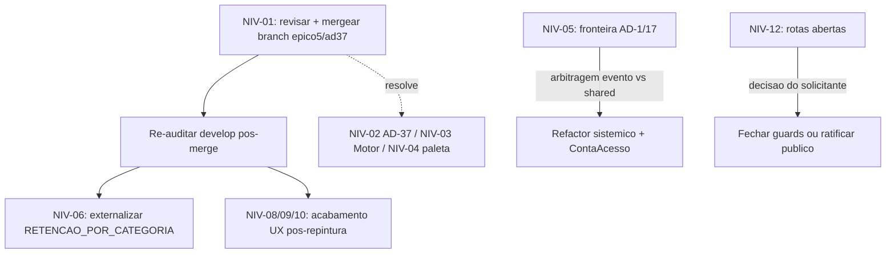

# Backlog de Nivelamento — Código × Documentação (`spec/docs/`)

**Data:** 2026-07-17
**Responsável de consolidação:** Tech Lead
**Origem:** auditoria de aderência do código implementado à nova documentação canônica (`spec/docs/`), em 4 eixos — Arquitetura (39 ADs), Casos de Uso (UC001–UC021), Requisitos (PRD v2.4: RF/RN), Contrato de UX (DESIGN/EXPERIENCE + Protótipos).
**Base auditada:** branch `develop` (ponto de integração).
**Fonte da verdade:** [`spec/docs/`](../../spec/docs/index.md) (AD-39 — um contrato, um lugar).

---

## Veredito executivo

Aderência **alta**. O Bloco Segurança (AD-18/19/20/23/29/30/33/35) e o núcleo de negócio batem com a espinha. As lacunas são de **completude**, não de **contradição** — com uma exceção estrutural (ciclo do edital, AD-37/RN014).

**Achado decisivo:** três dos quatro achados mais graves **já estão resolvidos** na branch `feature/epico5-ad37-maquina-estado-edital` (4 commits à frente de `develop`, 0 atrás), **ainda não mergeada**. O maior item de nivelamento é revisar e integrar essa branch.

### Placar por eixo (base `develop`)

| Eixo | Resultado |
|---|---|
| Arquitetura (39 ADs) | 30 ✅ · 4 ⚠️ · 3 ❌ (AD-1, AD-17, AD-37) · 2 🔵 diferidos |
| Casos de uso (21 UCs) | 16 ✅ · 2 ⚠️ (UC002, UC006) · 3 ❌ (UC008, UC009, UC013) |
| Requisitos (RF/RN) | RF 21/23 ✅ · RN 14/16 ✅ · 1 🔶 (RN014) |
| Contrato de UX | tipografia/componentes/i18n ✅ · paleta ❌ (D1) · 4 ⚠️ (IA, landing, tokens, foco) |

---

## Backlog priorizado

Legenda de estado: ⬜ a fazer · 🟦 já feito em branch (aguarda merge) · 🟨 decisão/arbitragem · ⏸️ diferido (coerente com a doc).

### P0 — Integração que nivela o grosso

| ID | Item | Doc | Estado | Nota |
|---|---|---|---|---|
| NIV-01 | **Revisar e mergear `feature/epico5-ad37-maquina-estado-edital` em `develop`** | AD-37, RN014, RF005, UX-DR1 | 🟦 | Branch entrega, num só lote: AD-37 (edital 7 estados `rascunho→aberto→em_analise→em_distribuicao→homologado→em_execucao→encerrado`, migração `0019`); Épico 5 Motor **ponta-a-ponta** (`distribuicao/` domain+application+adapters, `server.ts` wiring `pool?pg:memory`, rotas `POST /editais/:id/distribuir`, `GET /editais/:id/distribuicao`, `GET /distribuicao/minhas`, migração `0020`, eventos); repintura D1 (`#0061AE` em `index.css`+`tokens.ts`); tela `DemandasDistribuidas` (fecha item de IA); i18n 3 idiomas; atualização de `spine`/`epics`. Resolve NIV-02, NIV-03, NIV-04 e parte de NIV-10. **Ação TL:** revisar diff, escopo, testes (gate container) e segurança antes do PR para `develop`. |

### P1 — Divergências reais em `develop` (fora da branch acima)

| ID | Item | Doc | Estado | Nota |
|---|---|---|---|---|
| NIV-02 | Ciclo de vida do Edital: 3 → 6/7 estados | AD-37 / RN014 / Story 3.4 | 🟦 (via NIV-01) | Em `develop`: `edital.ts:4` só `rascunho\|publicado\|encerrado`. Sem os estados a vitrine (só "Aberto", RF003), o motor (só "Em Distribuição", AD-7) e o congelamento (Homologado, AD-10) não têm âncora. Resolvido na branch. |
| NIV-03 | Épico 5 / Motor de Distribuição ligado ponta-a-ponta (UC008) | AD-7/8/9/10/24, RF005 | 🟦 (via NIV-01) | Em `develop` existe só o kernel puro `distribuicao/domain/motor.ts` (não plugado). A branch adiciona persistência canônica da matriz, controller, rotas e migração. |
| NIV-04 | Repintura D1 — paleta azul institucional `#0061AE` | AD-3, UX-DR1, Story 9.3, ARBITRAGEM-01 (1=B) | 🟦 (via NIV-01) | Em `develop`: `index.css` navy `#14467F`; `#0061AE` não aparece. Arbitragem já respondida a favor do azul oficial. A branch aplica em `index.css`+`tokens.ts`. **Validar contraste AA** e alinhar os 3 bundles de `spec/Prototipo/` (ainda navy) no fechamento. |
| NIV-05 | Fronteira de módulo violada (`catalogo` → `credenciamento`) | AD-1 / AD-17 | 🟨 | `catalogo/application/cadastrar-fornecedor.ts:8` importa `credenciamento/domain/consentimento`. **Não** está na branch. Saídas: (a) evento `FornecedorCadastrado` (prova LGPD eventualmente consistente — arbitragem jurídica); (b) mover `Consentimento` para `shared/`. Padrão sistêmico (idem `ContaAcesso`). |
| NIV-06 | `RETENCAO_POR_CATEGORIA` hardcoded | AD-36, RNF007 | ⬜ | `gerir-direitos.ts:30` fixa `{cadastral:730, fiscal:1825, contratual:1825}` no default do construtor; não é injetado no composition root (`server.ts`). Externalizar para env/config versionada (os outros 3 parâmetros já estão em env). Baixo esforço. |

### P2 — Dívidas menores / consistência

| ID | Item | Doc | Estado | Nota |
|---|---|---|---|---|
| NIV-07 | UC006 — `AnaliseRepositoryMemory` sem par pg | AD-33, UC006 | ⬜ | `server.ts:265` instancia memory incondicional; o registro analítico não sobrevive a restart (o fato equivalente já está na trilha durável → impacto baixo). Criar `AnaliseRepositoryPg` + migração se o registro próprio for necessário. |
| NIV-08 | IA de navegação do fornecedor | AD-3, UX-DR5, EXPERIENCE.md | 🟦 parcial | 8 itens no menu vs 5 canônicos; "Minha conta" (`/minha-conta`) fora do menu; "Demandas distribuídas" apontava para `/transparencia` (a branch cria a tela real). Revisar o menu no pós-merge para bater com a IA (Início · Editais · Meus credenciamentos · Documentos · Demandas distribuídas). |
| NIV-09 | `tokens.ts` órfão e auto-inconsistente (D2) | UX-DR1 | 🟦 parcial | Não é importado por ninguém; a fonte real é o `:root` de `index.css`. A branch reconcilia hexes. Decidir: eleger `index.css` como fonte única e remover/derivar `tokens.ts`, ou passar a importá-lo. |
| NIV-10 | Foco visível e âmbar | UX-DR8, DESIGN.md | ⬜ | `index.css` usa `offset 2px` (contrato: `3px`) e âmbar `#f2b705` (contrato: `#FFB300`). Ajuste pontual; revalidar e-MAG/WCAG AA. |
| NIV-11 | Nomenclatura RBAC | AD-35, PRD §15 | ⬜ | Papel `smga` = "Secretaria/Gestor" do PRD (equivalente, mas "SMGA" é o *órgão* no PRD §4 — rótulo confuso). Papel `leitura` no enum não consta no PRD §15. Alinhar rótulos/comentários ou ratificar como extensão. Cosmético, não-bloqueante. |
| NIV-12 | Rotas sem RBAC (abertas a anônimo) — pré-existentes | AD-35, AD-19 | 🟨 | Fila de covalidação `GET /fornecedores/:id/documentos/pendentes` (doc-comment diz "só CPL/SMGA"), `PATCH /fornecedores/:id`, `/sincronizar`, `/verificar-elegibilidade`, `/reconsultar`, `/reenviar`, `/pendencias`, `GET /editais/:id/contestacoes-cnae`. **Não** é regressão do AD-20. Fechá-las muda o contrato do frontend → decisão explícita do solicitante. |

### P3 — Deriva documental e diferidos coerentes

| ID | Item | Doc | Estado | Nota |
|---|---|---|---|---|
| NIV-13 | Deriva da própria doc | AD-39 | ⬜ | `epics.md` abre citando "33 ADs / PRD v2.2" (hoje **39 ADs / v2.4**); `implementation-readiness-report.md` marcado OBSOLETO. A branch NIV-01 já toca `epics.md` — confirmar se corrige o cabeçalho; senão, atualizar. |
| NIV-14 | UC002 — gateway de dívida é mock | RF011, AD-4 | ⏸️ | `DividaMockGateway` sem PGM/SICAF real. Depende da reunião de interoperabilidade (LAC-17). Coerente com o MVP. |
| NIV-15 | AD-26 — `idempotencyKey` ausente | AD-26 | ⏸️ | Nenhuma operação externa com efeito existe ainda (adaptador SEI = Release 2). Introduzir junto com o SEI. |
| NIV-16 | UC009 (Reserva), UC013 (notificações RF009), UC007/RF012 (biometria) | Épico 5 / R2 / R2-condicional | ⏸️ | Ausentes por decisão de escopo. UC009 destrava junto do Motor; RF009/RF012 são Release 2 (gateway LAC-07 / RIPD). |

---

## Sequenciamento recomendado

1. **NIV-01** primeiro: destrava três achados de uma vez. Gate container (backend+frontend) e revisão de segurança antes do PR para `develop`.
2. Re-auditar `develop` pós-merge e rebaixar NIV-02/03/04 para ✅.
3. **NIV-06** (config) — baixo esforço, fecha AD-36.
4. **NIV-05** e **NIV-12** — exigem arbitragem (jurídica / de produto); escalar ao solicitante.
5. UX de acabamento (NIV-08/09/10) após a repintura estar em `develop`.
6. Diferidos (P3) permanecem diferidos por decisão de escopo — não forçar.

---

## Rastreabilidade

- Registros da branch: `docs/dev/2026-07-17-registro-ad37-maquina-estado-edital.md`, `docs/dev/2026-07-17-registro-epico5-motor-distribuicao.md` (na branch `feature/epico5-ad37-maquina-estado-edital`).
- Bloco Segurança (base do quadro): `docs/dev/2026-07-17-registro-fase2-ad20-identidade-jwt.md`, `docs/dev/2026-07-17-registro-ad19-pii-consentimento-documentos.md`.
- Espinha: [`spec/docs/architecture/ARCHITECTURE-SPINE.md`](../../spec/docs/architecture/ARCHITECTURE-SPINE.md) · Casos de uso: [`spec/docs/casos-de-uso.md`](../../spec/docs/casos-de-uso.md) · PRD: [`spec/docs/prd.md`](../../spec/docs/prd.md) · Épicos: [`spec/docs/epics.md`](../../spec/docs/epics.md).
</content>
</invoke>
