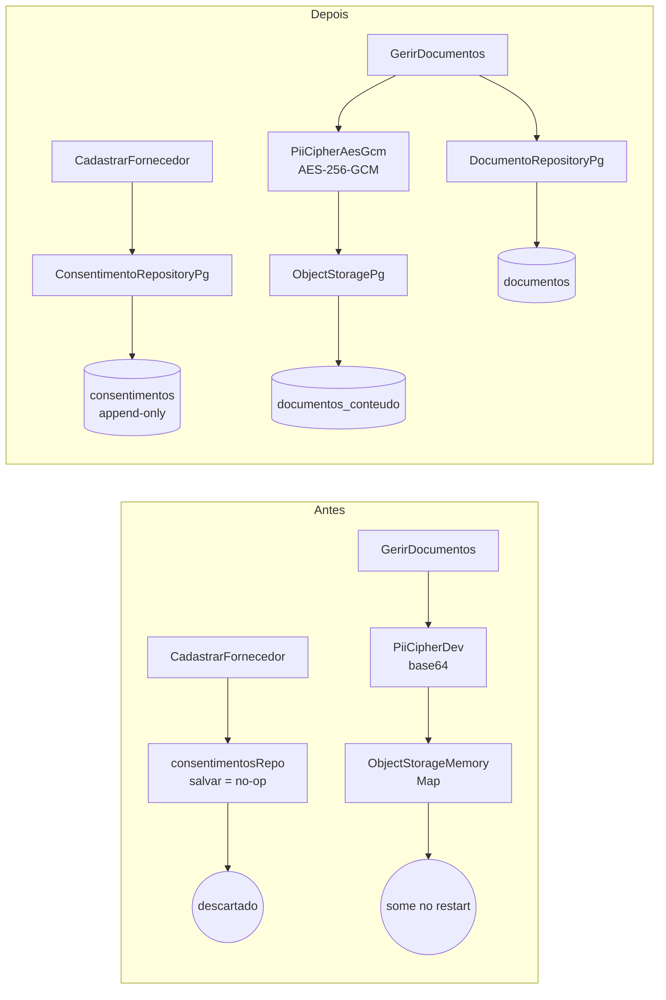

# Registro técnico — AD-19: o dado sensível passa a existir e a ser cifrado de verdade

**Data:** 2026-07-17 · **Branch:** `feature/ad20-identidade-jwt`
**Escopo decidido pelo solicitante:** Bloco Segurança (AD-20 + AD-19). Este registro cobre o **AD-19**.
**Anterior:** [`2026-07-17-registro-fase2-ad20-identidade-jwt.md`](2026-07-17-registro-fase2-ad20-identidade-jwt.md)

## 1. Os três defeitos

Todos no composition root, e todos invisíveis porque os testes passavam contra eles:

| # | Defeito | Onde |
|---|---|---|
| 1 | `const consentimentosRepo = { salvar: async () => {} }` — o consentimento LGPD era construído e **jogado fora**; não havia tabela | `server.ts:203` |
| 2 | `new ObjectStorageMemory()` + `DocumentoRepositoryMemory` **incondicionais** — documentos e PII de sócios num `Map`; sumiam no restart, levando a fila de covalidação (UC006) junto. Único agregado sem par pg | `server.ts:248-249` |
| 3 | `new PiiCipherDev()` — a "cifra em repouso" era **base64**. O próprio comentário dizia "NÃO usar em produção" | `server.ts:249` |

O #1 é o mais insidioso: a LGPD exige **demonstrar** o consentimento. O sistema pedia o consentimento,
mostrava o termo, e não guardava a prova. Os testes de cadastro passavam — contra um repositório que
descartava o dado.

## 2. O que foi feito



- **Cifra real** — `shared/crypto/pii-cipher-aes.ts`: AES-256-GCM, blob `base64(iv[12] | tag[16] |
  ciphertext)`, **IV aleatório por operação** (nonce estático é vedado — DEC-STR-19), tag verificada
  na decifra. Chave de 32 bytes (base64 ou hex) via `readSecret` (Docker secret, AD-29).
- **Consentimento** — `Consentimento.estado()/deEstado()` (AD-33), porta + adapters memory/pg,
  migração `0017`. A tabela **recusa UPDATE/DELETE por trigger**, como a trilha (0001): consentimento
  é prova legal, não se edita — revoga-se com um fato novo. Por isso o upsert é `ON CONFLICT DO
  NOTHING`, não `DO UPDATE`.
- **Documentos** — `Documento.estado()/deEstado()` (era a peça que faltava e o motivo de nunca ter
  ganhado adapter pg), `DocumentoRepositoryPg` (QBE parametrizado + paginação), `ObjectStoragePg` em
  tabela própria (`documentos_conteudo`), migração `0018` com índices parciais `WHERE
  status='pendente'` para a fila de covalidação. O storage recebe o conteúdo **já cifrado**: não
  decifra e não conhece a chave.
- **Wiring** — `pool ? pg : memory` nos três. A cifra é **AES sempre**; o que muda por ambiente é a
  chave (ver §3).

## 3. Uma decisão de sequenciamento que evitou dado corrompido

Enquanto `ObjectStorageMemory` era um `Map`, **nada persistia** — não havia blob base64 legado. A
migração 0018 muda isso: o conteúdo passa a ser durável. Se 0018 chegasse a um ambiente **antes** da
troca da cifra, tudo gravado via `PiiCipherDev` viraria permanentemente indecifrável no instante em
que o AES entrasse — sem marcador para distinguir os blobs.

Por isso **não há dois ciphers**: `PiiCipherAesGcm` é usado em todo ambiente e as duas mudanças
entram no mesmo commit. A janela nunca abre. (`PiiCipherDev` sobrevive só como fixture de teste.)

## 4. Consequência operacional: produção não sobe sem os dois segredos

Somando ao AD-20, `loadConfig()` agora **falha no boot** em produção sem `JWT_SECRET` **ou**
`PII_ENCRYPTION_KEY`. É intencional — cifrar com chave pública é teatro, e teatro pior que nada,
porque passa a impressão de proteção. Mas exige provisionamento **antes** do deploy:

```bash
openssl rand -base64 48 | docker secret create jwt_secret -
openssl rand -base64 32 | docker secret create pii_encryption_key -
```

Documentado em `docker-compose.yml` (secret `pii_encryption_key` + `PII_ENCRYPTION_KEY_FILE`) e
`.env.example`. **Perder ou rotacionar a chave torna os documentos gravados indecifráveis** — não há
reencriptação automática. Guardá-la com o mesmo cuidado do backup.

## 5. Evidências

**Gate em container (DEC-STR-34):** backend **419 testes / 66 arquivos** (+14 pg opt-in), frontend
**77 / 19**, lint + typecheck limpos.

**Postgres real** — os 14 specs pg (que o CI pula por não subir banco) rodados contra o banco de dev:
**14/14 verdes**.

**Live, pelo fluxo HTTP real:**

| Verificação | Antes | Agora |
|---|---|---|
| Cadastro (UC001) grava o consentimento | descartado silenciosamente | **1 linha** com finalidade + versão do termo |
| `UPDATE consentimentos` | (não havia tabela) | **erro**: `append-only (prova LGPD): UPDATE proibido` |
| `DELETE consentimentos` | — | **erro**: `DELETE proibido` |
| PII no banco em claro | — | **não aparece** |
| PII decodificável como base64 (o que `PiiCipherDev` fazia) | revelava o segredo | **não revela nada** (AES-256-GCM) |
| Documento após restart do backend | evaporava | **sobrevive** |
| Fila de covalidação (UC006) após restart | evaporava | **sobrevive** |

Blob real gravado: `suj3YX49C/AtWDMotvb06/e4kwpYZQb8gBj/5lRxkzZAbUcSAYSt+ahOqmXT…`

## 6. Dívidas registradas (não tratadas aqui)

1. **AD-1/AD-17 — violação de fronteira, agora concreta.** `CadastrarFornecedor` (módulo `catalogo`)
   importa `credenciamento/domain/consentimento.ts` e **manda gravar** na tabela de `credenciamento`.
   Enquanto o repo era no-op a violação era abstrata: ninguém escrevia nada. Agora escreve. Pôr o
   adapter em `credenciamento/` mantém o escritor físico no módulo dono, mas o **comando** vem de
   fora — é violação de fluxo, e nenhum arranjo de pastas a resolve. Duas saídas, ambas com decisão
   pendente: (a) evento de domínio `FornecedorCadastrado` carregando o consentimento, tornando a
   prova **eventualmente consistente** — para prova legal isso merece arbitragem, não escolha de
   implementação; (b) mover `Consentimento` para `shared/`, se o consentimento é transversal (o que
   a redação do AD-19 sugere). **O mesmo padrão já existe em `ContaAcesso`** → é dívida sistêmica.
2. **Contagem do funil satura em 20.** `server.ts:319` conta pendentes via `buscarPorExemplo`, que
   pagina com `size` default 20 — o painel admin mostra no máximo 20. Defeito pré-existente do
   adapter memory, **reproduzido fielmente** no pg (os adapters têm de ser intercambiáveis).
   Corrigir exige `contar(probe)` na porta. Não é segurança; ficou fora do bloco.
3. **Specs pg não rodam no CI** — são opt-in por `POSTGRES_HOST` e o `backend-test` não sobe banco.
   Hoje só rodam manualmente (como fiz aqui). Testcontainers resolveria (já previsto no protocolo TDD).
4. **Rotas sem guard** — herdado do AD-20, ver §7 do registro anterior. `GET
   /fornecedores/:id/documentos/pendentes` (a fila de covalidação) segue **aberta a anônimo**: agora
   os documentos são duráveis, então a exposição deixou de ser efêmera.

## 7. Rollback

Reverter o commit restaura os no-ops (e o buraco). **As migrações 0017/0018 são forward-only e
permanecem** — tabelas vazias e sem uso não quebram o código antigo, que nunca as consulta. Nenhum
dado precisa ser desfeito. Se já houver documento gravado com AES e o rollback for necessário, o
conteúdo fica ilegível para o código antigo (que espera base64): nesse caso, reverter **apenas** o
wiring do cipher não é suficiente — os blobs teriam de ser decifrados antes.
