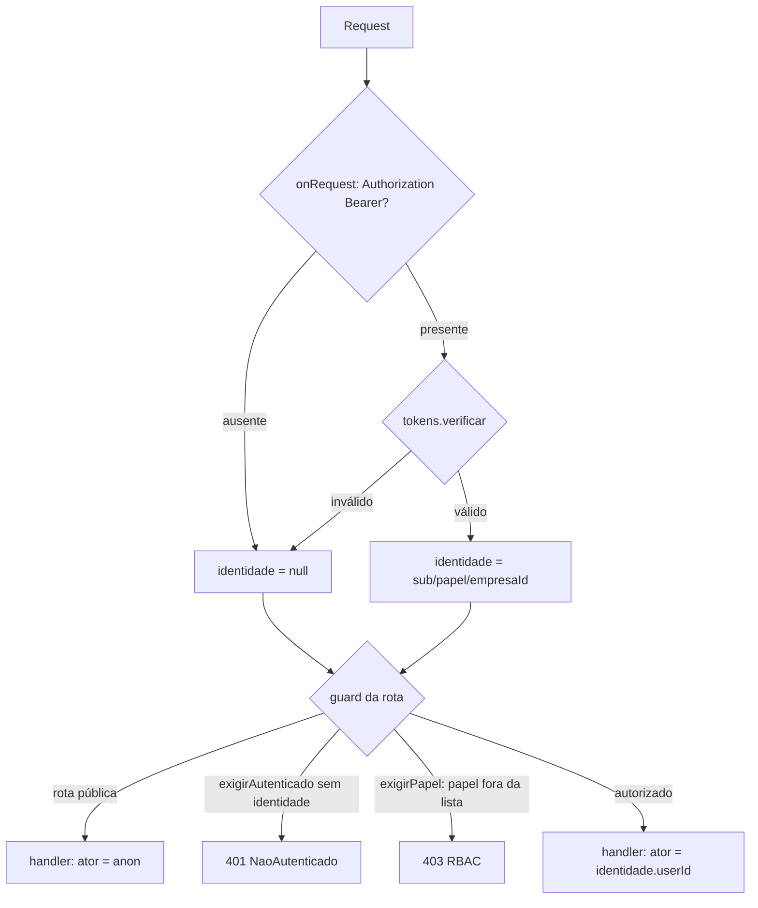

# Registro técnico — Fase 2 (AD-20): a identidade passa a vir do token

**Data:** 2026-07-17 · **Branch:** `feature/ad20-identidade-jwt` · **Base:** `chore/higiene-spec-fase1`
**Escopo decidido pelo solicitante:** Bloco Segurança (AD-20 + AD-19). Este registro cobre o **AD-20**.
**Prompt:** [`docs/prompts/2026-07-17_001_alinhar-implementacao-spec-fase2-ad20.md`](../prompts/2026-07-17_001_alinhar-implementacao-spec-fase2-ad20.md)

## 1. O defeito

O backend autorizava por `x-papel`: um header de texto escolhido por quem chama. A **política** de
papéis (AD-35) estava correta e testada; a **identidade** não era verificada. O `token-service.ts`
(JWT HS256, `sub`/`papel`/`empresaId`) existia, funcionava, e era exigido em **3 rotas** de `/auth`.

Não havia hook de autenticação: **14 controllers** reimplementavam o guard lendo o header.

Verificado live contra Postgres real (commit `c648b57`): **10/10 rotas protegidas abriram sem token**.
`/admin/usuarios` devolveu nome, e-mail, cargo e papel de servidores da Prefeitura a um anônimo.

## 2. A correção

Camada nova: [`backend/src/shared/http/autenticacao.ts`](../../backend/src/shared/http/autenticacao.ts).



Três decisões de desenho:

- **O hook não rejeita; o guard rejeita.** Token inválido em rota pública segue anônimo (o login não
  pode quebrar porque o navegador guardou um token expirado). Para o guard, token inválido e token
  ausente são a mesma coisa → 401. Um token inválido **nunca** "cai" de volta no header.
- **401 ≠ 403.** Anônimo → 401 (identidade desconhecida). Identificado sem permissão → 403. Devolver
  403 a um anônimo diria que a rota existe e que basta trocar de papel.
- **O ator da trilha (AD-18) vem do token.** Era `x-user-id`, autodeclarado: a auditoria registrava
  quem o chamador dissesse ser.

Registrada no composition root **antes da primeira rota** — o Fastify só aplica o hook às rotas
registradas depois dele (por isso `tokens` subiu para junto do `loadConfig`).

## 3. Consequência: o segredo do JWT virou crítico

Com o RBAC por header, o `JWT_SECRET` não decidia nada e caía num default versionado. Agora o token
**é** a autorização: subir produção sem `JWT_SECRET` deixaria qualquer pessoa forjar um administrador
com um segredo que está neste repositório — o mesmo buraco, reaberto por configuração.
`loadConfig()` agora **falha no boot** em produção sem segredo próprio (`env-jwt-secret.spec.ts`).

## 4. Divergências corrigidas junto (AD-35)

- `PERFIS_GESTAO` e `PERFIS_RESOLVE` continham `'secretaria'` e `'gestor'` — **cargos**, não papéis
  (`Papel` = `titular|procurador|administrador|cpl|smga|auditor|dpo|leitura`). Nunca casavam com
  ninguém: eram inertes e só pareciam funcionar enquanto o papel era texto livre. Corrigidos para
  papéis canônicos, **incluindo `administrador`** (que não conseguia gerir editais nem resolver
  contestações).
- Vários testes usavam `x-papel: 'fornecedor'` — papel inexistente — para provar o 403. Passavam por
  serem *desconhecidos*, não por serem *negados*. Trocados por papéis reais (`titular`).

## 5. Arbitragem: `GET /catalogos/:catalogo` continua público

O teste vermelho listava `GET /catalogos/secretarias` entre as rotas protegidas e exigia 401. **A
linha estava errada.** A sonda viu o GET abrir sem token e o leu como porta arrombada; ele nunca foi
protegido. A leitura de catálogo é aberta por decisão registrada (UC020: dado de referência,
consumido por editais/upload) e o próprio `catalogos-controller.ts` já a declarava. Quem exige
Administrador é a **escrita**.

Fechar o GET para deixar a linha verde teria revertido uma decisão de produto para satisfazer um
teste. O caso foi **reescrito para um POST**, preservando a intenção real (escrita não autoriza por
header) — registrado no próprio arquivo.

## 6. Evidências

**Gate em container (DEC-STR-34):** backend **385 testes / 62 arquivos**, lint + typecheck limpos
(antes: 348 verdes + 12 vermelhos). Frontend **77 testes / 19 arquivos**.

**Live, contra Postgres real** (`--profile dev`) — o ataque original, repetido:

| Verificação | Antes | Agora |
|---|---|---|
| 9 rotas protegidas com `x-papel` e sem token | 200 | **401** |
| `Bearer <inválido>` + `x-papel: administrador` | 200 | **401** |
| `/admin/usuarios` anônimo | PII de servidores | **401** `NaoAutenticado` |
| Token de `cpl` + `x-papel: administrador` | 200 (escalava) | **403** (papel vem do token) |
| Token de administrador (caminho feliz) | — | **200** em `/admin/usuarios`, `/auditoria`, `/admin/dashboard` |
| `GET /catalogos/secretarias` anônimo | 200 | **200** (público por decisão — §5) |
| `POST /catalogos/secretarias` com `x-papel`, sem token | 201 | **401** |

**Ator da trilha (AD-18)** — escrita real com `x-user-id: sou-outra-pessoa` no header:

```
CatalogoItemCriado | c776c642-5180-4857-a7c4-e34895518b73   ← sub do token (header ignorado)
CatalogoItemCriado | adm                                     ← registro anterior: string de header
```

Duas linhas da mesma tabela: a de cima é a identidade verificada; a de baixo é o que alguém digitou.

## 7. Achados que NÃO foram tratados (backlog explícito)

1. **Rotas sem RBAC nenhum, abertas a anônimo — pré-existente, não é regressão desta entrega:**
   - `GET /fornecedores/:id/documentos/pendentes` — é a **fila de covalidação**; o doc-comment do
     controller diz "RBAC: só CPL/SMGA", mas só o POST tinha guard. Expõe documentos de qualquer
     fornecedor. **É o mais grave da lista.**
   - `PATCH /fornecedores/:id`, `POST /fornecedores/:id/sincronizar` ("Minha conta", UC018).
   - `POST /fornecedores/:id/verificar-elegibilidade`, `/reconsultar`, `/reenviar`, `/pendencias`.
   - `GET /editais/:id/contestacoes-cnae` — expõe justificativas por fornecedor.

   Fechá-las muda o contrato do frontend e merece decisão explícita, não carona nesta migração.

2. **Deriva do banco de dev (não é código).** O volume local está dessincronizado do
   `seed.ts`: `administrador@compramais.local` não existe, `admin@compramais.local` é
   `administrador` (o seed diz `cpl`) e `fornecedor@demo.local` é `cpl` (o seed diz `titular`). O
   seed é insert-only e não reconcilia quem já existe. Não afeta produção nem o CI (que sobe banco
   limpo), mas **enquanto o RBAC era por header isso era invisível** — agora o login importa. Vale
   um seed idempotente ou um reset documentado do volume.

3. **`identidade.empresaId` é opcional.** Token `titular` sem `empresaId` cai em `''` e responde 404
   `FornecedorNaoEncontrado`. Comportamento preservado do código antigo; um 400 dedicado seria mais
   honesto.

## 8. Rollback

Reverter o commit desta entrega restaura o modelo por header (e reabre o bypass). Não há migração de
banco nem mudança de schema — o rollback é puramente de código. O frontend volta a funcionar sem
alteração adicional, porque continua enviando o Bearer; apenas os headers de identidade voltariam a
ser necessários.

## 9. Rastreabilidade

| Item | Caminho |
|---|---|
| Camada nova | `backend/src/shared/http/autenticacao.ts` |
| Guard do segredo | `backend/src/shared/config/env.ts` · `backend/tests/unit/env-jwt-secret.spec.ts` |
| Helper de teste | `backend/tests/helpers/auth.ts` |
| Contrato de aceite | `backend/tests/integration/rbac-identidade-jwt.spec.ts` |
| Teste que afirmava o defeito | `backend/tests/integration/rbac-auditoria.spec.ts` |
| Frontend | `frontend/src/lib/api.ts` |
| ADs | AD-20 (identidade), AD-35 (papéis), AD-18 (ator da trilha), AD-29 (segredos) |
