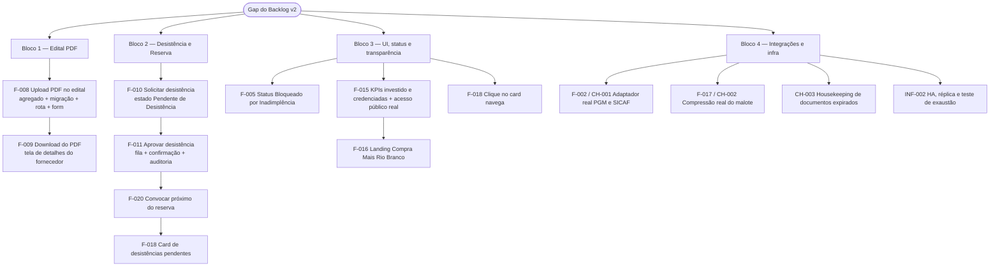

# Auditoria — `spec/Backlog` × Implementação (Revisão Consolidada do Tech Lead)

## Identificação

- **Projeto:** compraMais — Prefeitura Municipal de Rio Branco
- **Responsável:** Tech Lead
- **Data:** 2026-07-23
- **Escopo revisado:** `spec/Backlog/07-Backlog.md` (v1), `spec/Backlog/07-Backlog-v2.md` (v2) × branch `main` (`0faaf07`, com `develop` já integrada)
- **Método:** inspeção de código (domínio, aplicação, adapters, rotas em `backend/src/server.ts`, migrações `backend/migrations/`, telas e rotas em `frontend/src/`), cruzada com `.github/agents/memoria/MEMORIA-PROJETO.md`
- **Status:** Concluída com ressalvas — **somente leitura, nenhuma alteração de código**

---

## Resumo executivo

O backlog vigente (**v2**, 20 features) está **60% fechado**: **12 features implementadas**, **5 parciais** e **3 não implementadas**. O núcleo operacional (cadastro, documentos, covalidação, filtro CNAE, motor de distribuição, malote, auditoria) está de pé e durável em Postgres.

O gap concentra-se em **dois blocos coesos, ambos "Must Have" da Fase 1**:

1. **Edital oficial em PDF** (FEATURE-008/009) — inexistente do agregado à tela. É o maior buraco isolado: nenhuma linha de código.
2. **Fluxo de desistência** (FEATURE-010/011) e sua contraparte no reserva (FEATURE-020, ação de convocação) — o sistema *lista* desistências e reserva, mas **não executa** o fluxo: não há estado "Pendente de Desistência", nem aprovação administrativa, nem convocação do próximo da fila. Pior: `Credenciamento.cancelar` **lança exceção** justamente para o titular já distribuído — exatamente o caso que a feature quer cobrir.

Além disso, os **próprios arquivos de backlog têm defeitos de rastreabilidade** que precisam ser corrigidos antes de servirem como base de planejamento (§Validação dos artefatos).

**Recomendação:** tratar o gap em 3 incrementos nesta ordem — (1) Edital PDF, (2) Desistência ponta a ponta + convocação do reserva, (3) acabamento de UI/status (FEATURE-005/015/016/018). E, em paralelo, sanear os artefatos de backlog.

---

## 1. Validação dos artefatos de backlog

### 1.1 Divergências encontradas nos arquivos

| # | Achado | Arquivo | Impacto | Recomendação |
|---|---|---|---|---|
| B-01 | **Numeração RF colide com a doc canônica.** O v2 usa `RF015`=Termo de Responsabilidade, `RF016`=Edital PDF, `RF017`=Desistência. Em `spec/docs/` (PRD canônico) `RF015`=Autenticação recorrente, `RF016`=Tela única de contestação, `RF017`=Consentimento/direitos do titular — **três colisões**. `RN010` idem (v2=desistência; canônico=procurador convidado/removido pelo titular) | v2 | **Alto** — rastreabilidade RF→Épico→código fica ambígua; um item pode ser dado como "coberto" por código de outro requisito | Renumerar as novas regras do v2 (ex.: RF024+/RN017+) ou incorporá-las ao PRD canônico com número livre |
| B-02 | **Links relativos quebrados.** O v1 aponta para `03-HDR.md`, `04-Arquitetura.md`, `05-HistoriasUsuario.md`, `06-CasosUso.md` como irmãos em `spec/Backlog/` — os arquivos estão em `spec/Requisitos/`, `spec/Arquitetura/`, `spec/HistoriasUsuario/`, `spec/CasosUso/` | v1 | Médio — navegação/rastreabilidade quebrada | Corrigir os caminhos ou marcar o v1 como legado |
| B-03 | **Dois backlogs vigentes ao mesmo tempo.** O v1 não declara que foi superado pelo v2 | v1 | Médio — risco de planejar pela versão errada | Adicionar cabeçalho `> Superado por 07-Backlog-v2.md (2026-07-03)` |
| B-04 | **Resíduo de geração automática.** O v1 termina com `Quer que eu crie issues/epics no repositório ou atribua estimativas?` e traz `Casos de Uso: UC011? (painel interno)` — interrogação literal em artefato de governança | v1 | Baixo | Remover na consolidação |
| B-05 | **Backlog v2 desatualizado em relação ao produto.** Módulos entregues e em produção **não têm item de backlog**: UC004 (wizard de credenciamento), UC015 (autogestão de senha), UC016 (tela única de contestação), UC017 (LGPD/direitos do titular), UC019 (procuradores), UC020 (catálogos base), UC021 (usuários internos), permissões de telas por perfil | v2 | **Alto** — o backlog subestima o produto; qualquer métrica de progresso tirada dele é falsa | Incorporar as features entregues como itens fechados (ou referenciar `spec/docs/epics.md` como fonte de escopo) |
| B-06 | Divergência de mapeamento HU entre v1 e v2 (ex.: repositório documental: v1→HU006, v2→HU-007) | v1/v2 | Baixo — decorre da renumeração da Validação 01 | Manter só o v2 como fonte |

**Conclusão sobre os artefatos:** o v2 é utilizável como eixo de planejamento, mas **não é confiável como matriz de rastreabilidade** enquanto B-01 e B-05 não forem resolvidos.

---

## 2. Matriz de rastreabilidade — FEATURE × implementação

Legenda: ✅ Implementado · ⚠️ Parcial (mecanismo existe, critério de aceite não fecha) · ❌ Não implementado

| Feature | Prioridade | Status | Evidência de código | Gap para o critério de aceite |
|---|---|---|---|---|
| **F-001** Cadastro Integrado (Receita) | Must | ✅ | `shared/acl/receita/receita-brasilapi.ts`; `catalogo/application/cadastrar-fornecedor.ts` (fallback manual + `pendenteCovalidacao`); `cadastro-controller.ts` (503 `RECEITA_INDISPONIVEL`) | — |
| **F-002** Verificação de Inadimplência | Must | ⚠️ | `credenciamento/application/verificar-elegibilidade.ts`, `domain/bloqueio.ts`, mig `0009`, rotas `/verificar-elegibilidade`, `/reconsultar` | **Gateway é mock** (`shared/acl/divida/divida-mock.ts`). Sem PGM/SICAF real — o "Critério de Pronto" (APIs liberadas) não foi cumprido. Lógica, breaker e fail-open+flag prontos para o adaptador real |
| **F-003** Repositório Documental Reutilizável | Must | ✅ | `credenciamento/application/gerir-documentos.ts` (docs por fornecedor, vigente/expirado, cifra AES-256-GCM), mig `0018`, Passo 2 do wizard com estado `importado` | — |
| **F-004** Termo de Responsabilidade Legal | Must | ⚠️ | `Credenciamento.aceitarTermo`, checkbox + `podeAvancar` em `Credenciamento.tsx`, consentimento persistido (mig `0017`), evento na trilha | **O texto não é o da feature.** O termo atual é um "Termo de Aceite" genérico (veracidade de informações/documentos). A feature exige responsabilização **criminal sobre a capacidade produtiva declarada**. Critério de Pronto (validação jurídica) pendente |
| **F-005** Revisão da Nomenclatura de Status | Must | ❌ | Status na tela: `requerente / pendente_analise / credenciado / apto / em_correcao` (`admin/Fornecedores.tsx`) | Não existe **"Bloqueado por Inadimplência"** na UI; o bloqueio (RN002) vive no domínio mas não é projetado como status do fornecedor na listagem; a ação "Bloquear" está desabilitada |
| **F-006** Filtro de Editais por CNAE | Must | ✅ | `Fornecedor.compativelCom`, `ListarEditaisCompativeis`, `editais-controller` (403 `EditalIncompativel`), `pages/publico/Editais.tsx` | — |
| **F-007** Covalidação Humana | Must | ✅ | `credenciamento/application/covalidar.ts`, `JustificativaObrigatoria`, `admin/AnaliseDocumental.tsx`, `FilaCovalidacao` | — |
| **F-008** Upload de Edital Oficial (PDF) | Must | ❌ | **Nenhuma** — o agregado `Edital` não tem campo de arquivo; sem rota de upload; sem migração; sem campo no formulário | Feature inteira |
| **F-009** Download de Edital Oficial (PDF) | Must | ❌ | **Nenhuma** (depende de F-008) | Feature inteira |
| **F-010** Solicitação de Desistência (Fornecedor) | Must | ❌ | Existe `POST /credenciamentos/:id/cancelar` — **cancelamento direto, não solicitação** | Sem estado "Pendente de Desistência"; sem notificação ao admin; e `Credenciamento.cancelar` lança `CredenciamentoJaDistribuido` para titular com cota — bloqueia justamente o caso-alvo |
| **F-011** Aprovação de Desistência (Administrador) | Must | ❌ | `/admin/desistencias` é **somente leitura** (`ListarDesistencias`, `Desistencias.tsx`) | Sem fila de pendências, sem ação "Confirmar Desistência", sem observação, sem acionamento do reserva |
| **F-012** Motor de Distribuição Inteligente | Must | ✅ | `distribuicao/domain/motor.ts` (rateio + teto por capacidade + redistribuição de excedente + desempate canônico), `executar-distribuicao.ts`, mig `0022`, `admin/DistribuicaoInteligente.tsx` (preview + Homologar) | — |
| **F-013** Bloqueio de Edição Manual de Cotas | Must | ✅ | Matriz append-only versionada; **nenhuma rota ou campo de edição de cota** existe (rotas: `POST /editais/:id/distribuir` + GETs) | *Ressalva:* implementado por ausência deliberada; falta teste negativo explícito provando o bloqueio via API |
| **F-014** Ocultação do Rateio Global | Must | ✅ | `listar-demandas-fornecedor.ts` → devolve total do edital, nº de aptos e a **própria** cota; sem tabela comparativa | — |
| **F-015** Portal Público de Transparência | Should | ⚠️ | `paineis/application/paineis.ts` (`Transparencia`), `GET /transparencia`, `pages/publico/Transparencia.tsx` (KPIs: editais vigentes, secretarias, segmentos) | Faltam **Total Investido** e **Empresas Credenciadas**; a página vive sob o `fornecedorLayout` (shell do fornecedor) e `/` redireciona para `/cadastro` — **não há acesso público de fato** |
| **F-016** Adequação da Identidade Visual (Landing) | Should | ❌ | **Nenhuma landing page existe** | Feature inteira (título "Compra Mais Rio Branco", logos da Prefeitura, e-mail oficial) |
| **F-017** Malote SEI Otimizado | Must | ⚠️ | `malote/` completo, mig `0013`, fila durável `FilaMalotePg` com `recuperar()` no boot, ordem legal das peças, fragmentação + flag de peça acima do limite, `admin/GerarMalote.tsx` | **Compressão real dos bytes não implementada** (só fragmentação); limite MB do SEI ainda não formalizado pela TI (Critério de Pronto aberto) |
| **F-018** Dashboard Interno de Gestão | Should | ⚠️ | `DashboardAdmin.funil()`, `GET /admin/dashboard`, `admin/Dashboard.tsx` (4 cards) | Falta card **"Desistências pendentes"** (depende de F-010/011) e **clique no card não navega** para a lista |
| **F-019** Trilha de Auditoria Imutável | Must | ✅ | mig `0001` com trigger `auditoria_append_only` (UPDATE/DELETE recusados pelo banco), eventos de todos os módulos, `GET /auditoria` + `/auditoria/exportar` | — |
| **F-020** Gestão do Cadastro de Reserva | Must | ⚠️ | `listar-cadastro-reserva.ts` (fila FIFO por ordem cronológica de aceite), `GET /gestao/cadastro-reserva`, `admin/CadastroReserva.tsx` | Falta o 3º critério: **convocar o próximo da fila** para assumir cota vaga (ação inexistente) |

**Placar v2:** ✅ 12 · ⚠️ 5 · ❌ 3.
**Placar restrito à Fase 1 (Must Have, 16 features):** ✅ 9 · ⚠️ 4 · ❌ 3.

---

## 3. Backlog v1 (legado) — mapeamento e itens sem equivalente no v2

| Item v1 | Equivale a | Status |
|---|---|---|
| BI-001 Cadastro CNPJ/Receita | F-001 | ✅ |
| BI-002 Upload documental reutilizável | F-003 | ✅ |
| BI-003 Filtro CNAE | F-006 | ✅ |
| BI-004 Motor de Distribuição | F-012 | ✅ |
| BI-005 Malote SEI | F-017 | ⚠️ |
| BI-006 Inadimplência (PGM/SICAF) | F-002 | ⚠️ |
| BI-007 Covalidação humana | F-007 | ✅ |
| BI-008 Dashboard interno | F-018 | ⚠️ |
| BI-009 Portal público de transparência | F-015 | ⚠️ |
| **INF-001** Auditoria imutável + exportação | F-019 | ✅ |
| **INF-002** Disponibilidade e escalabilidade (HA) | — (sem equivalente no v2) | ⚠️ Swarm/Portainer + GHCR e plano de dimensionamento (`docs/dba/plano-dimensionamento-banco.md`) definidos; **sem réplica de leitura, sem HA configurada e sem teste de exaustão** (pendência já registrada na memória) |
| **INF-003** Usabilidade e identidade visual | F-016 (parcial) | ⚠️ Design System formal entregue (`docs/ux/design-system.md`); landing/brandbook pendente; divergência de paleta D1 ainda aberta |
| **CH-001** Integrações PGM/SICAF + fallback | F-002 | ❌ Só mock com circuit breaker; nenhum adaptador real |
| **CH-002** Worker de compressão/processamento assíncrono do malote | F-017 | ⚠️ Processamento assíncrono e fila durável ✅; **compressão real ❌** |
| **CH-003** Storage seguro + housekeeping de documentos expirados | F-003 | ⚠️ Storage cifrado AES-256-GCM + mig `0018` ✅; **housekeeping/expurgo de expirados não existe** (nenhuma rotina de retenção agendada no código) |

---

## 4. Gap consolidado — o que falta implementar

### Sequenciamento recomendado

| # | Incremento | Features | Por quê nesta ordem |
|---|---|---|---|
| 1 | **Edital oficial em PDF** | F-008 → F-009 | Maior gap isolado, greenfield, sem dependência de decisão externa. F-009 é consequência direta de F-008 |
| 2 | **Desistência ponta a ponta** | F-010 → F-011 → F-020 (convocação) → F-018 (card) | Bloco coeso: hoje o sistema só *observa* desistências. Exige decisão de domínio sobre `CredenciamentoJaDistribuido` (ver §5, D-01) |
| 3 | **Acabamento de status e transparência** | F-005, F-015, F-016, F-018 (navegação) | Baixo risco técnico, alto valor de percepção; F-016 depende do brandbook da Prefeitura |
| 4 | **Integrações e infra** | F-002/CH-001, F-017/CH-002, CH-003, INF-002 | Todos dependem de terceiros (API PGM liberada, limite MB do SEI, capacidade de infra) — não bloqueiam os blocos 1–3 |

---

## 5. Divergências que exigem arbitragem antes de implementar

| ID | Divergência | Impacto | Encaminhamento |
|---|---|---|---|
| **D-01** | `Credenciamento.cancelar` lança `CredenciamentoJaDistribuido` (RN016/RN004: titular distribuído não sai), mas F-010/F-011 exigem exatamente esse fluxo, com aprovação administrativa | **Bloqueante** para o Bloco 2 | Decisão do solicitante + jurídico: a desistência pós-distribuição é permitida **mediante ato formal do administrador**? Se sim, a regra deixa de ser proibição e passa a ser "só sai com aprovação" |
| **D-02** | RF/RN do backlog v2 colidem com o PRD canônico (B-01) | Alto para rastreabilidade | Business Analyst renumera antes do próximo planejamento |
| **D-03** | F-015 exige "Total Investido" — **o domínio não tem valor financeiro** (o edital guarda `quantitativos`, não preço) | Alto — o critério de aceite é inexequível hoje | Definir a origem do valor (preço de referência no edital? integração?) ou repactuar o KPI |
| **D-04** | F-004 exige responsabilização criminal sobre capacidade produtiva; o termo implementado é genérico | Médio — risco jurídico | Jurídico da Prefeitura fornece o texto; só então o front troca a string (mecanismo já pronto) |
| **D-05** | Backlog v2 não cobre 8 módulos já entregues (B-05) | Alto para gestão | Incorporar ao backlog ou adotar `spec/docs/epics.md` como fonte de escopo |

---

## 6. Riscos residuais

- **Métrica de progresso enganosa:** enquanto B-05 não for corrigido, o backlog subestima o entregue e superestima o restante.
- **F-013 sem prova:** o bloqueio de edição de cotas está garantido por *ausência* de endpoint. Um endpoint futuro pode reabrir o buraco sem que nenhum teste falhe — recomenda-se um teste negativo explícito.
- **Transparência não é pública de fato:** `/transparencia` está sob o shell do fornecedor e a raiz redireciona para `/cadastro`; o critério "acessível sem login" está formalmente atendido pela ausência de guard, mas não pela navegação.
- **Pendências de QA herdadas:** E2E Cypress segue sem execução real em CI para praticamente todas as entregas (pendência recorrente na memória de projeto).

---

## 7. Rastreabilidade

- Backlogs auditados: [`spec/Backlog/07-Backlog.md`](../../spec/Backlog/07-Backlog.md), [`spec/Backlog/07-Backlog-v2.md`](../../spec/Backlog/07-Backlog-v2.md)
- Doc canônica de requisitos/épicos: `spec/docs/epics.md`, `spec/docs/implementation-readiness-report.md`
- Auditoria anterior (eixo ADs/UCs): [`docs/dev/2026-07-17-backlog-nivelamento-spec-codigo.md`](2026-07-17-backlog-nivelamento-spec-codigo.md)
- Memória de projeto: `.github/agents/memoria/MEMORIA-PROJETO.md`
- Log do prompt: [`docs/prompts/2026-07-23_001_validar-backlog-implementacao.md`](../prompts/2026-07-23_001_validar-backlog-implementacao.md)

**Gates:** nenhuma alteração de código nesta demanda — suíte não re-executada (último gate verde registrado: backend 498, frontend 169, via `docker compose --profile test`).
