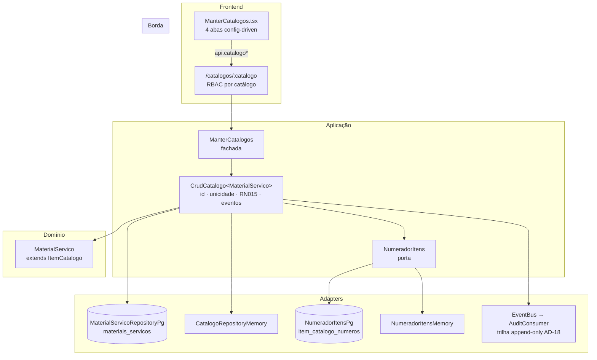

# Registro Técnico — Catálogo de Materiais e Serviços (4º catálogo de UC020)

- **Data:** 2026-07-23
- **Demanda:** "baseado no projeto `../comprac_api`, implemente o catálogo de materiais e serviços disponível no perfil SMGA e acessível no menu Catálogos"
- **Branch:** `feature/catalogo-materiais-servicos`
- **Log do prompt:** [`docs/prompts/2026-07-23_002_catalogo-materiais-servicos-smga.md`](../prompts/2026-07-23_002_catalogo-materiais-servicos-smga.md)
- **Gates:** backend **564** testes · frontend **183** testes (lint + typecheck + test via `docker compose --profile test`, DEC-STR-34)

---

## 1. O que foi entregue

O catálogo de **materiais e serviços** — os itens que a Administração compra ou contrata — entrou como o **4º catálogo de UC020**, na mesma jornada de Secretarias, Setores/CNAE e Tipos de Documento. Fica em `/admin/catalogos`, aba "Materiais e serviços", e é mantido pela **Secretaria (`smga`)** além do Administrador.

| Capacidade | Estado |
|---|---|
| Criar item com numeração automática `ITM-AAAA/NNN` | ✅ |
| Nome, natureza (Material \| Serviço), especificações técnicas, unidades de medida | ✅ |
| Editar com trilha `antes/depois` (AD-18) | ✅ |
| Inativar / reativar (exclusão lógica RN015) | ✅ |
| Unicidade de nome, global e case-insensitive | ✅ |
| Busca por número/nome/especificação, filtro por natureza | ✅ |
| Exportação Excel (CSV) e PDF (impressão) | ✅ |
| Persistência durável em Postgres + i18n nos 3 idiomas | ✅ |

---

## 2. Decisões e motivações

| # | Decisão | Motivação | Alternativa descartada |
|---|---|---|---|
| D1 | **Reusar o módulo `catalogos/`** em vez de criar um módulo novo | O `CrudCatalogo<T>` já resolve id, unicidade, inativação lógica e eventos de trilha; um módulo paralelo duplicaria as quatro coisas | Módulo `materiais/` autônomo |
| D2 | O par `status` (Ativo\|Pendente) + `ativo` da referência virou **uma única `situacao`** | Na referência o `Pendente` existe porque o **fornecedor sugere** itens; sem esse fluxo aqui, o segundo eixo de estado não teria produtor — seria estado morto que nenhuma tela alcança | Copiar os dois campos "para o futuro" |
| D3 | Chave natural de unicidade = **nome** (não o número) | O número é gerado pelo sistema, logo único por construção: usá-lo como chave não impediria duplicata alguma. É o mesmo critério de `TipoDocumento` | Chave = número |
| D4 | Numeração `ITM-AAAA/NNN` (barra), não `ITM-AAAA-NNN` da referência | Consistência interna com `ED-AAAA/NNN` (UC005/migração 0016) vale mais que a cópia literal | Formato da referência |
| D5 | **Perfis de escrita por catálogo** no controller | A tela "Catálogos" já é do `smga` por padrão (`VISIBILIDADE_PADRAO.smga`), mas todas as escritas exigiam `administrador` — o público default da tela receberia 403 em tudo | Afrouxar `PERFIS_ESCRITA` global (mudaria o contrato dos 3 catálogos base sem pedido) |
| D6 | Busca/filtro/paginação **client-side** | Padrão já estabelecido em `Editais.tsx` e `MeusCredenciamentos.tsx`; a listagem é dado de referência e vem inteira | QBE no backend (ver §6, follow-up) |
| D7 | `CrudCatalogo.criar` passou a devolver a **entidade**, não `{ id }` | O POST precisa responder com o `numero` gerado. `id` continua acessível por destructuring, então os três catálogos e seus testes não mudaram | Endpoint extra de releitura |

---

## 3. Arquitetura

### Arquivos

**Novos**
- `backend/src/catalogos/domain/material-servico.ts` — agregado + `formatarNumeroItem`
- `backend/src/catalogos/application/numerador-itens.ts` — porta + adaptador memória
- `backend/migrations/0027_init_materiais_servicos.sql`
- `backend/tests/unit/material-servico.spec.ts` (11 casos)
- `backend/tests/integration/materiais-servicos-rotas.spec.ts` (10 casos)

**Alterados**
- `catalogos/application/manter-catalogos.ts` — `CatalogoDef.criar` admite retorno assíncrono; `CrudCatalogo.criar` devolve a entidade; nova instância na fachada
- `catalogos/adapters/catalogos-controller.ts` — `PERFIS_ESCRITA` por catálogo; POST serializa a view completa
- `catalogos/adapters/catalogo-repository-pg.ts` — `MaterialServicoRepositoryPg` + `NumeradorItensPg`
- `catalogos/domain/eventos.ts` — `'material-servico'` no discriminador
- `server.ts` — wiring `pool ? pg : memory`
- `frontend/src/lib/api.ts`, `pages/admin/ManterCatalogos.tsx` (+ teste), `i18n/locales/{pt-BR,en,es}.json`

---

## 4. Ciclo TDD

**Red** — `material-servico.spec.ts` e `materiais-servicos-rotas.spec.ts` escritos antes da implementação; primeira execução no container: **1 falha** (a asserção usava a mensagem do erro em vez da classe `CampoObrigatorio` — corrigido o teste, não a produção).

**Green** — domínio → porta de numeração → fachada → adapters → migração → wiring → tela. Gates: backend **564** / frontend **183**.

O teste de rota fixa explicitamente que **a política dos catálogos base não foi afrouxada** (`smga` em `/catalogos/secretarias` → 403): sem esse caso, uma futura simplificação do RBAC abriria os três catálogos base sem nenhum teste vermelho.

---

## 5. Validação live (Postgres real, `--profile dev`, `RECEITA_PROVIDER=mock`)

| # | Cenário | Resultado |
|---|---|---|
| 1 | Migração 0027 aplicada; tabela + 4 índices + sequência | ✅ |
| 2 | SMGA cria item → **201** com `numero` `ITM-2026/001`, `ITM-2026/002` | ✅ |
| 3 | RBAC: `cpl` escreve → **403** | ✅ |
| 4 | RBAC: anônimo com `x-papel: smga` forjado → **401** | ✅ |
| 5 | Catálogos base intactos: `smga` em `/secretarias` → **403** | ✅ |
| 6 | Nome duplicado (`"  CABO DE REDE CAT6 "`) → **409** | ✅ |
| 7 | Sem unidade → **422 `UnidadeObrigatoria`**; tipo `obra` → **422 `TipoInvalido`** | ✅ |
| 8 | Leitura sem token → **200** (dado de referência) | ✅ |
| 9 | **Concorrência: 12 POSTs paralelos → 14 itens / 14 números distintos, zero colisão** | ✅ |
| 10 | RN015: inativado some do default, persiste com `?incluirInativos=true`, reativa | ✅ |
| 11 | Trilha AD-18: `CatalogoItemCriado ×14`, `Inativado ×1`, `Reativado ×1`; **ator = `sub` do token** (UUID do usuário smga), não header | ✅ |
| 12 | **Durabilidade:** item sobrevive ao restart do backend com número, unidades e especificações preservados | ✅ |
| 13 | PATCH grava diff `antes/depois` de `especificacoes` e `unidades` na trilha | ✅ |
| 14 | **Número imutável:** `PATCH {"numero":"ITM-9999/999"}` não o altera | ✅ |

---

## 6. Divergências deliberadas vs. a referência (`comprac_api`)

| Item da referência | Aqui | Por quê |
|---|---|---|
| `status` Pendente/Ativo | Só `situacao` ativo/inativo | Sem o fluxo de sugestão pelo fornecedor, `Pendente` não teria produtor (D2) |
| `solicitar-novo-item` + `avaliar-solicitacao` (fornecedor sugere, admin aprova) | **Fora de escopo** | Decidido com o solicitante: escopo = CRUD + busca/filtros/exportação |
| Anexo do item (upload/remoção em S3) | **Fora de escopo** | Idem; a infra de storage cifrado existe (`ObjectStorage`/AD-19) e comporta o incremento |
| Exportação server-side (CSV/PDF/JSON via endpoint) | Client-side (`lib/exportar.ts`) | Padrão do projeto: exporta-se exatamente o que a tela mostra, já filtrado |
| Localizações do item (`municipio`/`uf`) | Não portado | Depende de vínculo com edital, que não existe neste incremento |
| `ITM-AAAA-NNN` | `ITM-AAAA/NNN` | Consistência com `ED-AAAA/NNN` (D4) |

---

## 7. Riscos residuais e follow-ups

1. **Gaps na numeração.** O número é reservado **antes** da checagem de unicidade, então um POST que falhe com 409/422 consome um sequencial (na validação live: 14 itens, sequência em 17). Inofensivo para um identificador interno de catálogo e idêntico ao comportamento de `NumeradorEditais`; registrado para não ser lido como defeito.
2. **Busca client-side.** Adequada à ordem de grandeza atual; se o catálogo passar de alguns milhares de itens, migrar para QBE no backend, como `ListarFornecedores` já faz.
3. **`PERFIS_ESCRITA` dos catálogos base × visibilidade da tela.** A incoerência pré-existente permanece para os **três catálogos base**: o `smga` vê a tela "Catálogos" mas recebe 403 ao escrever neles. Não foi alterada por não fazer parte do pedido — **merece decisão do solicitante** (abrir os três ao `smga` ou tirar `catalogos` do padrão dele).
4. **Sem consumidores ainda.** O catálogo não está fiado a editais/lotes/distribuição — é cadastro base, como `secretarias` foi antes de alimentar o edital. O vínculo item ↔ edital é o incremento natural seguinte.
5. **E2E Cypress** a validar em execução real (QA/CI) — pendência recorrente do projeto.
6. **Backlog.** O catálogo de materiais e serviços **não consta de `spec/Backlog/07-Backlog-v2.md`** — mais um caso do achado B-05 da auditoria de 2026-07-23 ([`docs/dev/2026-07-23-auditoria-backlog-vs-implementacao.md`](2026-07-23-auditoria-backlog-vs-implementacao.md)).

---

## 8. Plano de rollback

Reversível sem perda: `git revert` do commit devolve código e telas ao estado anterior. A migração `0027` é **aditiva** — cria tabelas novas e não toca em nada existente; deixá-la aplicada é inócuo (as tabelas ficam órfãs). Se a remoção física for desejada, `DROP TABLE materiais_servicos, item_catalogo_numeros;` em janela controlada, ciente de que os itens cadastrados se perdem.
