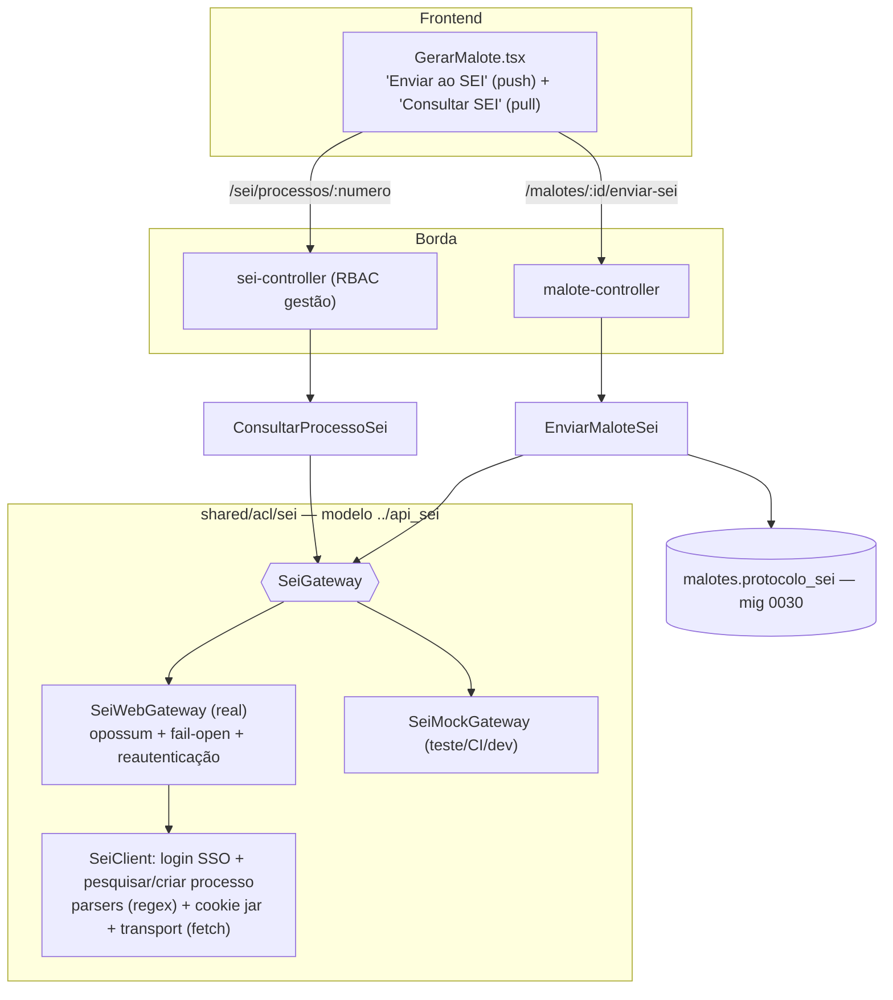

# Registro Técnico — Integração com o SEI (push + pull)

- **Data:** 2026-07-24
- **Demanda:** "o sistema deve ser integrado ao SEI, use como modelo `../api_sei`"
- **Branch:** `feature/integracao-sei`
- **Log do prompt:** [`docs/prompts/2026-07-24_005_integracao-sei.md`](../prompts/2026-07-24_005_integracao-sei.md)
- **Gates:** backend **653** · frontend **189** (lint + typecheck + test em container)

---

## 1. Escopo (decisão do solicitante)

AskUserQuestion: **push + pull**, com **adapter real**.

- **Push:** enviar o **Malote** (UC010/Épico 6) ao SEI — criar um processo e gravar seu número/protocolo no malote (o `exportar()` passa a ser real).
- **Pull:** consultar um processo do SEI por número e listar seus documentos (leitura, RBAC de gestão).

## 2. Abordagem (arbitragem do Tech Lead) e riscos

- **`../api_sei` como MODELO, não dependência.** O SDK (`sei-sdk`) não é publicado (`github:...`); depender dele quebraria o build self-contained em container (DEC-STR-34). A lógica essencial foi **portada** para `backend/src/shared/acl/sei/`, seguindo o padrão de ACL do projeto (receita/dívida: gateway + mock + real + circuit breaker `opossum` + fail-open + proveniência). Os parsers foram reescritos em **regex** (sem adicionar `node-html-parser`).
- **Riscos sinalizados e aceitos pelo solicitante ("real agora"):**
  1. **Sem SEI de homologação acessível** → não há validação live contra o SEI real nesta entrega. O adapter real é exercitado contra **fixtures de HTML do SEI** (login, pesquisa, árvore de documentos); os fluxos ponta a ponta foram validados live com o **mock**. Execução contra o SEI do órgão = **gate de QA**.
  2. **Escrita server-side é frágil** no SEI real (o próprio SDK documenta: a seleção de tipo de processo é autocomplete AJAX stateful) — pode exigir o fluxo por navegador no órgão. Registrado no código (`sei-client.ts`) e aqui.
- **Segredos fora do repo (PRJ-DEC-07):** credenciais/URL/órgão/tipo via env/Docker secret; senha por `SEI_SENHA`/`SEI_SENHA_FILE`.

## 3. Arquitetura

### Arquivos

**Cliente SEI portado** (`backend/src/shared/acl/sei/`): `sei-errors.ts`, `sei-urls.ts`, `sei-cookie-jar.ts`, `sei-transport.ts`, `sei-parse.ts`, `sei-client.ts`, `sei-gateway.ts` (porta + proveniência), `sei-web-gateway.ts` (real), `sei-mock-gateway.ts`.

**Push:** `malote/domain/malote.ts` (+`protocoloSei` no estado; `registrarEnvioSei` idempotente), `malote/domain/eventos.ts` (`MaloteProtocoladoSei`), `malote/application/enviar-malote-sei.ts`, `malote/adapters/malote-controller.ts` (rota `POST /malotes/:id/enviar-sei` + `protocoloSei` nas leituras), `malote/adapters/malote-repository-pg.ts` (coluna), `migrations/0030_malotes_protocolo_sei.sql`.

**Pull:** `sei/application/consultar-processo-sei.ts`, `sei/adapters/sei-controller.ts` (rota `GET /sei/processos/:numero`).

**Config/wiring:** `shared/config/env.ts` (`config.sei` + `resolverSei`: real|mock), `server.ts` (gateway real|mock por config; push+pull; evento na trilha), `backend/.env.example`, `docker-compose.yml` (env dev/prod + secret `sei_senha` opt-in).

**Frontend:** `lib/api.ts` (`maloteEnviarSei`/`seiConsultarProcesso` + tipos), `pages/admin/GerarMalote.tsx` (ação "Enviar ao SEI" na linha do malote gerado; modal "Consultar SEI"), i18n `admin.malote.sei.*` (3 idiomas), `vite.config.ts` + `nginx.conf` (proxy do prefixo `/sei`).

## 4. Regras e decisões

| # | Decisão | Motivação |
|---|---|---|
| D1 | Gateway `web` (real) por config; `mock` em teste/CI e dev sem SEI | Padrão receita/dívida; MVP não depende do SEI |
| D2 | Push é **idempotente** (malote já protocolado → devolve o mesmo processo) | Não duplicar processo no SEI numa reexecução |
| D3 | **Fail-open** no envio: SEI indisponível → NÃO grava nada, lança `SeiIndisponivel` (503) | Evita malote meio-protocolado; o gestor tenta de novo |
| D4 | Enviar exige malote `gerado`; protocolar marca `exportado` | O `exportar()` vira real (protocolo no SEI) |
| D5 | Boot **não exige** credenciais SEI (ausentes → mock) | Integração é opt-in por operação, não pré-condição do sistema |
| D6 | Parsers em regex (sem `node-html-parser`) | Build self-contained; `opossum` já existia |

## 5. Validação

**Ciclo TDD.** Gates: backend **653** (+27 SEI: `sei-parse`, `sei-client`, `sei-casos-uso`, `sei-rotas`), frontend **189** (+3: push/pull na tela).

**Cobertura do caminho real (sem SEI):** `sei-client.spec` exercita login SSO + pesquisar processo + documentos contra **fixtures** com um `FakeTransport` (mesmo padrão do api_sei); `sei-parse.spec` valida os parsers portados.

**Validado live contra Postgres (`--profile dev`, gateway mock):**

| # | Cenário | Resultado |
|---|---|---|
| 1 | Migração 0030 (coluna `protocolo_sei` + índice) | ✅ |
| 2 | Pull `GET /sei/processos/:numero` → 200; número inválido → 422 | ✅ |
| 3 | Push `POST /malotes/:id/enviar-sei`: cria processo, grava protocolo, status→`exportado` | ✅ |
| 4 | Push idempotente (`jaProtocolado`, mesmo processo) | ✅ |
| 5 | RBAC: fornecedor 403 (push/pull), anônimo 401 | ✅ |
| 6 | Trilha AD-18: `MaloteProtocoladoSei` | ✅ |
| 7 | **Durabilidade:** protocolo sobrevive ao restart | ✅ |
| 8 | UI: "Consultar SEI" (modal) + "Enviar ao SEI" na linha; nº do processo exibido | ✅ (captura) |

**Bug corrigido no caminho:** o prefixo `/sei` não estava no proxy do Vite/nginx → a consulta pelo navegador falhava ("Falha de conexão"). Adicionado a `vite.config.ts` e `nginx.conf`.

## 6. Como habilitar o SEI real (provisionamento)

`SEI_PROVIDER=web` + `SEI_BASE_URL`, `SEI_USUARIO`, `SEI_SENHA` (ou `SEI_SENHA_FILE`/secret `sei_senha`), `SEI_SEL_ORGAO` (texto da option), `SEI_ID_TIPO_PROCEDIMENTO` (id do tipo do órgão). Faltando qualquer um → cai para `mock`.

## 7. Backlog / gate de QA

1. **Execução contra o SEI de homologação do órgão** (confirmar parsers/seletores e a escrita de processo — possível necessidade do fluxo por navegador). É o gate de QA principal.
2. Criar documento no processo (anexar o dossiê/PDF do malote) — o SDK só cria documento pelo adapter **browser**; server-side é limitado. Hoje o push cria o processo e registra o número; anexar os bytes é o incremento seguinte (worker/AD-6).
3. E2E Cypress da integração (QA/CI).

## 8. Rollback

`git revert`. A migração 0030 é aditiva (coluna nova); deixá-la é inócuo. `DROP COLUMN protocolo_sei` para remoção física.
