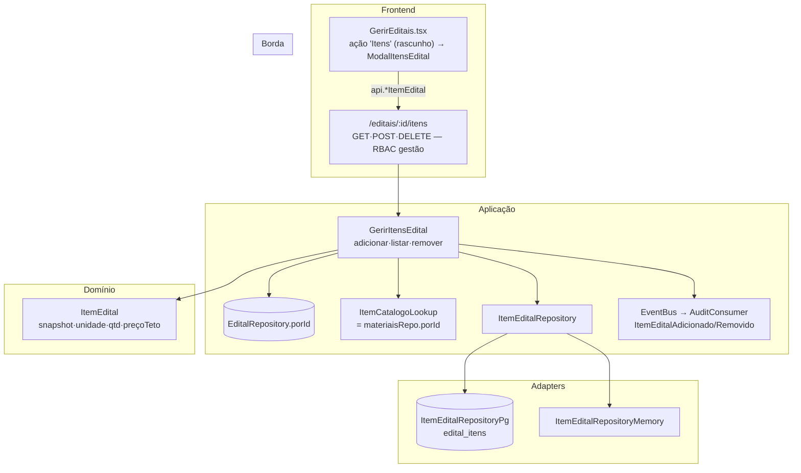

# Registro Técnico — Itens do Edital a partir do Catálogo (sem lotes)

- **Data:** 2026-07-24
- **Demanda:** "no cadastro de editais deve ser possível cadastrar os itens do edital, a partir do catálogo de bens e serviços, sem lotes; use como modelo `../comprac_api`"
- **Branch:** `feature/edital-itens-catalogo`
- **Log do prompt:** [`docs/prompts/2026-07-24_001_itens-do-edital-catalogo-sem-lotes.md`](../prompts/2026-07-24_001_itens-do-edital-catalogo-sem-lotes.md)
- **Gates:** backend **626** testes · frontend **185** testes (lint + typecheck + test via `docker compose --profile test`)

---

## 1. Escopo entregue x direção-alvo

O solicitante decidiu (AskUserQuestion): **(1)** o item do edital **tem preço-teto**; **(2)** "credenciamento e distribuição devem ser realizados por item".

A resposta (2) descreve um **modelo-alvo maior** — tornar o item a unidade de credenciamento e do rateio do Motor (Épico 5, hoje **bloqueado** e operando sobre o agregado `quantitativos`). Reescrever credenciamento + Motor para operar por item é um épico à parte.

**Arbitragem do Tech Lead — entregue agora (o pedido literal):** o **cadastro dos itens do edital** (adicionar/listar/remover, a partir do catálogo, com unidade + quantidade + preço-teto), full-stack, durável, auditado, modelado como o **substrato** do credenciamento/distribuição por item. **Não** altera o Motor nem o `quantitativos` agregado. O per-item credenciamento/distribuição é o **incremento seguinte** (ver §7).

---

## 2. Modelo — adaptação da referência

`comprac_api` acopla itens a **lotes** (`lote_catalogo_item`) e integra cotação/mapa-de-preço/PCA. A adaptação:

| Referência (`comprac_api`) | Aqui | Por quê |
|---|---|---|
| Item pertence a um **lote** | Item acopla **direto ao edital** | Decisão explícita "sem lotes" |
| `precoTeto` por item | **Mantido** | Decisão do solicitante |
| `cotacaoItemId`/`mapaPrecoItemId`/`itemPcaId`/`precoOriginalMapa` | **Fora** | Integrações de cotação/PCA inexistentes no compraMais |
| Snapshot `nome`/`unidade`/`descrição` | **Mantido** | Item estável mesmo que o catálogo mude depois (regra da referência) |
| Itens editáveis em `rascunho`/`suspenso` | Só em **`rascunho`** | Ciclo do compraMais é rascunho→publicado→encerrado |

Regras de validação preservadas da referência (`adicionar-item-lote.use-case.ts`): edital existe e editável; item de catálogo existe e **ativo**; **unidade ∈ unidades** do item; **não repetir** o mesmo item de catálogo no edital.

---

## 3. Arquitetura

### Arquivos

**Novos (backend):** `editais/domain/item-edital.ts`, `editais/application/gerir-itens-edital.ts`, `editais/adapters/item-edital-repository-{memory,pg}.ts`, `editais/adapters/itens-edital-controller.ts`, `migrations/0028_init_edital_itens.sql`, testes unit + integração.

**Alterados (backend):** `editais/domain/eventos.ts` (2 eventos), `server.ts` (wiring `pool ? pg : memory` + eventos na trilha).

**Frontend:** `GerirEditais.tsx` (ação "Itens" + `ModalItensEdital`; abre após criar), `lib/api.ts` (3 bindings + `ItemEditalView`), `design-system/components/Campo.tsx` (aceita `className`), `i18n/{pt-BR,en,es}.json` (bloco `gerirEditais.itens.*`), teste de componente.

---

## 4. Decisões e motivações

| # | Decisão | Motivação |
|---|---|---|
| D1 | Item acopla ao edital, sem lote | Pedido explícito |
| D2 | Preço-teto `numeric(15,2)`, > 0; domínio arredonda a 2 casas | Montante em reais; evita ruído de ponto flutuante |
| D3 | Snapshot de nome/descrição na inclusão | Item estável mesmo que o catálogo mude/inative depois (regra da referência) |
| D4 | Itens só em `rascunho` | Uma vez publicado, o edital congela (coerente com a completude para publicar) |
| D5 | `numero` sequencial por edital = `MAX(numero)+1` | Monotônico; não reusa após remoção (auditável) |
| D6 | Lookup do catálogo = o próprio `materiaisRepo` | `MaterialServico` satisfaz `ItemCatalogoLookup` estruturalmente; sem porta nova |
| D7 | `quantitativos`/Motor **intactos** | Épico 5 bloqueado; entrega isolada e reversível |
| D8 | Publicar **não** exige itens (ainda) | Mantém aditivo; editais atuais sem itens seguem publicáveis |

---

## 5. RN013 — guarda de transparência

Preço-teto é montante. **RN013** manda o portal público expor só agregados não-identificáveis. Verificado live: `GET /transparencia` devolve apenas `editaisVigentes`, `secretarias`, `segmentos` — **não toca** `edital_itens` nem preços. As rotas de itens são todas RBAC de gestão (nunca públicas). Uma nota na UI reforça que o preço-teto é uso interno.

---

## 6. Validação

**Gate container:** backend **626**, frontend **185**.

**Ciclo TDD:** testes de domínio (`item-edital.spec.ts`, 5 casos) e de rota (`itens-edital-rotas.spec.ts`, 11 casos) escritos antes; um ajuste de asserção no teste de componente (lista em `isLoading` → `findByTestId`).

**Validado live contra Postgres real (`--profile dev`, mock):**

| # | Cenário | Resultado |
|---|---|---|
| 1 | Migração 0028 aplicada (tabela + FK + índices + unique) | ✅ |
| 2 | SMGA adiciona item → **201** com `numero: 1`; 2º item → `numero: 2` | ✅ |
| 3 | Fornecedor adiciona → **403** | ✅ |
| 4 | Unidade fora das unidades do item → **422 UnidadeIndisponivel** | ✅ |
| 5 | Mesmo item de catálogo 2× → **409 ItemDuplicado** | ✅ |
| 6 | Preço-teto 0 (item novo) → **422 PrecoInvalido** | ✅ |
| 7 | Remover item → **200**; lista atualiza | ✅ |
| 8 | Adicionar após **publicar** → **409 EditalNaoEditavel** | ✅ |
| 9 | **RN013:** `/transparencia` não expõe itens/preços | ✅ |
| 10 | Trilha AD-18: `ItemEditalAdicionado ×2`, `ItemEditalRemovido ×1` | ✅ |
| 11 | **Durabilidade:** item sobrevive ao restart (nome/unidade/qtd/preço preservados) | ✅ |

**Evidência visual:** modal de itens no cadastro de editais (dropdown do catálogo · unidade restrita · quantidade · preço-teto · tabela Nº/Item/Unid./Qtd./Preço-teto/Ações com preços em reais).

---

## 7. Backlog remanescente (inclui a direção-alvo do solicitante)

1. **Credenciamento por item** — o fornecedor declara capacidade por item (hoje: uma capacidade por edital). Redesenho do fluxo de credenciamento.
2. **Distribuição por item** — o Motor (Épico 5, **bloqueado**) aloca a quantidade de **cada item** entre os credenciados naquele item. Requer rewiring do Motor e reconciliar `quantitativos` (agregado hoje) com `sum(item.quantidade)`.
3. **Publicar exigir ≥1 item** — quando o edital passar a ser item-cêntrico, faz sentido barrar publicação sem itens.
4. **Editar quantidade/preço de um item** (hoje: adicionar/remover). Baixo esforço.
5. **E2E Cypress** dos itens (QA/CI).

## 8. Rollback

`git revert` do commit. Migração `0028` é **aditiva** (tabela nova, sem tocar em `editais`); deixá-la aplicada é inócuo. Remoção física: `DROP TABLE edital_itens;`.
