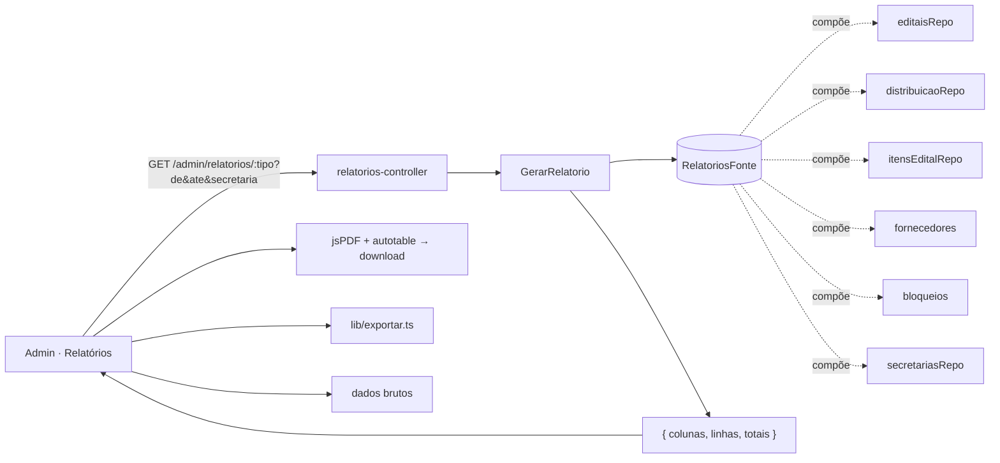

# Registro técnico — Módulo de Relatórios (perfil SMGA)

**Data:** 2026-07-25 · **Domínio:** relatórios gerenciais dos processos · **Perfis:** `smga`, `administrador`, `cpl`

## 1. Objetivo (Business Analyst)

Dar à Secretaria de Gestão (SMGA) uma central de **relatórios dos processos** com:

- geração de **PDF** (download direto) com cabeçalho **logo + título + data de emissão + período dos dados**;
- **exportação de dados brutos** em **JSON** e **CSV**;
- **filtros** por **data** (período) e por **secretaria**;
- **≥ 6 relatórios** relevantes.

## 2. Arquitetura (Tech Lead)

Regra do projeto: **backend responde em inglês/estruturado; localização e apresentação são do frontend**
(PRJ-DEC-12). Logo, o backend entrega **dado estruturado** e o frontend faz PDF/CSV/JSON e a tradução.

- **Módulo hexagonal `relatorios`** (read-only):
  - `application/relatorios.ts` — porta `RelatoriosFonte`, tipos de linha, e o caso de uso `GerarRelatorio`
    que aplica **período** (por `registerDate`/`geradoEm`) e **secretaria** e projeta `{ colunas, linhas, totais }`.
  - `adapters/relatorios-controller.ts` — `registrarRotasRelatorios`; RBAC `exigirPapel(['cpl','administrador','smga'])`;
    `GET /admin/relatorios/tipos` (catálogo) e `GET /admin/relatorios/:tipo`. **Sem response schema** (evita o
    field-stripping do fast-json-stringify sobre `linhas` dinâmicas — mesmo cuidado do export de auditoria).
- **Wiring** (`server.ts`): objeto `relatoriosFonte` compõe os repositórios já instanciados (padrão do `paineisFonte`).
  **Sem migração** — reusa `editaisRepo`, `itensEditalRepo`, `distribuicaoRepo`, `fornecedores`, `bloqueios`, `secretariasRepo`.
- **Tela `relatorios`** adicionada ao catálogo (`permissoes/domain/tela-admin.ts` + frontend `telas-admin.tsx`),
  visível por padrão a `smga` e `administrador`.
- **Frontend**: `pages/admin/Relatorios.tsx` (seletor, filtros, prévia, botões PDF/CSV/JSON) + `lib/relatorios.ts`
  (formatação localizada, PDF via `jspdf`/`jspdf-autotable` com o logo `design-system/image/logoCompraMais.png`,
  CSV/JSON via `lib/exportar.ts`). Rota `/admin/relatorios` sob `exigirTelaAdmin('relatorios')`.

## 3. Os 6 relatórios

| # | Tipo (`:tipo`) | Conteúdo | Data (filtro) | Secretaria |
|---|---|---|---|---|
| 1 | `editais` | Editais: nº, objeto, secretaria, situação, itens, valor estimado (Σ preço×qtd), vigência, criação | `registerDate` | ✅ |
| 2 | `distribuicoes` | Distribuições vigentes: demanda, distribuído, déficit, fornecedores, valor distribuído (Σ cota×preço) | `geradoEm` | ✅ |
| 3 | `cotas` | Rateio por fornecedor: CNPJ, edital, secretaria, cota, valor | `geradoEm` | ✅ |
| 4 | `credenciados` | Fornecedores credenciados/aptos: razão social, CNPJ, porte, situação, status, CNAE | `registerDate` | — |
| 5 | `participacao` | Fornecedores ativos por porte: nº, %, e % MEI | `registerDate` | — |
| 6 | `bloqueios` | Bloqueios ativos: fornecedor, tipo, situação, término, motivo | `registerDate` | — |

## 4. Validação (QA Expert)

- **Gates em container (DEC-STR-34):** backend **717 testes** (+15: unit `relatorios.spec` + integração `relatorios.spec`);
  frontend **241 testes** (+7: `lib/relatorios.test`). Lint + typecheck limpos.
- **Execução real contra Postgres** (stack dev + seed): login `smga@compramais.local` → `GET /permissoes/telas/me`
  inclui `relatorios`; os **6 endpoints** respondem 200 com dados semeados e a estrutura `{ colunas, linhas, totais }`.
  RBAC: papel sem acesso → 403; anônimo → 401; tipo inválido → 400.
- **Build de produção do frontend** (`vite build`) com as novas libs: OK (apenas aviso de chunk-size).

## 5. Riscos e follow-ups

- Distribuições **agregadas legadas** (sem matriz por item) exibem `valorDistribuido`/`cotas` = 0 — consistente
  com o `investimentoDistribuido` do paineis. Quando a distribuição por item (0033) for a regra, os valores populam.
- `jspdf` engorda o bundle do admin; se preciso, migrar a página para import dinâmico (code-split) — follow-up.
- Relatórios adicionais e agendamento/entrega por e-mail ficam fora deste escopo.
