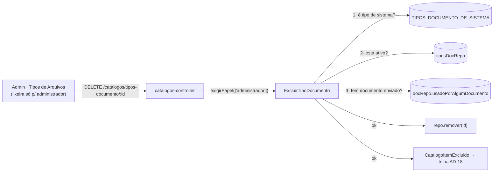

# Registro técnico — Exclusão de tipos de arquivo (RF022 / UC020)

**Data:** 2026-07-26 · **Domínio:** catálogo de Tipos de Documento · **Perfil da nova ação:** `administrador`
**Branch:** `feature/excluir-tipo-arquivo` · **Prompt:** [`docs/prompts/2026-07-26_003_excluir-tipos-de-arquivo.md`](../prompts/2026-07-26_003_excluir-tipos-de-arquivo.md)

## 1. Demanda

> Disponibilizar a opção de excluir tipos de arquivo cadastrados. A exclusão deve ser restrita ao perfil
> de administrador, pois atualmente o sistema permite apenas editar, inativar ou reativar o registro.

## 2. Estado verificado antes da mudança

| Item | Situação |
|---|---|
| Ações na tela `/admin/tipos-arquivos` | Editar e alternar situação (inativar/reativar) — nada mais |
| Rotas do catálogo | `GET`, `POST`, `PATCH`, `POST …/inativar`, `POST …/reativar` |
| Exclusão física existente | Só em Materiais e Serviços (`DELETE /catalogos/materiais-servicos/:id`) |
| Perfis de escrita em `tipos-documento` | `administrador` **e** `smga` |
| Porta `remover(id)` no repositório de catálogo | **Já existia** (pg e memory) → sem migração |

Confirmado, portanto, o diagnóstico do solicitante. A decisão adotada foi a **exclusão física com guardas**,
espelhando `ExcluirMaterialServico`, com um gate de perfil mais estreito.

## 3. Arquitetura



### Guardas, em ordem

1. **Tipo de sistema** (`TIPOS_DOCUMENTO_DE_SISTEMA`) → `409 TipoDocumentoDeSistema`.
   Checado **primeiro** de propósito: é a única condição terminal. Avisar antes evita que o Administrador
   inative a *Foto do Responsável* tentando excluí-la e, de quebra, derrube a prova de vida (UC007), cujo
   enrollment resolve o tipo **pelo nome** (`TIPO_DOC_FOTO_RESPONSAVEL`).
2. **Item ainda ativo** → `409 TipoDocumentoAtivoNaoExcluivel`. A exclusão não atalha a inativação.
3. **Documento já enviado com aquele tipo** → `409 TipoDocumentoEmUso`.
   `documentos.tipo` é **texto, sem FK** (migração 0018): apagar o tipo não quebraria o banco, mas deixaria
   o histórico do fornecedor apontando para um tipo inexistente e faria o reenvio falhar com
   `TipoDocumentoDesconhecido`. A checagem é por nome, case-insensitive, coerente com o índice `lower(nome)`.
4. Passou nas três → `repo.remover(id)` + `CatalogoItemExcluido` na trilha append-only (AD-18).

Item inexistente → `404 TipoDocumentoNaoEncontrado`.

### Gate de perfil

`DELETE /catalogos/tipos-documento/:id` usa `PERFIS_ESCRITA_PADRAO` (`['administrador']`), e **não** o
`ADMIN_E_SMGA` das demais escritas do catálogo. A Secretaria continua criando, editando e inativando; não
exclui. No frontend a lixeira só é renderizada para `papel === 'administrador'` — esconder uma ação que
sempre resultaria em 403 é decisão de UX, não de segurança: o gate real é o do servidor.

## 4. Arquivos alterados

### Backend

| Arquivo | Mudança |
|---|---|
| `src/catalogos/application/excluir-tipo-documento.ts` | **Novo** — caso de uso, porta `UsoEmDocumentos` e os 4 erros |
| `src/catalogos/domain/tipos-documento-baseline.ts` | `TIPOS_DOCUMENTO_DE_SISTEMA` (lista dos tipos não excluíveis) |
| `src/catalogos/adapters/catalogos-controller.ts` | Rota `DELETE`, dependência `excluirTipoDocumento`, mapeamento 404/409 |
| `src/credenciamento/application/gerir-documentos.ts` | `DocumentoRepository.usadoPorAlgumDocumento(tipo)` |
| `src/credenciamento/adapters/documentos-pg.ts` | Implementação SQL (`EXISTS` via `lower(tipo) = lower($1) LIMIT 1`) |
| `src/credenciamento/adapters/documentos-memory.ts` | Implementação equivalente em memória |
| `src/server.ts` | `docRepo` hoisted para junto dos catálogos + wiring de `ExcluirTipoDocumento` |

Sem migração: `remover(id)` já existia na porta `CatalogoRepository` e nos dois adaptadores.

### Frontend

| Arquivo | Mudança |
|---|---|
| `src/lib/api.ts` | `tipoArquivoExcluir(id)` |
| `src/pages/admin/TiposArquivos.tsx` | Lixeira por linha (só administrador), `window.confirm`, toast de sucesso |
| `src/i18n/locales/{pt-BR,en,es}.json` | `acao.excluir`, `confirmarExcluir`, `excluido` + 4 códigos em `erros.*` |

O erro **não** é tratado localmente: o `MutationCache` global (`lib/query.ts`) já converte a resposta em
toast traduzindo o `codigo`. Tratar nos dois lugares exigiria `meta: { semToast: true }`, senão o usuário
veria dois toasts.

## 5. Evidências (execução em container — DEC-STR-34)

```
docker compose --profile test run --rm backend-test     → lint + typecheck + 738 passed | 16 skipped (754)
docker compose --profile test run --rm frontend-test    → lint + typecheck + 247 passed (46 arquivos)

# gate ampliado, com o Postgres do stack (habilita as suítes opt-in):
docker compose --profile test run --rm -e POSTGRES_HOST=db -e POSTGRES_PASSWORD=changeme backend-test \
  sh -c "npm run lint && npm run typecheck && npx vitest run"
                                                        → 107 arquivos | 755 passed | 0 skipped
```

Recorte dos testes novos:

```
tests/integration/excluir-tipo-documento.spec.ts   8 tests   ✓
tests/integration/catalogos-rotas.spec.ts         17 tests   ✓   (6 novos: 401, 403 smga, 409 ativo,
                                                                   204 + sumiço da lista, 409 sistema,
                                                                   404, 409 em uso)
src/pages/admin/TiposArquivos.test.tsx            12 tests   ✓   (4 novos: lixeira p/ admin, ausente p/
                                                                   smga, confirma+chama, cancela)
```

Cobertura adicional:

- `tests/integration/documentos-pg.spec.ts` — `usadoPorAlgumDocumento` contra **Postgres real**
  (case-insensitive + trim). Suíte opt-in por `POSTGRES_HOST`; pulada no gate padrão, executada aqui.
  **Correção de vizinho:** o caso "o storage guarda o conteúdo CIFRADO" já falhava em `develop`
  (`TypeError: Cannot read properties of undefined (reading 'existeAtivo')`) — construía `GerirDocumentos`
  sem a porta de catálogo, obrigatória desde que o upload passou a validar o tipo. Como a suíte é opt-in,
  o CI nunca a executou e a quebra passou despercebida. Corrigido com um stub `{ existeAtivo: async () => true }`.
- `tests/integration/excluir-tipo-documento.spec.ts` amarra `TIPOS_DOCUMENTO_DE_SISTEMA` a
  `TIPO_DOC_FOTO_RESPONSAVEL` — trava contra drift entre catálogo e biometria.
- `cypress/e2e/tipos-arquivos-excluir.cy.ts` — **novo**, E2E do fluxo completo (criar → recusa em ativo →
  inativar → excluir; recusa do tipo de sistema; ausência da lixeira para `smga`). **Execução real pendente
  do QA Expert** com o stack no ar (`docker compose --profile dev`) — o Cypress não roda no profile `test`.

## 6. Riscos e pontos de atenção

| Risco | Tratamento |
|---|---|
| Excluir tipo usado pela prova de vida | Guarda `TIPOS_DOCUMENTO_DE_SISTEMA`, checada antes de tudo, com teste anti-drift |
| Histórico órfão em `documentos.tipo` | Guarda `TipoDocumentoEmUso` — a exclusão é bloqueada, restando inativar |
| **Ressurreição por seed** | Excluir um dos 9 tipos do `TIPOS_DOCUMENTO_BASELINE` funciona, mas o próximo `npm run seed:prod` o recria (`ON CONFLICT DO NOTHING`). Comportamento **conhecido e aceito**: o seed é operação manual de provisionamento, não roda no boot. Tipos criados pelo Administrador não são afetados. |
| Ação irreversível por clique acidental | `window.confirm` nomeando o tipo + gate de perfil + exigência de inativar antes |

**Achado adjacente (não corrigido, fora do escopo):** em `pages/admin/ManterCatalogos.tsx` a exclusão de
Materiais e Serviços trata o erro localmente **sem** `meta: { semToast: true }`, o que produz **dois toasts**
para a mesma falha. Não foi alterado por estar fora do pedido; fica registrado como dívida de 1 linha.

## 7. Rollback

Reverter o commit. Não há migração nem alteração de schema, e nenhum dado preexistente é transformado —
a única mudança de estado possível é a remoção de linhas de `tipos_documento` deliberadamente feita por um
Administrador (registrada na trilha de auditoria, mas **não reversível** pelo rollback do código).

## 8. Rastreabilidade

- Requisito: **RF022** (tipos de documento parametrizáveis) · **UC020** (manter catálogos) · **RN015**
  (inativação lógica como padrão) · **AD-18** (trilha append-only) · **AD-20** (identidade pelo JWT).
- Precedente reusado: `ExcluirMaterialServico` + `DELETE /catalogos/materiais-servicos/:id`.
- Decisão registrada em `.github/agents/memoria/MEMORIA-PROJETO.md` (**PRJ-DEC-18**).
- Manual do Administrador: `spec/manuais/manual-administrador.md` §19 ("Inativar ou excluir um tipo").
