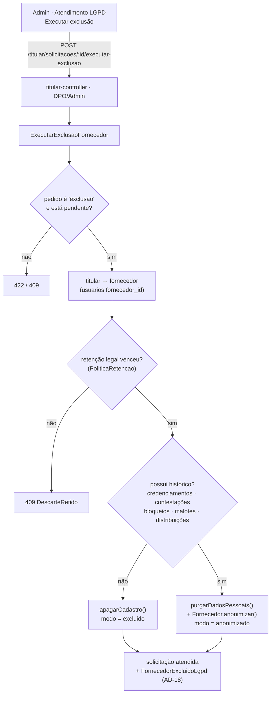

# Registro técnico — Exclusão de fornecedor para atendimento LGPD (UC017 / art. 18, V)

**Data:** 2026-07-26 · **Domínio:** direitos do titular + cadastro de fornecedor
**Branch:** `feature/exclusao-fornecedor-lgpd` · **Prompt:** [`docs/prompts/2026-07-26_007_exclusao-fornecedor-lgpd.md`](../prompts/2026-07-26_007_exclusao-fornecedor-lgpd.md)

## 1. Demanda e a tensão que ela carrega

> Disponibilizar uma opção para exclusão do cadastro do fornecedor, especialmente para atendimento de
> solicitações relacionadas à LGPD (…) evitando a perda de informações relacionadas a editais, documentos
> e participações anteriores.

Eliminar e preservar ao mesmo tempo não é contradição: é a definição de **anonimização**. Elimina-se o
dado pessoal; preserva-se o registro do ato administrativo.

## 2. Estado antes da mudança

A fila de Atendimento LGPD **registrava** a decisão e **não eliminava nada**:
`GerirDireitosTitular.avaliarDescarte` conferia o prazo de retenção e marcava a solicitação como atendida
com um texto. Existia o processo; faltava a execução.

## 3. Decisões (do solicitante)

| Questão | Decisão |
|---|---|
| Modelo | **Híbrido**: sem histórico de participação → apaga o cadastro; com histórico → anonimiza |
| CNPJ e razão social | **Preservados** — dados de pessoa jurídica que integram o ato administrativo publicado |
| Gatilho | **Só pela fila LGPD**, a partir de uma solicitação `exclusao` pendente. Não há exclusão sem pedido formal |

Decisões do Tech Lead, por já estarem formalizadas: reusar a `PoliticaRetencao` existente como guarda
(LGPD art. 16, I) e **nunca** tocar a tabela `auditoria` (AD-18).

## 4. Arquitetura



### O que cada desfecho faz

| | `excluido` (sem histórico) | `anonimizado` (com histórico) |
|---|---|---|
| Linha `fornecedores` | apagada | mantida, `anonimizado_em` preenchida |
| CNPJ / razão social | vão junto | **preservados** |
| `contato` (telefone, endereço, nome fantasia) | vai junto | **zerado** |
| `documentos` (linha) | apagada | **mantida** — a covalidação segue auditável |
| `documentos_conteudo` (blob com PII de sócios) | apagado | **apagado** |
| `fornecedor_biometria` (dado sensível, art. 11) | apagada | **apagada** |
| `usuarios`, `contas_acesso`, `consentimentos`, `notificacoes` | apagados | **apagados** |
| `credenciamentos`, `distribuicoes`, `contestacoes`, `bloqueios`, `malotes` | (não existem) | **intactos** |
| `auditoria` | **intacta** | **intacta** |

### Por que "histórico" exclui documentos

Documento é **dado pessoal**, não registro de participação. Um fornecedor que enviou certidões e nunca se
credenciou pode ter o cadastro apagado por completo — não há ato administrativo a preservar. Já quem
participou mantém a linha do documento (o metadado prova que a certidão foi aprovada em tal data) sem o
arquivo.

### Trilha de auditoria

O payload de `FornecedorExcluidoLgpd` é **quantitativo**: registra que N documentos e M credenciais foram
eliminados, nunca o conteúdo. Gravar o dado pessoal numa trilha que por definição nunca é apagada (AD-18)
anularia a própria eliminação. Há teste afirmando isso.

## 5. Arquivos

### Backend

| Arquivo | Mudança |
|---|---|
| `migrations/0039_fornecedores_anonimizacao.sql` | **Nova** — `anonimizado_em` + índice parcial |
| `src/catalogo/domain/fornecedor.ts` | `anonimizar()`, getters, `FornecedorAnonimizado`; `editarContato` bloqueado após anonimizar |
| `src/catalogo/adapters/fornecedor-repository-pg.ts` | persiste/reconstrói `anonimizado_em` |
| `src/titular/application/executar-exclusao-fornecedor.ts` | **Novo** — caso de uso + 3 portas locais + erros |
| `src/titular/domain/eventos.ts` | `FornecedorExcluidoLgpd` (payload quantitativo) |
| `src/titular/adapters/purga-fornecedor-pg.ts` | **Novo** — purga em **uma transação**, histórico, diretório |
| `src/titular/adapters/purga-fornecedor-memory.ts` | **Novo** — espelho para o modo sem banco |
| `src/titular/adapters/titular-controller.ts` | rota `POST …/executar-exclusao` (DPO/Admin) |
| `src/server.ts` | composição das portas a partir dos repositórios existentes |
| memória: `fornecedor-repository-memory`, `conta-repository`, `usuario-repository`, `documentos-memory`, `consentimento-repository-memory`, `biometria-repository-memory` | `removerDoFornecedor` / `remover` |

**Assimetria proposital entre adaptadores:** no Postgres a purga é uma transação de SQL; em memória, a
composição de um `removerDoFornecedor` por repositório. Cada mundo usa o mecanismo que garante
atomicidade nele.

### Frontend

| Arquivo | Mudança |
|---|---|
| `src/pages/admin/AtendimentoLgpd.tsx` | botão "Executar exclusão" (só em pedido `exclusao`), confirmação, feedback por desfecho |
| `src/lib/api.ts` | `executarExclusaoLgpd(id)` |
| `src/i18n/locales/{pt-BR,en,es}.json` | `adminLgpd.excluir`, `.excluirAjuda`, `.confirmarExcluir`, `feedback.excluido`, `feedback.anonimizado` |

## 6. Evidências (container — DEC-STR-34)

```
docker compose --profile test run --rm backend-test   → lint + typecheck + 760 passed | 17 skipped (777)
docker compose --profile test run --rm frontend-test  → lint + typecheck + 256 passed (46 arquivos)
```

**18 casos novos:**

| Suíte | Casos |
|---|---|
| `executar-exclusao-fornecedor.spec.ts` (9) | apaga sem histórico · anonimiza com histórico preservando CNPJ/razão social · anonimizado não volta a ser editável · retenção bloqueia e **nada** é apagado · pedido de acesso não dispara · titular sem fornecedor · prestação de contas no resultado · **não executa duas vezes nem purga de novo** · trilha sem dado pessoal |
| `titular-rotas.spec.ts` (4, HTTP) | 403 sem DPO · 422 em pedido de outro tipo · 409 retenção · 404 titular sem fornecedor |
| `AtendimentoLgpd.test.tsx` (5) | botão só em `exclusao` · confirma e informa histórico preservado · cancelar não apaga · feedback do modo `excluido` · 409 vira mensagem de retenção |

**Defeito encontrado e corrigido durante o TDD:** a primeira versão só descobria que o pedido já havia
sido resolvido no `atender()` do agregado — **depois** de purgar. Uma segunda chamada teria rodado a purga
de novo. A checagem de estado subiu para antes de qualquer ação destrutiva (`SolicitacaoJaResolvida`), e
há teste afirmando que a segunda tentativa não purga.

## 7. Limitações conhecidas

| Item | Situação |
|---|---|
| **Caminho feliz via HTTP** | Não testável ponta a ponta: a retenção mínima é 730 dias e não há como criar um fornecedor "antigo" pela API. O desfecho é coberto no caso de uso, com relógio injetado. |
| **Purga pg contra Postgres real** | O SQL da transação **não** tem teste de integração com banco (as suítes pg são opt-in por `POSTGRES_HOST`). **Recomendo ao QA executar o fluxo em ambiente com banco antes do merge.** |
| **`distribuicoes`** | O fornecedor vive dentro do jsonb de alocações; a sonda usa `LIKE` sobre o texto do jsonb. Funciona e é conservadora (falso-positivo levaria a anonimizar em vez de apagar — o lado seguro), mas é a consulta mais frágil do conjunto. |
| **Sem desfazer** | A operação é irreversível por natureza. A confirmação na tela e o gate de perfil são as únicas barreiras. |

## 8. Rollback

Reverter o commit desfaz o **código**. Não desfaz **dados já eliminados** — não há como: é uma exclusão.
A migração 0039 é aditiva e pode permanecer sem efeito colateral.

## 9. Rastreabilidade

- **LGPD art. 18, V** (eliminação) · **art. 16, I** (guarda por obrigação legal) · **art. 11** (dado
  sensível: biometria) · **UC017** · **FR-004/FR-008** · **RN009** · **AD-18** · **AD-28** · **AD-33**.
- Decisão registrada em `.github/agents/memoria/MEMORIA-PROJETO.md` (**PRJ-DEC-20**).
- Manual do Administrador: `spec/manuais/manual-administrador.md` §14 (Atendimento LGPD).
