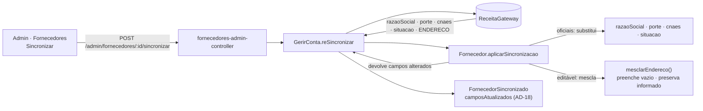

# Registro técnico — Endereço na sincronização com a Receita (RF018 / RF019 / UC018)

**Data:** 2026-07-26 · **Tipo:** correção de defeito · **Domínio:** cadastro de fornecedor
**Branch:** `bugfix/sincronizacao-endereco-receita` · **Prompt:** [`docs/prompts/2026-07-26_006_sincronizacao-endereco-receita.md`](../prompts/2026-07-26_006_sincronizacao-endereco-receita.md)

## 1. Defeito relatado

> Ao cadastrar um fornecedor manualmente e posteriormente realizar a sincronização com a Receita Federal,
> o sistema está trazendo apenas os dados básicos da empresa. Os dados de endereço — logradouro, número,
> bairro, município, estado e CEP — não estão sendo preenchidos.

## 2. Causa raiz

O endereço **chegava** da Receita e era **descartado** na camada de aplicação. Rastreio:

| Etapa | Antes |
|---|---|
| `DadosCnpj` (contrato do gateway) | já declarava `endereco?: EnderecoEmpresa` |
| `receita-brasilapi.ts` | **mapeava** o endereço (`mapearEndereco`) |
| `receita-mock.ts` | **tinha** endereço na semente |
| `CadastrarFornecedor` (autocadastro público) | **usava** o endereço oficial |
| **`GerirConta.reSincronizar`** | **descartava** — o payload passado ao agregado tinha só 4 campos |
| `CriarFornecedorAdmin` | sem campo de endereço → fornecedor manual nascia sem nenhum |

```ts
// ANTES — gerir-conta.ts
f.aplicarSincronizacao(
  { razaoSocial: …, porte: …, cnaes: …, situacao: … },  // r.valor.endereco ignorado
  r.timestamp,
);
```

Por isso o defeito só aparecia no **cadastro manual**: no autocadastro o endereço já vinha na criação, e
a sincronização nunca precisou trazê-lo.

## 3. Decisão de comportamento (do solicitante)

O endereço **não é dado oficial read-only**: vive em `contato`, junto de nome fantasia e telefone
(RN009), e o da Receita é o **fiscal**, que pode divergir do de correspondência. Sobrescrever a cada
sincronização seria perda silenciosa de dado.

**Política adotada — preencher campo a campo o que estiver vazio, preservar o que já foi informado.**
É a mesma regra que o autocadastro já aplicava ("o informado pelo titular tem precedência sobre o oficial").

| Campo atual | Receita | Resultado |
|---|---|---|
| vazio | preenchido | recebe o oficial |
| preenchido | preenchido | **preservado** |
| preenchido | vazio | preservado |
| `latitude`/`longitude` | (não fornecidos) | preservados |

## 4. Arquitetura



`aplicarSincronizacao` passou a **devolver os campos efetivamente atualizados**, para a trilha não
afirmar que mexeu no endereço quando não mexeu — `'endereco'` só entra em `camposAtualizados` quando a
mescla produziu alguma mudança.

## 5. Arquivos alterados

### Backend

| Arquivo | Mudança |
|---|---|
| `src/catalogo/domain/fornecedor.ts` | `aplicarSincronizacao` recebe `endereco?` e retorna `string[]`; nova `mesclarEndereco` |
| `src/catalogo/application/gerir-conta.ts` | repassa `r.valor.endereco`; audita os campos devolvidos pelo agregado |
| `src/catalogo/application/criar-fornecedor-admin.ts` | aceita `endereco`; `normalizarEndereco` (trim, CEP só dígitos, descarta objeto em branco) |
| `src/catalogo/adapters/fornecedores-admin-controller.ts` | `POST /admin/fornecedores` lê `endereco` do body |
| `src/shared/acl/receita/receita-mock.ts` | 2ª empresa na semente (`44.555.666/0001-81`) |

**Sem migração.** `contato` já é persistido como snapshot JSON (AD-33) e `Endereco` já previa todos os campos.

Sobre o mock: com uma única entrada na semente, **todo** CNPJ cadastrado manualmente caía em
`indisponivel` e a sincronização nunca aplicava nada — o defeito ficava invisível em dev e não havia
como escrever o teste ponta a ponta.

### Frontend

| Arquivo | Mudança |
|---|---|
| `src/pages/admin/ModalFornecedor.tsx` | bloco "Endereço" no formulário de criação, com autofill por CEP |
| `src/lib/api.ts` | `fornecedorAdminCriar` aceita `endereco?: EnderecoView` |
| `src/i18n/locales/{pt-BR,en,es}.json` | `endereco.complemento`, `modal.enderecoTitulo`, `modal.enderecoAjuda` |

O autofill de CEP reusa `consultarCep` (mesmo endpoint do autocadastro) e **não sobrescreve** o que o
operador já digitou — espelha a regra da mescla no backend. O `endereco` só é enviado quando há algum
campo preenchido; o caso de uso descarta de novo, por via das dúvidas.

## 6. Evidências (container — DEC-STR-34)

```
docker compose --profile test run --rm backend-test   → lint + typecheck + 747 passed | 17 skipped (764)
docker compose --profile test run --rm frontend-test  → lint + typecheck + 251 passed (46 arquivos)
```

**14 casos novos:**

| Suíte | Casos |
|---|---|
| `gerir-conta.spec.ts` (6) | manual sem endereço recebe o completo · preenche só os vazios preservando o informado · endereço completo intocado · lat/long preservadas · Receita sem endereço não quebra · `'endereco'` na trilha só quando muda |
| `fornecedores-admin-rotas.spec.ts` (3, HTTP) | **cenário do relato ponta a ponta** (criar manual → detalhe sem endereço → sincronizar → detalhe com endereço) · POST aceita endereço e a sync não o sobrescreve · POST com endereço em branco não grava objeto vazio |
| `Fornecedores.test.tsx` (2) | envia endereço com CEP só em dígitos · endereço em branco não é enviado |

## 7. Riscos e pontos de atenção

| Risco | Tratamento |
|---|---|
| Sincronização apagar endereço de correspondência | Mescla por campo — nunca sobrescreve o preenchido |
| Endereço "vazio" (strings em branco) bloquear a mescla futura | `normalizarEndereco` descarta o objeto todo em branco na criação; o frontend também não o envia |
| Trilha de auditoria imprecisa | `camposAtualizados` passou a vir do agregado, refletindo o que mudou de fato |
| **Fornecedores manuais já existentes** | Não há backfill: eles recebem o endereço na **próxima** sincronização. Nenhum dado é migrado por este PR. |

## 8. Rollback

Reverter o commit. Sem migração e sem transformação de dados — endereços preenchidos por sincronizações
já executadas permanecem gravados (foram escritos em campo que já existia), o que é o comportamento
desejado mesmo em caso de reversão do código.

## 9. Rastreabilidade

- **RF018** (re-sincronização) · **RF019** (endereço estruturado geolocalizável) · **UC018** ·
  **RN009** (Receita read-only; contato editável) · **AD-18** (trilha append-only) · **AD-33** (snapshot).
- Decisão registrada em `.github/agents/memoria/MEMORIA-PROJETO.md` (**PRJ-DEC-19**).
- Manual do Administrador: `spec/manuais/manual-administrador.md` §12 (Fornecedores).
