# Compra Mais — Relatório de Entrega do Produto

**Projeto:** Compra Mais — Programa de Compras Municipalizadas
**Cliente/Contratante:** Prefeitura Municipal de Rio Branco (SMGA)
**Contrato:** Contrato 28 (1201073) — SEI **0107.004731/2026-31**
**Base legal:** Lei nº 14.133/2021 · Lei Municipal 2.027
**Documento:** Relatório de Entrega do Produto (funcionalidades e telas)
**Data:** 2026-07-06
**Fontes:** mockups ratificados [`spec/AI-UI-Design/painel-administrativo.html`](../../spec/AI-UI-Design/painel-administrativo.html) e [`spec/AI-UI-Design/portal-fornecedor.html`](../../spec/AI-UI-Design/portal-fornecedor.html); contrato [`spec/source/Contrato.pdf`](../../spec/source/Contrato.pdf); documentação canônica [`spec/docs/`](../../spec/docs/index.md) (PRD v2.5).

---

## 1. Objetivo

Este relatório consolida a **entrega do produto** Compra Mais, correlacionando os **módulos contratados** (Contrato 28) às **funcionalidades e telas** materializadas nos protótipos ratificados do **Painel Administrativo** e do **Portal do Fornecedor**, e registra a alocação de **996 UST para personalização dos módulos**. Serve como peça de conferência de escopo e de rastreabilidade contrato → produto.

> **Idioma e natureza.** Documento formal de governança em português do Brasil. Os protótipos são a **fonte visual ratificada**; a implementação real deriva deles e da documentação canônica (PRD v2.5, casos de uso, épicos, espinha de arquitetura).

## 2. Enquadramento contratual

O objeto contrata o fornecimento, a disponibilização de uso, a implantação e a **customização** de módulos do sistema de compras governamentais, além de um banco de serviços técnicos de TI medido em **UST**.

| Item | Objeto | Unid. | Qtd. | Valor unit. | Valor total |
|---|---|---|---|---|---|
| **1** | Módulos de **maior complexidade** (ver §2.1) | Unid. | 04 | R$ 455.000,00 | **R$ 1.820.000,00** |
| **2** | Módulos de **menor complexidade** (ver §2.2) | Unid. | 01 | R$ 453.900,00 | **R$ 453.900,00** |
| **3** | Serviços técnicos de TI (suporte, manutenção evolutiva, sustentação, implantação) | **UST** | 27.561 | R$ 181,50 | **R$ 5.002.321,50** |
| | | | | **VALOR TOTAL** | **R$ 7.276.221,50** |

**Vigência:** 12 (doze) meses a partir da assinatura, prorrogável sucessivamente até 10 (dez) anos (arts. 106 e 107 da Lei 14.133/2021).
**Obrigação de customização (cláusula 10.1.5):** *"Implantar e customizar a solução em estrita conformidade com as especificações."*

### 2.1 Módulos de maior complexidade (Item 1)

Demandas de Compras · **Cadastro de Fornecedores** · **Business Intelligence (BI) e Relatórios** · **Administração do Sistema** · Gestão de Editais · Integrações e Jobs (automações) · Gestão da Distribuição · Portal Governamental de Compras Integrado ao Sistema.

### 2.2 Módulos de menor complexidade (Item 2)

Consulta Pública / Portal de Transparência · App de Compras Governamentais.

## 3. Situação da entrega por módulo contratado

Legenda: 🟢 Entregue (telas/fluxos materializados no protótipo) · 🟡 Parcial · 🔴 Não materializado (pendente).

| Módulo contratado | Item | Situação | Onde se materializa |
|---|---|---|---|
| **Cadastro de Fornecedores** | 1 | 🟢 | Portal do Fornecedor (cadastro/credenciamento/conta) + Painel Admin (Gestão de Fornecedores) |
| **Administração do Sistema** | 1 | 🟢 | Painel Admin (grupo "Administração do Sistema") |
| **Gestão de Editais** | 1 | 🟢 | Painel Admin (Editais) + Vitrine do fornecedor |
| **Gestão da Distribuição** | 1 | 🟢 | Painel Admin (Distribuição Inteligente + Cadastro de Reserva) |
| Demandas de Compras | 1 | 🟢 | Editais + Credenciamento + Distribuição |
| Business Intelligence (BI) e Relatórios | 1 | 🟡 | Painel Admin (Dashboard + Portal da Transparência) + exportações |
| Integrações e Jobs (automações) | 1 | 🟡 | Simuladas no protótipo (Receita, PGM/SICAF, varredura diária) |
| Portal Governamental Integrado | 1 | 🟡 | Malote SEI + arquitetura de integração (backend) |
| Consulta Pública / Transparência | 2 | 🟢 | Portal da Transparência (BI público) |
| App de Compras Governamentais | 2 | 🔴 | Fora do escopo dos protótipos web atuais |

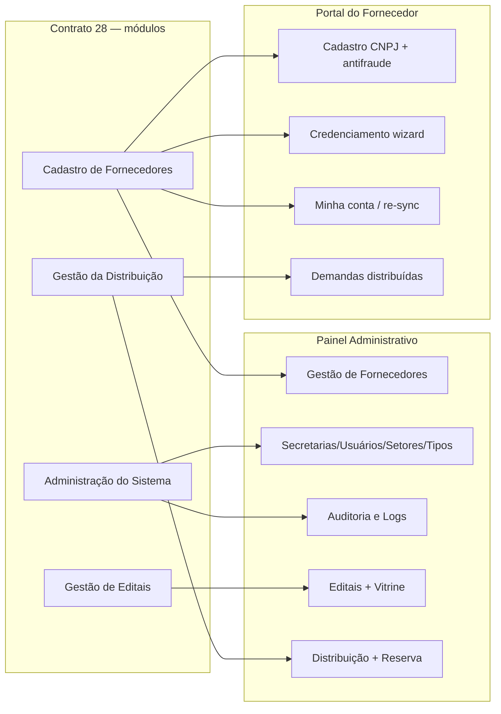
```mermaid
flowchart LR
  subgraph Contrato[Contrato 28 — módulos]
    CF[Cadastro de Fornecedores]
    ADM[Administração do Sistema]
    EDT[Gestão de Editais]
    DIST[Gestão da Distribuição]
  end
  subgraph Fornecedor[Portal do Fornecedor]
    F1[Cadastro CNPJ + antifraude]
    F2[Credenciamento wizard]
    F3[Minha conta / re-sync]
    F4[Demandas distribuídas]
  end
  subgraph Admin[Painel Administrativo]
    A1[Gestão de Fornecedores]
    A2[Secretarias/Usuários/Setores/Tipos]
    A3[Auditoria e Logs]
    A4[Editais + Vitrine]
    A5[Distribuição + Reserva]
  end
  CF --> F1 & F2 & F3 & A1
  ADM --> A2 & A3
  EDT --> A4
  DIST --> A5 & F4
```

### 3.1 Cadastro de Fornecedores — 🟢 Entregue

Materializado de ponta a ponta entre os dois protótipos. Rastreável a **RF001, RF018, RF019, RF024, RF026** · **RN009, RN016, RN018, RN019, RN020** · casos de uso **UC001, UC004, UC018, UC019, UC023**.

**Portal do Fornecedor:**
- **Cadastro por CNPJ** com **consulta à Receita Federal** e autopreenchimento somente leitura (Razão Social, Nome Fantasia, Porte, CNAE principal e secundários); **fallback manual** sinalizado para covalidação rigorosa quando a Receita está indisponível.
- **Filtro antifraude** na entrada: cruzamento **PGM (Dívida Ativa Municipal)** × **SICAF** — empresa idônea avança; com pendência, **acesso bloqueado** (CTAs "Consultar pendências", "Falar com a CPL").
- **Criação de conta** (e-mail + senha) iniciando no status **Cadastrado** (nomenclatura oficial `Cadastrado → Credenciado → Fornecedor`, AD-41).
- **Wizard de credenciamento** (5 etapas + sucesso): (1) declaração de **capacidade produtiva** (teto do rateio) com **Termo de Responsabilidade** (RF024); (2) documentos exigidos com **reaproveitamento automático**; (3) upload de pendentes (PDF ≤ 10 MB, comprimido para o SEI); (4) **Prova de vida/liveness** — etapa **opcional / Release 2** (biometria adiada, ratificada pelo cliente); (5) **Termo de Aceite / Declaração de Veracidade**. Conclui em **Pendente de Análise**.
- **Meus credenciamentos** (acompanhamento, retomada, **cancelamento/desistência**).
- **Minha conta**: dados oficiais da Receita (somente leitura), **re-sincronização do CNPJ** preservando campos editáveis, **endereço estruturado**, gestão do **procurador** (RN010), troca de senha autenticada.

**Painel Administrativo — Gestão de Fornecedores:** tabela (CNPJ, razão social, porte, CNAE, capacidade, status), ações Ver/Editar/**Bloquear** (soft-delete → Inativo preservando histórico), busca, filtros, ordenação e **exportação (Excel/PDF)**; **Credenciamento em Edital** (elegíveis por CNAE com selos PGM/SICAF/CNAE); **Análise Documental** (fila de covalidação, aprovar/reprovar com **justificativa obrigatória**, RN003).

**Prints — Cadastro de Fornecedores**

*Cadastro público: consulta do CNPJ na Receita, fallback manual e abas Entrar / Criar conta.*

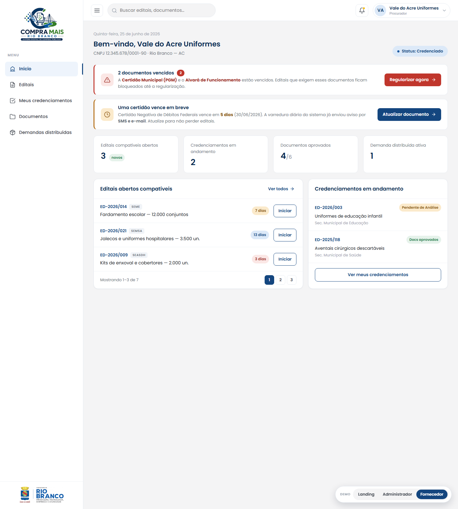
*Início do fornecedor: status Credenciado, alertas de vencimento e editais compatíveis.*

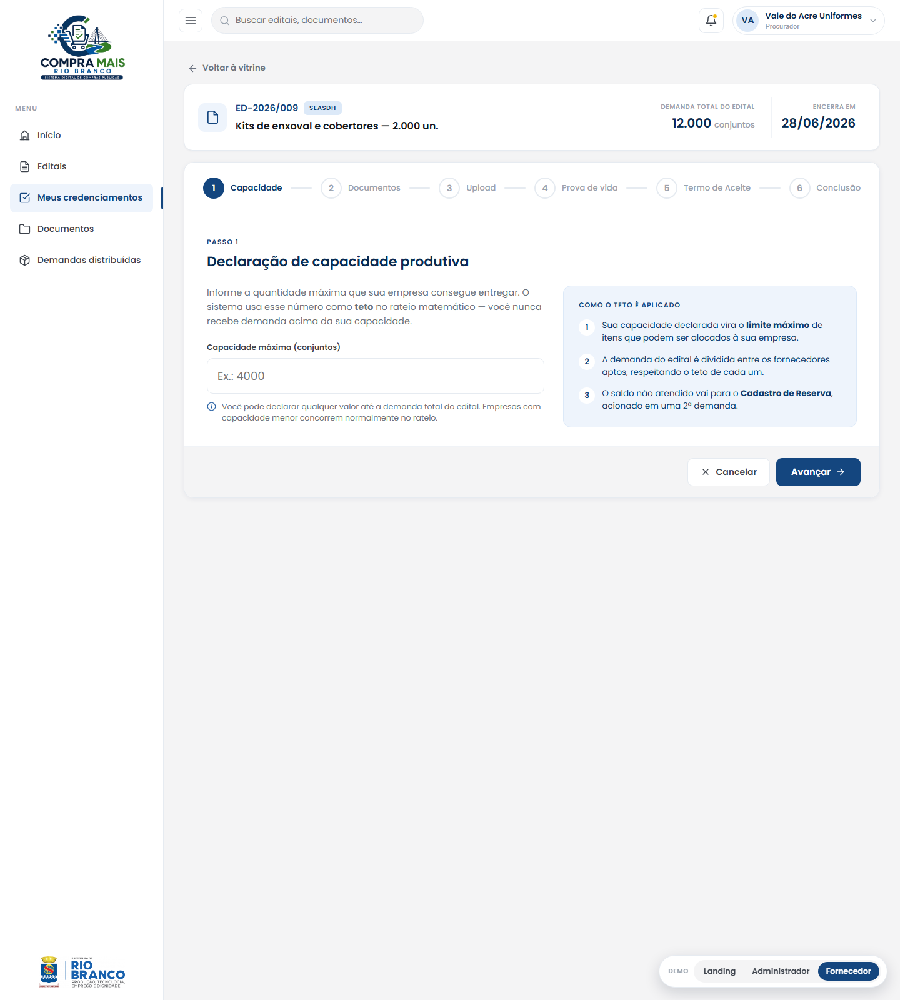
*Wizard: capacidade → documentos → upload → prova de vida (R2) → Termo de Aceite → conclusão.*

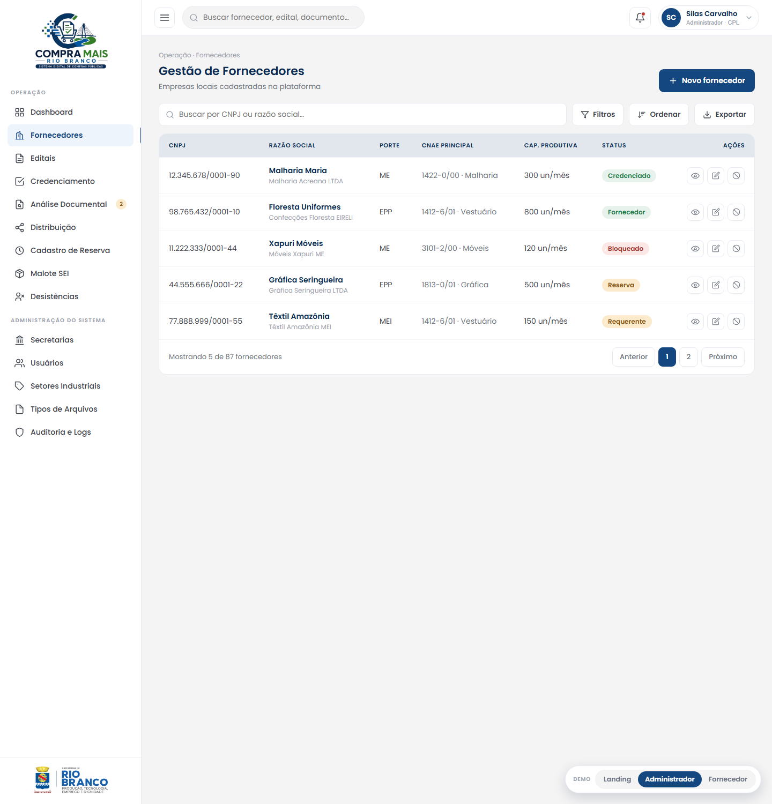
*Painel Admin: gestão de fornecedores (porte, CNAE, capacidade, status) com exportação.*

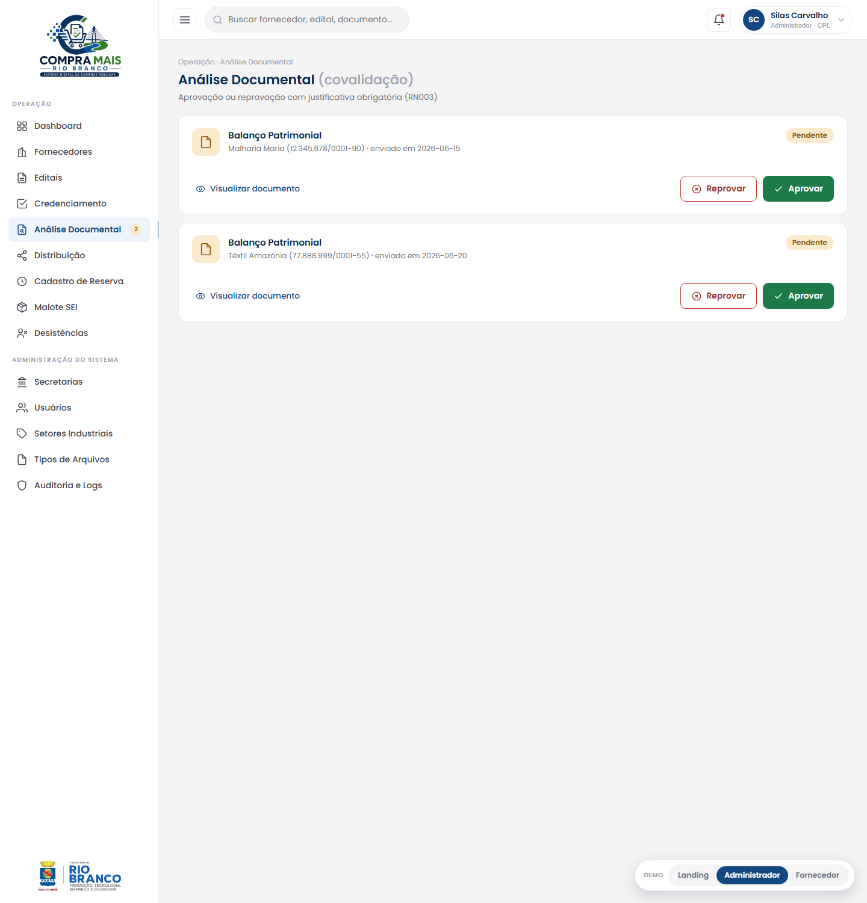
*Painel Admin: fila de covalidação documental (aprovar/reprovar com justificativa — RN003).*

### 3.2 Administração do Sistema — 🟢 Entregue

Grupo dedicado no Painel Admin. Rastreável a **RF020, RF021, RF022, RF023, RF015** · **RN015** (exclusão lógica) · **RBAC (§15 do PRD, AD-35)** · casos de uso **UC020, UC021, UC015, UC012**.

| Tela | Entrega |
|---|---|
| **Secretarias** | CRUD de unidades demandantes (Sigla, Nome, Responsável, Contato, Status); inativação preservando histórico |
| **Usuários** | CRUD de servidores com **Perfil RBAC** (Administrador, Gestor, Analista, Auditor), login, reset de senha |
| **Setores Industriais (CNAE)** | CRUD de códigos CNAE (Código, Descrição, Categoria, Situação) — base do filtro/match |
| **Tipos de Arquivos** | CRUD de documentos exigidos (Formato, Obrigatoriedade, Validade/"sem validade", Exercício) |
| **Auditoria e Logs** | Trilha **append-only imutável** (data/hora, usuário, perfil, ação, alvo, IP) + **Exportar Logs** |
| **Minha conta / Segurança** | Dados do usuário + **alteração da própria senha** (mín. 8 caracteres) |

Princípios transversais implementados na UI: **soft-delete** (exclusão converte para Inativo/Bloqueado, nunca apaga) e **auditoria imutável**.

**Prints — Administração do Sistema**

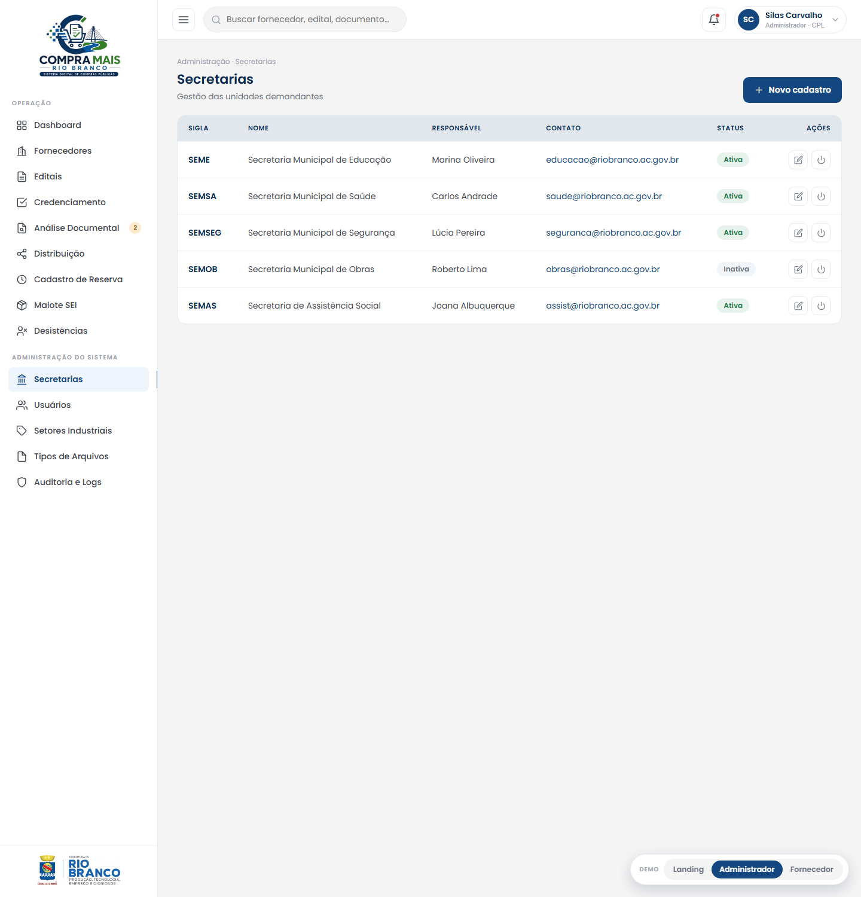
*CRUD de Secretarias demandantes.*

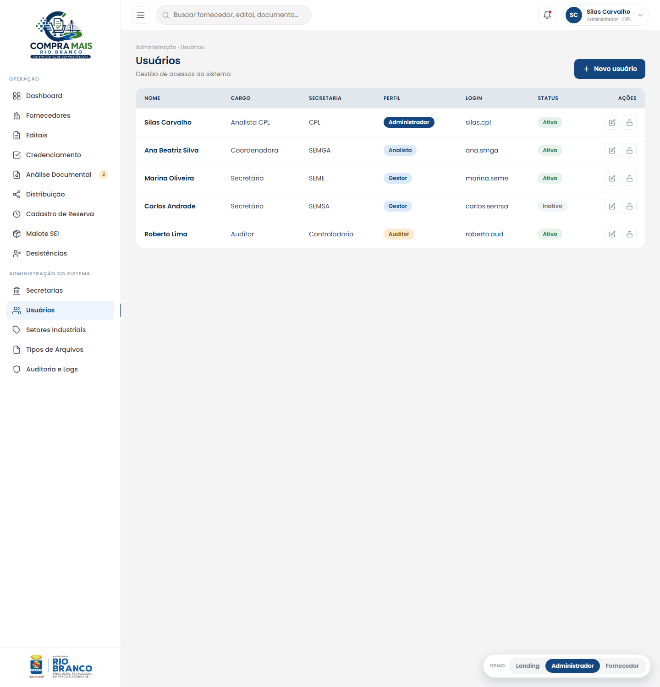
*Gestão de usuários internos com perfil RBAC (Administrador/Gestor/Analista/Auditor).*

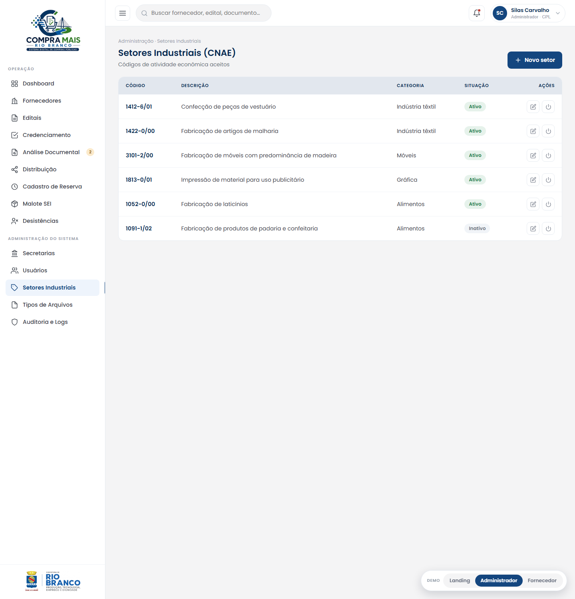
*Catálogo de CNAE / setores industriais.*

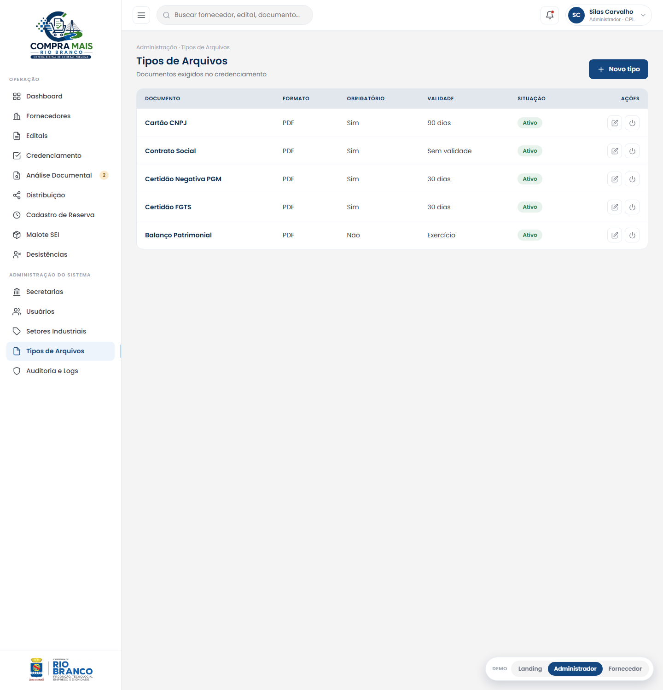
*Catálogo de tipos de documento exigidos (formato, obrigatoriedade, validade).*

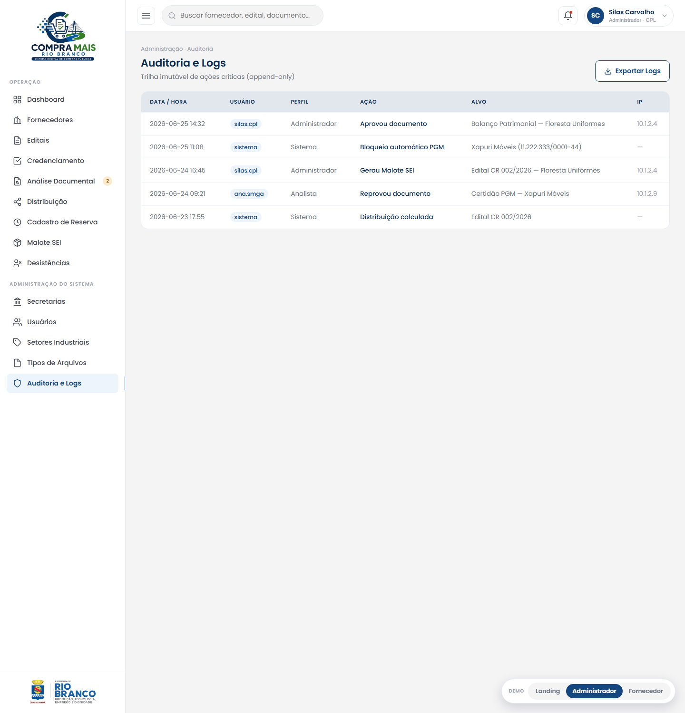
*Trilha de auditoria append-only com exportação de logs.*

### 3.3 Gestão de Editais — 🟢 Entregue

Módulo de maior complexidade (Item 1). Rastreável a **RF008, RF003, RF025** · **RN007, RN012, RN014, RN001** · casos de uso **UC005, UC003, UC022** · **AD-16, AD-37, AD-39**.

**Painel Administrativo — Editais de Credenciamento:**
- Criação de editais **individualizados** (1 edital = 1 demanda de uma secretaria — RN007), com objeto, quantidade, valor unitário, **secretaria demandante** e **CNAE exigido**.
- **Ciclo de vida** do edital `Rascunho → Aberto → Em Análise → Em Distribuição → Homologado → Em Execução` (RN014/AD-37); edição pós-publicação **auditada** (RN012).
- **Anexação do PDF oficial** do edital como pré-requisito de publicação (RF025/AD-39). Ações Ver/Editar por edital.

**Portal do Fornecedor — Vitrine de Editais:**
- Exibe **apenas** editais compatíveis com os CNAEs da empresa (**match exato de 7 dígitos** — RF003/RN001), ocultando os incompatíveis; filtros por busca e secretaria, exportação Excel/PDF, colunas ordenáveis.
- **Baixar Edital em PDF** (RF025) e **Iniciar Credenciamento**.

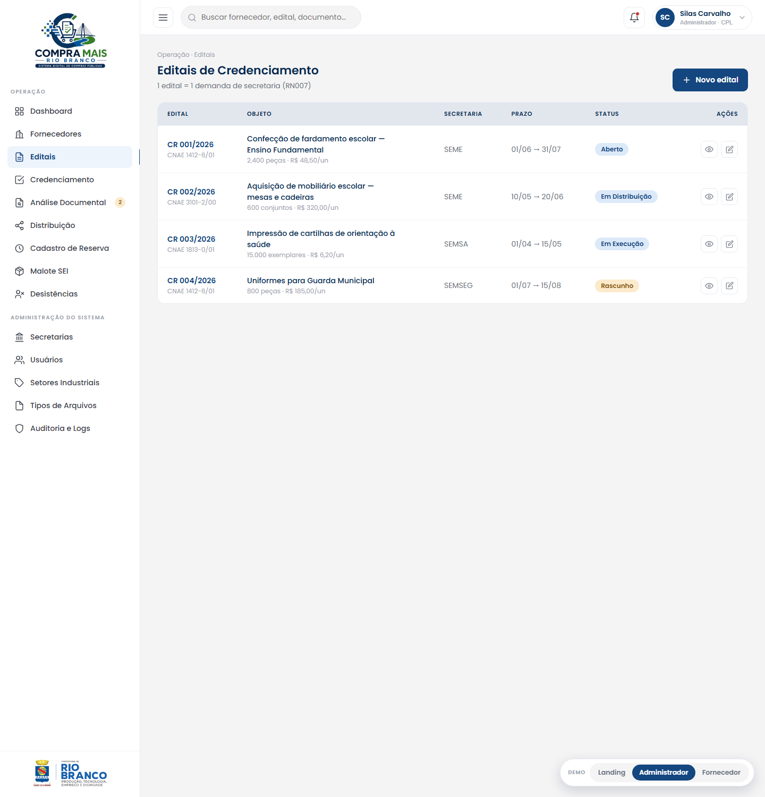
*Editais de credenciamento (1 edital = 1 demanda de secretaria — RN007), com ciclo de vida e status.*

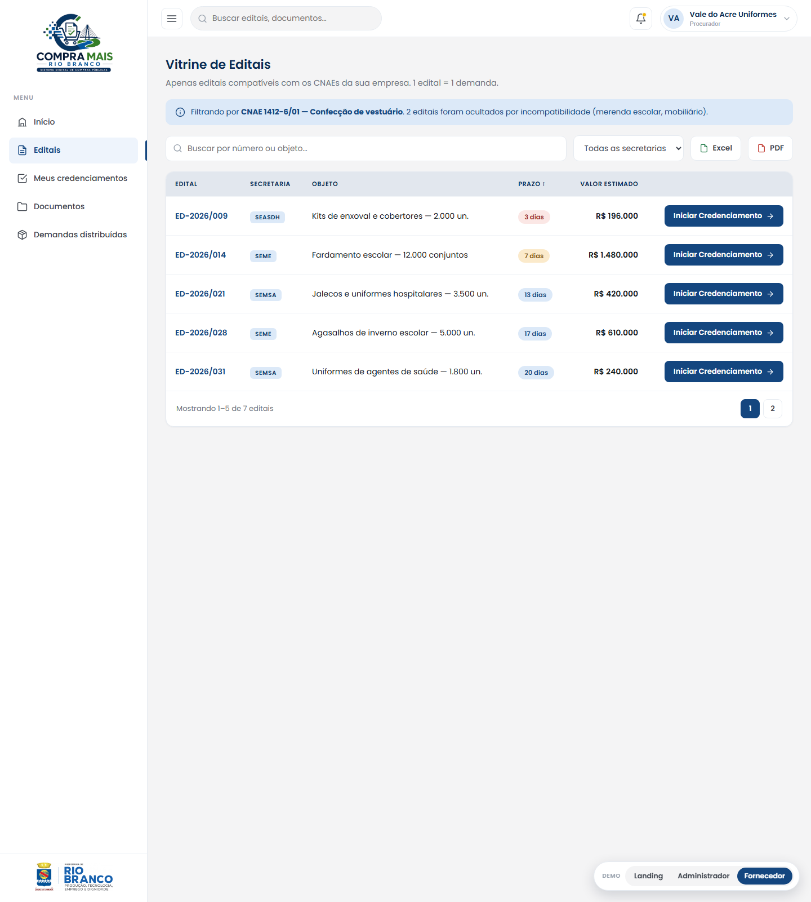
*Vitrine filtrada por CNAE (editais incompatíveis ocultados), com "Baixar Edital em PDF" e "Iniciar Credenciamento".*

### 3.4 Gestão da Distribuição — 🟢 Entregue

Módulo de maior complexidade (Item 1). Rastreável a **RF005, RF006** · **RN004, RN005, RN017, RN020** · casos de uso **UC008, UC009** · **AD-7/AD-8/AD-10/AD-24/AD-25** (motor determinístico, alocação append-only, ordem da reserva).

**Painel Administrativo:**
- **Distribuição Inteligente:** aciona o **motor de rateio** (water-filling iterativo + maiores restos/Hamilton + desempate determinístico), respeitando o **teto de capacidade declarada** de cada fornecedor (RN005); exibe métricas (demanda total, distribuído, habilitados) e a **matriz de alocação** (cota e % por fornecedor); ação **Homologar distribuição** — a alocação **congela** (AD-10, RN014). A edição manual das cotas é **vedada** (RN017).
- **Cadastro de Reserva:** fila cronológica dos retardatários (2ª Demanda), acionada por **substituição** sem alterar os contratos vigentes (RN004/AD-25).

**Portal do Fornecedor:** a tela **Demandas distribuídas** mostra ao fornecedor apenas a **cota própria** (rateio global oculto — RN020) e o comparativo com o teto declarado (ver §3.1).

> **Nota de dependência:** o congelamento definitivo do motor depende da definição estrutural **Item × Lote** (LAC-16), ainda pendente — ver §7.

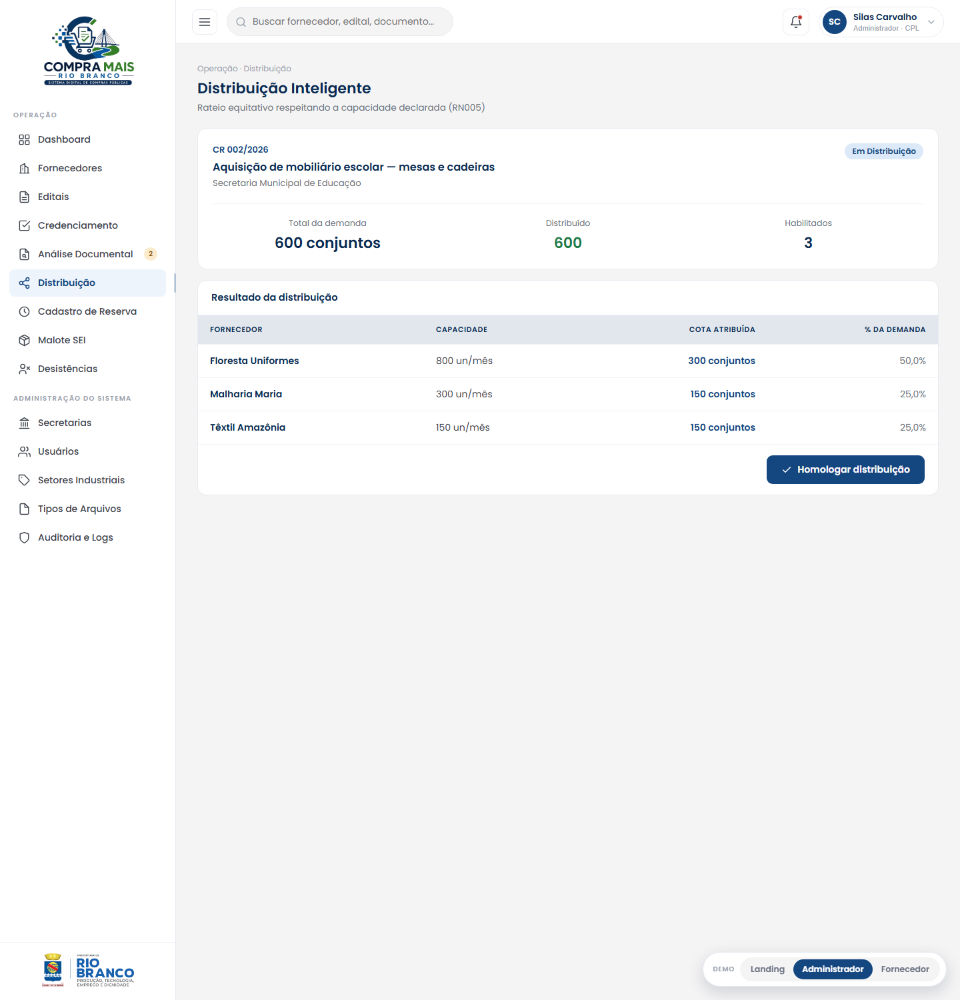
*Distribuição Inteligente: rateio por capacidade declarada e homologação.*

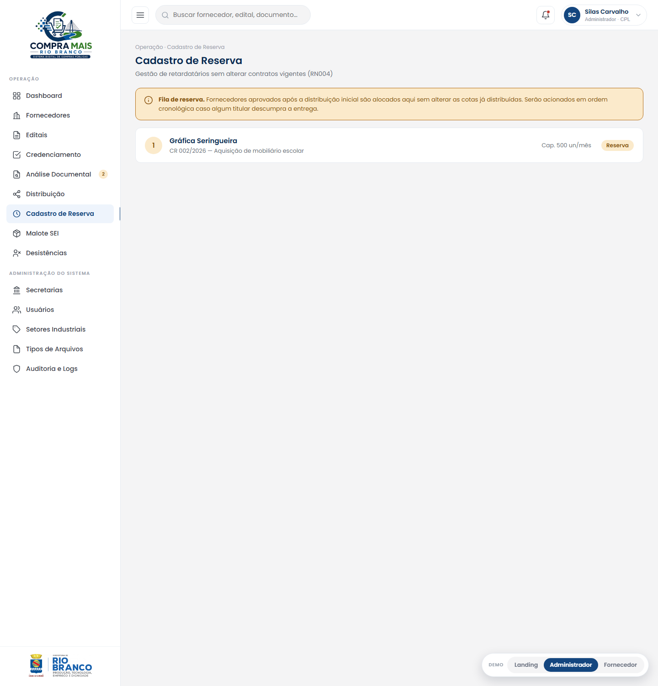
*Cadastro de Reserva: fila cronológica de retardatários, sem alterar contratos vigentes (RN004).*

## 4. Personalização dos módulos — 996 UST

A cláusula **10.1.5** obriga a CONTRATADA a **implantar e customizar a solução em estrita conformidade com as especificações**. Os serviços técnicos são medidos no banco de **27.561 UST** (Item 3, R$ 181,50/UST). Desse banco, alocam-se **996 UST** à **personalização dos módulos** entregues — adaptação do core à realidade da Prefeitura de Rio Branco (identidade visual institucional, regras locais, catálogos, integrações municipais e ajustes de fluxo validados com o cliente).

**Valor da alocação:** 996 UST × R$ 181,50 = **R$ 180.774,00** (parte do Item 3).

> **Rateio proposto (a ratificar com a SMGA).** O contrato estabelece o banco de UST de forma agregada; a distribuição por módulo abaixo é **planejamento de entrega**, não valor contratual fechado. Os totais somam 996 UST.

| Frente de personalização | Módulo(s) | UST (proposta) | Escopo de customização |
|---|---|---:|---|
| Identidade visual e institucional | Todos | 120 | Paleta azul institucional, logomarcas, landing "Compra Mais Rio Branco", e-mail da comissão |
| Cadastro de Fornecedores | Cadastro de Fornecedores | 260 | Fluxo CNPJ + fallback, Termo de Responsabilidade, procurador, endereço estruturado, filtro antifraude PGM/SICAF |
| Administração do Sistema | Administração do Sistema | 220 | CRUDs de Secretarias/Usuários/Setores/Tipos, RBAC por cargo, exclusão lógica, auditoria |
| Gestão de Editais | Gestão de Editais | 180 | Editais individualizados, ciclo de vida do edital, anexação do PDF oficial e vitrine por CNAE |
| Gestão da Distribuição | Gestão da Distribuição | 140 | Motor de rateio (water-filling), homologação, Cadastro de Reserva e ajuste do algoritmo/desempate à realidade da Prefeitura |
| Ajustes de fluxo da Validação 01 | Editais/Distribuição/Documentos | 76 | Desistência covalidada, ocultar rateio global, "Em Análise" vs "Bloqueado", PDF do edital |
| **Total** | | **996** | |

## 5. Catálogo de telas entregues (protótipos ratificados)

### 5.1 Painel Administrativo — 16 telas

Dashboard · Fornecedores · Editais · Credenciamento · Análise Documental · Distribuição · Cadastro de Reserva · Malote SEI · Desistências · Secretarias · Usuários · Setores Industriais · Tipos de Arquivos · Auditoria e Logs · Portal da Transparência · Minha conta.
*Componentes transversais:* sheets de CRUD reutilizáveis, modal de reprovação com justificativa obrigatória, toasts, dropdowns de notificação/perfil, chips de status por cor.

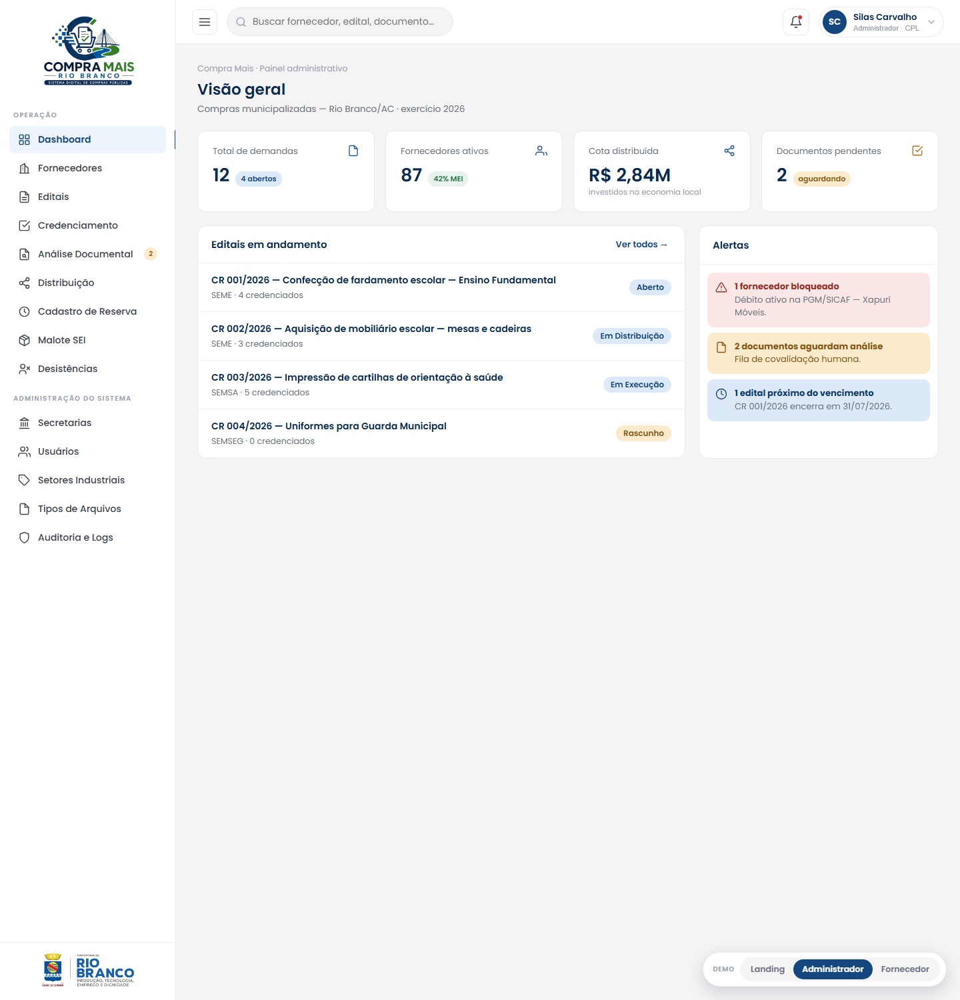
*Dashboard administrativo (BI operacional): KPIs, editais em andamento e painel de alertas.*

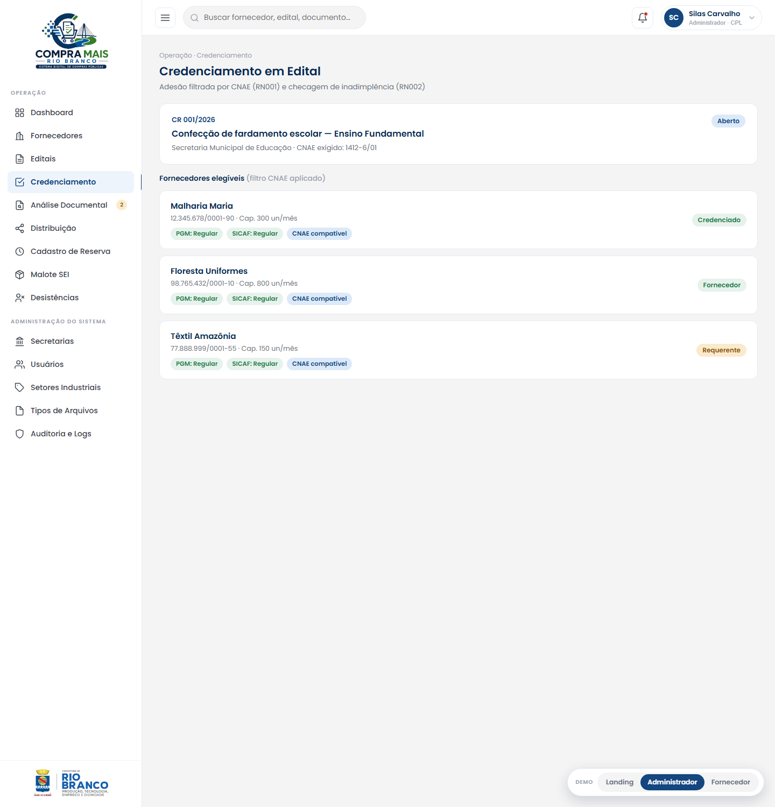
*Fornecedores elegíveis por CNAE com selos PGM / SICAF / CNAE compatível.*

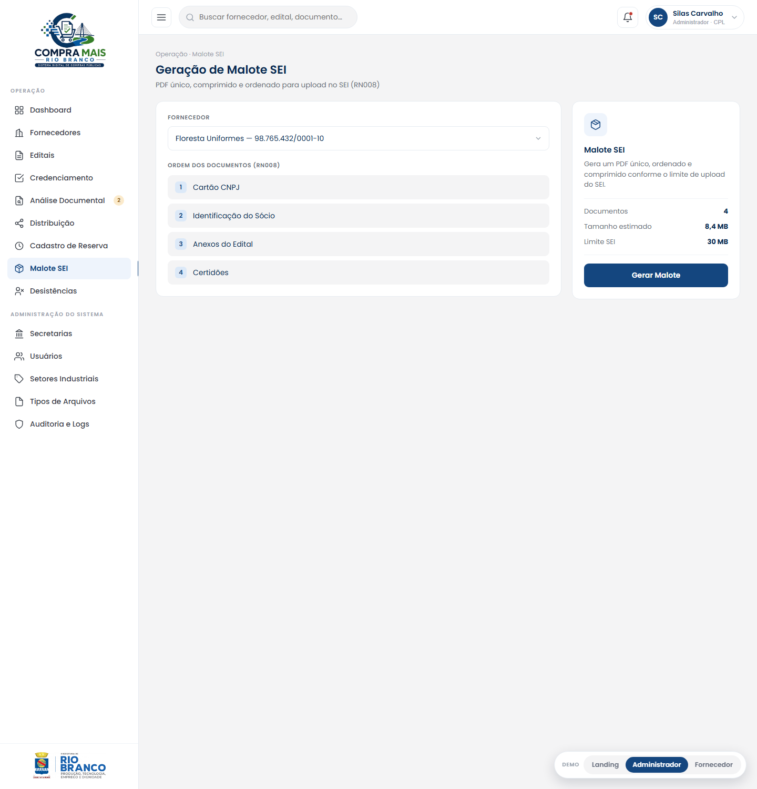
*Geração do malote ordenado e comprimido para o SEI (limite em MB — RN008).*

### 5.2 Portal do Fornecedor — 9 telas/visões

Landing/Cadastro público (CNPJ + antifraude) · Login · Início (dashboard) · Vitrine de Editais · Meus Credenciamentos · Wizard de Credenciamento (5 etapas + sucesso) · Gestão de Documentos (+ visualizador de PDF) · Demandas distribuídas (cota individual) · Minha conta.
*Componentes transversais:* stepper do wizard, alertas de vencimento (varredura diária SMS/e-mail), badges de status, notificações, estados vazios.

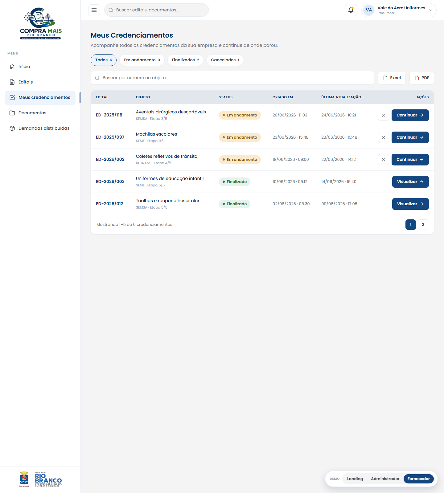
*Acompanhamento, retomada e cancelamento de credenciamentos.*

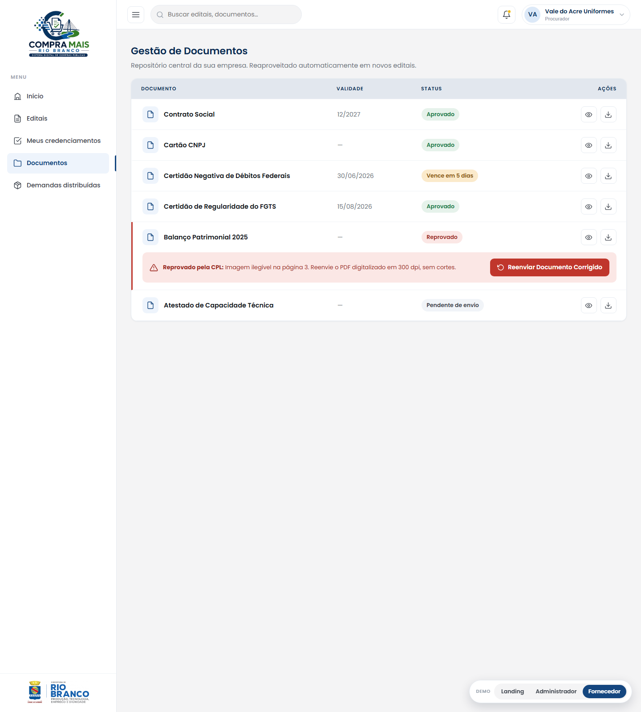
*Repositório reaproveitável, estados (Aprovado/Em Análise/Reprovado) e reenvio.*

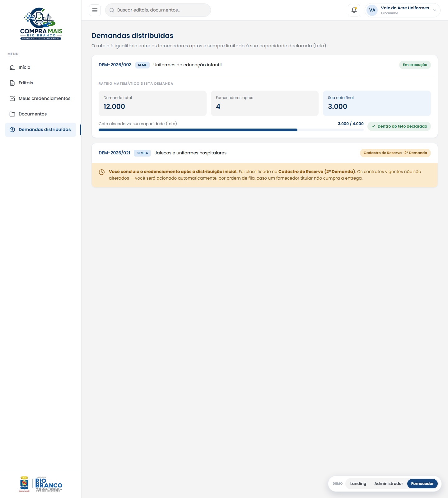
*Cota individual do fornecedor (rateio global oculto — RN020) e Cadastro de Reserva.*

## 6. Rastreabilidade à documentação canônica

O produto entregue está ancorado no PRD **v2.5** e derivados em [`spec/docs/`](../../spec/docs/index.md):
- **Requisitos:** RF001–RF026 · RN001–RN021 · RNF001–RNF008 ([prd.md](../../spec/docs/prd.md)).
- **Casos de uso:** UC001–UC023 ([casos-de-uso.md](../../spec/docs/casos-de-uso.md)).
- **Arquitetura:** 41 ADs ([ARCHITECTURE-SPINE.md](../../spec/docs/architecture/ARCHITECTURE-SPINE.md)).
- **Épicos/histórias:** [epics.md](../../spec/docs/epics.md).
- **UX:** [DESIGN.md](../../spec/docs/ux/DESIGN.md) / [EXPERIENCE.md](../../spec/docs/ux/EXPERIENCE.md).
- **Validação do cliente:** [VALIDACAO-CLIENTE-01.md](../../spec/docs/VALIDACAO-CLIENTE-01.md) e [VALIDACAO-MOCKUPS.md](../../spec/docs/VALIDACAO-MOCKUPS.md).

## 7. Pendências, ressalvas e riscos de escopo

| # | Item | Situação | Impacto |
|---|---|---|---|
| P1 | Definição estrutural **Item × Lote** | ⚖️ a definir | Bloqueia o congelamento do motor de distribuição (LAC-16); precede a evolução da Gestão da Distribuição |
| P2 | **BI/Relatórios** parametrizáveis | 🟡 gráficos mockados | Definir catálogo de relatórios e filtros com a SMGA |
| P3 | **App de Compras Governamentais** (Item 2) | 🔴 fora dos protótipos web | Definir plataforma/escopo do app |
| P4 | **Integrações reais** (Receita, PGM/SICAF, SEI) | 🟡 simuladas | Chaves/contratos de interoperabilidade pendentes (LAC-08/LAC-17); contingência PGM = upload manual de certidão |
| P5 | **Limite em MB do SEI** | ⚖️ a ratificar | Parametrizar `SEI_MALOTE_LIMITE_MB` (LAC-05) |
| P6 | **Biometria / Prova de vida** | ⏸️ Release 2 | Adiamento ratificado pelo cliente (condicional a RIPD) |
| P7 | **Texto jurídico do Termo de Responsabilidade** | ⚖️ a validar | Jurídico da Prefeitura (LAC-22) |
| P8 | **Rateio das 996 UST por módulo** | 📝 proposta | A ratificar com a SMGA (§4) |
| P9 | **Execução E2E (Cypress) em CI** | 🟡 pendente | Validação real de fluxos com backend/stubs |

## 8. Conclusão

O produto materializa, nos protótipos ratificados, **25 telas** cobrindo os módulos de maior complexidade (**Cadastro de Fornecedores**, **Administração do Sistema**, **Gestão de Editais** e **Gestão da Distribuição** entregues; **BI e Relatórios** em nível dashboard/transparência) e parte dos módulos de menor complexidade (**Consulta Pública/Transparência**). A **customização** contratada (cláusula 10.1.5) é sustentada pela alocação de **996 UST** do banco de serviços técnicos.

Ficam como **entregas pendentes prioritárias**: a definição estrutural de **Item × Lote** (motor de distribuição), **relatórios parametrizáveis de BI**, o **App de Compras Governamentais**, e a **habilitação das integrações reais** — todas rastreadas em §7 e na matriz de lacunas canônica.

---

*Documento de governança — `docs/entrega/relatorio-entrega-produto.md`. Correlaciona Contrato 28 (SEI 0107.004731/2026-31) aos protótipos ratificados e à documentação canônica (PRD v2.5).*
