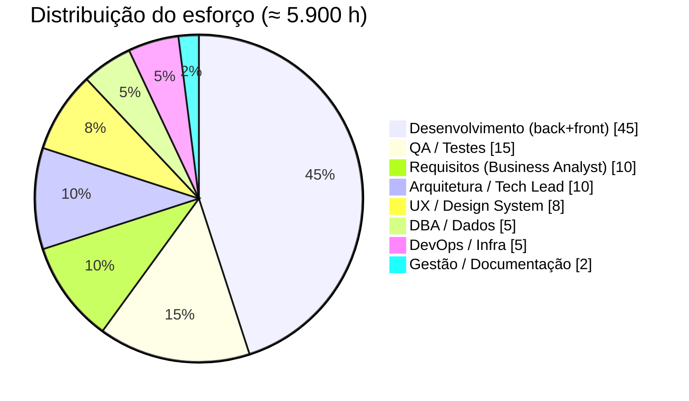
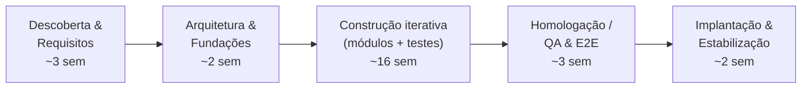

# Relatório de Esforço e Custo de Desenvolvimento — Compra Mais

**Programa Compra Mais · Prefeitura de Rio Branco**
Estimativa do tamanho funcional, esforço (horas/homem) e custo (R$) do sistema implementado.
Métodos: **Análise de Pontos de Função (IFPUG)** e **Linhas de Código (LOC / backfiring)**.

> **Natureza da estimativa.** Este relatório mede o **tamanho funcional entregue** e o traduz no
> **esforço e custo equivalentes de um desenvolvimento convencional** (para fins de orçamento,
> valoração do ativo e referência contratual). A contagem de PF é **derivada dos artefatos реais do
> repositório** (endpoints, entidades, integrações, telas) — é uma contagem *estimada*, não uma
> contagem IFPUG certificada. Valores em R$ são **referências de mercado (Brasil, 2025-2026)**;
> ajuste ao modelo de contratação (CLT interno, fábrica/PJ ou métrica de PF).

---

## 1. Sumário executivo

| Indicador | Valor central | Faixa |
|---|---:|---|
| **Tamanho funcional (PF ajustados)** | **737 PF** | 690 – 780 PF |
| **Linhas de código autorais** | **≈ 49.800 LOC** | — |
| **Esforço equivalente** | **≈ 5.900 h** (~37 pessoa-mês) | 4.400 – 8.100 h |
| **Custo equivalente (equipe interna)** | **≈ R$ 649 mil** | R$ 396 mil – R$ 1,30 mi |
| **Custo por PF** | **≈ R$ 880 / PF** | R$ 540 – R$ 1.760 / PF |
| **Cronograma equivalente** | **≈ 6 meses** (equipe de ~6) | 4 – 8 meses |

> Triangulação: a contagem de PF e a de LOC são **consistentes entre si** (≈ 52 LOC de produção por
> PF, dentro do fator esperado para TypeScript). O custo por PF converge com a **precificação de PF de
> mercado** usada no setor público (~R$ 900/PF).

---

## 2. Métricas medidas do sistema (base factual)

Coletadas diretamente do repositório (exclui `node_modules`, `dist`, lockfiles, imagens e binários).

### 2.1 Linhas de código (autorais)

| Área | Linguagem | LOC |
|---|---|---:|
| Backend — aplicação | TypeScript | 15.568 |
| Backend — testes | TypeScript | 8.928 |
| Backend — migrações | SQL | 809 |
| Frontend — aplicação | TS/TSX | 16.232 |
| Frontend — estilos | CSS | 357 |
| Frontend — E2E (Cypress) | TypeScript | 1.188 |
| Serviço de biometria facial | Python | 103 |
| Portal (landing) | HTML/CSS/JS | 438 |
| Internacionalização (i18n, 3 idiomas) | JSON | 5.349 |
| Infraestrutura (compose, Dockerfiles, CI, deploy) | YAML/Docker | 867 |
| **Total autoral** | | **≈ 49.839** |
| *— dos quais código de produção* | | *≈ 33.507* |
| *— dos quais testes automatizados* | | *≈ 10.116* |

### 2.2 Contadores estruturais e funcionais

| Elemento | Quantidade |
|---|---:|
| Módulos de backend (bounded contexts) | 15 |
| Tabelas de banco (migrações) | 27 |
| Entidades/agregados de domínio | 34 |
| Casos de uso (application/) | 53 |
| Controllers HTTP | 25 |
| **Endpoints REST** | **108** (49 GET, 48 POST, 7 PATCH, 3 DELETE, 1 PUT) |
| Eventos de domínio | 50 |
| Integrações externas | 5 (Receita, CEP/BrasilAPI, Dívida Ativa, SEI, Biometria) |
| Telas de frontend | 44 |
| Casos de uso de negócio (UC001–UC021) | ~21 |
| Testes automatizados | 958 (717 backend + 241 frontend) + 18 specs E2E |
| Histórico | 378 commits · 5 autores · 2026-06-24 a 2026-07-26 |

---

## 3. Método 1 — Análise de Pontos de Função (IFPUG)

### 3.1 Funções de dados

| Tipo | Descrição | Qtd | Compl. | PF |
|---|---|---:|---|---:|
| **ALI (ILF)** | Arquivos lógicos internos mantidos pelo sistema | 19 | 4 alta / 10 média / 5 baixa | **195** |
| **AIE (EIF)** | Arquivos de interface externa (referenciados) | 4 | 2 média / 2 baixa | **24** |

ALIs identificados: Edital(+itens), Fornecedor(+endereço/CNAE/QSA), Credenciamento(+prova de vida/termo),
Documento, Bloqueio, Consentimento LGPD, Distribuição (matriz), Contestação CNAE, Malote, Solicitação do
titular, Secretaria, Setor/CNAE, Tipo de documento, Material/Serviço, Unidade de medida, Usuário interno,
Notificação, Trilha de auditoria, Visibilidade de telas.
AIEs: Receita Federal (CNPJ/QSA), BrasilAPI (CEP), Dívida Ativa, SEI (processos).

### 3.2 Funções transacionais

| Tipo | Descrição | Qtd | PF |
|---|---|---:|---:|
| **EE (EI)** | Entradas externas (gravação: cadastros, credenciamento, distribuição, covalidação, malote…) | 52 | **210** |
| **SE (EO)** | Saídas externas com dados derivados (dashboard, transparência, 6 relatórios, rateio, exportações, PDFs) | 18 | **96** |
| **CE (EQ)** | Consultas externas (vitrines, listagens, detalhes, catálogos, permissões) | 34 | **116** |

### 3.3 Pontos de função não ajustados (PFNA)

| Componente | PF |
|---|---:|
| ALI | 195 |
| AIE | 24 |
| EE | 210 |
| SE | 96 |
| CE | 116 |
| **PFNA (UFP)** | **641** |

### 3.4 Fator de Ajuste (VAF)

14 Características Gerais do Sistema (0–5). Destaques do Compra Mais: entrada 100% online, **processamento
complexo** (motor de rateio *water-filling*, biometria facial, parsing SEI, retenção LGPD), **eficiência do
usuário final** (i18n em 3 idiomas + Design System), processamento distribuído (arquitetura hexagonal +
serviço de ML + Swarm), **facilidade de mudança** (telas-por-perfil e catálogos configuráveis), reusabilidade
(Ports & Adapters).

- **Nível Total de Influência (TDI) ≈ 50** → **VAF = 0,65 + 0,01 × 50 = 1,15**

### 3.5 Pontos de Função Ajustados (PFA)

> **PFA = PFNA × VAF = 641 × 1,15 = 737 PF**

**Verificação por *backfiring*:** 33.507 LOC de produção ÷ 641 PFNA = **52 LOC/PF** — dentro do fator
esperado para TypeScript (≈ 50–60 LOC/PF), o que valida a coerência entre as duas medições.

---

## 4. Método 2 — Linhas de Código (LOC)

O método LOC serve de **contraprova** da contagem funcional. Considerando o código autoral efetivo
(produção + testes + i18n + infraestrutura) ≈ **49.800 LOC**:

| Base | LOC | Produtividade líquida | Esforço |
|---|---:|---|---:|
| Otimista | 49.800 | 11 LOC/h | 4.530 h |
| **Central** | 49.800 | **8,4 LOC/h** | **5.900 h** |
| Conservador | 49.800 | 6 LOC/h | 8.300 h |

> A produtividade líquida (LOC por hora **já incluindo** análise, testes, revisão e retrabalho) para
> código de produção testado costuma situar-se entre 5 e 15 LOC/h. O ponto central (8,4 LOC/h) é o que
> reconcilia o método LOC com o método de Pontos de Função.

---

## 5. Esforço (horas/homem)

Convertendo o tamanho funcional (**737 PF**) por faixas de produtividade (h/PF), com contraprova por LOC:

| Cenário | Produtividade | Esforço (h) | Pessoa-mês¹ |
|---|---|---:|---:|
| Otimista (equipe sênior, alto reúso) | 6 h/PF | 4.420 h | 27,6 |
| **Central (recomendado)** | **8 h/PF** | **5.896 h ≈ 5.900 h** | **36,9** |
| Conservador (produtividade de mercado clássica) | 11 h/PF | 8.107 h | 50,7 |

¹ 160 h úteis por pessoa-mês.

**Esforço adotado: ≈ 5.900 horas/homem** (faixa 4.400 – 8.100 h).

### 5.1 Distribuição do esforço por disciplina

| Disciplina | % | Horas | Custo (R$ 110/h) |
|---|---:|---:|---:|
| Desenvolvimento (backend + frontend) | 45% | 2.655 | R$ 292.050 |
| QA / Testes automatizados | 15% | 885 | R$ 97.350 |
| Requisitos (Business Analyst) | 10% | 590 | R$ 64.900 |
| Arquitetura / Tech Lead | 10% | 590 | R$ 64.900 |
| UX / Design System | 8% | 472 | R$ 51.920 |
| DBA / Modelagem de dados | 5% | 295 | R$ 32.450 |
| DevOps / Infraestrutura | 5% | 295 | R$ 32.450 |
| Gestão / Documentação | 2% | 118 | R$ 12.980 |
| **Total** | **100%** | **5.900** | **R$ 649.000** |

---

## 6. Custos (R$)

### 6.1 Custo-hora de referência (Brasil, 2025-2026)

| Modelo de contratação | Custo-hora (blended) |
|---|---:|
| **Equipe interna (CLT + encargos + overhead)** | R$ 90 – 130 /h (central **R$ 110/h**) |
| Fábrica de software / PJ | R$ 130 – 200 /h |
| Métrica de Ponto de Função (setor público) | R$ 600 – 1.200 /PF |

*Blended* = média ponderada de uma equipe mista (Business Analyst, Tech Lead, Dev pleno/sênior, QA, UX, DBA, DevOps).

### 6.2 Custo total por cenário

| Cenário | Esforço | Custo-hora | **Custo total** |
|---|---:|---:|---:|
| Piso (interno, otimista) | 4.400 h | R$ 90 | **R$ 396.000** |
| **Central (interno)** | **5.900 h** | **R$ 110** | **R$ 649.000** |
| Fábrica/PJ (central) | 5.900 h | R$ 160 | R$ 944.000 |
| Teto (fábrica, conservador) | 8.100 h | R$ 160 | **R$ 1.296.000** |

### 6.3 Contraprova por Ponto de Função (setor público)

> 737 PF × **R$ 900/PF** (valor de mercado típico) = **R$ 663.300**

Convergente com o custo central por horas (**R$ 649 mil**), reforçando a estimativa.

**Custo por PF adotado:** R$ 649.000 ÷ 737 ≈ **R$ 880/PF**.

---

## 7. Cronograma equivalente

Com o esforço central de **5.900 h** e uma equipe de **6 pessoas** (~960 h/mês úteis):

> 5.900 ÷ 960 ≈ **6,1 meses** de desenvolvimento convencional (faixa 4 – 8 meses).

> **Observação factual:** o calendário real do repositório (24/06 → 26/07) foi **comprimido por
> desenvolvimento assistido**. Isso **não altera o tamanho funcional entregue** — que é o que este
> relatório mede. As 5.900 h representam o **esforço equivalente** que uma equipe convencional
> despenderia para produzir o mesmo escopo, base adequada para orçamento e valoração.

---

## 8. Premissas e ressalvas

1. **Contagem de PF derivada** dos artefatos реais (endpoints, entidades, integrações, telas), não uma
   contagem IFPUG certificada por profissional CFPS. Margem típica ±15%.
2. **LOC** exclui código de terceiros (`node_modules`), gerado (`dist`), lockfiles e binários (imagens);
   inclui código autoral (produção, testes, i18n, infraestrutura).
3. **Produtividade e custo-hora** são referências de mercado; devem ser calibrados ao contrato real
   (senioridade, encargos, região, modelo CLT/PJ/fábrica).
4. O relatório mede **desenvolvimento**; **não inclui** custos recorrentes de **operação/infraestrutura**
   (nuvem, licenças, sustentação), **treinamento** de usuários nem **manutenção evolutiva** pós-entrega.
5. A **documentação** entregue (manuais, System Design, registros técnicos) está contemplada na rubrica
   "Gestão / Documentação".

---

## 9. Conclusão

O Compra Mais é um sistema de **porte médio-grande** (~**737 PF**, ~**33,5 mil linhas de produção**, 108
endpoints, 15 módulos, 27 tabelas, 5 integrações, 44 telas), com **processamento de negócio complexo**
(motor de distribuição equitativa, biometria, integração SEI, LGPD) e **alta qualidade de engenharia**
(≈ 960 testes automatizados, i18n em 3 idiomas, arquitetura hexagonal, esteira de container).

- **Esforço equivalente:** **≈ 5.900 horas/homem** (faixa 4.400 – 8.100 h).
- **Custo equivalente:** **≈ R$ 649 mil** (faixa R$ 396 mil – R$ 1,30 milhão conforme o modelo de contratação).
- **Cronograma equivalente:** **≈ 6 meses** com equipe de 6 pessoas.

As duas metodologias (Pontos de Função e Linhas de Código) **convergem** e são reforçadas pela
precificação por PF do setor público, conferindo **robustez** à estimativa.
