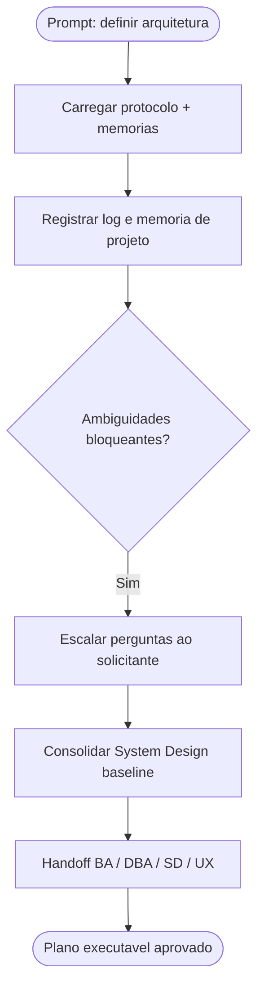

# Log de Prompt — definicao-arquitetura-webapp-geo

## Prompt Original

> @tech-lead este projeto será um aplicação web, multi repo, com banco postgres usando geo referenciado, com backend baseado em node.js, na pasta backend, frontend em em React.js, na pasta frontend. O projeto utilizará devcontainer, deverá iniciar a partir de composer único com perfis de produção e de desenvolvimento, todas as variáveis de ambiente devem ser setadas a partir do docker-compose.yml, o projeto será publicado em cluster docker swarm, orquestrado por portainer e com o pull da imagem direto do GHRC

---

## Interpretação

### Intenção Principal

Definir a arquitetura e o baseline de infraestrutura de uma aplicação web greenfield (compraMais): backend Node.js (`backend/`), frontend React.js (`frontend/`), persistência PostgreSQL com dados georreferenciados (PostGIS), ambiente de desenvolvimento via devcontainer, orquestração local por um único Docker Compose com perfis de produção e desenvolvimento, variáveis de ambiente centralizadas no `docker-compose.yml`, e publicação em cluster Docker Swarm gerenciado por Portainer com pull de imagens do GHCR.

### Entidades Identificadas

| Entidade | Tipo | Relevância |
|---|---|---|
| `backend/` | Pasta/serviço Node.js | Onde reside o serviço de API |
| `frontend/` | Pasta/serviço React.js | Onde reside a SPA |
| PostgreSQL + georreferenciado | Banco de dados | Persistência com dados geoespaciais → PostGIS |
| devcontainer | Ambiente de desenvolvimento | Padroniza o ambiente em VS Code |
| `docker-compose.yml` | Orquestração local | Compose único com perfis prod/dev e env centralizado |
| Docker Swarm + Portainer | Orquestração de produção | Deploy em cluster com pull do GHCR |
| GHCR | Registry de imagens | Origem das imagens de produção |

### Intenções Secundárias

- Estrutura multi-repo (governança de repositórios separados) — **conflita** com a descrição de pastas `backend/` e `frontend/` no mesmo repositório; precisa de desambiguação.
- Pipeline CI/CD para build e push de imagens ao GHCR (pré-requisito do pull no Swarm).
- Estratégia de variáveis de ambiente sem versionar segredos (env no compose vs `.env`/Docker secrets).
- Definição de framework Node.js (NestJS vs Express/Fastify) e de stack frontend (Vite/Next).

### Restrições

- Sem segredos versionados (env no `docker-compose.yml` exige cuidado com credenciais → usar `.env`/secrets do Swarm).
- Compose deve ser único, parametrizado por perfis (`profiles`) para dev e prod.
- Publicação por imagem (Swarm/Portainer faz pull do GHCR — não builda em produção).
- Nenhum código existente ainda (pastas `backend/`, `frontend/` e `spec/source/` vazias).

### Ambiguidades e Inferências

| Ambiguidade | Inferência Adotada | Confiança |
|---|---|---|
| "multi repo" vs pastas `backend/`/`frontend/` no mesmo repo | Tratado como questão bloqueante a confirmar com o solicitante | Baixa |
| "georreferenciado" | PostgreSQL + extensão PostGIS | Alta |
| "composer único" | Um único `docker-compose.yml` com `profiles` dev/prod | Alta |
| "GHRC" | GitHub Container Registry (GHCR) | Alta |
| Framework Node.js não informado | A confirmar (NestJS recomendado pelo catálogo de skills) | Baixa |
| Ferramenta de build frontend | A confirmar (Vite como padrão React SPA) | Média |

---

## Plano de Ação

### Passos Planejados

1. **Gate de logging e memória**: registrar este log e as decisões de projeto na memória.
2. **Desambiguação**: escalar ao solicitante as decisões bloqueantes (topologia de repositório, framework Node, registry).
3. **System Design baseline**: consolidar arquitetura, perfis de compose, estratégia de env/secrets, pipeline GHCR e deploy Swarm.
4. **Handoffs**: distribuir para Business Analyst (System Design), DBA (PostGIS/dimensionamento), Senior Developer (scaffolding TDD + devcontainer/compose) e UX Expert (Design System) conforme o fluxo do pacote.

---

## Contexto do Projeto Aplicado

> Conforme [AGENTS.md](../../.github/agents/AGENTS.md) e a persona [tech-lead.agent.md](../../.github/agents/tech-lead.agent.md), o Tech Lead é o ponto de entrada da demanda formal: transforma ambiguidade em plano executável, define a stack, registra decisões na memória e distribui handoffs. Stack Node.js → skill `nestjs-best-practices` ou `nodejs-best-practices`; React → `vercel-react-best-practices`/`frontend-react-best-practices`; Cypress como padrão E2E; documentação de governança em pt-BR.

---

## Resultado Esperado

Plano executável consolidado com System Design baseline, decisões de arquitetura registradas em memória, perguntas de desambiguação escaladas ao solicitante e handoffs definidos para os demais agents.
