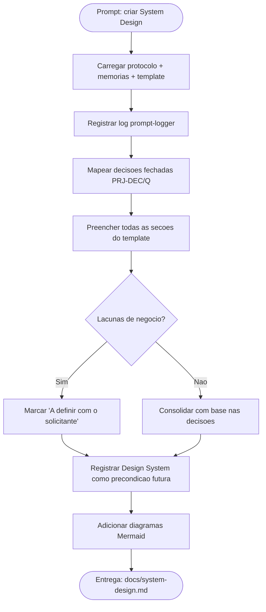

# Log de Prompt — system-design-compramais

## Prompt Original

> Você atua como o agent Business Analyst do pacote em .github/agents/. Siga estritamente a persona e o protocolo. LEIA PRIMEIRO (obrigatório) os arquivos de protocolo (AGENTS.md), persona (business-analyst.agent.md), memória de projeto (MEMORIA-PROJETO.md, decisões PRJ-DEC-03..07 e resoluções Q-01..Q-03), o template base (system-design-template.md) e o exemplo preenchido. TAREFA: produzir o System Design do projeto compraMais seguindo o template padrão, em português do Brasil. Contexto/decisões já fechadas pelo Tech Lead: aplicação web compraMais com dados georreferenciados; monorepo único com backend Node.js (Fastify, TypeScript) em backend/ e frontend React SPA + Vite (TypeScript) em frontend/; persistência PostgreSQL + PostGIS (consultas geoespaciais, índices GiST); dev com devcontainer (VS Code); orquestração local com um único docker-compose.yml com profiles dev/prod, variáveis centralizadas no compose, segredos via .env (dev) e Docker secrets/Portainer (prod), nunca versionados; produção em Docker Swarm orquestrado por Portainer, pull de imagens do GHCR, CI (GitHub Actions) builda e publica, deploy por imagem sem build em produção. ENTREGA: criar docs/system-design.md preenchendo TODAS as seções do template, incluir ao menos 1 diagrama Mermaid, registrar a seção de referência ao Design System como pendência/precondição futura (frontend ainda não desenhado), e marcar como "A definir com o solicitante" onde faltar informação de negócio.

---

## Interpretação

### Intenção Principal

Produzir o artefato formal de governança System Design do projeto compraMais, em português do Brasil, aderente ao `templates/system-design-template.md`, consolidando as decisões já fechadas pelo Tech Lead (PRJ-DEC-03..07 e Q-01..Q-03) sem reabri-las, e preenchendo todas as seções do template — incluindo a seção obrigatória de referência ao Design System, que deve ser registrada explicitamente como pendência/precondição futura por o frontend ainda não estar desenhado.

### Entidades Identificadas

| Entidade | Tipo | Relevância |
|---|---|---|
| `docs/system-design.md` | Artefato a criar | Entregável principal da tarefa |
| `templates/system-design-template.md` | Template base | Estrutura obrigatória do documento |
| `MEMORIA-PROJETO.md` (PRJ-DEC-03..07, Q-01..Q-03) | Decisões de projeto | Base factual do System Design |
| `backend/` (Node.js Fastify + TS) | Componente | Serviço de API |
| `frontend/` (React SPA + Vite + TS) | Componente | SPA do usuário |
| PostgreSQL + PostGIS | Persistência | Consultas geoespaciais e índices GiST |
| docker-compose.yml (profiles dev/prod) | Orquestração | Ponto único de orquestração local |
| Docker Swarm + Portainer + GHCR | Produção/CI | Modelo de release por imagem |
| Design System (UX Expert) | Dependência futura | Precondição de validação frontend |

### Intenções Secundárias

- Manter rastreabilidade com a memória de projeto e os templates de validação/aprovação esperados a jusante.
- Sinalizar honestamente lacunas de negócio como "A definir com o solicitante" sem inventar requisitos.
- Registrar a seção de Design System como pendência/precondição (gate de QA e critério de aceite do Tech Lead).
- Apontar divergências entre o material de apoio e o estado real (ex.: prompt original citava NestJS/Express e multi-repo; já resolvido para Fastify e monorepo).

### Restrições

- Não reabrir decisões já fechadas (PRJ-DEC-03..07, Q-01..Q-03).
- Não inventar requisitos de negócio específicos; usar "A definir com o solicitante" quando faltar dado.
- Documento em português do Brasil (regra de idioma do protocolo).
- Segredos nunca versionados; refletir essa restrição no design.

### Ambiguidades e Inferências

| Ambiguidade | Inferência Adotada | Confiança |
|---|---|---|
| Requisitos de negócio funcionais do compraMais (o que se "compra") | Não definidos no material; marcados como "A definir com o solicitante" | Alta |
| Volume/carga esperados | Sem dado de negócio; premissas marcadas como a definir, com baseline técnico genérico | Alta |
| Handoff de dimensionamento do banco do DBA | Ainda não recebido; registrado como pendência de handoff | Alta |
| Design System | Inexistente (frontend não desenhado); registrado como precondição futura | Alta |

---

## Plano de Ação

### Passos Planejados

1. **Gate de logging**: registrar este log antes/junto da entrega (protocolo AGENTS.md item 2).
2. **Base factual**: consolidar PRJ-DEC-03..07 e Q-01..Q-03 como verdade do design.
3. **Preenchimento**: completar todas as seções do template com arquitetura, integrações, implantação e dimensionamento.
4. **Honestidade de escopo**: marcar lacunas de negócio como "A definir com o solicitante".
5. **Design System**: registrar explicitamente como pendência/precondição futura.
6. **Diagramas**: incluir diagramas Mermaid de contexto/componentes e de implantação.
7. **Divergências**: registrar divergências entre material de apoio e decisões fechadas.

---

## Contexto do Projeto Aplicado

> Conforme [AGENTS.md](../../.github/agents/AGENTS.md) (itens 16, 29, 37, 45) e a persona [business-analyst.agent.md](../../.github/agents/business-analyst.agent.md), o Business Analyst elabora o System Design com `templates/system-design-template.md`, em pt-BR, com diagramas Mermaid, referenciando explicitamente o Design System do UX como precondição de validação frontend. Decisões fechadas pelo Tech Lead em [MEMORIA-PROJETO.md](../../.github/agents/memoria/MEMORIA-PROJETO.md) (PRJ-DEC-03..07, Q-01..Q-03) são a base do documento. Skill complementar de apoio: `clean-architecture` (fronteiras), `mermaid-generator` (diagramas).

---

## Resultado Esperado

Arquivo `docs/system-design.md` criado, com todas as seções do template preenchidas em pt-BR, ao menos dois diagramas Mermaid, seção de Design System registrada como precondição futura, lacunas de negócio marcadas como "A definir com o solicitante" e divergências sinalizadas para a revisão consolidada do Tech Lead.
