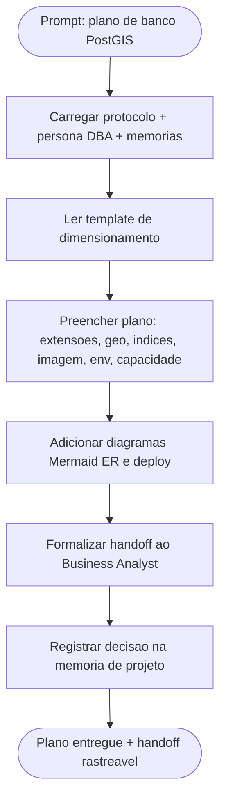

# Log de Prompt — plano-dimensionamento-banco-postgis

## Prompt Original

> Você atua como o agent DBA do pacote em .github/agents/. Siga estritamente a persona e o protocolo. LEIA PRIMEIRO (obrigatório) AGENTS.md, dba.agent.md, MEMORIA-PROJETO.md (PRJ-DEC-03..07) e o template plano-dimensionamento-expansao-banco-template.md. TAREFA: produzir o plano de dimensionamento e expansão do banco para compraMais seguindo o template, em português do Brasil, com foco em PostgreSQL + PostGIS. Cobrir extensões (postgis, postgis_topology, btree_gist), estratégia geoespacial (geometry vs geography, SRID 4326, projeção métrica), indexação (GiST/SP-GiST e índices de apoio), versão da imagem (postgis/postgis com tag fixada), volume e backup, variáveis de ambiente (POSTGRES_DB/USER/PASSWORD via secret) e conexão do backend, dimensionamento inicial e gatilhos, estratégia de migrations, e handoff explícito para o Business Analyst. ENTREGA: criar docs/dba/plano-dimensionamento-banco.md preenchendo o template, com ao menos 1 diagrama Mermaid, marcando volumetria faltante como "A estimar com o solicitante".

---

## Interpretação

### Intenção Principal

Produzir, na persona DBA, o plano formal de dimensionamento e expansão do banco PostgreSQL + PostGIS do projeto compraMais, preenchendo o template oficial do pacote, com decisões técnicas de extensões, modelagem geoespacial, indexação, imagem/backup, variáveis de ambiente, dimensionamento inicial, gatilhos de expansão, estratégia de migrations e handoff rastreável ao Business Analyst.

### Entidades Identificadas

| Entidade | Tipo | Relevância |
|---|---|---|
| PostgreSQL + PostGIS | Banco / extensão | Núcleo da camada de dados georreferenciada (PRJ-DEC-04) |
| `docs/dba/plano-dimensionamento-banco.md` | Artefato a criar | Entregável principal da tarefa |
| `plano-dimensionamento-expansao-banco-template.md` | Template | Estrutura obrigatória do documento |
| SRID 4326 / geometry / geography | Conceito geoespacial | Define modelagem e indexação |
| GiST / SP-GiST / btree_gist | Índices | Estratégia de indexação geoespacial e de apoio |
| `docker-compose.yml` / Docker Swarm / Portainer | Infra | Onde o banco roda em dev e prod (PRJ-DEC-05/06) |
| Docker secrets / `.env` | Segredos | Senha do banco nunca versionada (PRJ-DEC-07) |
| Business Analyst | Agent / handoff | Consolida o plano no System Design (DEC-STR-04) |

### Intenções Secundárias

- Manter rastreabilidade do handoff DBA → BA para o System Design.
- Registrar decisão de dados na memória de projeto.
- Marcar honestamente lacunas de volumetria real como "A estimar com o solicitante".

### Restrições

- Decisões PRJ-DEC-03..07 são base fechada e não devem ser reabertas.
- Projeto greenfield: sem volumetria real; estimativas são premissas a validar.
- Segredos nunca versionados (`.env` em dev, Docker secrets em prod).
- Documento de governança em português do Brasil.

### Ambiguidades e Inferências

| Ambiguidade | Inferência Adotada | Confiança |
|---|---|---|
| Volumetria e crescimento reais | Marcados como "A estimar com o solicitante"; uso de premissas conservadoras | Alta |
| Tag exata da imagem postgis/postgis | Fixar `postgis/postgis:16-3.4` (PostGIS 3.4 sobre PostgreSQL 16, LTS estável) | Média |
| Domínio funcional das entidades geo | Inferido de "compraMais" (estabelecimentos/ofertas georreferenciadas); modelagem genérica e marcada para validação | Média |

---

## Plano de Ação

### Passos Planejados

1. **Gate de logging e memória**: registrar este log e carregar contexto (PRJ-DEC-03..07, DEC-STR-04).
2. **Preenchimento do template**: produzir o plano com extensões, modelagem geoespacial, indexação, imagem/volume/backup, env/secrets, dimensionamento e gatilhos, migrations.
3. **Diagramas**: incluir ER conceitual e fluxo de deploy/dados do banco em Mermaid.
4. **Handoff e memória**: formalizar handoff ao BA e registrar a decisão de dados na memória de projeto.

---

## Contexto do Projeto Aplicado

> Conforme [AGENTS.md](../../.github/agents/AGENTS.md), [dba.agent.md](../../.github/agents/dba.agent.md) e as decisões PRJ-DEC-04 (PostGIS), PRJ-DEC-05/06 (compose/Swarm/Portainer) e PRJ-DEC-07 (segredos não versionados). O DBA é dono do plano de dimensionamento e expansão e deve formalizar handoff rastreável ao Business Analyst (DEC-STR-04 / regra 24 do protocolo) para consolidação no System Design. Idioma de governança: português do Brasil (DEC-STR-25).

---

## Resultado Esperado

Arquivo `docs/dba/plano-dimensionamento-banco.md` preenchido conforme o template, com diagramas Mermaid (ER e deploy), decisões de extensões/SRID/índices/imagem, dimensionamento inicial e gatilhos, estratégia de migrations e handoff explícito ao Business Analyst; decisão de dados registrada na memória de projeto.
