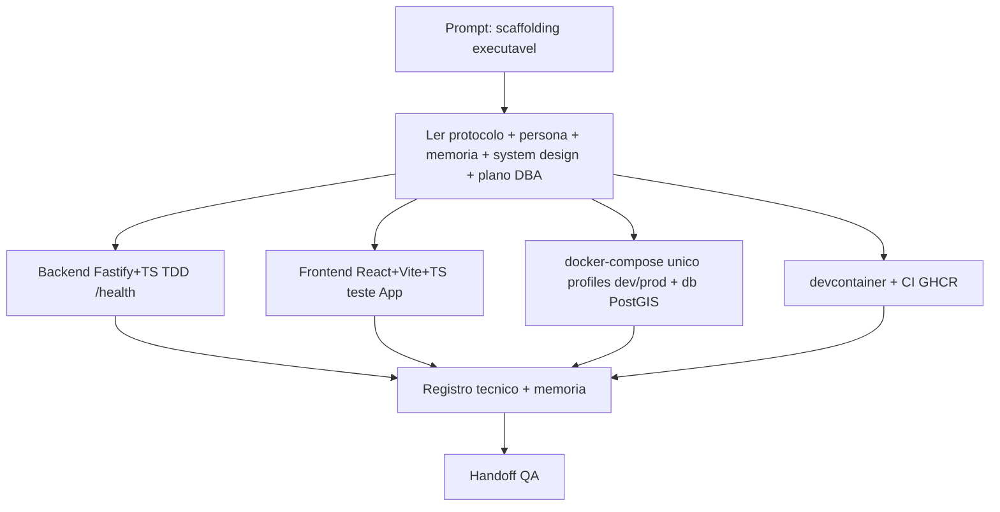

# Log de Prompt — scaffolding-monorepo-compramais

## Prompt Original

> Você atua como o agent Senior Developer do pacote em .github/agents/. Siga estritamente a persona e o protocolo. LEIA PRIMEIRO (obrigatório): AGENTS.md, senior-developer.agent.md, MEMORIA-PROJETO.md (PRJ-DEC-03..08, Q-01..Q-03), docs/system-design.md, docs/dba/plano-dimensionamento-banco.md, skills nodejs-best-practices e protocolo-tdd. TAREFA: criar o scaffolding executável do monorepo compraMais, coerente com as decisões já fechadas, sem reabrir decisões. DELIVERABLES: (1) backend Node.js + Fastify + TypeScript com package.json, tsconfig, server.ts, app.ts, rota GET /health, camadas routes/ e plugins/ (pg pool), 1 teste passando (TDD Red-Green), Dockerfile multi-stage non-root, .dockerignore, .env.example; (2) frontend React + Vite + TypeScript com package.json, vite.config, tsconfig, index.html, main.tsx, App.tsx, 1 teste passando (vitest + testing-library), Dockerfile multi-stage (nginx alpine), nginx.conf (SPA fallback + proxy /api), .dockerignore, .env.example; (3) .devcontainer/devcontainer.json usando o compose com profile dev e feature node; (4) docker-compose.yml único raiz com profiles: db (postgis/postgis:16-3.4, volume, env, healthcheck), backend e frontend para dev (build local, bind mount, hot reload, profile dev) e prod (imagem GHCR + deploy: Swarm, profile prod), env centralizada, segredos via .env (dev) e docker secrets (prod); (5) .github/workflows/ci.yml: lint+test dos dois serviços, build e push GHCR com tags por SHA e release, login via GITHUB_TOKEN; (6) raiz: .gitignore, .env.example consolidado, atualizar README.md. REGRAS: TypeScript em ambos; nada de segredos reais; testes devem rodar/passar (ou registrar dependência de npm install); seguir TDD (registrar Red-Green); produzir registro técnico em docs/dev/registro-scaffolding.md em pt-BR.

---

## Interpretação

### Intenção Principal

Criar o scaffolding executável (esqueleto de projeto que compila, roda e tem testes verdes) do monorepo compraMais, materializando em arquivos reais as decisões de arquitetura/infra já fechadas (PRJ-DEC-03..08, Q-01..Q-03), sem reabrir decisões.

### Entidades Identificadas

| Entidade | Tipo | Relevância |
|---|---|---|
| `backend/` (Fastify + TS) | Serviço a criar | API HTTP, rota `/health`, pool pg |
| `frontend/` (React + Vite + TS) | Serviço a criar | SPA, build estático servido por nginx |
| `docker-compose.yml` (raiz, único) | Orquestração | Profiles dev/prod, serviço db PostGIS |
| `.devcontainer/devcontainer.json` | Ambiente dev | Compose profile dev + feature node |
| `.github/workflows/ci.yml` | CI/CD | Lint+test, build/push GHCR |
| `.env.example`, `.gitignore`, `README.md` | Governança/raiz | Config sem segredos e instruções |
| `docs/dev/registro-scaffolding.md` | Registro técnico | Decisões, TDD, como rodar |

### Intenções Secundárias

- Garantir aderência ao baseline do DBA (imagem `postgis/postgis:16-3.4`, SRID 4326, segredos via `.env`/secret `*_FILE`, pool de conexões).
- Aplicar TDD (Red-Green-Refactor) com teste real para `/health` no backend e teste do `App` no frontend.
- Manter segurança: non-root nas imagens, sem segredos versionados, helmet/CORS no backend.
- Preparar handoff completo para o QA Expert.

### Restrições

- Não reabrir decisões fechadas.
- TypeScript obrigatório nos dois serviços.
- Nenhum segredo real versionado — apenas `.env.example` com placeholders.
- Documentação de governança em português do Brasil.

### Ambiguidades e Inferências

| Ambiguidade | Inferência Adotada | Confiança |
|---|---|---|
| Runner de teste backend (vitest x node:test) | Vitest (consistência com o frontend, watch e cobertura) | Alta |
| Ferramenta de lint | ESLint flat config + typescript-eslint | Alta |
| Execução real dos testes no ambiente | Código correto entregue; execução depende de `npm install` (sem rede garantida no ambiente do agent) | Média |
| Versão base do Node | Node 22 LTS (alinhado à skill nodejs-best-practices) | Alta |

---

## Plano de Ação

1. Registrar este log (prompt-logger) — feito.
2. Criar backend (Fastify+TS) com TDD para `/health`.
3. Criar frontend (React+Vite+TS) com teste do `App`.
4. Criar `docker-compose.yml` único com profiles dev/prod e serviço db PostGIS.
5. Criar `.devcontainer/devcontainer.json`.
6. Criar `.github/workflows/ci.yml` (GHCR).
7. Criar raiz: `.gitignore`, `.env.example`, atualizar `README.md`.
8. Produzir registro técnico `docs/dev/registro-scaffolding.md`.
9. Atualizar memória de projeto e fechar com handoff ao QA.

## Diagrama de Raciocínio

