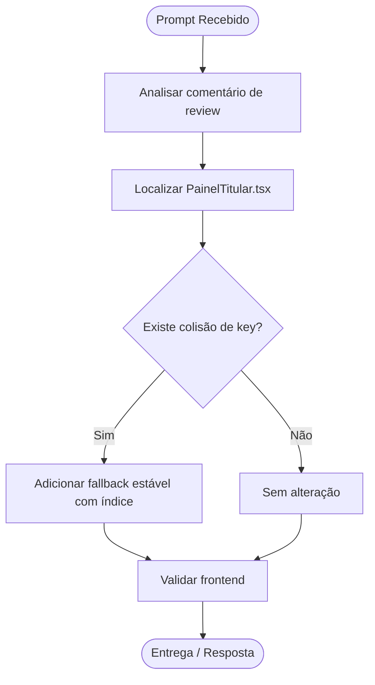

# Log de Prompt — fix-painel-titular-key

## Prompt Original

> You have been given comments on the previous commits you made in the repository.
>
> You are working on an issue in the 'hydrosdesenvolvimento/compraMais' repository.
>
> Consider the following problem statement:
>
> @copilot Fix the code for only [this review comment](https://github.com/hydrosdesenvolvimento/compraMais/pull/8#discussion_r3503068522).
>
> When a review comment includes a suggested change, apply the suggestion exactly unless the instructions in the 'Additional instructions' section below indicate otherwise.
>
> Do not make changes beyond what is described in the linked review comment, unless requested in the 'Additional instructions' section below.

---

## Interpretação

### Intenção Principal

Update the React frontend so the `PainelTitular` list key no longer collides when `referenciaId` is missing. The requested fix is narrowly scoped to the review comment and should avoid unrelated changes.

### Entidades Identificadas

| Entidade | Tipo | Relevância |
|---|---|---|
| `frontend/src/pages/publico/PainelTitular.tsx` | componente | Contains the list rendering that needs the key fallback fix |
| `referenciaId` | campo de dados | Used in the current React key composition and may be absent |
| TanStack React / React list keys | conceito | The review comment targets collision-prone keys in rendered lists |
| Review comment `discussion_r3503068522` | revisão | Defines the exact requested change |

### Intenções Secundárias

- Preserve the existing UI and behavior except for the list key generation.
- Keep the change minimal and aligned with the reviewer suggestion.
- Validate the frontend build/tests after the fix.

### Restrições

- Do not change code outside the linked review comment scope.
- Avoid introducing unrelated refactors.
- The repository uses React + TypeScript in `frontend/` and existing frontend scripts for lint/typecheck/tests.

### Ambiguidades e Inferências

| Ambiguidade | Inferência Adotada | Confiança |
|---|---|---|
| “stable fallback (e.g., index)” | Use the array index only when `referenciaId` is missing, while preserving `tipo` in the key | Alta |
| Scope of the linked review comment | Apply only the React key fix in `PainelTitular.tsx` | Alta |

---

## Plano de Ação

### Passos Planejados

1. **Inspect the component**: confirm how the list key is currently built and where the fallback should be applied.
2. **Apply the minimal fix**: change the key to use a stable index fallback when `referenciaId` is absent.
3. **Validate**: run targeted frontend checks (typecheck/lint/tests as appropriate) and confirm the change is isolated.

---

## Contexto do Projeto Aplicado

> Conforme o protocolo do repositório, tarefas de correção de código devem seguir o fluxo TDD/review-documentation e manter mudanças cirúrgicas. O frontend é React + TypeScript, então a alteração deve preservar a renderização e evitar efeitos colaterais.

---

## Resultado Esperado

A single-file frontend fix in `frontend/src/pages/publico/PainelTitular.tsx`, plus validation evidence that the list key collision risk is removed without changing unrelated behavior.
