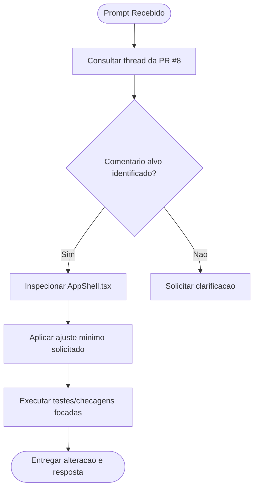

# Log de Prompt — fix-single-review-comment

## Prompt Original

> You have been given comments on the previous commits you made in the repository.
> 
> You are working on an issue in the 'hydrosdesenvolvimento/compraMais' repository.
> ...
> @copilot Fix the code for only this review comment (https://github.com/hydrosdesenvolvimento/compraMais/pull/8#discussion_r3503068604).
> 
> When a review comment includes a suggested change, apply the suggestion exactly unless the instructions in the 'Additional instructions' section below indicate otherwise.
> 
> Do not make changes beyond what is described in the linked review comment, unless requested in the 'Additional instructions' section below.

---

## Interpretação

### Intenção Principal

Aplicar somente a correção pedida no comentário de review indicado na PR #8, sem expandir escopo para outros apontamentos.

### Entidades Identificadas

| Entidade | Tipo | Relevância |
|---|---|---|
| PR #8 | artefato GitHub | Contém o comentário alvo e o contexto do feedback |
| discussion_r3503068604 | comentário de review | Define exatamente a alteração solicitada |
| frontend/src/design-system/AppShell.tsx | arquivo | Local indicado pelo comentário alvo |

### Intenções Secundárias

- Validar apenas o necessário para garantir que a alteração não quebre comportamento existente.
- Manter mudanças cirúrgicas e rastreáveis.

### Restrições

- Alterar somente o que for necessário para resolver o comentário linkado.
- Não atuar em outros comentários fora do escopo explícito.

### Ambiguidades e Inferências

| Ambiguidade | Inferência Adotada | Confiança |
|---|---|---|
| Conjunto exato de comentários “novos” | Focar no comentário explicitamente linkado no prompt | Alta |
| Profundidade de validação | Executar validação focada na área alterada | Alta |

---

## Plano de Ação

### Passos Planejados

1. **Identificar comentário alvo**: abrir a thread da PR e confirmar o conteúdo de `discussion_r3503068604`.
2. **Aplicar correção mínima**: ajustar somente o trecho citado em `AppShell.tsx`.
3. **Validar alteração**: rodar checagem/teste pertinente da área frontend.
4. **Finalizar**: registrar resultado e responder no comentário, se aplicável.

---

## Contexto do Projeto Aplicado

> Execução guiada por instrução de escopo mínimo da tarefa e validação focada na área alterada. Skill complementar ativada: `protocolo-tdd` para manter disciplina de validação.

---

## Resultado Esperado

Uma alteração cirúrgica em `frontend/src/design-system/AppShell.tsx` que elimina o problema apontado no comentário `discussion_r3503068604`, com validação da área impactada e sem mudanças paralelas.
