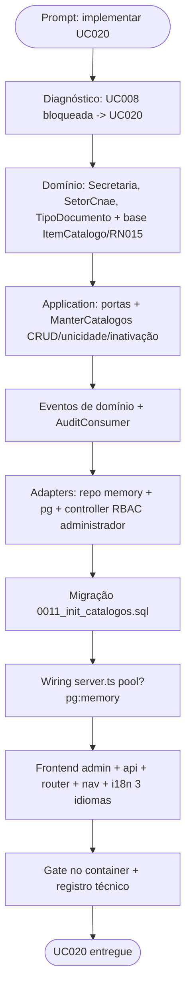

# Log de Prompt — uc020-manter-catalogos-base

## Prompt Original

> Vamos implementar UC008 do @spec/docs/casos-de-uso.md em uma branch nova

> _(Após diagnóstico:)_ UC008 = Épico 5 (Motor de Distribuição) está **bloqueado** até a ratificação
> de Item × Lote (SMGA/TCE). O solicitante optou por **implementar outra UC desbloqueada** e, entre as
> candidatas, escolheu **UC020 — Manter Catálogos Base**.

---

## Interpretação

### Intenção Principal

Implementar a **UC020 — Manter Catálogos Base** ([casos-de-uso.md](../../spec/docs/casos-de-uso.md#L311))
em uma branch nova. A demanda original era UC008, mas essa UC pertence ao Épico 5 (Motor), explicitamente
**bloqueado** até fechar Item × Lote com SMGA/TCE ([index.md](../../spec/docs/index.md#L53),
[epics.md](../../spec/docs/epics.md#L339)). O solicitante redirecionou para UC020, que é **Must**, sem
bloqueio, e desbloqueia lacunas já sinalizadas em UC005/UC003/UC004.

### Entidades Identificadas

| Entidade | Tipo | Relevância |
|---|---|---|
| Secretaria (RF020) | catálogo/entidade | Nome, Sigla, Responsável; 1 Edital → 1 Secretaria (AD-16) |
| Setor/CNAE (RF021) | catálogo/entidade | código + descrição; base do "CNAE exigido" e do match do fornecedor (RF003) |
| Tipo de Documento (RF022) | catálogo/entidade | nome, formato, regra de validade, categoria, exigência de exercício; parametriza upload/covalidação |
| `EntidadeBase` | camada domínio | superclasse de auditoria de linha (AD-33) reutilizada |
| `server.ts` | composition root | wiring `pool ? pg : memory` (padrão dos fixes 0004..0010) |
| Painel Admin | frontend | tela do Administrador para CRUD dos três catálogos |

### Intenções Secundárias

- Inativação **lógica** (RN015): item vira Inativo, some das listas de seleção, vínculos passados intactos.
- Unicidade de chave (sigla/código/nome) — duplicidade bloqueada.
- Durabilidade em Postgres (nova migração) no mesmo padrão dos módulos já entregues.
- RBAC: apenas **Administrador** mantém catálogos.
- i18n nos 3 idiomas (pt-BR/en/es) para toda string do frontend (DEC-STR-33).

### Restrições

- Backend responde em inglês; identificadores estáveis inalterados (DEC-STR-33).
- Testes rodam **no container** (DEC-STR-34).
- PR tem base `develop` (DEC-STR-32).
- Não expandir escopo para UC021 (usuários) nem para o Motor (Épico 5, bloqueado).

### Ambiguidades e Inferências

| Ambiguidade | Inferência Adotada | Confiança |
|---|---|---|
| "implementar UC008" vs. bloqueio do Épico 5 | Confirmado com o solicitante → trocar para UC desbloqueada (UC020) | Alta |
| Papel RBAC de Administrador | Header `x-papel = 'administrador'` (padrão de auditoria/malote/paineis); `Papel` enum de login não muda (UC021) | Alta |
| Nome do módulo (há `catalogo/` = fornecedor) | Novo módulo `catalogos/` (plural), distinto do `catalogo/` singular existente | Alta |

---

## Plano de Ação

### Passos Planejados

1. **Domínio**: entidades ricas dos três catálogos com base comum de inativação lógica (RN015).
2. **Application**: portas de repositório + `ManterCatalogos` (criar/editar/inativar/reativar/listar), com validação de unicidade e erro tipado de duplicidade.
3. **Eventos**: `SecretariaCriada/Editada/Inativada`, análogos para Setor e TipoDocumento; registrar no `AuditConsumer` (AD-18).
4. **Adapters**: repositórios memory + pg (snapshot `estado()/deEstado()`), controller REST com RBAC `administrador`.
5. **Migração** `0011_init_catalogos.sql` (tabelas + índices de unicidade parcial em ativos).
6. **Wiring** no `server.ts` (`pool ? pg : memory`) e catálogo de eventos.
7. **Frontend**: página admin de catálogos (Query/Form/Mutations), `api`, rota + item de nav, i18n pt-BR/en/es, teste de componente.
8. **Gate no container** (lint+typecheck+test backend/frontend) + registro técnico em `docs/dev/`.

---

## Contexto do Projeto Aplicado

> Clean Architecture / hexagonal (AD-32/AD-33): domínio rico estendendo `EntidadeBase`, portas na
> application, adaptadores memory/pg intercambiáveis, wiring no composition root (`server.ts`). Segue o
> padrão de durabilidade dos fixes 0004..0010 (snapshot + migração + `pool ? pg : memory`). RN015
> (inativação lógica) é o invariante central. Skills acionadas: `prompt-logger` (este log),
> `protocolo-tdd` (ciclo de testes), `nodejs-best-practices` e `frontend-react-best-practices`.

---

## Resultado Esperado

Módulo `catalogos/` (backend) com os três catálogos duráveis e RBAC de Administrador, migração 0011,
tela admin no frontend com i18n nos 3 idiomas, testes unit+integração e gate verde no container.
Rastreabilidade: UC020 · RF020, RF021, RF022 · RN015 · AD-16, AD-38 · Story (Épico 8, Admin).
