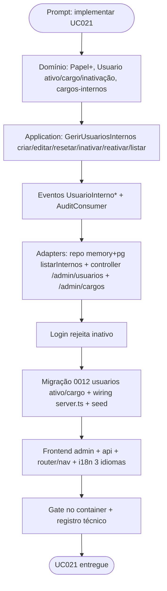

# Log de Prompt — uc021-gerir-usuarios-internos

## Prompt Original

> Vamos implementar o UC021 do @spec/docs/casos-de-uso.md em uma nova branch

---

## Interpretação

### Intenção Principal

Implementar a **UC021 — Gerir Usuários Internos (Servidores)**
([casos-de-uso.md](../../spec/docs/casos-de-uso.md#L327)) em uma branch nova
(`feature/uc021-gerir-usuarios-internos`). É a segunda UC do Bloco G (Administração), logo após a
UC020 (catálogos base). Rastreabilidade: **RF023 · RBAC §15 · RN015 · AD-35 · Story 9.7** (Épico 9).

### Entidades Identificadas

| Entidade | Tipo | Relevância |
|---|---|---|
| `Usuario` (shared/identity) | entidade de login (AD-20/AD-33) | Servidor interno **é** um `Usuario`; UC021 é o CRUD administrativo dessas contas |
| Cargo → Papel RBAC | mapeamento (§15/AD-35) | Cargo é rótulo parametrizável; **papel** é o invariante que carrega as permissões |
| `Papel` (identity-provider) | enum RBAC | Estendido com `administrador \| auditor \| dpo` (valores já autorizados por `x-papel`) |
| Reset de senha (Admin) | operação | Admin redefine a senha; usuário troca a própria depois (UC015) |
| Inativação lógica (RN015) | invariante | Servidor desligado é **inativado**, preservando a autoria histórica (AD-38) |
| Painel Admin | frontend | Tela "Usuários" do Administrador |

### Intenções Secundárias

- Distinto do **autocadastro do fornecedor** (UC001/UC015): este fluxo **não cria fornecedores**.
- Login deve **rejeitar usuário inativo** (sem enumeração de conta — mensagem genérica).
- Guard: Administrador **não pode inativar a própria conta** (evita lockout).
- Durabilidade em Postgres (migração aditiva a `usuarios`) no padrão dos incrementos anteriores.
- i18n nos 3 idiomas (pt-BR/en/es) para toda string do frontend (DEC-STR-33).

### Restrições

- Backend responde em inglês; identificadores estáveis inalterados (DEC-STR-33).
- Testes rodam **no container** (DEC-STR-34).
- PR tem base `develop` (DEC-STR-32).

### Ambiguidades e Inferências

| Ambiguidade | Inferência Adotada | Confiança |
|---|---|---|
| Cargo parametrizável (RF023) vs. mapa fixo | Mapa **canônico fixo** cargo→papel (papel = invariante AD-35); CRUD de cargos parametrizáveis = follow-up | Alta |
| Reset de senha: link vs. senha direta | Admin **define nova senha** diretamente; usuário troca via UC015 (UC021: "resetar a senha") | Alta |
| Servidor = novo cadastro vs. `Usuario` | Servidor **é** `Usuario` (única fonte de "quem loga"); UC021 estende `shared/identity` | Alta |
| `Papel` enum não cobre administrador/auditor/dpo | Estender o enum (os controllers já autorizam nesses `x-papel`) | Alta |

---

## Plano de Ação

### Passos Planejados

1. **Domínio**: estender `Papel`; `Usuario` ganha `ativo`+`cargo`, `inativar/reativar`, snapshot atualizado; mapa `cargos-internos` (cargo→papel).
2. **Application**: `GerirUsuariosInternos` (criar/editar/resetar senha/inativar/reativar/listar) com regras (unicidade de e-mail, cargo válido, guard de auto-inativação, "não é usuário interno").
3. **Eventos**: `UsuarioInternoCriado/Editado`, `UsuarioSenhaResetada`, `UsuarioInternoInativado/Reativado`; registrar no `AuditConsumer` (AD-18).
4. **Adapters**: `UsuarioRepository.listarInternos` (memory+pg), controller REST `/admin/usuarios` (+`/admin/cargos`) com RBAC `administrador`.
5. **Login**: `AutenticarLocal` rejeita usuário inativo (mensagem genérica).
6. **Migração** `0012` (aditiva: `ativo`, `cargo`) + wiring `server.ts` + atualizar `seed`.
7. **Frontend**: tela admin `GerirUsuarios`, `api`, rota + nav, i18n pt-BR/en/es, teste de componente.
8. **Gate no container** (lint+typecheck+test backend/frontend) + registro técnico em `docs/dev/`.

---

## Contexto do Projeto Aplicado

> Clean Architecture / hexagonal (AD-32/AD-33): servidores internos reusam a entidade `Usuario` de
> `shared/identity` (fonte única de login), estendida com inativação lógica (RN015) e o vínculo
> cargo→papel (AD-35). Durabilidade no padrão dos incrementos 0004..0011 (snapshot + migração +
> `pool ? pg : memory`). Skills acionadas: `prompt-logger` (este log), `protocolo-tdd` (ciclo de
> testes), `nodejs-best-practices` e `frontend-react-best-practices`.

---

## Resultado Esperado

`shared/identity` estendido com o CRUD administrativo de servidores (`GerirUsuariosInternos`),
migração 0012 (aditiva), login rejeitando inativos, tela admin "Usuários" com i18n nos 3 idiomas,
testes unit+integração+componente e gate verde no container. Rastreabilidade: UC021 · RF023 · RBAC §15
· RN015 · AD-35 · Story 9.7.
