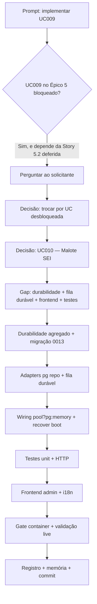

# Log de Prompt — UC010 Gerar Malote Digital (Exportação SEI)

- **Data:** 2026-07-10
- **Sequência do dia:** 002
- **Branch:** `feature/uc010-gerar-malote-sei` (a partir de `develop`)
- **Skill:** prompt-logger (DEC-STR-16)

## Prompt original (sanitizado)

> "Vamos implementar UC009 do spec/docs/casos-de-uso.md em uma nova branch"

Sem segredos, credenciais, tokens ou PII no prompt — nenhuma sanitização necessária além da omissão de contexto irrelevante.

## Interpretação semântica

O usuário pediu para implementar o **UC009 (Gerir Cadastro de Reserva)** em nova branch. Ao analisar
o contexto, identificou-se que **UC009 pertence ao Épico 5, explicitamente bloqueado** (`⚠️ Bloqueado
até ratificar Item × Lote — SMGA/TCE`) e que sua pré-condição depende da **Story 5.2 (matriz de alocação
persistida)**, deferida pelo UC008 (que entregou só o kernel puro do motor). A decisão foi levada ao
solicitante.

**Decisão do solicitante (via AskUserQuestion):**
1. Escopo do UC009 → **"Trocar por UC desbloqueada"** (mantém o bloqueio de governança do Épico 5).
2. UC alvo → **UC010 — Gerar Malote Digital (Exportação SEI)** (Must, Épico 6).

## Entidades e domínio

- **Domínio:** backend `malote/` (Fastify+TS, Clean Architecture hexagonal) + frontend admin (React+Vite).
- **UC010 / RF007 / RN008 / RNF002 · Épico 6 (Stories 6.1/6.2/6.3) · AD-6/AD-21/AD-26.**
- **Ator principal:** Analista CPL.

## Estado atual (gap analysis)

Módulo `malote/` já existe (commit hexagonal em massa), com domínio rico, aplicação, controller, repo
memory, eventos e testes. **Gap = mesma classe dos fixes 0004/0005/0007/0009/0010:**

- `Malote` sem `estado()/deEstado()` → não persistível.
- Sem `MaloteRepositoryPg` e sem migração → **core "Must" ainda só em memória**.
- **Fila só em memória** (`FilaMaloteMemory`) → jobs se perdem no restart (lacuna nomeada da Story
  6.1/6.2: "fila durável com retry, estado pendente→gerado sobrevive a restart").
- Wiring hardcoded `new MaloteRepositoryMemory()` — sem `pool ? pg : memory`.
- Sem testes HTTP (`malote-rotas.spec.ts`).
- Sem superfície de frontend (página, api, nav, i18n).

## Plano de ação

1. **Durabilidade do agregado:** `Malote.estado()/deEstado()` + `MaloteState` (AD-33).
2. **Migração `0013_init_malotes.sql`:** tabelas `malotes` (peças/fragmentos jsonb) e `malote_jobs`
   (fila durável — payload jsonb, tentativas, situação).
3. **Adapters pg:** `MaloteRepositoryPg` (upsert + QBE jsonb) e `FilaMalotePg` (enfileirar/drenar com
   retry e dead-letter; recuperação no boot — troca o array da fila por tabela, "mesma porta").
4. **Wiring** `pool ? pg : memory` no `server.ts` + recover da fila no boot.
5. **Testes:** round-trip unit `estado/deEstado` + `malote-rotas.spec.ts` (202, RBAC 403, GET, QBE,
   export idempotente, 404).
6. **Frontend admin:** página `GerarMalote.tsx` (solicitar + lista/QBE + exportar + flag peça acima do
   limite), `api.malote*`, rota `/admin/malote` + nav, i18n pt-BR/en/es (DEC-STR-33), teste de componente.
7. **Gate em container** (DEC-STR-34) + validação live contra Postgres real.
8. **Registro técnico** + atualização da memória de projeto + commit semântico.

## Fluxo de raciocínio

