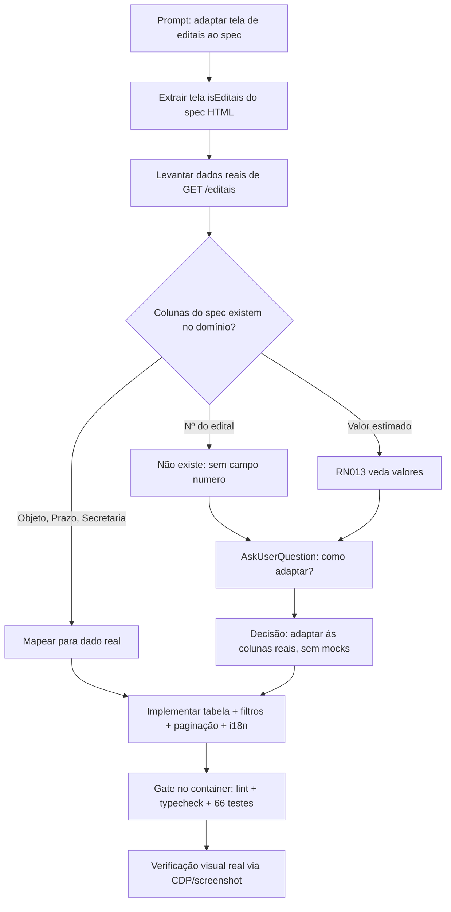

# Log de Prompt — Adaptar a Vitrine de Editais ao spec de UI

- **Data:** 2026-07-16
- **Sequência do dia:** 001
- **Branch:** `feature/layout-vitrine-editais` (a partir de `develop`)
- **Skill:** prompt-logger (DEC-STR-16)

## Prompt original (sanitizado)

> "Em uma nova branch vamos *ADAPTAR* a tela de editais com tela de editaia do @spec/AI-UI-Design/portal-fornecedor.html"

Sem segredos, credenciais, tokens ou PII no prompt — nenhuma sanitização necessária.

## Interpretação semântica

O usuário pediu para **adaptar** (ênfase dele) a tela `frontend/src/pages/publico/Editais.tsx` ao layout
da tela de editais do spec `spec/AI-UI-Design/portal-fornecedor.html`. "Adaptar" ≠ "copiar": o spec é um
protótipo HTML com dados fictícios, e a aplicação consome dados reais. O trabalho é trazer a **estrutura
visual** do spec para a tela real, sem inventar dado que o domínio não possui.

## Entidades e domínio

- **Domínio:** frontend `pages/publico/Editais.tsx` (React 19 + TanStack Query/Router + react-i18next).
- **UC003 / RN001** (vitrine filtrada por CNAE) · **UX-DR3** · **RN013** (transparência não expõe valores).
- **Ator principal:** Fornecedor (titular/procurador).
- **Fonte de layout:** `spec/AI-UI-Design/portal-fornecedor.html`, tela `isEditais` (memória: *layout-fonte-de-verdade*).

## Gap analysis — spec × dados reais

A tabela do spec tem 6 colunas: `Edital (nº) · Secretaria · Objeto · Prazo · Valor estimado · Ação`.
`GET /editais` devolve apenas `{ id, objeto, secretariaId, prazoVigencia, quantitativos }`.

| Coluna do spec | Dado real? | Resolução |
|---|---|---|
| Nº do edital (`ED-2026/003`) | **Não** — entidade e tabela `editais` não têm `numero`, só `id` opaco | Objeto vira a coluna-âncora |
| Secretaria (sigla) | Indireto — só `secretariaId` | Resolvido via `GET /catalogos/secretarias` (mesmo padrão de `Inicio.tsx`) |
| Objeto | Sim | Mantido |
| Prazo (dias) | Derivável de `prazoVigencia` | `diasAte()` + pill por urgência |
| Valor estimado | **Não** — nenhum campo monetário no domínio; **RN013 veda expor valores** | **Coluna removida**; entra `Quantitativos` (dado real) |
| Ação (Iniciar) | Sim | Mantido |

**Divergência registrada (RN013 × spec):** o protótipo exibe "Valor estimado" por edital. A RN013 do PRD
é explícita: o portal "não expõe fornecedores, **valores** nem dados pessoais". O PRD arbitra
(memória: *uc-vs-prd-arbitragem*) → a coluna não foi implementada. Reintroduzi-la exige decisão de BA/Tech
Lead + migração de schema.

## Decisões do solicitante (via AskUserQuestion)

1. Colunas sem dado real → **"Adaptar às colunas reais"** (sem mocks, alinhado ao commit anterior
   *"liga a home do fornecedor a dados reais (sem mocks)"*).
2. Extras → **banner de CNAE**, **filtro por secretaria + ordenação + paginação** e **botões de exportação**.

## Plano de ação

1. Extrair `diasAte`/cores de prazo para `lib/prazos.ts` (elimina duplicação com `Inicio.tsx`).
2. Reescrever a vitrine como tabela semântica com o styling do spec.
3. Busca (objeto/sigla), filtro por secretaria, ordenação por coluna, paginação 5/página — client-side.
4. Banner de CNAE a partir do CNAE principal do perfil real.
5. Exportação sem dependência nova: CSV (Blob + BOM) e PDF (`window.print()`).
6. i18n nos três idiomas; preservar contratos `data-cy` dos testes E2E.
7. Rodar o gate no container (`docker compose --profile test run --rm frontend-test`).

## Fluxo de raciocínio

## Rastreabilidade

- `frontend/src/pages/publico/Editais.tsx` — tela adaptada.
- `frontend/src/pages/publico/Editais.test.tsx` — 7 testes (lista, vazio, sigla, busca/ordenação, paginação, vazio de busca, banner).
- `frontend/src/lib/prazos.ts` — helper compartilhado (novo).
- `frontend/src/pages/publico/Inicio.tsx` — passa a consumir `lib/prazos.ts`.
- `frontend/src/i18n/locales/{pt-BR,en,es}.json` — chaves de `editais.vitrine`.
