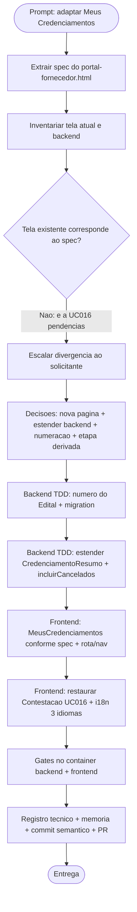

# Log de Prompt — adaptar-meus-credenciamentos-spec-ui

## Prompt Original

> Em uma nova branch vamos *ADAPTAR* o 'Meus credenciamentos" de acordo com o Meu credenciamentos do @spec/AI-UI-Design/portal-fornecedor.html

---

## Interpretação

### Intenção Principal

Adaptar a tela "Meus Credenciamentos" do Portal do Fornecedor à especificação visual/funcional
definida em `spec/AI-UI-Design/portal-fornecedor.html`, em uma nova branch (Gitflow), seguindo o
mesmo padrão da entrega anterior de vitrine de editais (commits `9790fd3`/`85444f8`).

### Entidades Identificadas

| Entidade | Tipo | Relevância |
|---|---|---|
| `spec/AI-UI-Design/portal-fornecedor.html` | Spec de UI (fonte da verdade visual) | Define a tela alvo (chips, tabela, paginação, ações) |
| `frontend/src/pages/publico/Contestacao.tsx` | Componente React | Estava rotulado "Meus Credenciamentos", mas implementa UC016 (pendências) |
| `frontend/src/pages/publico/MeusCredenciamentos.tsx` | Componente React (novo) | Tela alvo desta entrega |
| `frontend/src/router.tsx` | Roteamento/nav | Nav "Meus credenciamentos" apontava para `/contestacao` |
| `backend/src/credenciamento/application/listar-credenciamentos.ts` | Caso de uso | Projeção de leitura consumida pela tela |
| `backend/src/editais/domain/edital.ts` | Agregado | Não possuía `numero` (coluna "Edital" do spec) |
| `frontend/src/i18n/locales/{pt-BR,en,es}.json` | i18n | Toda string visível deve vir do i18n (PRJ-DEC-12) |

### Intenções Secundárias

- Corrigir o mis-wiring de nav/título: "Meus credenciamentos" apontava para a Tela Única de
  Contestação/Regularização (UC016), que lista pendências, não credenciamentos.
- Restaurar a identidade própria da tela de Contestação (UC016).
- Manter o contrato de testes (`data-cy`) e o gate de execução em container (DEC-STR-34).

### Restrições

- Prompt sem conteúdo sensível — nenhuma sanitização necessária.
- Branch nova exigida explicitamente pelo solicitante → `feature/layout-meus-credenciamentos`
  (Gitflow, base `develop` conforme PRJ-DEC-11).
- Toda string visível ao usuário deve passar pelo i18n nos 3 idiomas (PRJ-DEC-12).
- Testes rodam no container, nunca no host (PRJ-DEC-13 / DEC-STR-34).

### Ambiguidades e Inferências

| Ambiguidade | Inferência Adotada | Confiança |
|---|---|---|
| "ADAPTAR o 'Meus credenciamentos'" — a tela existente é UC016 (pendências), não credenciamentos | Escalado ao solicitante (AskUserQuestion). Decisão: **criar nova página** `MeusCredenciamentos` + corrigir a nav; Contestação (UC016) volta a ter identidade própria | Alta (decidido pelo solicitante) |
| Campos do spec ausentes no backend (número do edital, criado em, última atualização, etapa) | Escalado ao solicitante. Decisão: **estender o backend** | Alta (decidido pelo solicitante) |
| Coluna "Edital" (ED-2026/003) — agregado `Edital` não tem `numero` | Escalado. Decisão: **implementar numeração agora** (migration aditiva, formato ED-AAAA/NNN, sequência por ano, unicidade, exposição no UC005) | Alta (decidido pelo solicitante) |
| "Etapa n/5" + ação "Continuar" (retomar de onde parou) — backend não persiste progresso do wizard | Escalado. Decisão: **derivar do estado** (iniciado → Em andamento; aceito → Finalizado; cancelado → Cancelado). Sem coluna Etapa; retomada real vira backlog | Alta (decidido pelo solicitante) |
| Spec tem 5 etapas; o wizard real tem 4 | Divergência esperada: prova de vida (UC007) está fora do MVP. Não replicar a 5ª etapa | Alta |

---

## Plano de Ação

### Passos Planejados

1. **Extração do spec**: mapear estrutura, strings, tokens e comportamento da tela alvo no HTML de spec.
2. **Inventário e divergência**: identificar que `/contestacao` (UC016) carregava o rótulo "Meus
   Credenciamentos"; escalar ao solicitante em vez de assumir.
3. **Backend — numeração do Edital**: `numero` no agregado + `EditalState`, geração ED-AAAA/NNN com
   sequência por ano e unicidade, migration aditiva, exposição no UC005, backfill dos existentes.
4. **Backend — projeção de leitura**: estender `CredenciamentoResumo` com `numeroEdital`, `criadoEm`,
   `atualizadoEm` (de `EntidadeBase`, sem migration) e sigla da secretaria (catálogo UC020);
   parâmetro `incluirCancelados` na rota (o chip "Cancelados" do spec exige).
5. **Frontend — tela alvo**: `MeusCredenciamentos.tsx` fiel ao spec (chips com contagem, busca,
   export Excel/PDF, tabela ordenável, badges de status, paginação de 5, estado vazio), rota
   `/credenciamentos` e nav corrigida.
6. **Frontend — Contestação**: restaurar título/subtítulo próprios do UC016 e seu item de nav.
7. **i18n**: chaves novas nos 3 idiomas (pt-BR, en, es).
8. **Gates no container**: `docker compose --profile test run --rm backend-test` e `frontend-test`.
9. **Fechamento**: registro técnico (review-documentation), memória de projeto, commit semântico
   (commit-writer) e PR contra `develop`.

---

## Contexto do Projeto Aplicado

> Protocolo comum obrigatório de `.github/agents/AGENTS.md` (memórias, prompt-logger, TDD,
> review-documentation, commit-writer). Skill `.github/skills/protocolo-tdd/` como referência
> operacional (Red-Green-Refactor, pirâmide 70/20/10, `data-cy` estáveis).
> `frontend-react-best-practices` para a stack React/Vite detectada.
> PRJ-DEC-11 (PR base `develop`), PRJ-DEC-12 (i18n obrigatório nos 3 idiomas; backend responde em
> inglês), PRJ-DEC-13/DEC-STR-34 (suite roda no container).
> Memória do usuário: layout segue os 3 HTML de `spec/AI-UI-Design` (Poppins) como fonte de verdade.
> Nota de correção: PRJ-DEC-10 registrou "Meus Credenciamentos" como refeita no refresh de UI, mas na
> prática o rótulo foi aplicado sobre a tela de UC016 — esta entrega corrige o registro.

---

## Resultado Esperado

- Nova branch `feature/layout-meus-credenciamentos`.
- Backend: `numero` no agregado `Edital` (+ migration + geração + exposição no UC005);
  `CredenciamentoResumo` estendido; rota de leitura com `incluirCancelados`.
- Frontend: `MeusCredenciamentos.tsx` fiel ao spec em `/credenciamentos`, nav corrigida,
  `Contestacao.tsx` com identidade UC016 restaurada, i18n nos 3 idiomas.
- Testes: unitários + integração (backend) e de componente (frontend), gates verdes no container.
- Registro técnico em `docs/dev/`, memória de projeto atualizada, commit semântico e PR para `develop`.
