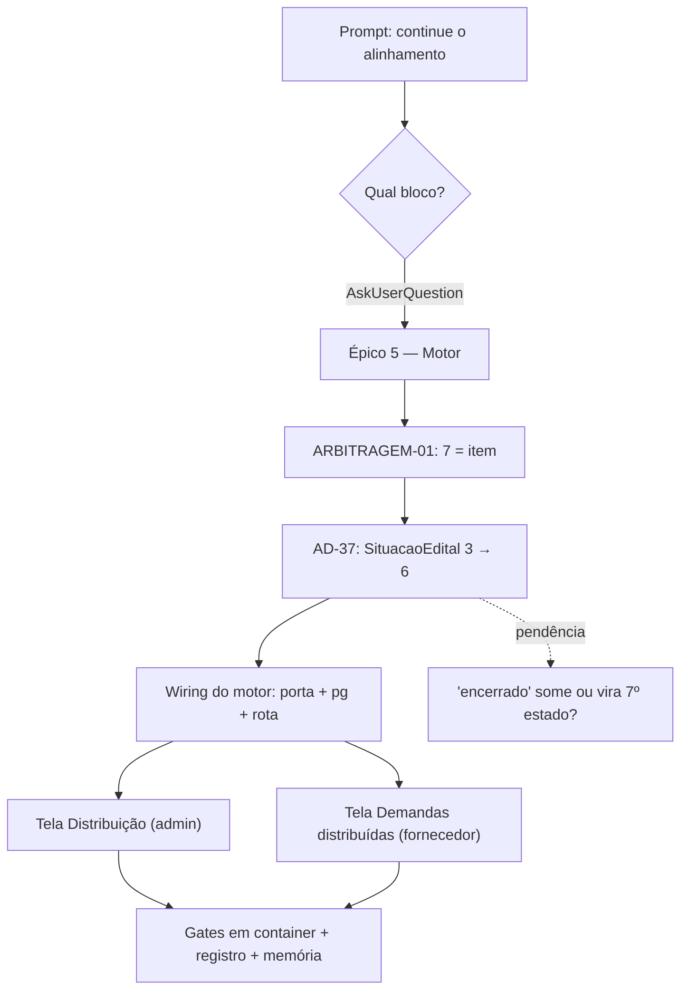

# Log de Prompt — alinhar-implementacao-epico5-motor-distribuicao

## Prompt Original

> @tech-lead realizei a atualização na documentação do projeto a nova documentação está na pasta spec. Continue a alinhar as implemetações com a documentação

---

## Interpretação

### Intenção Principal

**"Continue"** — dar sequência ao alinhamento código × `spec/docs/` iniciado em
[2026-07-17_001](2026-07-17_001_alinhar-implementacao-spec-fase2-ad20.md). Aquele log cobriu o
**Bloco Segurança** (AD-20 identidade por JWT + AD-19 PII/consentimento), hoje mergeado
(PR #55, commits `ef18405` e `231b0ba`). A demanda não mudou; mudou o bloco.

### Escopo decidido pelo solicitante (AskUserQuestion)

**Épico 5 — Motor de Distribuição**, escolhido entre 4 opções (as outras: paleta institucional
`#0061AE`/Story 9.3; rotas sem RBAC expostas pelo AD-20; renumeração RF/UC da arbitragem 3).

Motivo declarado na opção: é a razão de existir do produto, está parado desde junho com o cálculo
pronto e testado, e a [ARBITRAGEM-01](../../spec/docs/ARBITRAGEM-01.md) (resposta **7 = item**,
2026-07-16) destravou.

### Estado verificado antes de agir (não presumido)

| Afirmação da spec | Verificação | Resultado |
|---|---|---|
| `motor.ts` implementado e importado por ninguém | `grep -rn "distribuicao/domain/motor" backend/src` | ✅ **zero hits** — confirmado |
| `SituacaoEdital` tem 3 estados; AD-37 exige 6 | `backend/src/editais/domain/edital.ts:4` | ✅ `'rascunho' \| 'publicado' \| 'encerrado'` |
| Paleta ainda navy (D1 aberta) | `frontend/src/design-system/tokens.ts:8-10` | ✅ `#0A2A52`/`#0E3A6E`/`#14467F` |
| 6 rotas com ID de demonstração | `frontend/src/router.tsx:34-36,66-78` | ✅ `DEMO_FORNECEDOR_ID`/`DEMO_EDITAL_ID`/`DEMO_SECRETARIA_ID` |

### Entidades Identificadas

| Entidade | Tipo | Relevância |
|---|---|---|
| `spec/docs/ARBITRAGEM-01.md` | Ofício respondido | **7 = item** destrava o Épico 5; §"Consequências" lista a ordem de dependência |
| `backend/src/distribuicao/domain/motor.ts` | Domínio pronto, órfão | Função pura (AD-7), determinística (AD-24) — falta wiring |
| `backend/src/editais/domain/edital.ts` | Máquina de estado | **Pré-condição:** AD-37 exige 3→6 estados; as telas leem estados que o domínio rejeita |
| `spec/Prototipo/*.html` | Contrato de UX (artefato) | Telas Distribuição e Demandas distribuídas ratificadas, zero código |
| `spec/docs/epics.md` §Épico 5 | Fila canônica | 4 histórias (5.1–5.4); **ainda marcado "Bloqueado"** — marcador desatualizado |

### Riscos sinalizados

- **AD-37 é pré-condição, não item paralelo:** alargar `SituacaoEdital` toca domínio, adapter pg,
  migração, controllers, testes, frontend e i18n. Fazer as telas antes seria construir sobre estado
  que o domínio recusa com `TransicaoInvalida`.
- **`encerrado` não tem contrapartida** nos 6 estados do AD-37 — decidir se some ou vira o 7º.
  É arbitragem de domínio, não escolha de implementação.
- **Régua vigente (2026-07-16):** o que já está em código **permanece**; o que é novo no HTML vira
  trabalho definido. O bundle propõe, o código tem defesa.
- **Documentação desatualizada pela própria arbitragem:** `epics.md` e `ARCHITECTURE-SPINE.md`
  §Questões Abertas ainda declaram o Épico 5 bloqueado por Item × Lote — resolvido em 2026-07-16.

### Ambiguidades

- **"Continue"** não nomeia o bloco. Resolvido por `AskUserQuestion`, seguindo o precedente da
  sessão anterior e as pendências marcadas *"decisão do solicitante"* na memória de projeto.

### Sanitização

Nenhum segredo, credencial ou dado pessoal no prompt. Nada a sanitizar.

---

## Plano de Ação

1. Auditar o contrato do Épico 5 em 4 eixos paralelos (motor, máquina de estado, mockups,
   requisitos RF/RN/AD/UC).
2. Sequenciar as entregas e submeter divergências ao solicitante (incl. o destino de `encerrado`).
3. **AD-37** — alargar a máquina de estado 3→6 (pré-condição), via TDD e migração.
4. **Wiring do motor** — porta, adapter pg, caso de uso, controller e rota; persistência canônica
   append-only (Story 5.2, AD-10/AD-24).
5. **Telas** — Distribuição (admin) e Demandas distribuídas (fornecedor), conforme bundle.
6. Atualizar `epics.md` / `ARCHITECTURE-SPINE.md` removendo os marcadores de bloqueio vencidos.
7. Gates em container (DEC-STR-34), registro técnico e memória.

