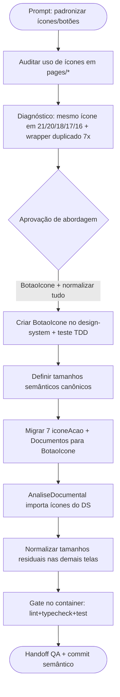

# Log de Prompt — padronizar-icones-botoes-telas

## Prompt Original

> Tech lead os icones dos botões de todas as telas não estão padronizados uns estão maiores outros menores e botões que fazem a mesma coisa estão diferentes.

(Acompanhado de captura da tela **Gestão de Fornecedores** mostrando os botões de ação da linha — olho / lápis / bloquear.)

---

## Interpretação

### Intenção Principal

Padronizar os ícones dos botões em todas as telas do frontend: hoje o mesmo ícone é
renderizado em tamanhos diferentes de tela para tela, e botões que executam a mesma ação
(ex.: "ver detalhes", "editar", "fechar modal", "exportar") têm aparência e wrapper
divergentes. O objetivo é uma linguagem visual consistente ancorada no design-system.

### Entidades Identificadas

| Entidade | Tipo | Relevância |
|---|---|---|
| `frontend/src/design-system/icons.tsx` | arquivo | Fonte dos ícones SVG; `base()` já define default 20px |
| `frontend/src/design-system/components/Botao.tsx` | componente | Botão de texto do DS; não cobre botão só-ícone |
| `iconeAcao` (const) | estilo duplicado | Copiado idêntico em 7 páginas admin; wrapper 40×40 do botão de ação |
| `acaoIconeStyle` (Documentos) | estilo | Variante própria do mesmo wrapper, com ícone 17px |
| `AnaliseDocumental.tsx` | página | Redefine ícones SVG localmente em vez de importar do DS |
| `pages/admin/*`, `pages/publico/*` | páginas | Consumidores dos ícones/botões a normalizar |

### Intenções Secundárias

- Eliminar a duplicação do wrapper `iconeAcao` (7 cópias) centralizando no design-system.
- Definir tamanhos semânticos canônicos por contexto de uso (ação em linha, toolbar, fechar modal, inline).
- Fazer `AnaliseDocumental` consumir os ícones compartilhados.
- Preservar todos os `data-cy`, `aria-label`, `title` e a lógica existente (contrato de testes).

### Restrições

- Toda string visível vem do i18n (DEC-STR-33); esta mudança é visual/estrutural e não deve introduzir texto hardcoded.
- Suite de testes roda no container (DEC-STR-34): `docker compose --profile test run --rm frontend-test`.
- Governança: escolha do solicitante por **protocolo completo** (prompt-logger, memória, ciclo Senior→QA, commit semântico).
- PR base `develop` (PRJ-DEC-11); branch de trabalho a partir de `develop`.

### Ambiguidades e Inferências

| Ambiguidade | Inferência Adotada | Confiança |
|---|---|---|
| "todas as telas" — escopo total? | Solicitante confirmou: componente `BotaoIcone` + normalizar tudo (admin + público) | Alta |
| Tamanho canônico correto | Ação em linha/toolbar = 18px; fechar modal = 20px; inline em botão de texto = 16px; nav = 20px (default do `base`) | Média |

---

## Plano de Ação

### Passos Planejados

1. **Auditoria** (concluída): censo de `Icone* width={...}` em `pages/` e mapeamento dos wrappers.
2. **`BotaoIcone`**: novo componente no design-system encapsulando o wrapper 40×40 + tamanho de ícone padrão, com teste (TDD).
3. **Tamanhos canônicos**: padronizar `IconeOlho/Lapis/Bloquear/Power` = 18; `IconeFechar` de modal = 20; toolbar = 18; inline = 16.
4. **Migração**: substituir os 7 `iconeAcao` e o `acaoIconeStyle` do Documentos pelo `BotaoIcone`.
5. **AnaliseDocumental**: remover ícones locais e importar do design-system.
6. **Gate**: `docker compose --profile test run --rm frontend-test` (lint + typecheck + vitest).
7. **Fechamento**: handoff QA e commit semântico via convenção do projeto.

---

## Contexto do Projeto Aplicado

> Conforme CLAUDE.md e `MEMORIA-PROJETO.md` (PRJ-DEC-10), o design-system navy/âmbar (Poppins)
> é a fonte da linguagem visual, com `icons.tsx` já centralizando os glyphs. A refatoração
> reforça essa centralização criando o wrapper de botão-ícone que hoje está duplicado.
> Segue DEC-STR-33 (i18n), DEC-STR-34 (testes no container) e o ciclo de developer com gates de QA.

---

## Resultado Esperado

Novo componente `BotaoIcone` no design-system; 7 páginas admin + Documentos migradas para ele;
`AnaliseDocumental` consumindo ícones compartilhados; tamanhos de ícone uniformizados por contexto
semântico; testes/lint/typecheck verdes no container; handoff QA e commit semântico.
