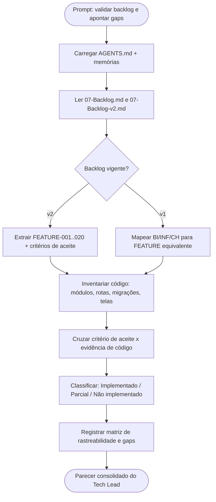

# Log de Prompt — validar-backlog-implementacao

## Prompt Original

> @tech-lead valide os arquivos em /home/sales/compraMais/spec/Backlog e check o que não está implementada

---

## Interpretação

### Intenção Principal

O solicitante quer que o Tech Lead audite os artefatos de backlog (`spec/Backlog/07-Backlog.md` e `spec/Backlog/07-Backlog-v2.md`), verifique a consistência interna deles e cruze cada item com o código real da branch `main`, produzindo o recorte do que **não** está implementado (ou está parcialmente implementado).

### Entidades Identificadas

| Entidade | Tipo | Relevância |
|---|---|---|
| `spec/Backlog/07-Backlog.md` | artefato (backlog v1) | Backlog original por Release (BI-001..009, INF, CH) |
| `spec/Backlog/07-Backlog-v2.md` | artefato (backlog v2) | Backlog vigente por Épicos (FEATURE-001..020) |
| `backend/src/**` | código | Fonte de verdade da implementação de domínio/aplicação/adapters |
| `frontend/src/**` | código | Fonte de verdade das telas e do contrato de UI |
| `backend/migrations/*.sql` | código/dados | Evidência de durabilidade por feature |
| `.github/agents/memoria/MEMORIA-PROJETO.md` | memória | Estado declarado das UCs entregues e backlog aberto |

### Intenções Secundárias

- Sinalizar divergências entre os dois backlogs (v1 x v2) e entre backlog e implementação.
- Priorizar o gap remanescente para o MVP (Fase 1) e apontar o próximo incremento.
- Registrar o resultado como artefato rastreável, não apenas resposta em chat.

### Restrições

- Auditoria **somente leitura**: nenhuma alteração de código nesta demanda.
- Verificação por inspeção de código/rotas/migrações; a execução da suíte em container não foi disparada (não há mudança para validar).
- Idioma dos documentos formais: português do Brasil (AGENTS.md §29).

### Ambiguidades e Inferências

| Ambiguidade | Inferência Adotada | Confiança |
|---|---|---|
| "valide os arquivos" | Validar consistência interna dos backlogs (rastreabilidade RF/HU/UC, duplicidade v1 x v2) **e** aderência ao código | Alta |
| Qual backlog é o vigente | `07-Backlog-v2.md` é o vigente (Validação 01, 2026-07-03); v1 tratado como legado e mapeado para v2 | Alta |
| "não está implementada" | Inclui também "parcialmente implementada" (mecanismo existe, critério de aceite não fecha) | Alta |
| Branch de referência | `main` (branch atual, limpa, com `develop` já mergeada em `0faaf07`) | Alta |

---

## Plano de Ação

### Passos Planejados

1. **Protocolo**: carregar `AGENTS.md`, `MEMORIA-COMPARTILHADA.md` e `MEMORIA-PROJETO.md` para recuperar decisões ativas e UCs já entregues.
2. **Leitura dos backlogs**: ler os dois arquivos de `spec/Backlog/` e determinar o vigente.
3. **Inventário de código**: mapear módulos do backend, rotas registradas em `server.ts`, migrações aplicadas e telas/rotas do frontend.
4. **Cruzamento por critério de aceite**: para cada FEATURE, buscar a evidência concreta (arquivo/rota/migração/tela) que satisfaz o critério declarado.
5. **Classificação e gaps**: consolidar matriz de rastreabilidade com status e apontar o gap de MVP.
6. **Registro**: publicar o parecer em `docs/dev/2026-07-23-auditoria-backlog-vs-implementacao.md` e atualizar a memória de projeto.

---

## Contexto do Projeto Aplicado

> Protocolo comum de `.github/agents/AGENTS.md` (carregamento de memórias, prompt-logger obrigatório, idioma PT-BR dos artefatos de governança) e persona do `tech-lead.agent.md` (revisão consolidada, rastreabilidade e registro explícito de divergências entre artefatos e implementação). A auditoria reusa o método já aplicado no "Nivelamento código x doc" de 2026-07-17 (`docs/dev/2026-07-17-backlog-nivelamento-spec-codigo.md`), agora com o backlog v2 como eixo. Nenhuma alteração de código foi feita, então as skills `protocolo-tdd` e `review-documentation` não geram ciclo de entrega nesta demanda.

---

## Resultado Esperado

Parecer consolidado do Tech Lead com: (a) validação dos dois arquivos de backlog e suas divergências internas; (b) matriz FEATURE-001..020 com status Implementado/Parcial/Não implementado e evidência de código; (c) mapeamento do backlog v1 (BI/INF/CH) para o v2; (d) lista priorizada do que falta para fechar a Fase 1 (MVP).
