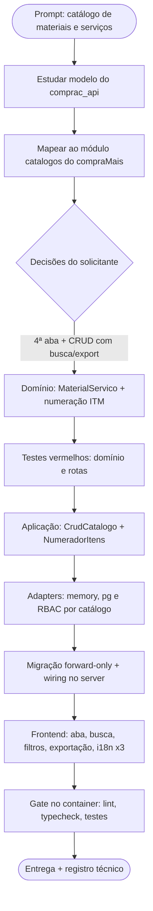

# Log de Prompt — catalogo-materiais-servicos-smga

## Prompt Original

> @tech-lead basedo no projeto @../comprac_api, implement o catálogo de materiais e servidos disponível no perfil SGMA e acessível no menu catalogo

---

## Interpretação

### Intenção Principal

Implementar no compraMais um **catálogo de materiais e serviços** — itens que a Administração compra/contrata — usando o modelo do projeto de referência `comprac_api` como base conceitual. O catálogo deve ser mantido pelo perfil **SMGA** (Secretaria/Gestor) e alcançável pelo item de menu **Catálogos** do Painel Admin.

### Entidades Identificadas

| Entidade | Tipo | Relevância |
|---|---|---|
| `comprac_api` `src/domain/catalogo/item-catalogo.ts` | referência | Modelo do agregado: `numero`, `nome`, `especificacoesTecnicas`, `unidades[]`, `status`, `ativo`, `tipo` (MATERIAL\|SERVICO) |
| `comprac_api` `src/resources/catalogo/catalogo.controller.ts` | referência | Superfície REST: listar com busca/status, criar, atualizar, alternar ativo, exportar |
| `backend/src/catalogos/` | módulo | Módulo UC020 já existente ("uma jornada, três catálogos") — base abstrata `ItemCatalogo`, `CrudCatalogo<T>`, controller parametrizado por `:catalogo` |
| `backend/src/permissoes/domain/tela-admin.ts` | política | `catalogos` já consta em `VISIBILIDADE_PADRAO.smga` — o menu já é do SMGA |
| `frontend/src/pages/admin/ManterCatalogos.tsx` | tela | Tela config-driven em `/admin/catalogos`, destino da nova aba |
| `frontend/src/lib/exportar.ts` | utilitário | Exportação client-side já compartilhada por Editais e Meus Credenciamentos |

### Intenções Secundárias

- Reusar a infraestrutura de catálogo já existente em vez de criar um módulo paralelo.
- Manter o padrão de durabilidade do projeto (`pool ? pg : memory` + migração forward-only).
- Manter a trilha de auditoria (AD-18) e a inativação lógica (RN015) como nos demais catálogos.

### Restrições

- **RBAC:** as escritas de `/catalogos/*` hoje exigem `administrador`; o perfil `smga` receberia 403. O novo catálogo precisa admitir `smga` — mudança de política a ser feita de forma cirúrgica, sem alterar o contrato dos três catálogos base.
- **Protocolo TDD** obrigatório (`.github/skills/protocolo-tdd/`) e execução da suíte **no container** (DEC-STR-34).
- **i18n:** toda string visível nos três idiomas (PRJ-DEC-12); backend responde em inglês.
- O `comprac_api` é NestJS/TypeORM; o compraMais é Fastify + arquitetura hexagonal própria — a referência vale como **modelo de domínio**, não como código a portar.

### Ambiguidades e Inferências

| Ambiguidade | Inferência Adotada | Confiança |
|---|---|---|
| "SGMA" | Erro de digitação de **SMGA** (papel `smga` = Secretaria/Gestor) | Alta |
| "menu catalogo" | Item de menu **Catálogos** (`common.nav.catalogos` → `/admin/catalogos`) | Alta — confirmado pelo solicitante |
| Onde a tela vive | **4ª aba em `/admin/catalogos`** | Alta — decidido pelo solicitante via AskUserQuestion |
| Escopo do incremento | **CRUD + busca/filtros + exportação**, criação direta como Ativo (sem workflow Pendente→Aprovar) | Alta — decidido pelo solicitante |
| Status `Pendente` da referência | **Fora de escopo**: na referência ele só existe porque o fornecedor pode sugerir itens; sem esse fluxo, não haveria produtor do estado | Alta |
| Formato da numeração | `ITM-AAAA/NNN` (padrão do projeto, como `ED-AAAA/NNN`), não `ITM-AAAA-NNN` da referência | Média — consistência interna vence a cópia literal |

---

## Plano de Ação

### Passos Planejados

1. **Domínio**: `MaterialServico extends ItemCatalogo` com `numero`, `nome` (chave natural), `tipo`, `especificacoes`, `unidades[]`; validações e `estado()/deEstado()` (AD-33).
2. **Numeração**: porta `NumeradorItens` + adaptadores memory/pg com reserva atômica por ano (mesmo padrão de `NumeradorEditais`).
3. **Aplicação**: nova instância de `CrudCatalogo` na fachada `ManterCatalogos`; `CatalogoDef.criar` passa a admitir retorno assíncrono (a numeração consulta o banco).
4. **Adapters**: `MaterialServicoRepositoryPg`, evento com discriminador `material-servico`, e **perfis de escrita por catálogo** no controller (`materiais-servicos` → administrador + smga).
5. **Persistência**: migração `0027` (tabela + sequência + índices únicos) e wiring `pool ? pg : memory`.
6. **Frontend**: 4ª aba em `ManterCatalogos` com campos novos (textarea, lista de unidades), busca, filtro por tipo/situação e exportação; i18n nos três idiomas.
7. **Validação**: gate `docker compose --profile test` (lint + typecheck + testes) nos dois serviços.

---

## Contexto do Projeto Aplicado

> Protocolo comum de `.github/agents/AGENTS.md` (memórias, prompt-logger, PT-BR nos artefatos de governança) e persona do `tech-lead.agent.md`. Desenvolvimento sob `.github/skills/protocolo-tdd/` (ciclo Red-Green) e `.github/skills/review-documentation/` para o registro técnico. Arquitetura hexagonal do projeto: domínio puro → aplicação (portas) → adapters, com `pool ? pg : memory` e migrações forward-only (AD-28/AD-33). RBAC por JWT (PRJ-DEC-14) e i18n obrigatório no frontend (PRJ-DEC-12). O `comprac_api` entra como **fonte do modelo de domínio**, não como código portado — as stacks divergem (NestJS/TypeORM × Fastify/pg).

---

## Resultado Esperado

Catálogo de materiais e serviços operante: agregado, numeração automática, persistência durável, rotas com RBAC de SMGA, aba na tela de Catálogos com busca, filtros e exportação, i18n nos três idiomas, coberto por testes de domínio e de rota, com o gate do container verde.
