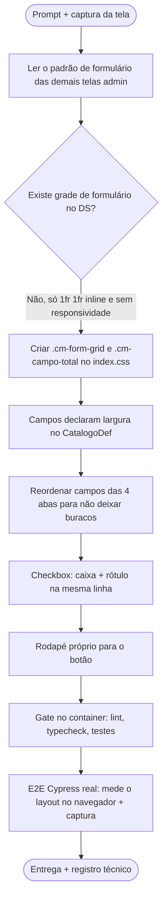

# Log de Prompt — ajustar-disposicao-campos-catalogos

## Prompt Original

> @ux-expert ajuste a disposição dos campo em http://localhost:5173/#/admin/catalogos, veja imagem
>
> _(acompanhado de captura da tela "Catálogos base", aba "Materiais e serviços", mostrando os quatro campos empilhados numa coluna estreita à esquerda e o restante do cartão vazio)_

---

## Interpretação

### Intenção Principal

Corrigir a **disposição (layout) dos campos** do formulário da tela `/admin/catalogos`. A captura evidencia o defeito: os campos estão empilhados numa coluna única de 480px, deixando aproximadamente dois terços da largura do cartão vazios, com o botão "Adicionar item" esticado à largura da coluna.

### Entidades Identificadas

| Entidade | Tipo | Relevância |
|---|---|---|
| `frontend/src/pages/admin/ManterCatalogos.tsx` | tela | Formulário config-driven dos 4 catálogos — onde o layout é definido |
| `frontend/src/index.css` | Design System | Fonte única de tokens e grades utilitárias (`.cm-grid-*`) |
| `frontend/src/pages/admin/{TiposArquivos,GerirEditais,Secretarias}.tsx` | referência interna | Já usam grade de 2 colunas em formulários admin — padrão a seguir |
| Captura da tela enviada pelo solicitante | evidência | Define o defeito observado |

### Intenções Secundárias

- Manter o formulário legível: aproveitar a largura **sem** transformar os campos em linhas longas demais.
- Preservar o comportamento responsivo (colapsar em coluna única em telas estreitas).
- Não quebrar o contrato de testes (`data-cy`) já existente na tela.

### Restrições

- Alteração **apenas de apresentação**: nenhuma mudança de contrato de API, domínio ou i18n de conteúdo.
- Gate no container obrigatório (DEC-STR-34) e protocolo TDD para código.
- A tela é config-driven para 4 catálogos — o ajuste precisa servir a todos, não só à aba da captura.

### Ambiguidades e Inferências

| Ambiguidade | Inferência Adotada | Confiança |
|---|---|---|
| "ajuste a disposição dos campos" | Reorganizar em grade de 2 colunas do Design System, com campos longos ocupando a linha inteira | Alta — é o defeito visível na imagem e o padrão já usado nas demais telas admin |
| Escopo: só a aba "Materiais e serviços"? | **Todas as 4 abas** — o formulário é o mesmo componente; corrigir só uma deixaria as outras três com o defeito | Alta |
| Alinhamento dos checkboxes (aba Tipos de documento) | Incluído: caixa e rótulo na mesma linha é disposição de campo, exatamente o que foi pedido | Média |
| Largura máxima do formulário | 880px — duas colunas de ~420px, comparáveis à coluna única atual, sem linhas longas demais em telas largas | Média |

---

## Plano de Ação

### Passos Planejados

1. **Levantar o padrão interno**: verificar como `TiposArquivos`, `GerirEditais` e `Secretarias` dispõem campos (grade `1fr 1fr`, campos longos na linha inteira).
2. **Promover ao Design System**: criar `.cm-form-grid` e `.cm-campo-total` em `index.css`, com colapso responsivo no mesmo breakpoint das demais grades (920px) — as grades inline das outras telas não colapsam.
3. **Declarar a largura por campo** em `CampoDef` (`largura: 'total'`) e reordenar os campos das quatro abas para não sobrar meia linha vazia.
4. **Corrigir o checkbox**: caixa e rótulo na mesma linha, com área de clique.
5. **Rodapé do formulário**: botão com largura própria, não esticado.
6. **Validar**: gate no container + spec Cypress que mede posições reais no navegador e captura evidência.

---

## Contexto do Projeto Aplicado

> Persona `ux-expert.agent.md` (coerência com o Design System, `docs/ux/design-system.md`) e protocolo comum de `AGENTS.md`. Decisão D2 registrada na memória de projeto elege `index.css` como fonte única de tokens — por isso a grade nova entra lá, e não em `tokens.ts`. Protocolo TDD adaptado ao domínio visual: como o teste de componente em jsdom não calcula layout, a verificação é um spec Cypress que mede `getBoundingClientRect()` no navegador real, atacando a lacuna "E2E Cypress a validar" recorrente na memória de projeto. Gate no container conforme DEC-STR-34.

---

## Resultado Esperado

Formulário da tela de Catálogos em grade de duas colunas, aproveitando a largura do cartão, com campos longos na linha inteira, checkboxes alinhados, botão com largura própria e colapso para coluna única em telas estreitas — validado por E2E real com capturas de evidência.
