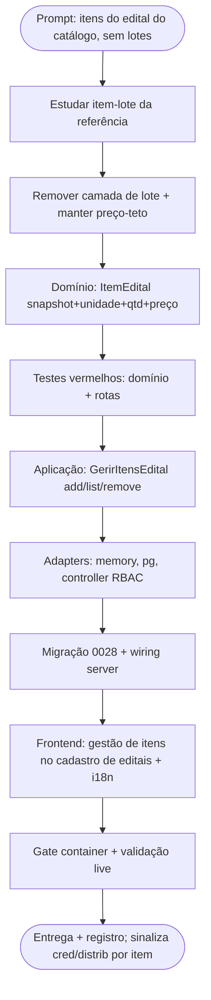

# Log de Prompt — itens-do-edital-catalogo-sem-lotes

## Prompt Original

> @tech-lead no cadastro de editais deve ser possível cadastrar os itens do edital, a partir do catálogo de bens e serviços, sem lotes, use como modelo de implementação o cadastro de editais em ../comprac_api

Decisões do solicitante (AskUserQuestion):
1. **Item do edital tem preço-teto** (valor monetário unitário), como na referência.
2. **Credenciamento e distribuição devem ser realizados por item** (resposta livre — direção-alvo do modelo).

## Interpretação

### Intenção Principal

Permitir que, no cadastro de um edital, o gestor **adicione os itens do edital escolhendo-os do catálogo de materiais e serviços** (UC020 · 4º catálogo), **sem a camada de lotes** da referência `comprac_api`. Cada item guarda a referência ao catálogo, a unidade de medida, a quantidade e o preço-teto unitário.

### Escopo desta entrega x direção-alvo (decisão do Tech Lead)

A resposta 2 ("credenciamento e distribuição por item") descreve um **modelo-alvo maior** — tornar o item a unidade de credenciamento e de rateio do Motor (Épico 5), hoje **bloqueado** e operando sobre o agregado `quantitativos`. Reescrever credenciamento + Motor para operar por item é um épico à parte.

**Entrega agora (o pedido literal):** o **cadastro dos itens do edital** — full-stack, com preço-teto, quantidade e unidade — modelado de forma a ser o substrato do credenciamento/distribuição por item. **Não** altera o Motor nem o `quantitativos` agregado (Épico 5 bloqueado); isso é o incremento seguinte, explicitamente sinalizado.

### Entidades Identificadas

| Entidade | Tipo | Relevância |
|---|---|---|
| `comprac_api` `item-lote-edital.ts` + `adicionar-item-lote.use-case.ts` | referência | Modelo do item: snapshot do catálogo, unidade ∈ unidades do produto, preço-teto, validações |
| `backend/src/editais/domain/edital.ts` | agregado | Onde os itens se acoplam (edital) |
| `backend/src/catalogos/domain/material-servico.ts` | catálogo | Fonte dos itens (nome, unidades, especificações, ativo) |
| `frontend/src/pages/admin/GerirEditais.tsx` | tela | Cadastro de editais — recebe a gestão de itens |

### Restrições

- **Sem lotes** (decisão explícita do solicitante) → o item acopla direto ao edital.
- **Preço-teto entra**, mas **RN013** exige que o portal público de transparência exponha só agregados não-identificáveis: os preços de item **não podem** chegar à projeção pública (`Transparencia` hoje só expõe contagem de editais, secretarias e CNAEs — não toca itens; a guardar).
- Itens editáveis só enquanto o edital está em **rascunho** (espelha "rascunho/suspenso" da referência; o ciclo do compraMais é rascunho→publicado→encerrado).
- Protocolo TDD; gate no container (DEC-STR-34); i18n nos 3 idiomas (PRJ-DEC-12); RBAC por JWT (PRJ-DEC-14).

### Ambiguidades e Inferências

| Ambiguidade | Inferência Adotada | Confiança |
|---|---|---|
| "cadastrar os itens" | Adicionar / listar / remover itens de um edital em rascunho | Alta |
| Preço-teto | Incluído (decisão do solicitante); `numeric(15,2)`, > 0 | Alta |
| Relação com `quantitativos`/Motor | Item carrega quantidade própria; `quantitativos` e Motor **intactos** neste incremento; per-item cred/distribuição = épico seguinte | Média — arbitragem do Tech Lead sobre a resposta livre |
| Publicar exige itens? | **Não** neste incremento (mantém aditivo; editais atuais sem itens seguem publicáveis) | Média |
| Numeração do item | Sequencial 1..N dentro do edital (monotônica; não reusa após remoção) | Alta |

## Plano de Ação

### Passos

1. Domínio `ItemEdital` (snapshot do catálogo, unidade, quantidade, preço-teto; `estado()/deEstado()` AD-33).
2. Aplicação `GerirItensEdital` (adicionar/listar/remover) + porta de repositório + lookup do catálogo; regras da referência menos lote.
3. Adapters memory/pg + controller `/editais/:id/itens` (RBAC `PERFIS_GESTAO`).
4. Migração `0028_init_edital_itens.sql` (forward-only) + wiring `pool ? pg : memory`; evento na trilha (AD-18).
5. Frontend: no cadastro de editais, gestão de itens (dropdown do catálogo → unidade → quantidade → preço-teto; listar/remover) para editais em rascunho; i18n 3 idiomas.
6. Gate no container + validação live contra Postgres.

## Contexto do Projeto Aplicado

> Arquitetura hexagonal (domínio → aplicação → adapters), `pool ? pg : memory`, migrações forward-only (AD-28/AD-33), RBAC por JWT (PRJ-DEC-14), i18n (PRJ-DEC-12), trilha append-only (AD-18). `comprac_api` como **modelo de domínio** (não código portado; stacks divergem). Reusa o catálogo de materiais e serviços entregue em UC020 (2026-07-23). Protocolo TDD e `review-documentation` para o registro.

## Resultado Esperado

No cadastro de editais, o gestor adiciona itens vindos do catálogo (unidade validada, quantidade, preço-teto), lista e remove enquanto o edital está em rascunho; itens duráveis em Postgres, na trilha de auditoria, cobertos por testes; gate do container verde; per-item credenciamento/distribuição sinalizado como épico seguinte.
