# Log de Prompt — remover-quantitativo-edital

## Prompt Original

> os editais não deve mais ter o campo Quantitativo, os quantitativos apenas os dos itens dos editais

Decisão do solicitante (AskUserQuestion): nas listas de edital (vitrine e gestão), **remover a coluna de quantidade** — a quantidade passa a viver por item.

## Interpretação

### Intenção Principal

O edital **deixa de ter** o campo agregado `quantitativos`. A quantidade passa a existir **apenas nos itens do edital** (cada `ItemEdital` já tem sua `quantidade`, entregue em 2026-07-24). Continuação direta da direção "credenciamento e distribuição por item".

### Consequências (mapeadas no código)

| Consumidor de `edital.quantitativos` | Tratamento |
|---|---|
| Domínio `Edital` (state/criar/editar/validação de publicação) | Remove o campo e o requisito de publicação |
| `EditalRepositoryPg`/memory + migração | Drop da coluna |
| Controllers de gestão/vitrine + `gerir-editais`/`buscar-editais` | Remove do payload e das projeções |
| **Motor de Distribuição** (`ExecutarDistribuicao`, `ResumoDistribuicaoEdital`) | Demanda passa a ser **Σ quantidade dos itens** (única fonte possível) |
| Frontend: form "Novo edital", lista/detalhe da gestão, vitrine | Remove o campo/coluna de quantidade |

### Restrições

- Protocolo TDD; gate no container (DEC-STR-34); i18n 3 idiomas (PRJ-DEC-12); RBAC por JWT.
- Migração forward-only (AD-28): o drop entra como **nova** migração (não altera migração aplicada).
- RN013 já respeitado no incremento de itens (preço não vaza à transparência); nada muda aqui.

### Ambiguidades e Inferências

| Ambiguidade | Inferência | Confiança |
|---|---|---|
| Como as listas mostram quantidade | **Remover a coluna** (decisão do solicitante); quantidade só por item | Alta |
| Fonte da demanda do Motor | **Σ quantidade dos itens** (não há outra) | Alta |
| Publicar passa a exigir ≥1 item? | **Não** neste incremento (remove só o requisito de `quantitativos>0`); mantém aditivo/reversível | Média — arbitragem |

## Plano de Ação

```mermaid
flowchart TD
    A([Prompt: edital sem Quantitativo]) --> B[Domínio Edital: remove campo + validação]
    B --> C[Migração 0029: drop column]
    C --> D[Adapters/app: pg, memory, gerir, controllers, buscar]
    D --> E[Distribuição: demanda = Σ itens]
    E --> F[Testes backend]
    F --> G[Frontend: form/lista/detalhe/vitrine + i18n]
    G --> H[Testes frontend + gates]
    H --> I([Live + PR])
```

## Contexto do Projeto Aplicado

> Arquitetura hexagonal, `pool ? pg : memory`, migrações forward-only (AD-28/AD-33), i18n (PRJ-DEC-12), RBAC por JWT (PRJ-DEC-14). A demanda do Motor deixa de ser um campo do edital e passa a ser derivada dos itens (reusa `ItemEditalRepository.listarDoEdital`). Continuação do incremento "itens do edital a partir do catálogo" (2026-07-24). Protocolo TDD e `review-documentation` para o fechamento.

## Resultado Esperado

Edital sem `quantitativos` (domínio/DB/UI); a quantidade vive só nos itens; a Distribuição soma os itens para obter a demanda; listas e formulário de edital sem a coluna/campo de quantidade; gates verdes e validação live.
