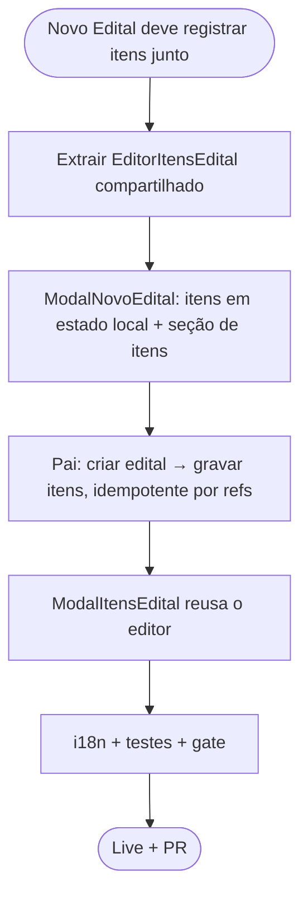

# Log de Prompt — novo-edital-com-itens

## Prompt Original

> modal de Novo Edital deve permitir o registro dos itens do edital junto com o cadastro do edital

## Interpretação

### Intenção Principal

No modal "Novo Edital", permitir cadastrar os **itens do edital** no mesmo passo da criação do edital — em vez de só depois, pelo gerenciador de itens que abria após criar.

### Abordagem (decisão do Tech Lead)

- **Sem mudança de contrato no backend.** Reusa os endpoints já validados `POST /editais` e `POST /editais/:id/itens`. O modal acumula os itens em **estado local** e, no Salvar, o componente pai orquestra: cria o edital → grava cada item.
- **Idempotência por refs** (não há transação cruzando `editais`+`edital_itens`): numa reexecução (ex.: falha de rede no meio dos itens), o Salvar **não recria** o edital nem reenvia itens já gravados; retoma só os pendentes. Os refs zeram no sucesso. Evita edital/itens duplicados.
- **Editor de itens compartilhado** (`EditorItensEdital`): a mesma UI (form de adição + tabela) serve à criação (itens locais) e ao gerenciador de rascunho existente (itens via API), sem divergência.
- Itens são **opcionais** na criação (podem ser adicionados depois pela ação "Itens").

### Restrições

- i18n 3 idiomas (PRJ-DEC-12); RBAC por JWT; gate no container (DEC-STR-34); Design System.
- Regra do backend preservada: não repetir o mesmo item de catálogo no edital → o catálogo do dropdown já chega **sem** os itens usados.

### Ambiguidades e Inferências

| Ambiguidade | Inferência | Confiança |
|---|---|---|
| Itens junto = mesmo modal? | Sim — seção de itens dentro do "Novo Edital" | Alta |
| Backend passa a aceitar itens no create? | Não — orquestração no cliente reusando endpoints (sem contrato novo; sem transação cruzada) | Média (arbitragem) |
| Manter o gerenciador de itens pós-criação? | Sim — a ação "Itens" nas linhas em rascunho continua para edições posteriores; deixa de abrir automaticamente após criar | Alta |

## Plano de Ação

## Contexto do Projeto Aplicado

> Reusa o catálogo de materiais e serviços (UC020) e as rotas de itens do edital (2026-07-24). Sem transação distribuída disponível entre agregados, a criação-com-itens é orquestrada no cliente de forma idempotente (refs) — os itens caem num edital em rascunho, recuperável pela ação "Itens" se algo falhar. Design System (`cm-form-grid`, `Campo`, tabela compartilhada), i18n e RBAC preservados.

## Resultado Esperado

Modal "Novo Edital" com uma seção de itens (item do catálogo → unidade → quantidade → preço-teto) que acumula os itens e os grava junto com o edital ao salvar; editor de itens compartilhado com o gerenciador de rascunho; gate verde e validação live.
