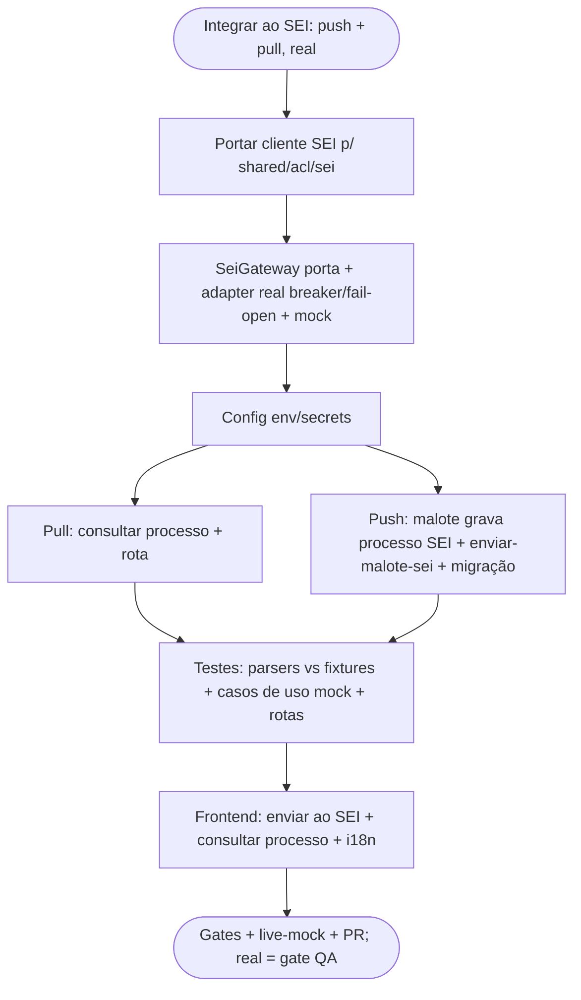

# Log de Prompt — integracao-sei

## Prompt Original

> @tech-lead o sistema deve ser integrado ao SEI, use como modelo para implementação ../api_sei

Decisões do solicitante (AskUserQuestion):
1. Direção: **ambos (push + pull)** — enviar o Malote ao SEI e consultar processos.
2. Adapter: **real agora** (contra o SEI de verdade).

## Interpretação

### Intenção Principal

Integrar o compraMais ao **SEI** (Sistema Eletrônico de Informações), modelando a implementação no `../api_sei` (um SDK TypeScript que fala com a **camada web** do SEI — `controlador.php` — via login SSO server-side + parsing de HTML; sem web service).

- **Push:** ao gerar o Malote (UC010/Épico 6), criar/localizar um processo no SEI e registrar seu número/protocolo no malote, tornando o `exportar()` real.
- **Pull:** pesquisar um processo por número e listar seus documentos (leitura), para vincular/consultar no Painel Admin.

### Abordagem (arbitragem do Tech Lead)

- **`../api_sei` como MODELO, não dependência.** O SDK não é publicado (github:...); depender dele quebraria o build self-contained em container (DEC-STR-34). Porta-se a lógica essencial para `backend/src/shared/acl/sei/`, seguindo o padrão de ACL já existente (receita/dívida: gateway + mock + adapter real + circuit breaker + fail-open + proveniência).
- **Parsers portados com regex** (sem adicionar `node-html-parser`); `opossum` (circuit breaker) já é dependência.
- **Config por ambiente** (secrets): `SEI_BASE_URL`, `SEI_USUARIO`, `SEI_SENHA`, `SEI_SEL_ORGAO`, `SEI_ID_TIPO_PROCEDIMENTO`. Boot não exige (integração é opt-in por operação; sem config → erro claro/fail-open, não derruba o sistema).

### Restrições e risco explícito (sinalizado ao solicitante)

- **Sem SEI de homologação acessível:** não é possível validar live contra o SEI real nesta entrega. O adapter real é implementado e testado contra **fixtures de HTML do SEI** (portadas do api_sei); a validação live dos fluxos usa o **mock**. Uma execução real contra o SEI do órgão fica como **gate de QA**.
- O próprio SDK documenta que **escrita server-side** (criar processo/documento) é frágil (seleção de tipo é AJAX stateful) — pode exigir o fluxo por navegador no órgão real. Registrado como risco.
- Segredos do SEI nunca versionados (PRJ-DEC-07); env/Docker secret.

### Entidades

| Entidade | Tipo | Relevância |
|---|---|---|
| `../api_sei` (`sei-sdk`) | referência | Login SSO, parsers (login/processos/documentos), `criarProcesso`/`pesquisarProcesso` |
| `backend/src/shared/acl/*` | padrão | ACL de integração (gateway + mock + real + breaker + fail-open) |
| `backend/src/malote/*` | módulo | Ponto de contato do push (o malote é "para protocolo no SEI") |

## Plano de Ação

## Contexto do Projeto Aplicado

> Arquitetura hexagonal + padrão de ACL (receita/dívida) com `opossum` circuit breaker, mock + real, fail-open+flag e proveniência (fonte/timestamp/frescor). `pool ? pg : memory`, migrações forward-only (AD-28/AD-33), RBAC por JWT, i18n (PRJ-DEC-12), segredos fora do repo (PRJ-DEC-07). `../api_sei` é modelo de implementação (como `comprac_api`/`api_sei` antes) — portado, não dependido, para manter o build em container.

## Resultado Esperado

Camada de integração SEI (`shared/acl/sei`) com adapter real (login + pesquisar/criar processo + documentos) e mock; push do malote ao SEI (registra o processo) e pull de consulta de processo; rotas com RBAC; testes de parser contra fixtures + casos de uso; frontend para enviar/consultar; gates verdes; validação live via mock, com a execução contra o SEI real registrada como gate de QA.
