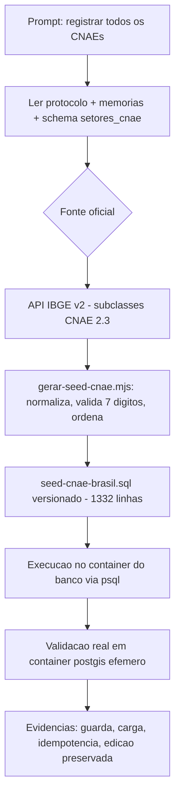

# Log de Prompt — seed-cnae-brasil-container-db

## Prompt Original

> @tech-lead crie uma script para ser executada no container do banco para registro de todos os cnaes
> do Brasil

## Interpretação

### Intenção Principal

Popular o catálogo **Setores Industriais (`setores_cnae`, RF021)** com **todas as subclasses CNAE do
Brasil**, por meio de um **script executado dentro do container do banco** (psql), e não pela tela de
cadastro manual nem pelo backend.

### Entidades envolvidas

- Tabela `setores_cnae` (`0011_init_catalogos.sql` + coluna `categoria` em `0021_setores_cnae_categoria.sql`).
- Domínio `SetorCnae` (chave natural = subclasse de 7 dígitos; base do match fornecedor × edital, RF003/RN001).
- Serviço `db` do `docker-compose.yml` (dev) e serviço `db` de `deploy/compramais-stack.yml` (prod/Swarm).

### Decisões (arbitragem do Tech Lead)

- **SQL versionado, não download em runtime**: o container do Postgres não tem rede/curl e a carga
  precisa ser reprodutível e auditável. O `.sql` com as 1.332 subclasses entra no repositório; um
  gerador separado (`gerar-seed-cnae.mjs`, roda no host) o reconstrói a partir da API do IBGE.
- **Não é migração**: fica em `backend/scripts/`, fora de `backend/migrations/` (o runner varre apenas
  `migrations/*.sql`). Dado de referência é operação, não evolução de schema.
- **Idempotente e não destrutivo** (AD-28 / forward-only): tabela temporária + `INSERT ... WHERE NOT
  EXISTS`; nunca apaga nem inativa setor existente, pois editais publicados podem tê-lo exigido.
- **Preserva edição manual**: `UPDATE` de descrição/categoria só nas linhas cujo `last_user_update`
  ainda é `seed-cnae-brasil` — o que o admin editou na tela não é sobrescrito em reexecuções.
- **`categoria` = seção CNAE (A–U)**: agrupamento oficial de 21 valores, preenchendo a coluna
  "Categoria" da tela dedicada sem inventar taxonomia própria.
- **`descricao` no texto oficial em caixa alta** do IBGE, igual à nomenclatura dos dados de CNPJ da
  Receita — facilita conferência contra a origem.
- **Guarda de pré-requisito**: `DO $$ ... RAISE EXCEPTION` se `setores_cnae`/`categoria` não existirem.

### Ambiguidades resolvidas

- "todos os CNAEs" → **subclasses de 7 dígitos** (nível que o domínio valida e que o edital exige),
  não seções/divisões/grupos/classes.
- "script no container do banco" → **psql dentro do container**, com wrapper `docker compose exec`
  (dev) e `docker exec` (prod/Swarm), sem execução no host (PRJ-DEC-05).

## Fluxo de raciocínio

## Rastreabilidade

- Script SQL: `backend/scripts/seed-cnae-brasil.sql` (1.332 subclasses, CNAE 2.3).
- Wrapper de execução: `backend/scripts/seed-cnae-brasil.sh`.
- Gerador: `backend/scripts/gerar-seed-cnae.mjs` (fonte: `https://servicodados.ibge.gov.br/api/v2/cnae/subclasses`).
- Documentação operacional: `backend/scripts/README.md`.
- Validação: container `postgis/postgis:16-3.4` efêmero com migrações 0011 + 0021 — guarda de schema,
  1ª execução (1.332 inserts), 2ª execução (`INSERT 0 0`, edição de admin preservada).
