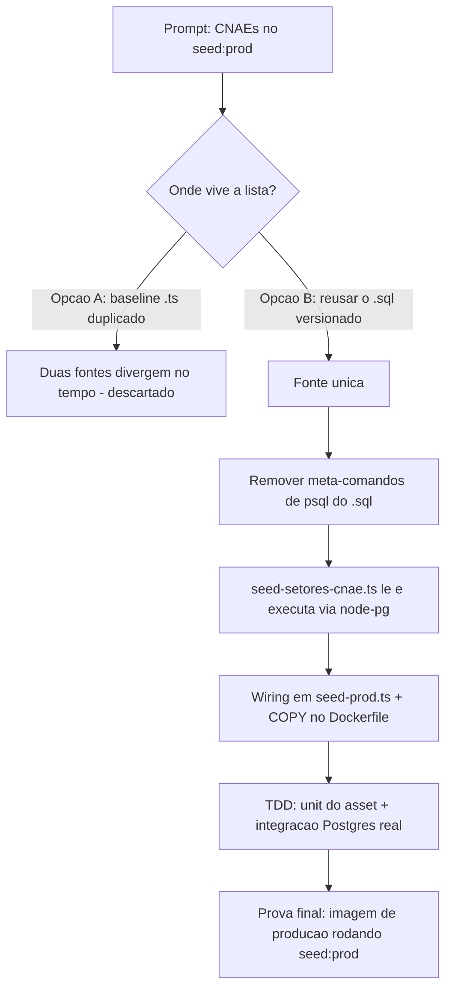

# Log de Prompt — cnaes-no-seed-prod

## Prompt Original

> @tech-lead inclua o cadastro dos cnaes como parte do seed:prod

## Interpretação

### Intenção Principal

O catálogo de CNAEs (entregue no log `2026-07-26_001` como script de container) deve entrar também no
**seed de produção** (`npm run seed:prod` → `dist/shared/db/seed-prod.js`), ao lado do catálogo de
tipos de documento e do admin inicial — para que o primeiro deploy já suba com RF021 populado, sem
passo manual do DBA.

### Decisões (arbitragem do Tech Lead)

- **Fonte única, não duplicada**: o `seed:prod` executa o **mesmo** `backend/scripts/seed-cnae-brasil.sql`
  via node-pg, em vez de uma lista replicada em TypeScript (padrão `TIPOS_DOCUMENTO_BASELINE`). Uma
  segunda cópia das 1.332 subclasses só criaria divergência entre o que o DBA roda por psql e o que o
  deploy grava.
- **Consequência aceita**: o `.sql` passou a ser gerado **sem meta-comandos de psql** (`\set ON_ERROR_STOP`,
  `\timing`) — o driver não os entende. Quem usa psql passa `-v ON_ERROR_STOP=1` na linha de comando
  (wrapper e README já faziam). Regra travada por teste para não regredir.
- **Guarda agora resolve pelo `search_path`** (`to_regclass('setores_cnae')` + `pg_attribute` no lugar de
  `public.` fixo e `information_schema`), o que a torna válida em schema isolado — inclusive o do teste
  de integração.
- **Imagem de produção carrega o asset**: `COPY scripts/seed-cnae-brasil.sql` no `Dockerfile`, mesma
  lógica do `COPY migrations`. Só o `.sql` entra; o gerador `.mjs` continua sendo utilitário de host.
- **`seed.ts` (DEV/DEMO) não foi alterado** — o pedido foi o seed de produção; o seed de dev continua
  com o recorte de demonstração e pode chamar `seedSetoresCnae(pool)` em uma linha quando se quiser.

## Fluxo de raciocínio

## Rastreabilidade

- Módulo novo: `backend/src/shared/db/seed-setores-cnae.ts`.
- Wiring: `backend/src/shared/db/seed-prod.ts`, `backend/Dockerfile`.
- Script/gerador ajustados: `backend/scripts/seed-cnae-brasil.sql`, `backend/scripts/gerar-seed-cnae.mjs`.
- Testes: `backend/tests/unit/seed-setores-cnae.spec.ts`, `backend/tests/integration/seed-cnae-pg.spec.ts`.
- Documentação: `backend/scripts/README.md`.
- Evidências: gate em container **723 testes verdes**; integração pg real (1.332 criados → reexecução
  0 criados, edição de admin preservada); imagem `--target runtime` executando
  `node dist/shared/db/seed-prod.js` contra banco descartável (`1332 criado(s)` → 2ª execução
  `0 criado(s)`, 21 seções), com banco e imagem de checagem removidos ao final.
