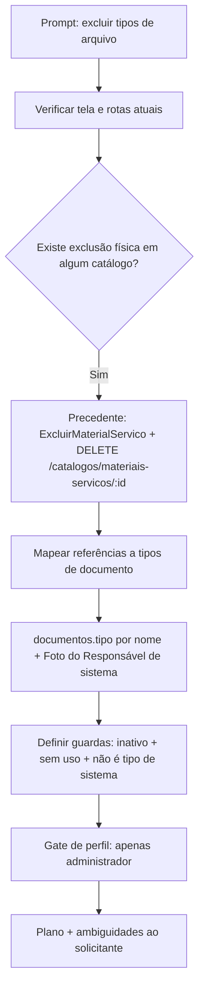

# Prompt 003 — Exclusão de tipos de arquivo

## Prompt original

> @tech-lead verifique
> 1. Exclusão de tipos de arquivo
> Disponibilizar a opção de excluir tipos de arquivo cadastrados. A exclusão deve ser restrita ao perfil de
> administrador, pois atualmente o sistema permite apenas editar, inativar ou reativar o registro.

Sanitização: não aplicável — o prompt não contém segredos, credenciais, tokens, cookies ou PII.

## Interpretação semântica

O solicitante pede a **exclusão definitiva (física)** de itens do catálogo *Tipos de Documento*
(tela "Tipos de Arquivos", RF022/UC020), hoje limitado a editar / inativar / reativar (exclusão lógica
RN015). A exclusão deve ser **exclusiva do perfil `administrador`** — mais restrita, portanto, que as
demais escritas do catálogo, que hoje aceitam `administrador` **e** `smga`.

## Entidades envolvidas

| Camada | Artefato |
|---|---|
| Domínio | `backend/src/catalogos/domain/tipo-documento.ts`, `tipos-documento-baseline.ts` |
| Aplicação | `backend/src/catalogos/application/manter-catalogos.ts`, `excluir-material-servico.ts` (precedente) |
| Porta | `backend/src/catalogos/application/catalogo-repository.ts` (`remover(id)` já existe) |
| Adapters | `catalogo-repository-pg.ts`, `catalogo-repository-memory.ts`, `catalogos-controller.ts` |
| Consumidores | `credenciamento/application/gerir-documentos.ts` (`existeAtivo`), `biometria/domain/biometria.ts` (`TIPO_DOC_FOTO_RESPONSAVEL`) |
| Dados | `documentos.tipo` (texto, migração 0018) — referência **por nome**, sem FK |
| Frontend | `frontend/src/pages/admin/TiposArquivos.tsx`, `lib/api.ts`, `i18n/locales/{pt-BR,en,es}.json` |
| Docs | `spec/manuais/manual-administrador.md`, `docs/ux/design-system.md` |

## Intenção principal

Permitir que o Administrador remova definitivamente tipos de arquivo cadastrados por engano, sem poluir o
catálogo com registros inativos.

## Intenções secundárias

- Preservar a integridade dos documentos já enviados pelos fornecedores (RN015 / AD-28).
- Manter a exclusão lógica como caminho padrão; a exclusão física é exceção controlada.
- Diferenciar o gate de perfil da exclusão (`administrador`) dos demais gates do catálogo (`administrador` + `smga`).

## Restrições identificadas

- Trilha append-only (AD-18): a exclusão precisa gerar evento auditável.
- `documentos.tipo` é texto (nome), não FK — a guarda de uso precisa consultar por nome.
- `Foto do Responsável` é tipo de sistema (prova de vida, UC007) — apagá-lo quebra o enrollment biométrico.
- Toda string nova de frontend passa pelo i18n nos 3 idiomas (DEC-STR-33); backend responde em inglês.
- Suite roda em container (DEC-STR-34).

## Ambiguidades levantadas ao solicitante

1. Exclusão **física** (padrão do precedente Materiais e Serviços) vs. apenas um rótulo "Excluir" para a inativação.
2. Guardas de pré-condição: exigir item **inativo** e **sem documento enviado** com aquele tipo.
3. Proteção do tipo de sistema `Foto do Responsável`.

## Plano de ação derivado

1. Verificar o estado atual do catálogo e do gate de perfis (concluído).
2. Levantar o precedente `ExcluirMaterialServico` e as referências a tipos de documento (concluído).
3. Consolidar plano de implementação (backend → frontend → i18n → testes → docs) e submeter as
   ambiguidades ao solicitante antes de codificar.
4. Após decisão: ciclo Senior Developer → documentation-writer → QA → commit-writer → fechamento Tech Lead.

## Fluxo de raciocínio

